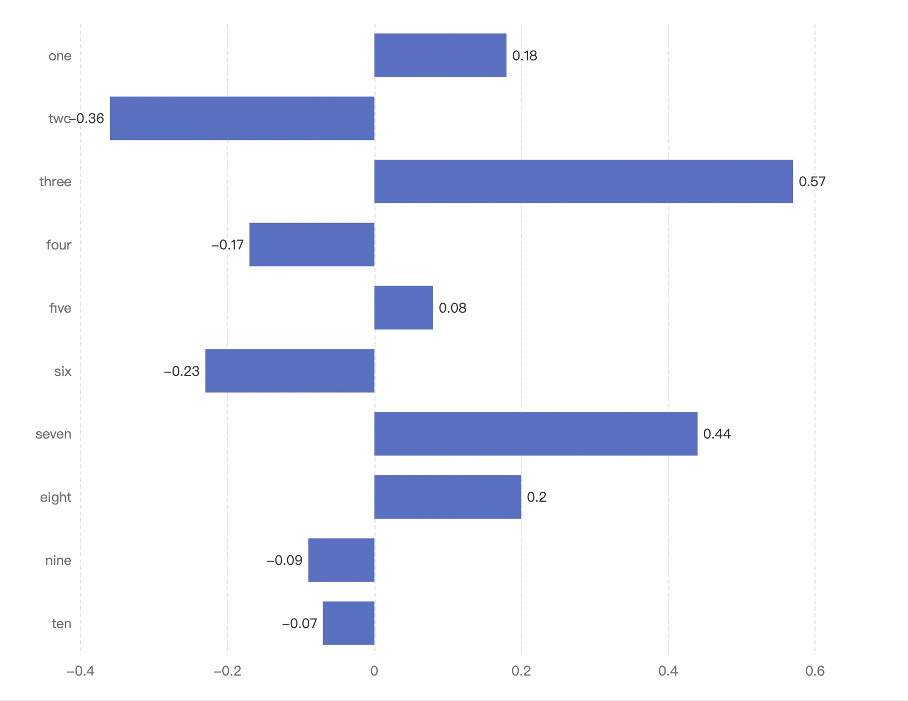
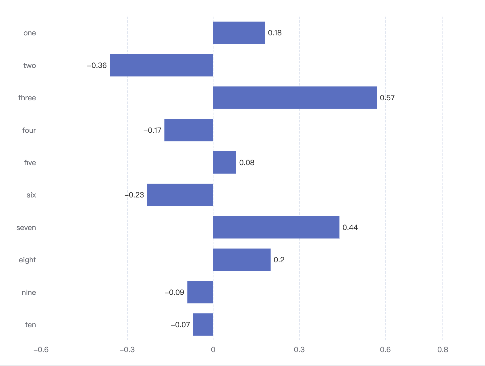

## 问题

最近在做一个 echarts 图表, 效果如下图所示:



要求在柱状图的左右两侧展示具体数值, 但目前数值会超出坐标轴, 与刻度重合

所以就想在坐标轴两侧各增加一格坐标, 这样就不会重合了

思路就是获取坐标最大最小值和坐标间距, 通过设置 `min` 和 `max` 实现

## 获取最大最小值

获取坐标最大最小值 `echarts` 提供了方法: [echarts 获取坐标轴的最大值\_yixiongmao 的博客-CSDN 博客\_echarts 获取 y 轴最大值](https://blog.csdn.net/yixiongmao/article/details/104202890)

```js
myChart.setOptions(option)
//获取Y轴的刻度范围
var rangeY = myChart.getModel().getComponent('yAxis').axis.scale._extent
//获取X轴的刻度范围
var rangeX = myChart.getModel().getComponent('xAxis').axis.scale._extent
```

得到的结果是有 2 个元素的数组, 如:[0, 600], 数组第一个元素为坐标轴的最小刻度, 第二个元素为坐标轴的最大刻度.

注意如果坐标轴为类目轴. 比如 x 轴数据为['南瓜', '西瓜', '哈密瓜', '黄瓜'], 由于有 4 条记录, 那么得到的范围就是这 4 条记录的最小下标和最大下标值, 结果就是:[0, 3].

## 获取间距

但获取最大最小值没有找到类似方法, 只能自己计算了

[Echarts 里面获取纵坐标刻度的间距](https://www.cnblogs.com/yangzhou33/p/11651367.html)

但这个方法有点问题, 如果 `data` 中有负数, 计算的是不对的, 必须全部取绝对值才可以

以下为本人封装的

```js
/**
 * @description 获取 Echarts 坐标轴间距
 * @param {Array} data 源数据
 * @param {number} splitNumber 坐标轴的分割段数, 默认 5, 详情参加 echarts
 * @returns {number} 坐标轴间距
 */
export const getEchartsSpace = (data, splitNumber = 5, round = true) => {
  const max = Math.max(...data.map(item => Math.abs(item)))
  let val = max / splitNumber

  // echart 内部计算 interval 的方法
  // https://github.com/apache/incubator-echarts/blob/fd064123626c97b36cbd6da1b5fc73385c280abd/src/util/number.js
  const exponent = Math.floor(Math.log(val) / Math.LN10)
  const exp10 = Math.pow(10, exponent)
  const f = val / exp10 // 1 <= f < 10
  let nf
  if (round) {
    if (f < 1.5) {
      nf = 1
    } else if (f < 2.5) {
      nf = 2
    } else if (f < 4) {
      nf = 3
    } else if (f < 7) {
      nf = 5
    } else {
      nf = 10
    }
  } else {
    if (f < 1) {
      nf = 1
    } else if (f < 2) {
      nf = 2
    } else if (f < 3) {
      nf = 3
    } else if (f < 5) {
      nf = 5
    } else {
      nf = 10
    }
  }
  val = nf * exp10

  // Fix 3 * 0.1 === 0.30000000000000004 issue (see IEEE 754).
  // 20 is the uppper bound of toFixed.
  return exponent >= -20 ? +val.toFixed(exponent < 0 ? -exponent : 0) : val
}
```

## 设置最大最小值

```js
xAxis: {
  min: this.min - this.space,
  max: this.max + this.space
}
```

通过计算可得 `x` 轴坐标为 `[-0.4, 0.6]`, 间距为 `0.2`, 设置的 `min` 为 `-0.6`, `max` 为 `0.8`

效果如下图所示:



数值确实不会和坐标重合了, 但下面坐标轴间距不是等宽的, 应该是咱们设置后, `echarts` 又自动计算了一遍

如果要追求完美, 那么可以在设置完最大最小后, 再计算一下间距, 重新设置

但目前已经符合我的需求了, 就不管了

## 使用别人封装的框架时的处理

由于我使用的是别人封装好的组件, 并没有 `myChart`, 所以并不能通过 `myChart` 获取最大最小值

那只能绕行解决了

具体思路就是用 `data` 中的最小值除以间距, 获取倍数, 由于要向左增加一格, 所以需要减一, 再向上取整, 这里要主要正数和负数的向上取整是不同的, 最大值同理:

```js
xAxis: {
  min: ({ min }) => { // 这里的 min 只是 data 中的最小值, 不是坐标轴的最小值
    const multiple = min / this.space - 1
    return this.space * Math[multiple < 0 ? 'floor' : 'ceil'](multiple)
  },
  max: ({ max }) => { // 同上
    const multiple = max / this.space + 1
    return this.space * Math[multiple < 0 ? 'floor' : 'ceil'](multiple)
  }
}
```

## 参考资料

- [echarts 获取坐标轴的最大值\_yixiongmao 的博客-CSDN 博客\_echarts 获取 y 轴最大值](https://blog.csdn.net/yixiongmao/article/details/104202890)
- [Echarts 里面获取纵坐标刻度的间距](https://www.cnblogs.com/yangzhou33/p/11651367.html)
- [坐标轴刻度取值算法-基于魔数数组-源于 echarts 的 y 轴刻度计算需求 - 272623186 - 博客园](https://www.cnblogs.com/vicky-li/p/11653415.html)
