## 1. JS 的运⾏机制

众所周知 js 是⼀⻔单线程的语⾔, 所以在 js 的世界中默认的情况下同⼀个时间节点只能做⼀件事情, 这样的设定就造成了 js 这⻔语⾔的⼀些局限性, ⽐如在我们的⻚⾯中加载⼀些远程数据时, 如果按照单线程同步的⽅式运⾏, ⼀旦有 HTTP 请求向服务器发送, 就会出现等待数据返回之前⽹⻚假死的效果出现. 因为 js 在同⼀个时间只能做⼀件事, 这就导致了⻚⾯渲染和事件的执⾏, 在这个过程中⽆法进⾏. 显然在实际的开发中我们并没有遇⻅过这种情况.

### 关于同步和异步

基于以上的描述, 我们知道在 js 的世界中, 应该存在⼀种解决⽅案, 来处理单线程造成的诟病. 这就是同步【阻塞】和异步【⾮阻塞】执⾏模式的出现.

#### 同步(阻塞):

同步的意思是 js 会严格按照单线程(从上到下、从左到右的⽅式)执⾏代码逻辑, 进⾏代码的解释和运⾏, 所以在运⾏代码时, 不会出现先运⾏ 4、5 ⾏的代码, 再回头运⾏ 1、3 ⾏的代码这种情况. ⽐如下列操作.

```js
var a = 1
var b = 2
var c = a + b
// 这个例⼦中c⼀定是3, 不会出现先执⾏第三⾏然后再执⾏第⼆⾏和第⼀⾏的情况
console.log(c)
```

接下来通过下列的案例升级⼀下代码的运⾏场景:

```js
var a = 1
var b = 2
var d1 = new Date().getTime()
var d2 = new Date().getTime()
while (d2 - d1 < 2000) {
  d2 = new Date().getTime()
}
//这段代码在输出结果之前⽹⻚会进⼊⼀个类似假死的状态
console.log(a + b)
```

当我们按照顺序执⾏上⾯代码时, 我们的代码在解释执⾏到第 4 ⾏时, 还是正常的速度执⾏, 但是在下⼀⾏就会进⼊⼀个持续的循环中. d2 和 d1 在⾏级间的时间差仅仅是毫秒内的差别, 所以在执⾏到 while 循环的时候 d2-d1 的值⼀定⽐ 2000 ⼩, 那么这个循环会执⾏到什么时候呢?

由于每次循环时, d2 都会获取⼀次当前的时间发⽣变化, 直到 d2-d1==2000 等情况, 这时也就是正好过了 2 秒的时间, 我们的程序才能跳出循环, 进⽽再输出 a+b 的结果. 那么这段程序的实际执⾏时间⾄少是 2 秒以上. 这就导致了程序阻塞的出现, 这也是为什么将同步的代码运⾏机制叫做阻塞式运⾏的原因.

阻塞式运⾏的代码, 在遇到消耗时间的代码⽚段时, 之后的代码都必须等待耗时的代码运⾏完毕, 才能得到执⾏资源, 这就是单线程同步的特点.

#### 异步(⾮阻塞):

在上⾯的阐述中, 我们明⽩了单线程同步模型中的问题所在, 接下来引⼊单线程异步模型的介绍.

异步的意思就是和同步对⽴, 所以异步模式的代码是不会按照默认顺序执⾏的. js 执⾏引擎在⼯作时, 仍然是按照从上到下从左到右的⽅式解释和运⾏代码.

在解释时, 如果遇到异步模式的代码, 引擎会将当前的任务"挂起"并略过. 也就是先不执⾏这段代码, 继续向下运⾏⾮异步模式的代码, 那么什么时候来执⾏同步代码呢? 直到同步代码全部执⾏完毕后, 程序会将之前"挂起"的异步代码按照"特定的顺序"来进⾏执⾏, 所以异步代码并不会【阻塞】同步代码的运⾏, 并且异步代码并不是代表进⼊新的线程同时执⾏, ⽽是等待同步代码执⾏完毕再进⾏⼯作.

我们阅读下⾯的代码分析:

```js
var a = 1
var b = 2
setTimeout(function() {
  console.log('输出了⼀些内容')
}, 2000)
//这段代码会直接输出3并且等待2秒左右的时间再输出function内部的内容
console.log(a + b)
```

这段代码的 setTimeout 定时任务规定了 2 秒之后执⾏⼀些内容, 在运⾏当前程序执⾏到 setTimeout 时, 并不会直接执⾏内部的回调函数, ⽽是会先将内部的函数在另外⼀个位置(具体是什么位置下⾯会介绍)保存起来, 然后继续执⾏下⾯的 console.log 进⾏输出, 输出之后代码执⾏完毕, 然后等待⼤概 2 秒左右, 之前保存的函数再执⾏.

⾮阻塞式运⾏的代码, 程序运⾏到该代码⽚段时, 执⾏引擎会将程序保存到⼀个暂存区, 等待所有同步代码全部执⾏完毕后, ⾮阻塞式的代码会按照特定的执⾏顺序, 分步执⾏. 这就是单线程异步的特点.

#### 通俗的讲:

通俗的讲, 同步和异步的关系是这样的:

【同步的例⼦】:⽐如我们在核酸检测站, 进⾏核酸检测这个流程就是同步的. 每个⼈必须按照来的时间, 先后进⾏排队, ⽽核酸检测⼈员会按照排队⼈的顺序严格的进⾏逐⼀检测, 在第⼀个⼈没有检测完成前, 第⼆个⼈就得⽆条件等待, 这个就是⼀个阻塞流程.

如果排队过程中第⼀个⼈在检测时出了问题, 如棉签断了需要换棉签, 这样更换时间就会追加到这个⼈身上, 直到他顺利的检测完毕, 第⼆个⼈才能轮到. 如果在检测中间棉签没有了, 或者是录⼊信息的系统崩溃了, 整个队列就进⼊⽆条件挂起状态, 所有⼈都做不了了. 这就是结合⽣活中的同步案例.

【异步的例⼦】: 还是结合⽣活中, 当我们进餐馆吃饭时, 这个场景就属于⼀个完美的异步流程场景. 每⼀桌来的客⼈会按照他们来的顺序进⾏点单, 假设只有⼀个服务员的情况, 点单必须按照先后顺序, 但是服务员不需要等第⼀桌客⼈点好的菜出锅上菜, 就可以直接去收集第⼆桌第三桌客⼈的需求. 这样可能在⼗分钟之内, 服务员就将所有桌的客⼈点菜的菜单统计出来, 并且发送给了后厨. 之后的菜也不会按照点餐顾客的餐桌顺序, 因为后厨收集到菜单之后可能有 1, 2, 3 桌的客⼈都点了锅包⾁, 那么他可能会先⼀次出三份锅包⾁, 这样锅包⾁在上菜的时候 1, 2, 3 桌的客⼈都能得到, 并且其他的菜也会乱序的逐⼀上菜, 这个过程就是异步的. 如果按照同步的模式点餐, 默认在饭店点菜就会出现饭店在第⼀桌客⼈上满菜之前第⼆桌之后的客⼈就只能等待连单都不能点的状态.

#### 总结:

js 的运⾏顺序就是完全单线程的异步模型: 同步在前, 异步在后. 所有的异步任务都要等待当前的同步任务执⾏完毕之后才能执⾏. 请看下⾯的案例:

```js
var a = 1
var b = 2
var d1 = new Date().getTime()
var d2 = new Date().getTime()
setTimeout(function() {
  console.log('我是⼀个异步任务')
}, 1000)
while (d2 - d1 < 2000) {
  d2 = new Date().getTime()
}
//这段代码在输出3之前会进⼊假死状态，'我是⼀个异步任务'⼀定会在3之后输出
console.log(a + b)
```

观察上⾯的程序我们实际运⾏之后就会感受到单线程异步模型的执⾏顺序了, 并且这⾥我们会发现 setTimeout 设置的时间是 1000 毫秒但是在 while 的阻塞 2000 毫秒的循环之后并没有等待 1 秒⽽是直接输出了我是⼀个异步任务, 这是因为 setTimeout 的时间计算是从 setTimeout() 这个函数执⾏时开始计算的.

### JS 的线程组成

上⾯我们通过⼏个简单的例⼦⼤概了解了⼀下 JS 的运⾏顺序, 那么为什么是这个顺序, 这个顺序的执⾏原理是什么样的, 我们应该如何更好更深的探究真相呢? 这⾥需要介绍⼀下浏览器中⼀个 Tab ⻚⾯的实际线程组成.

在了解线程组成前要了解⼀点, 虽然浏览器是单线程执⾏ js 代码的, 但是浏览器实际是以多个线程协助操作来实现单线程异步模型的, 具体线程组成如下:

1. GUI 渲染线程
2. js 引擎线程
3. 事件触发线程
4. 定时器触发线程
5. http 请求线程
6. 其他线程

按照真实的浏览器线程组成分析, 我们会发现实际上运⾏ js 的线程其实并不是⼀个, 但是为什么说 js 是⼀⻔单线程的语⾔呢? 因为这些线程中实际参与代码执⾏的线程并不是所有线程, ⽐如 GUI 渲染线程为什么单独存在, 这个是防⽌我们在 html ⽹⻚渲染⼀半的时候突然执⾏了⼀段阻塞式的 JS 代码⽽导致⽹⻚卡在⼀半停住这种效果. 在 js 代码运⾏的过程中实际执⾏程序时同时只存在⼀个活动线程, 这⾥实现同步异步就是靠多线程切换的形式来进⾏实现的.

所以我们通常分析时, 将上⾯的细分线程归纳为下列两条线程:

1. 【主线程】: 这个线程⽤了执⾏⻚⾯的渲染, js 代码的运⾏, 事件的触发等等
2. 【⼯作线程】: 这个线程是在幕后⼯作的, ⽤来处理异步任务的执⾏, 来实现⾮阻塞的运⾏模式

## 2. js 的运⾏模型

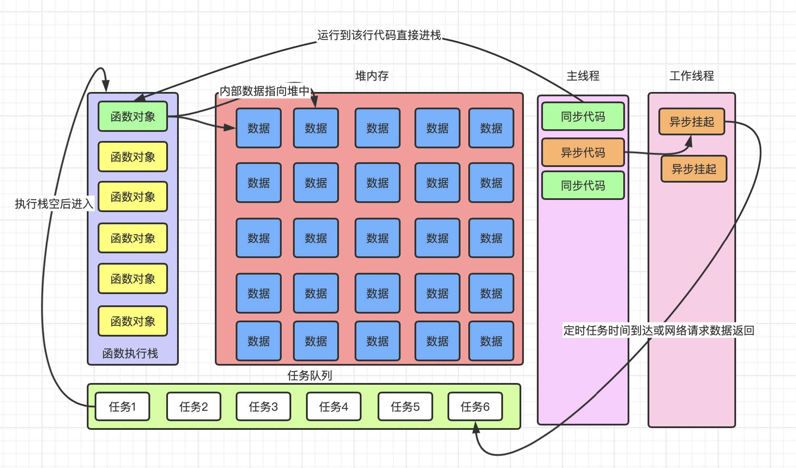

上图是 js 运⾏时的⼀个⼯作流程和内存划分的简要描述, 我们根据图中可以得知主线程就是我们 js 执⾏代码的线程, 主线程代码在运⾏时, 会按照同步和异步代码将其分成两个去处, 如果是同步代码执⾏, 就会直接将该任务放在⼀个叫做"函数执⾏栈"的空间进⾏执⾏, 执⾏栈是典型的【栈结构】(先进后出), 程序在运⾏的时候会将同步代码按顺序⼊栈, 将异步代码放到【⼯作线程】中暂时挂起, 【⼯作线程】中保存的是定时任务函数、JS 的交互事件、JS 的⽹络请求等耗时操作.

当【主线程】将代码块筛选完毕后, 进⼊执⾏栈的函数会按照从外到内的顺序依次运⾏, 运⾏中涉及到的对象数据是在堆内存中进⾏保存和管理的. 当执⾏栈内的任务全部执⾏完毕后, 执⾏栈就会清空. 执⾏栈清空后, "事件循环"就会⼯作, "事件循环"会检测【任务队列】中是否有要执⾏的任务, 那么这个任务队列的任务来源就是⼯作线程, 程序运⾏期间, ⼯作线程会把到期的定时任务、返回数据的 http 任务等【异步任务】按照先后顺序插⼊到【任务队列】中, 等执⾏栈清空后, 事件循环会访问任务队列, 将任务队列中存在的任务, 按顺序(先进先出)放在执⾏栈中继续执⾏, 直到任务队列清空.

### 从代码⽚段开始分析

```js
function task1() {
  console.log('第⼀个任务')
}

function task2() {
  console.log('第⼆个任务')
}

function task3() {
  console.log('第三个任务')
}

function task4() {
  console.log('第四个任务')
}
task1()
setTimeout(task2, 1000)
setTimeout(task3, 500)
task4()
```

刚才的⽂字阅读可能在⼤脑中很难形成⼀个带动画的图形界⾯来帮助我们分析 js 的实际运⾏思路, 接下我们将这段代码肢解之后详细的研究⼀下.

#### 按照字⾯分析:

按照字⾯分析, 我们创建了四个函数代表 4 个任务, 函数本身都是同步代码. 在执⾏的时候会按照 1, 2, 3, 4 进⾏解析, 解析过程中我们发现任务 2 和任务 3 被 setTimeout 进⾏了定时托管, 这样就只能先运⾏任务 1 和任务 4 了. 当任务 1 和任务 4 运⾏完毕之后 500 毫秒后运⾏任务 3, 1000 毫⽶后运⾏任务 2.

那么他们在实际运⾏时⼜是经历了怎么样的流程来运⾏的呢? ⼤概的流程我们以图解的形式分析⼀下.

#### 图解分析:

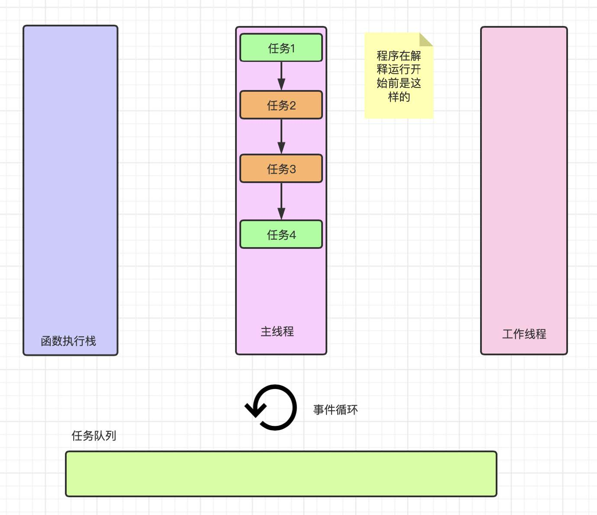

如上图, 在上述代码刚开始运⾏的时候我们的主线程即将⼯作, 按照顺序从上到下进⾏解释执⾏, 此时执⾏栈、⼯作线程、任务队列都是空的, 事件循环也没有⼯作. 接下来我们分析下⼀个阶段程序做了什么事情.

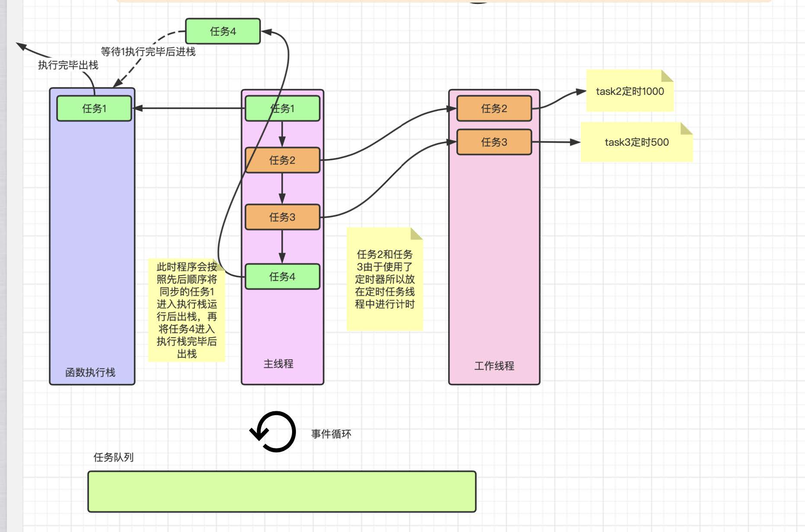

结合上图可以看出程序在主线程执⾏之后就将任务 1、4 和任务 2、3 分别放进了两个⽅向, 任务 1 和任务 4 都是⽴即执⾏任务所以会按照 1->4 的顺序进栈出栈(这⾥由于任务 1 和 4 是平⾏任务所以会先执⾏任务 1 的进出栈再执⾏任务 4 的进出栈), ⽽任务 2 和任务 3 由于是异步任务就会进⼊⼯作线程挂起并开始计时, 并不影响主线程运⾏, 此时的任务队列还是空置的.

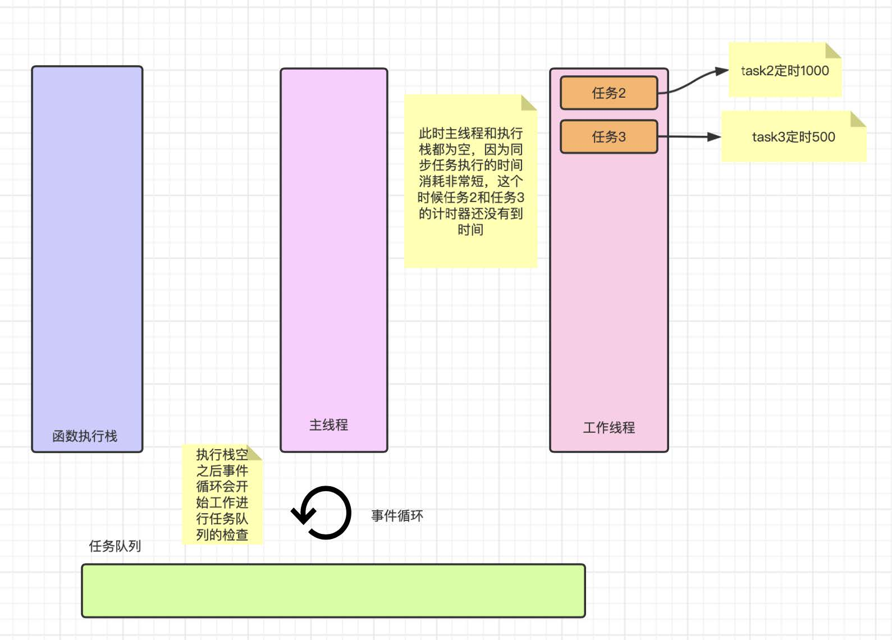

我们发现同步任务的执⾏速度是⻜快的, 这样⼀下子执⾏栈已经空了, ⽽任务 2 和任务 3 还没有到时间, 这样我们的事件循环就会开始⼯作等待任务队列中的任务进⼊, 接下来就是执⾏异步任务的时候了.

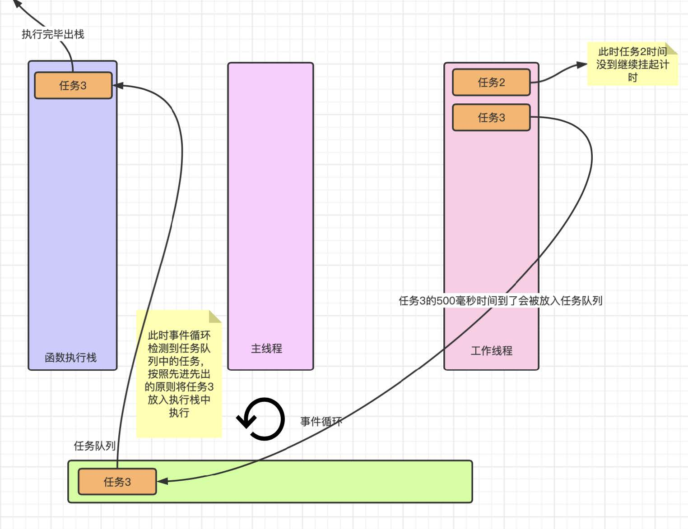

我们发现任务队列并不是⼀下⼦就会将任务 2 和任务 3 ⼀起放进去, ⽽是哪个计时器到时间了哪个放进去, 这样我们的事件循环就会发现队列中的任务, 并且将任务拿到执⾏栈中进⾏消费, 此时会输出任务 3 的内容.

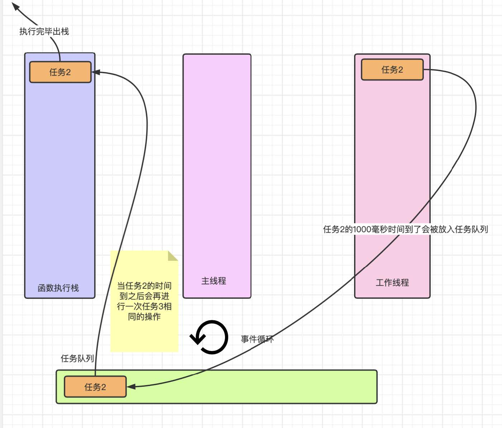

到这就是最后⼀次执⾏, 当执⾏完毕后⼯作线程中没有计时任务, 任务队列的任务清空程序到此执⾏完毕.

### 总结

我们通过图解之后脑⼦⾥就会更清晰的能搞懂异步任务的执⾏⽅式了, 这⾥采⽤最简单的任务模型进⾏描绘复杂的任务在内存中的分配和⾛向, 我们有了这次的经验之后就可以通过观察代码在⼤脑中先模拟⼀次执⾏, 这样可以更清晰的理解 JS 的运⾏机制.

### 关于执⾏栈

执⾏栈是⼀个栈的数据结构, 当我们运⾏单层函数时, 执⾏栈执⾏的函数进栈后, 会出栈销毁然后下⼀个进栈下⼀个出栈, 当有函数嵌套调⽤的时候栈中就会堆积栈帧, ⽐如我们查看下⾯的例⼦:

```js
function task1() {
  console.log('task1执⾏')
  task2()
  console.log('task2执⾏完毕')
}

function task2() {
  console.log('task2执⾏')
  task3()
  console.log('task3执⾏完毕')
}

function task3() {
  console.log('task3执⾏')
}
task1()
console.log('task1执⾏完毕')
```

我们根据字⾯阅读就能很简单的分析出输出的结果会是

```js
/*
task1执⾏
task2执⾏
task3执⾏
task3执⾏完毕
task2执⾏完毕
task1执⾏完毕
*/
```

那么这种嵌套函数在执⾏栈中的操作流程是什么样的呢?

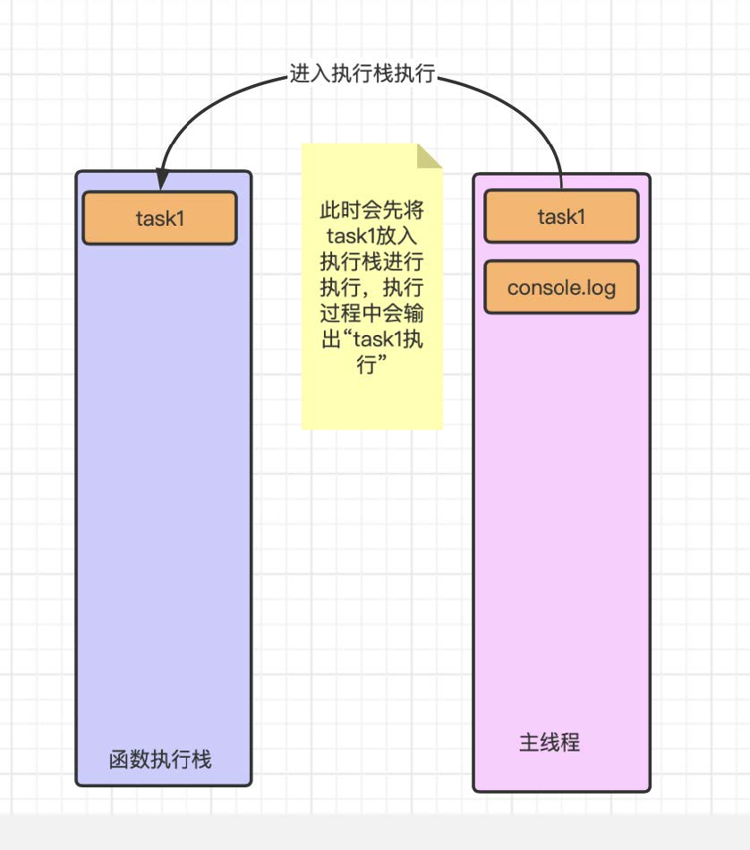

第⼀次执⾏的时候调⽤ task1 函数执⾏到 console.log 的时候先进⾏输出, 接下来会遇到 task2 函数的调⽤会出现下⾯的情况:

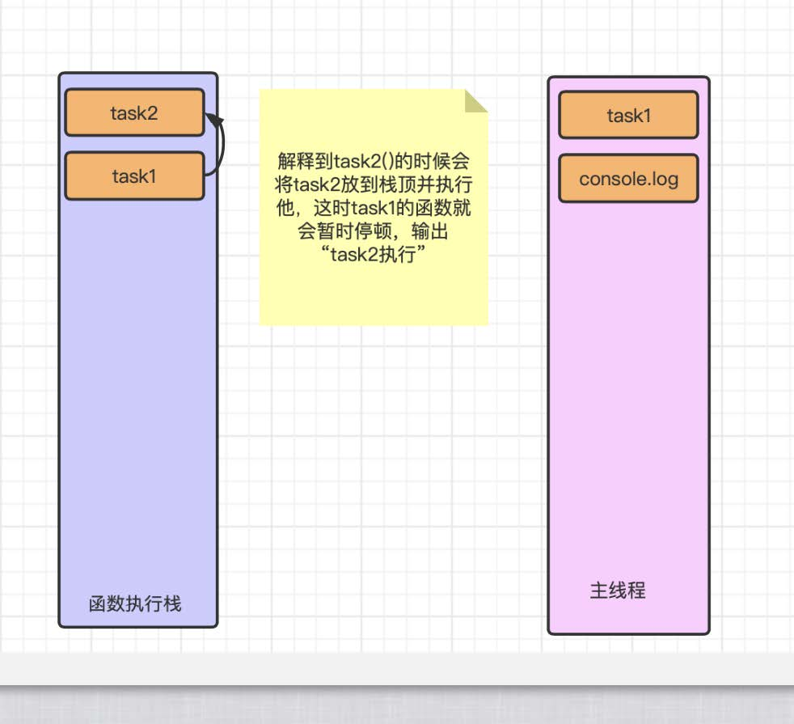

执⾏到此时检测到 task2 中还有调⽤ task3 的函数, 那么就会继续进⼊ task3 中执⾏, 如下图:

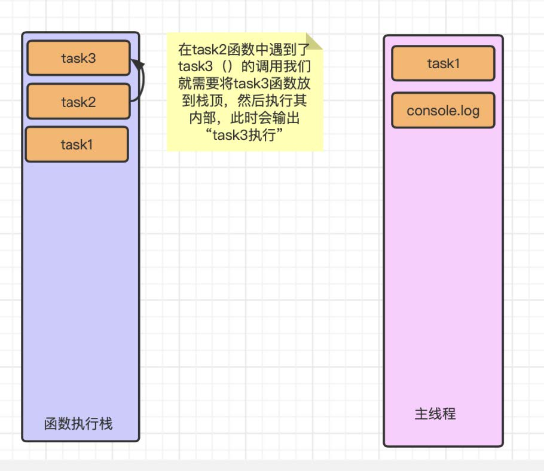

在执⾏完 task3 中的输出之后 task3 内部没有其他代码, 那么 task3 函数就算执⾏完毕那么就会发⽣出栈⼯作.

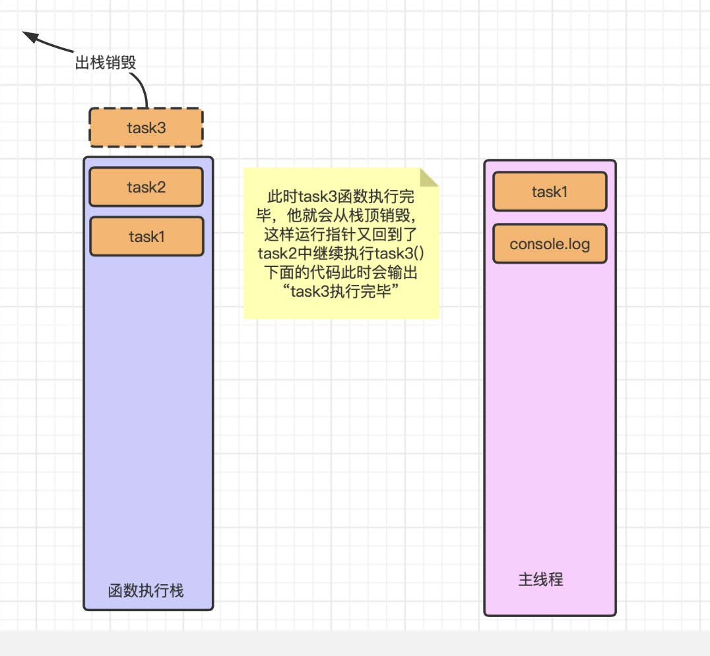

此时我们会发现 task3 出栈之后程序运⾏⼜会回到 task2 的函数中继续他的执⾏. 接下来会发⽣相同的事情.

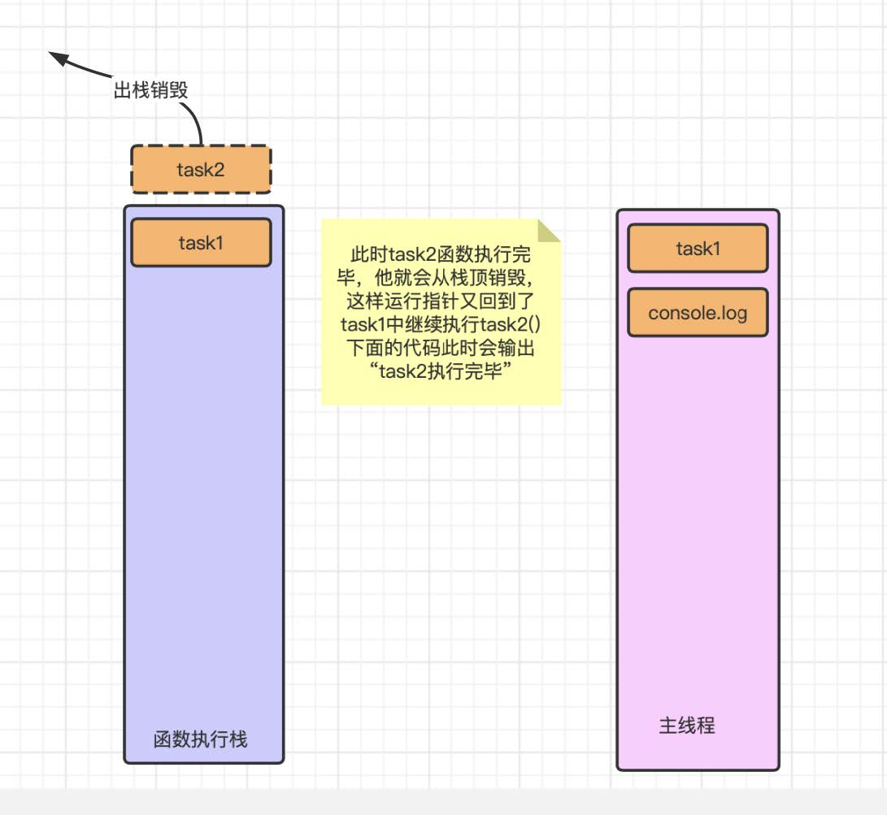

再之后就剩下 task1 ⾃⼰了, 他在 task2 销毁之后输出 task2 执⾏完毕后他也会随着出栈⽽销毁.

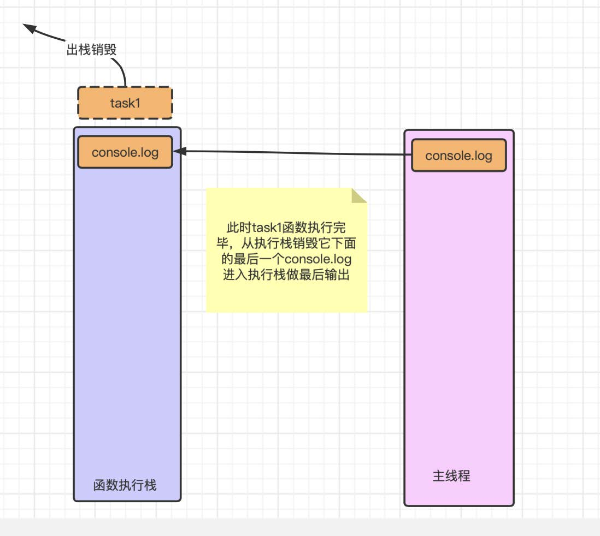

当 task1 执⾏完毕之后它随着销毁最后⼀⾏输出, 就会进⼊执⾏栈执⾏并销毁, 销毁之后执⾏栈和主线程清空. 这个过程就会出现 123321 的这个顺序, ⽽且我们在打印输出时, 也能通过打印的顺序来理解⼊栈和出栈的顺序和流程.

### 关于递归

关于上⾯的执⾏栈执⾏逻辑清楚后, 我们就顺便学习⼀下递归函数, 递归函数是项⽬开发时经常涉及到的场景. 我们经常会在未知深度的树形结构, 或其他合适的场景中使⽤递归.

递归在⾯试中也会经常被问到⻛险问题, 如果了解了执⾏栈的执⾏逻辑后, 递归函数就可以看成是在⼀个函数中嵌套 n 层执⾏, 那么在执⾏过程中会触发⼤量的栈帧堆积, 如果处理的数据过⼤, 会导致执⾏栈的⾼度不够放置新的栈帧, ⽽造成栈溢出的错误. 所以我们在做海量数据递归的时候⼀定要注意这个问题.

#### 关于执⾏栈的深度:

执⾏栈的深度根据不同的浏览器和 JS 引擎有着不同的区别, 我们这⾥就 Chrome 浏览器为例⼦来尝试⼀下递归的溢出:

```js
var i = 0

function task() {
  i++
  console.log(`递归了${i}次`)
  task()
}
task()
```

我们发现在递归了 11378 次之后会提示超过栈深度的错误, 也就是我们⽆法在 Chrome 或者其他浏览器做太深层的递归操作.

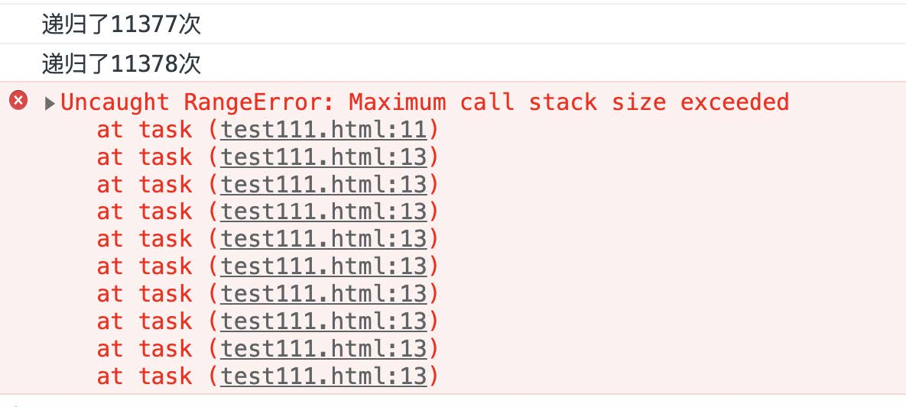

### 如何跨越递归限制

发现问题后, 我们再考虑如何能通过技术⼿段跨越递归的限制. 可以将代码做如下更改, 这样就不会出现递归问题了.

```js
var i = 0

function task() {
  i++
  console.log(`递归了${i}次`)
  //使⽤异步任务来阻⽌递归的溢出
  setTimeout(function() {
    task()
  }, 0)
}
task()
```

我们发现只是做了⼀个⼩⼩的改造, 这样就不会出现溢出的错误了. 这是为什么呢?

在了解原因之前我们先看控制台的输出, 结合控制台输出我们发现确实超过了界限也没有报错.

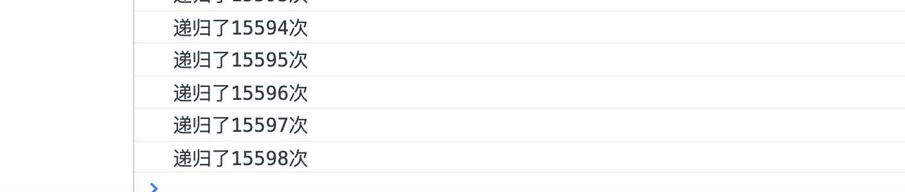

#### 图解原因:

这个是因为我们这⾥使⽤了异步任务去调⽤递归中的函数, 那么这个函数在执⾏的时候就不只使⽤栈进⾏执⾏了.

先看没有异步流程时候的执⾏图例:

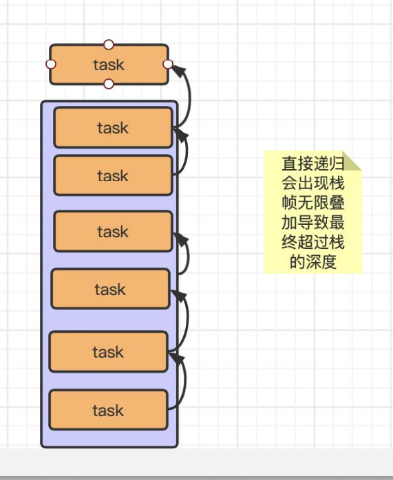

再看有了异步任务的递归:

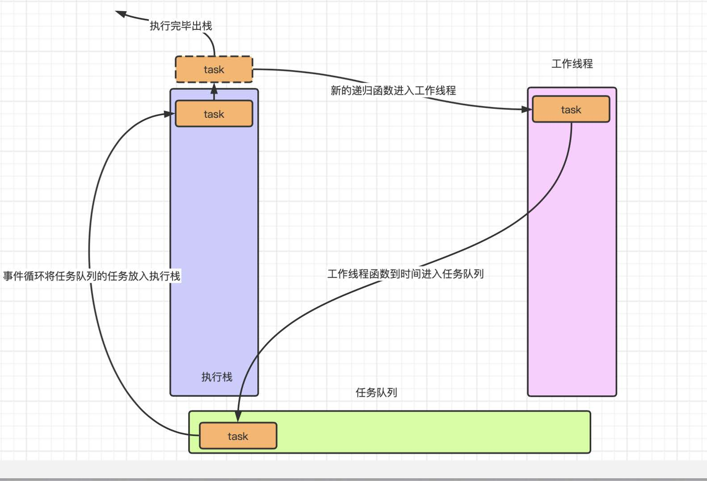

有了异步任务之后我们的递归就不会叠加栈帧了, 因为放⼊⼯作线程之后该函数就结束了, 可以出栈销毁, 那么在执⾏栈中就永远都是只有⼀个任务在运⾏, 这样就防⽌了栈帧的⽆限叠加, 从⽽解决了⽆限递归的问题, 不过异步递归的过程是⽆法保证运⾏速度的, 在实际的⼯作场景中, 如果考虑性能问题, 还需要使⽤ while 循环等解决⽅案, 来保证运⾏效率的问题, 在实际⼯作场景中, 尽量避免递归循环, 因为递归循环就算控制在有限栈帧的叠加, 其性能也远远不及指针循环.

## 3. 宏任务和微任务

在明确了事件循环模型以及 js 的执⾏流程后, 我们认识了⼀个叫做任务队列的容器, 他的数据结构是队列的结构. 所有除同步任务外的代码都会在⼯作线程中, 按照他到达的时间节点有序的进⼊任务队列, ⽽且任务队列中的异步任务⼜分为【宏任务】和【微任务】.

### 举个例⼦:

在了解【宏任务】和【微任务】前, 还是拿⽣活中的实际场景举个例⼦:

⽐如在去银⾏办理业务时, 每个⼈都需要在进⼊银⾏时找到取票机进⾏取票, 这个操作会把来办理业务的⼈按照取票的顺序排成⼀个有序的队列. 假设银⾏只开通了⼀个办事窗⼝, 窗⼝的⼯作⼈员会按照排队的顺序进⾏叫号, 到达号码的⼈就可以前往窗⼝办理业务, 在第⼀个⼈办理业务的过程中, 第⼆个以后的⼈都需要进⾏等待.

这个场景与 js 的异步任务队列执⾏场景是⼀模⼀样的, 如果把每个办业务的⼈当作 js 中的每⼀个异步的任务, 那么取号就相当于将异步任务放⼊任务队列. 银⾏的窗⼝就相当于【函数执⾏栈】, 在叫号时代表将当前队列的第⼀个任务放⼊【函数执⾏栈】运⾏.

这时可能每个⼈在窗⼝办理的业务内容各不相同, ⽐如第⼀个⼈仅仅进⾏开卡的操作, 这样银⾏⼯作⼈员就会为其执⾏开卡流程, 这就相当于执⾏异步任务内部的代码. 如果第⼀个⼈的银⾏卡开通完毕, 银⾏的⼯作⼈员不会⽴即叫第⼆个⼈过来, ⽽是会询问第⼀个⼈, "您是否需要为刚才开通的卡办理⼀些增值业务, ⽐如做个活期储蓄.", 这时相当于在原始开卡的业务流程中临时追加了⼀个新的任务, 按照 js 的执⾏顺序, 这个⼈的新任务应该回到取票机拿取⼀张新的号码, 并且在队尾重新排队, 这样⼯作的话办事效率就会急剧下降. 所以银⾏实际的做法是在叫下⼀个⼈办理业务前, 如果前⾯的⼈临时有新的业务要办理, ⼯作⼈员会继续为其办理业务, 直到这个⼈的所有事情都办理完毕.

从取卡到办理追加业务完成的这个过程, 就是微任务的实际体现. 在 js 运⾏环境中, 包括主线程代码在内, 可以理解为所有的任务内部都存在⼀个微任务队列, 在每下⼀个宏任务执⾏前, 事件循环系统都会先检测当前的代码块中是否包含已经注册的微任务, 并将队列中的微任务优先执⾏完毕, 进⽽执⾏下⼀个宏任务. 所以实际的任务队列的结构是这样的, 如图:

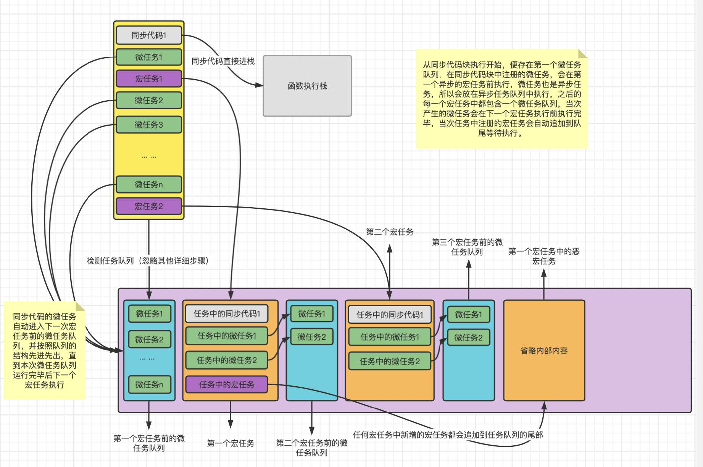

### 宏任务与微任务的介绍

由上述内容得知 js 中存在两种异步任务, ⼀种是宏任务⼀种是微任务, 他们的特点如下:

#### 宏任务:

宏任务是 js 中最原始的异步任务, 包括 setTimeout、setInterVal、AJAX 等, 在代码执⾏环境中按照同步代码的顺序, 逐个进⼊⼯作线程挂起, 再按照异步任务到达的时间节点, 逐个进⼊异步任务队列, 最终按照队列中的顺序进⼊函数执⾏栈进⾏执⾏.

#### 微任务:

微任务是随着 ECMA 标准升级提出的新的异步任务, 微任务在异步任务队列的基础上增加了【微任务】的概念, 每⼀个宏任务执⾏前, 程序会先检测中是否有当次事件循环未执⾏的微任务, 优先清空本次的微任务后, 再执⾏下⼀个宏任务, 每⼀个宏任务内部可注册当次任务的微任务队列, 在下⼀个宏任务执⾏前运⾏, 微任务也是按照进⼊队列的顺序执⾏的.

#### 总结:

在 js 的运⾏环境中, 代码的执⾏流程是这样的:

1. 默认的同步代码按照顺序从上到下，从左到右运⾏，运⾏过程中注册本次的微任务和后续的宏任务：
2. 执⾏本次同步代码中注册的微任务，并向任务队列注册微任务中包含的宏任务和微任务
3. 将下⼀个宏任务开始前的所有微任务执⾏完毕
4. 执⾏最先进⼊队列的宏任务，并注册当次的微任务和后续的宏任务，宏任务会按照当前任务队列的队尾继续向下排列

### 常⻅的宏任务和微任务划分

#### 宏任务

| #                     | 浏览器 | Node |
| --------------------- | ------ | ---- |
| I/O                   | ✅     | ✅   |
| setTimeout            | ✅     | ✅   |
| setInterval           | ✅     | ✅   |
| setImmediate          | ❌     | ✅   |
| requestAnimationFrame | ✅     | ❌   |

有些地⽅会列出来 UI Rendering , 说这个也是宏任务, 可是在读了 HTML 规范⽂档以后, 发现这很显然是和微任务平⾏的⼀个操作步骤

requestAnimationFrame 姑且也算是宏任务吧, requestAnimationFrame 在 MDN 的定义为, 下次⻚⾯重绘前所执⾏的操作, ⽽重绘也是作为宏任务的⼀个步骤来存在的, 且该步骤晚于微任务的执⾏

#### 微任务

| #                          | 浏览器 | Node |
| -------------------------- | ------ | ---- |
| process.nextTick           | ❌     | ✅   |
| MutationObserver           | ✅     | ❌   |
| Promise.then catch finally | ✅     | ✅   |

### 经典笔试题

#### 代码输出顺序问题 1

```js
setTimeout(function() {
  console.log('timer1')
}, 0)
requestAnimationFrame(function() {
  console.log('UI update')
})
setTimeout(function() {
  console.log('timer2')
}, 0)
new Promise(function executor(resolve) {
  console.log('promise 1')
  resolve()
  console.log('promise 2')
}).then(function() {
  console.log('promise then')
})
console.log('end')
```

解析:

本案例输出的结果为: 猜对我就告诉你, 先思考, 猜对之后结合运⾏结果分析.

按照同步先⾏, 异步靠后的原则, 阅读代码时, 先分析同步代码和异步代码, Promise 对象虽然是微任务, 但是 new Promise 时的回调函数是同步执⾏的, 所以优先输出 promise 1 和 promise 2.

在 resolve 执⾏时 Promise 对象的状态变更为已完成, 所以 then 函数的回调被注册到微任务事件中, 此时并不执⾏, 所以接下来应该输出 end.

同步代码执⾏结束后, 观察异步代码的宏任务和微任务, 在本次的同步代码块中注册的微任务会优先执⾏, 参考上⽂中描述的列表, Promise 为微任务, setTimeout 和 requestAnimationFrame 为宏任务, 所以 Promise 的异步任务会在下⼀个宏任务执⾏前执⾏, 所以 promise then 是第四个输出的结果.

接下来参考 setTimeout 和 requestAnimationFrame 两个宏任务, 这⾥的运⾏结果是多种情况. 如果三个宏任务都为 setTimeout 的话会按照代码编写的顺序执⾏宏任务, ⽽中间包含了⼀个 requestAnimationFrame, 这⾥就要学习⼀下他们的执⾏时机了.

setTimeout 是在程序运⾏到 setTimeout 时⽴即注册⼀个宏任务, 所以两个 setTimeout 的顺序⼀定是固定的, timer1 和 timer2 会按照顺序输出.

⽽ requestAnimationFrame 是请求下⼀次重绘事件, 所以他的执⾏频率要参考浏览器的刷新率.

参考如下代码:

```js
let i = 0
let d = new Date().getTime()
let d1 = new Date().getTime()

function loop() {
  d1 = new Date().getTime()
  i++
  //当间隔时间超过1秒时执⾏
  if (d1 - d >= 1000) {
    d = d1
    console.log(i)
    i = 0
    console.log('经过了1秒')
  }
  requestAnimationFrame(loop)
}
loop()
```

该代码在浏览器运⾏时, 控制台会每间隔 1 秒进⾏⼀次输出, 输出的 i 就是 loop 函数执⾏的次数, 如下图:

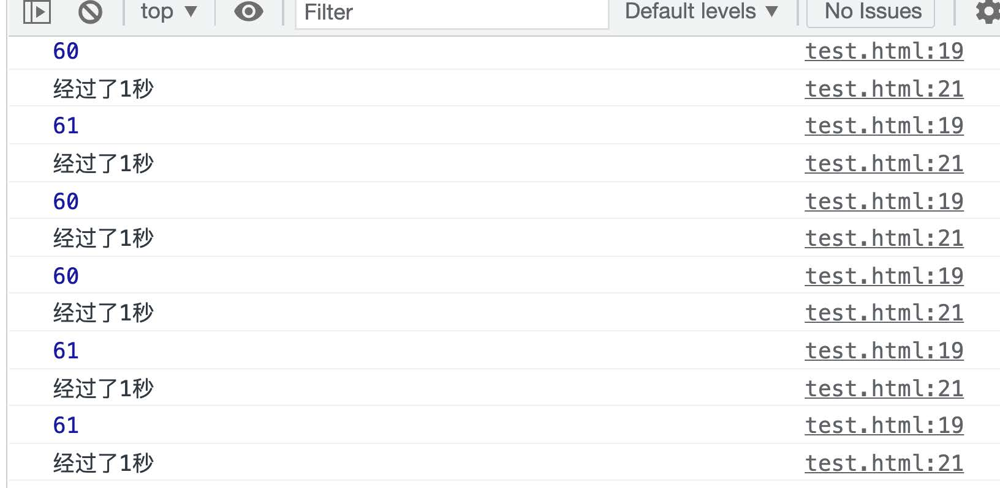

这个输出意味着 requestAnimationFrame 函数的执⾏频率是每秒钟 60 次左右, 他是按照浏览器的刷新率来进⾏执⾏的, 也就是当屏幕刷新⼀次时该函数就会触发⼀次, 相当于运⾏间隔是 16 毫秒左右.

继续参考下列代码:

```js
let i = 0
let d = new Date().getTime()
let d1 = new Date().getTime()

function loop() {
  d1 = new Date().getTime()
  i++
  if (d1 - d >= 1000) {
    d = d1
    console.log(i)
    i = 0
    console.log('经过了1秒')
  }
  setTimeout(loop, 0)
}
loop()
```

该代码结构与上⾯的案例类似, 循环是采⽤ setTimeout 进⾏控制的, 所以参考运⾏结果, 如图:

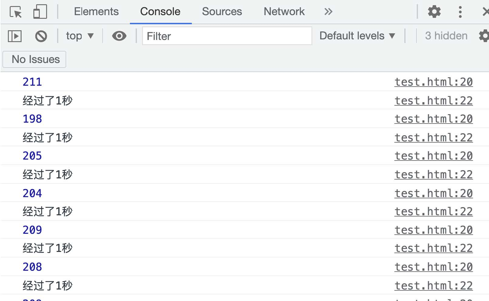

根据运⾏结果得知, setTimeout(fn, 0) 的执⾏频率是每秒执⾏ 200 次左右, 所以他的间隔是 5 毫秒左右.

由于这两个异步的宏任务触发时机和执⾏频率不同, 会导致三个宏任务的触发结果不同, 如果我们打开⽹⻚时, 恰好赶上 5 毫秒内执⾏了⽹⻚的重绘事件, requestAnimationFrame 在⼯作线程中就会到达触发时机优先进⼊任务队列, 所以此时会输出: UI update->timer1->timer2.

⽽当打开⽹⻚时上⼀次的重绘刚结束, 下⼀次重绘的触发是 16 毫秒后, 此时 setTimeout 注册的两个任务在⼯作线程中就会优先到达触发时机, 这时输出的结果是:timer1->timer2->UI update.

所以此案例的运⾏结果如下 2 图所示:

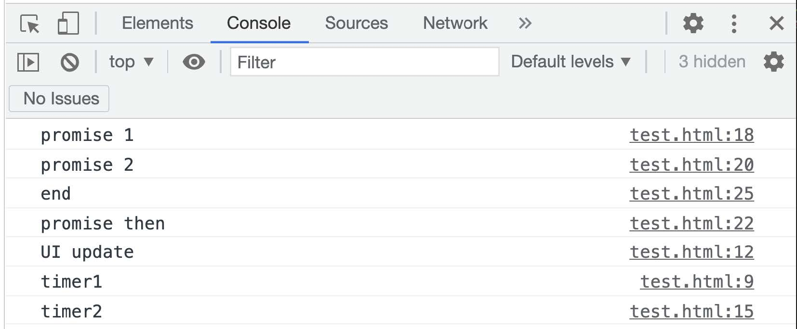

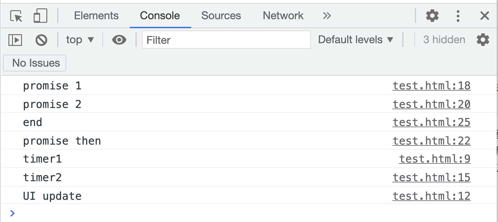

#### 代码输出顺序问题 2

```js
document.addEventListener('click', function() {
  Promise.resolve().then(() => console.log(1))
  console.log(2)
})
document.addEventListener('click', function() {
  Promise.resolve().then(() => console.log(3))
  console.log(4)
})
```

解析: 仍然是猜对了告诉你哈～, 先运⾏⼀下试试吧.

这里先插个题外话: `document.onclick = () => {}` 由于是赋值操作, 故只有最后一个赋值操作生效, 而 `addEventListener` 是可以多次绑定的并且都生效

这个案例代码简单易懂, 但是很容易引起错误答案的出现.

由于该事件是直接绑定在 document 上的, 所以点击⽹⻚就会触发该事件, 在代码运⾏时相当于按照顺序注册了两个点击事件, 两个点击事件会被放在⼯作线程中实时监听触发时机, 当元素被点击时, 两个事件会按照先后的注册顺序放⼊异步任务队列中进⾏执⾏, 所以事件 1 和事件 2 会按照代码编写的顺序触发.

这⾥就会导致有⼈分析出错误答案: 2, 4, 1, 3.

为什么不是 2, 4, 1, 3 呢? 由于事件执⾏时并不会阻断 JS 默认代码的运⾏, 所以事件任务也是异步任务, 并且是宏任务, 所以两个事件相当于按顺序执⾏的两个宏任务.

这样就会分出两个运⾏环境, 第⼀个事件执⾏时, `console.log(2);` 是第⼀个宏任务中的同步代码, 所以他会⽴即执⾏, ⽽ `Promise.resolve().then(()=> console.log(1));` 属于微任务, 他会在下⼀个宏任务触发前执⾏, 所以这⾥输出 2 后会直接输出 1.

⽽下⼀个事件的内容是相同道理, 所以输出顺序为:2, 1, 4, 3.

## 总结

关于事件循环模型今天就介绍到这⾥, 在 NodeJS 中的事件循环模型和浏览器中是不⼀样的, 本⽂是以浏览器的事件循环模型为基础进⾏介绍, 事件循环系统在 js 异步编程中占据的⽐重是⾮常⼤的, 在⼯作中可使⽤场景也是众多的, 掌握了事件循环模型就相当于, 异步编程的能⼒上升了⼀个新的⾼度.
