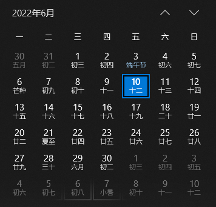

## 需求

最近遇到这么一个需求：

用户可以指定每周的截止日，包含截至日当天。如：截至日为周日，则每个周期都是：周一 ~ 周日；截至日为周四，则每个周期都是上周五 ~ 本周四



如上图，截至日为周日，则 6 月的周期为：

- 5.30~6.5
- 6.6~6.12
- 6.13~6.19
- 6.20~6.26

由于 6.27~7.3 的结束日已不在 6 月，故不属于 6 月的周期

截至日为周四，则 6 月的周期为：

- 5.27~6.2
- 6.3~6.9
- 6.10~6.16
- 6.17~6.23
- 6.24~6.30

## 开发环境

开发环境：`"react": "^17.0.2", "moment": "^2.29.1", "antd": "^4.18.8",`

## 修改 moment 周起始日

一开始的想法是当用户设置截至日后，更改 `moment` 的周起始日（值为截至日的后一天，如截至日为周日，则起始日为周一），这样我们就不需要计算了，`moment` 帮我们计算好了，我们只需要获取该月的周期即可，结果发现修改是全局的，别的日期组件的周起始日都改变了，这种肯定是不可以的，当然如果你的需求就是这样的，那其实就可以了

`moment` 不同版本修改周起始日不同，可以参考[这里](http://momentjs.cn/docs/#/customization/dow-doy/)

```js
// 从 2.12.0 开始
moment.updateLocale('zh-cn', {
  week: {
    dow: weekEnd // Locale#week.dow 应是代表星期中第一天的整数，1 是星期一、2 是星期二、...、7 是星期日
  }
})
```

由于我们使用的是中文日期，周起始日为周一，`dow` 为 `1`，而由于周起始日为截至日的后一天，故对应的截至日为周日，所以周日的值为 `1`，以此类推可以得出：

```js
const weekEndOptions = '日一二三四五六'.split('').map((item, index) => ({
  label: `星期${item}`,
  value: ++index
}))
```

当周截至日改变后，就需要执行一下上面的代码，更新周起始日

接下来就是获取当前月有几周及其对应的开始结束日期了，主要思路就是先获取月第一周第一天，然后循环加 7 天，直到结束日期不在本月为止

主要代码：

```js
const cycleChart = '一二三四五六' // 月第几周期
moment.updateLocale('zh-cn', {
  week: {
    dow: weekEnd // 周截至日
  }
})
const year = monthValue.year() // monthValue: antd 月份组件获取的值
const month = monthValue.month()
// moment([year, month]): 设置为 年月第一天 0 时 0 分 0 秒，startOf('week') 获取第一周第一天
let start = moment([year, month]).startOf('week')
const result = []
let index = 0
loop()
function loop() {
  const end = moment(start) // 这里使用 moment(start) 是因为 add/subtract 会改变原值
    .add(7, 'd')
    .subtract(1, 's')
  if (end.month() === month) {
    result.push({
      label: `第${cycleChart.charAt(index)}周期（${start.format('MM-DD')}~${end.format('MM-DD')}）`,
      time: [moment(start), end],
      value: index
    })
    start.add(7, 'd')
    loop()
  }
}
```

## 通过 weekday 计算

主要思路就是通过 `weekEnd` 获取当月第一周周 `weekEnd` 的日期，比如 `weekEnd` 为周日，则 6 月第一周周日是 6.5，`weekEnd` 为周二，则 6 月第一周周二为 5.31；获取的这个日期是每周期的结束日期，故需要判断该日期的月份是否等于当前月，如果小于，则需要加 7 天，如果等于，则计入周期，也需要判断年份

然后循环加 7 天，直到结束日期不在本月为止

```js
const year = monthValue.year()
const month = monthValue.month()
let end = moment([year, month])
  .weekday(weekEnd)
  .add(1, 'd')
  .subtract(1, 's')
const result = []
let index = 0
loop()
function loop() {
  if (end.month() < month || end.year() < year) {
    end.add(7, 'd')
    loop()
  } else if (end.month() === month) {
    const start = moment(end)
      .subtract(7, 'd')
      .add(1, 's')
    result.push({
      label: `第${cycleChart.charAt(index)}周期（${start.format('MM-DD')}~${end.format('MM-DD')}）`,
      time: [start, moment(end)],
      value: index
    })
    end.add(7, 'd')
    index++
    loop()
  }
}
```
