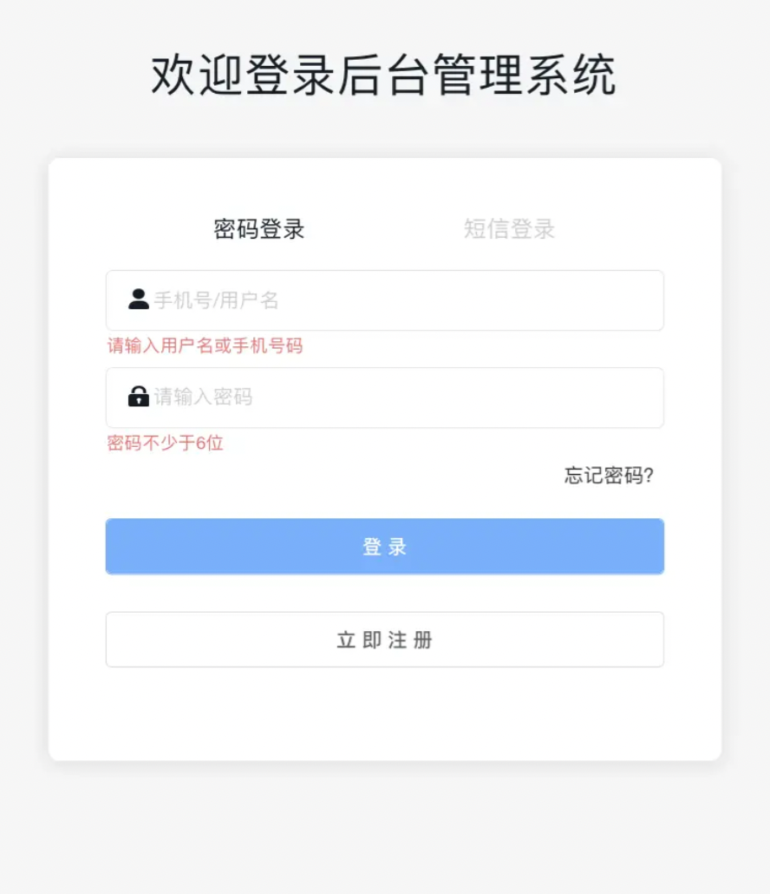
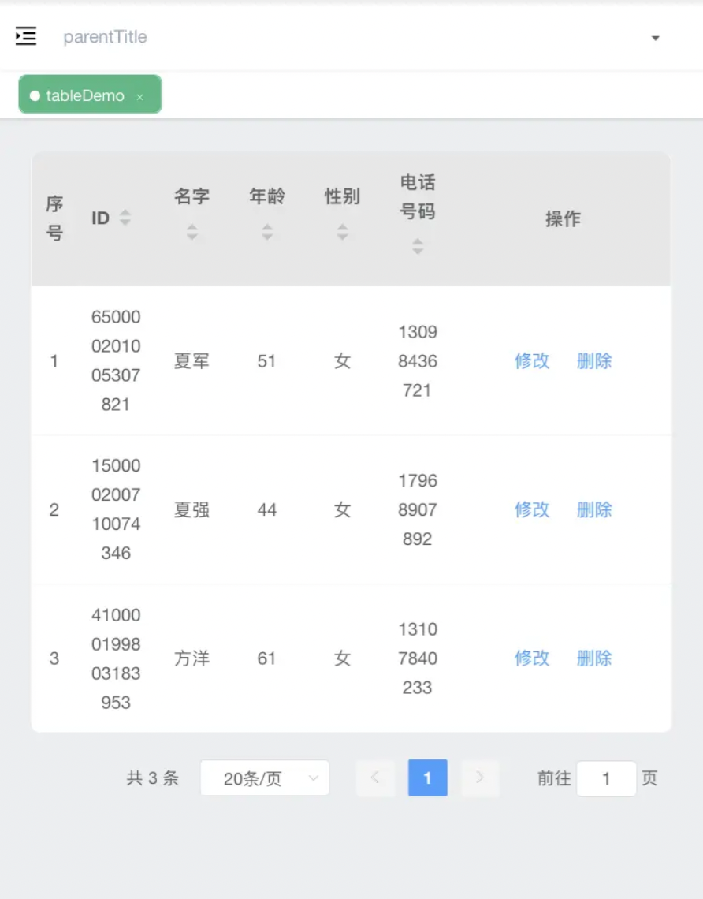

最近打算做一个小工具类的项目, 基于 `Vue` + `ElementUI` . 众所周知, `ElementUI` 是 `web` 端的, 但现在大家使用手机多于电脑, 所以需要有简单的适配

<!-- more -->

关于适配, 网上有很多种方法, 有通过媒体查询的; 有写多套 `css` 样式, `web` 加载 `web` 样式, `app` 加载 `app` 样式; 有写两套代码, 根据设备加载不同代码...

但本人目前没有这么高的要求, 只想以一套代码解决, 并且不需要更改太多代码

# 用 rem 代替 px

虽然我们用的 `ElementUI` 框架已经在响应式上面做了出色的处理, 但是也只能解决一部分的问题. 所以我们需要使用 `rem` .

## 什么是 rem

`rem` 是 `CSS3` 新增的相对长度单位, 是指相对于根元素 `html` 的 `font-size` 计算值的大小. 简单可理解为屏幕宽度的百分比.

但是! 但是! 问题来了, 那就是我们其实用 `px` 开发习惯了, 要改成 `rem` 一时半会缓不过来, 加上还要换算是吧. 所以用 `rem` 还挺烦的. 接下来主角就登场了, 安利大家几个插件, 能够将你项目中的 `px` 转换成 `rem` , 还可以自定义换算基数等.

## 使用 lib-flexible & px2rem 自动转换 px 为 rem, 解决响应式问题

### 引入 lib-flexible 和 px2rem

```bash
npm install --save lib-flexible
npm install --save-dev px2rem-loader postcss-plugin-px2rem
```

`postcss-plugin-px2rem` 是为了在使用 `less` 或者 `sass` 的情况下也可以正常转换

### 删除或注释 index.html 中的 `<meta name="viewport"` 标签

使用 `lib-flexible` 插件, 他会自动生成 `meta name="viewport"` 的标签, 所以我们需要把原来有的删除掉. 自动生成标签之后, `lib-flexible` 会自动设置 `html` 的 `font-size` 为屏幕宽度除以 `10` , 也就是 `1rem` 等于 `html` 根节点的 `font-size` , 如果你的设计稿宽度是 `750px` , 那 `font-size` 就会被设置为 `75px`

### 入口文件引入 lib-flexible

在 `main.js` 全局引入 `lib-flexible`

```js
// 使用lib-flexible来解决移动端适配
import 'lib-flexible'
```

网上看到有人说要修改源码:

> 因为 lib-flexible 主要用于手机自适应, 当屏幕尺寸大于 540px 时, 它设置 html 的 font-size 固定为 54px, 并不能根据屏幕尺寸调整 html 的 font-size 的大小, 所以这里需要修改 lib-flexible 源码. 在 node-modules 依赖包 lib-flexible 文件夹中的 flexible.js 文件, 可以看到源码

```js
function refreshRem() {
  var width = docEl.getBoundingClientRect().width
  if (width / dpr > 540) {
    // 变更
    // width = 540 * dpr
    width = width * dpr
  }
  var rem = width / 10
  docEl.style.fontSize = rem + 'px'
  flexible.rem = win.rem = rem
}
```

但我们可以在 `postcss-plugin-px2rem` 设置一下来解决这个问题, 下面会介绍到

这里说一下如何修改源码:

如果修改源码, 只是自己本地修改了, 别人拉取代码的话还是未修改的源码

所以需要将修改后的源码添加到项目中: 在 `node-modules` 依赖包 `lib-flexible` 文件夹中找到 `flexible.js` 文件, 复制到项目中并修改, 位置自定, 在 `main.js` 中引入这个文件就可以了

### 在 vue.config.js 新增 px2rem 的配置

```js
const path = require('path')

function resolve(dir) {
  return path.join(__dirname, dir)
}

module.exports = {
  publicPath: '/',
  outputDir: 'dist', // 输出文件目录
  assetsDir: 'assets', // 静态资源文件夹
  productionSourceMap: false,
  devServer: {
    port: 9566, // 端口号
    open: true,
    proxy: null // 设置代理
  },
  // 新增内容
  css: {
    loaderOptions: {
      postcss: {
        plugins: [
          require('postcss-plugin-px2rem')({
            rootValue: 54, // 换算基数，默认100，自行根据效果调整。
            minPixelValue: 3 // 设置要替换的最小像素值默认0，这里表示大于3px会被转rem。
          })
        ]
      }
    }
  },
  // 新增结束
  chainWebpack: config => {
    // 新增内容
    config.module
      .rule('css')
      .test(/\.css$/)
      .oneOf('vue')
      .resourceQuery(/\?vue/)
      .use('px2rem')
      .loader('px2rem-loader')
      .options({
        remUnit: 54
      })
    // 新增结束

    config.module
      .rule('svg')
      .exclude.add(resolve('src/icons'))
      .end()

    config.module
      .rule('icons')
      .test(/\.svg$/)
      .include.add(resolve('src/icons'))
      .end()
      .use('svg-sprite-loader')
      .loader('svg-sprite-loader')
      .options({
        symbolId: 'icon-[name]'
      })
  }
}
```

### 康康 postcss-plugin-px2rem 的配置项

`rootValue` 转换基数, 类型可以是 `Number` 也可以是 `Object` , 默认是 `100` . 如果你传的是一个 `Object` , 例如 `{px:50 , rpx:100}` , 那么就意味着, 在换算的时候, 如果遇上单位是 `px` 那换算基数是 `50` , 如果遇上 `rpx` 那么换算基数是 `100`

`minPixelValue` `Number` 类型, 表示开始转换的最小值, 默认是 `0` , 意思就是大于 `0px` 的长度都进行转换

细心的小伙伴发现我这里的 `rootValue` 转换基数设置的是 `54` , 为什么涅? 你运行项目, 然后 `F12` , 会发现根元素 `html` 的 `font-size` 是 `54px` . 为什么! 为什么明明前面说的是宽度除以 `10` 啊, 我特喵的 `pc` 端宽度是 `1080` 啊, 不应该是 `font-size:108px` 么???

这个就和上面 `lib-flexible` 的源码对应上了

`pc` 端的 `dpr` 是 `1` , `width/dpr` 肯定是大于 `540` 的, 所以 `lib-flexible` 会默认使用 `540px` 这个宽度, 然后将屏幕宽度除以 `10` 作为 `rem` 值, 所以 `1rem=54px` . 所以我们将 `rootValue` 转换基数设为 `54` 刚刚好

## 成果





完美

## 参考资料

[打造 vuecli3+element 后台管理系统(五)几个小技巧, 让你的后台系统在不同版本浏览器兼容性更好](https://juejin.cn/post/6844903933161242637)
