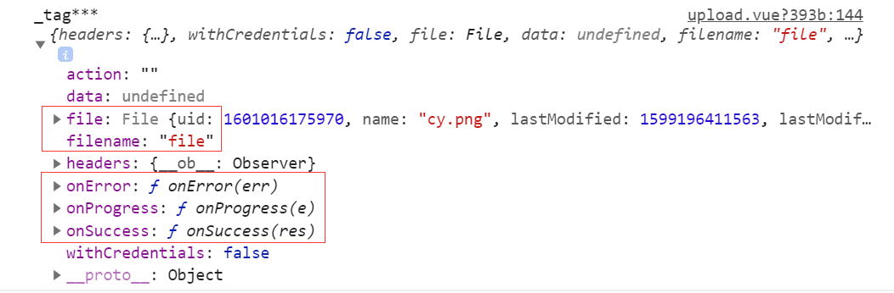

最近开发项目过程中需要有一些图片和视频上传的功能，本想用普通的上传方式，即后台提供上传的地址，前端直接调用的方法，但此方法有一点缺点，用户数据需先上传到应用服务器，之后再上传到 OSS。网络传输时间比直传到 OSS 多一倍。如果用户数据不通过应用服务器中转，而是直传到 OSS，速度将大大提升。为了提高上传效率，决定使用服务端签名后直传的方法来实现。

## 前端直传阿里 oss

服务端签名后直传的原理如下：

- 用户发送上传 Policy 请求到应用服务器。
- 应用服务器返回上传 Policy 和签名给用户。
- 用户直接上传数据到 OSS

[在客户端直接上传文件到 OSS\_对象存储 (OSS)-阿里云帮助中心](https://help.aliyun.com/zh/oss/use-cases/uploading-objects-to-oss-directly-from-clients/?spm=a2c4g.11186623.0.0.467022358cBQeb)

但讲真，阿里云的开发文档写的并不是特别好理解，而且 demo 是用 Plupload 组件原生 JS 实现的，加入到 vue 项目中还需进行进一步封装，于是用 elementui 中的上传组件封装实现了服务端签名直传，示例如下：

[vue+element-ui+ 阿里云 oss 服务端签名后直传图片的示例](https://github.com/HenryTSZ/hello-world/issues/98)

## 显示自带进度条

使用上方的示例代码，确实可以实现前端直传阿里 oss，但有一个问题，无法显示自带进度条

上传图片还好一点，立马就上传完成，回显出图片了，但上传视频后，由于 el-upload 不支持视频回显，就展示一个图片加载失败的提示，也没有进度条，也不知道上传完了没有，只有等上传完成后，在右上角才会出现一个上传成功的提示。

所以我们需要把自带的进度条展示出来

上方的示例代码是通过自定义 `http-request` 来实现上传的，那我们能不能还是用 `action` 这种默认的上传方式呢

### 使用默认上传方式

我们可以把所有的数据都放在 `oss` 这个变量里面，然后再 `beforeUpload` 中做一些处理：如果校验都通过，就给 `oss` 这个变量赋值

```html
<el-upload
  :action="oss.host"
  :data="oss"
  :multiple="true"
  :limit="8"
  :on-exceed="onExceed"
  :before-upload="beforeUpload"
  :file-list="fileList">
  <i class="el-icon-plus"></i>
</el-upload>
```

```js
export default {
  data() {
    return {
      oss: {
        host: ''
      },
      fileList: []
    }
  },
  methods: {
    async getStorageInfo() {
      const pro = new Promise(resolve => {
        // 判断签名有没有过期
        const res = JSON.parse(localStorage.getItem('sign'))
        const timestamp = Date.parse(new Date()) / 1000
        if (res && res.expire - 3 > timestamp) {
          resolve(res)
        } else {
          this.axios('阿里云上传的地址').then(res => {
            if (res.status == 200) {
              localStorage.setItem('sign', JSON.stringify(res.data))
              resolve(res.data)
            }
          })
        }
      })
      return await pro
    },
    async beforeUpload(file) {
      // 校验一下文件格式和大小的限制
      // do something

      // 校验通过
      let filename = file.name
      let picName = this.random_string(10) + this.get_suffix(filename)
      const storageInfo = await this.getStorageInfo()
      this.oss = {
        ...storageInfo,
        OSSAccessKeyId: storageInfo.accessKey,
        key: storageInfo.dir + picName,
        name: filename,
        success_action_status: 200
      }
    }
  }
}
```

测试了一下，发现进度条出来的

但多选的话就有问题了

当选择了多个文件后，`beforeUpload` 会触发多次，所以上传的时候，`el-upload` 获取的 `data` 是最后一个 `oss` 的值，导致上传的都是最后一个文件

那这条路就走不通了，还需要看看 `http-request` 的实现

### 使用 `http-request` + `axios` 展示自带进度条

因为使用了自定义上传，所以覆盖掉了上传组件自带的进度条显示，点击文件后直接显示成功图标。没有了进度条，在网上找了很多资料，最终下面两个方法组合完成进度条展示：

- axios 的 onUploadProgress 方法（axios 本身就有提供文件上传下载的进度值方法，进度有值，本身就代表请求中。）来获取上传进度。
- 利用 onProgress() 方法，来实现对进度条数值的定义。

[ElementUI 上传组件，使用自定义上传行为 http-request，不显示自带进度条的解决办法 (选用 axios 的 onUploadProgress 方法)\_element ui http-request](https://blog.csdn.net/qq_56018649/article/details/120179089)

```js
// 覆盖默认的上传行为，可以自定义上传的实现
async uploadFile(param) {
  // param.file 就是上传文件本身

  const formData = new FormData()
  formData.append('file', param.file)
  // something set formData

  // 发起请求
  axios({
    method: 'post',
    url: oss.host,
    data: formData,
    // 重点一：complete 就是处理后的上传进度数值 1-100
    onUploadProgress: progressEvent => {
      const complete = parseInt(((progressEvent.loaded / progressEvent.total) * 100) | 0, 10)
      // 重点二：onProgress() 方法需要以上方接收的形参来调用
      // 这个方法有一个参数"percent"，给他进度值 complete 即可
      param.onProgress({ percent: complete })
    }
  }).then(res => {
    console.log(res)
  })
}
```

这样就可以把进度条也展示出来了

## 关联上传钩子

这里有一个问题，因为对于 upload 上传组件来说，不仅仅有上传文件，还有上传文件成功 success 和失败 error 钩子，需要我们对上传成功和上传失败做一些处理才行。

在没有自定义上传文件前，这些上传钩子是和上传文件请求接口相关联的。而我们自定义了上传文件操作，所以现在上面的写法是不能主动触发 upload 组件定义的钩子的。

[element-ui upload 组件的 http-request 自定义上传文件](https://www.cnblogs.com/mggahui/p/13728773.html)

那么我们怎么把自定义上传 api 和 upload 组件的这两个钩子关联起来呢，element-ui 文档上介绍提供了 http-request 属性可以让我们可以自定义上传，没有介绍如何使用，这个时候就要发挥我们码农看源代码的能力啦。通过断点源码找到调用我们自定义上传文件方法的地方，如下图所示


通过截图上面的文字分析，我们添加如下所示代码即可，即添加 return 语句返回 promise 结果，（注意，因为 axios 本身实现的时候返回的就是 promise）,所以添加 return 语句返回即可

```js
async uploadFile(param) {
  console.log('_tag***', param)
  // something set formData

  // 注意看这里，加了 return
  return axios({
    method: 'post',
    // something
  }).then(res => {
    console.log(res)
  })
}
```

同时，通过源码我们也发现，upload 组件内部往我们自定的上传方法中传递了一个 options 参数，其中包含了对 upload 上传文件 success 成功钩子，error 失败钩子，progress 上传进度钩子，也就是说，其实我们也可以在自定义上传里面主动调用这些钩子以实现相应功能（注意自己调用钩子时候保证回调参数一致）。

打印自定义上传方法的回调数据（由 upload 组件内部传递给我们的数据，通过上面源码分析截图调用 httpRequest 的地方，也可以看到回调数据的）



我们有两种方案可以将自定义上传方法和 upload 内部的文件上传 success，error 钩子关联起来

- 自定义上传方法并返回 promise（推荐）
- 在自定义上传方法中主动调用 upload 组件提供的钩子或者调用自己定义的钩子

## 动态截取视频第一帧画面作为封面展示

Element 的  el-upload 上传视频后，回显异常，不会显示视频内容 (如下图)


通过在网上查找截取视频第一帧的方法，自己稍加修改，得以正常显示封面，如下图：


本方法采用前端动态获取第一帧画面，后端不保存当前视频第一帧信息。这样做，好处是：修改及删除视频时，不用做额外的关联封面处理，减少交互以及省去服务器保存封面资源，不好的地方就是：如果视频过大，获取第一帧封面的时间会比较长，本人亲测，40 几 M 的视频，差不多 2-3 秒左右加载封面出来，但针对此问题，可以先默认加载系统预设默认封面，待视频处理完后，再加载第一帧画面。

[el-upload 上传视频时，动态截取视频第一帧画面作为封面展示\_el-upload 上传视频没有封面](https://github.com/HenryTSZ/hello-world/issues/99)

### JS 中获取视频第一帧方法

```js
getVideoCover(file) {
  let _self = this
  _self.$set(file, 'videoUrl', _self.$utils.deepClone(file.url)) //备份视频源路径，用于后续预览展示

  const video = document.createElement('video') // 也可以自己创建 video
  video.src = file.url // url 地址 url 跟 视频流是一样的
  file.url = videoDefCover //设置默认封面，videoDefCover 为预制的默认封面，不需要可去除或替换成自己的
  let canvas = document.createElement('canvas') // 获取 canvas 对象
  const ctx = canvas.getContext('2d') // 绘制 2d
  video.crossOrigin = 'anonymous' // 解决跨域问题，也就是提示污染资源无法转换视频
  video.currentTime = 1 // 第一帧

  video.oncanplay = () => {
    console.log(video.clientWidth, video.clientHeight)
    canvas.width = video.clientWidth ? video.clientWidth : 320 // 获取视频宽度
    canvas.height = video.clientHeight ? video.clientHeight : 320 //获取视频高度
    // 利用 canvas 对象方法绘图
    ctx.drawImage(video, 0, 0, canvas.width, canvas.height)
    // 转换成 base64 形式
    let _videoFirstimgsrc = canvas.toDataURL('image/png') // 截取后的视频封面
    _self.$set(file, 'url', _videoFirstimgsrc) //重置文件的 url 为当前截取的封面，用于 el-upload 展示
    video.remove()
    canvas.remove()
  }
}
```

### 上传成功后回显调用

```js
handleUploadSuccess(response, file, fileList) {
  //为 el-upload on-success 方法实现
  let _self = this
  _self.fileList = fileList
  if (response.code != 0) {
    _self.$message({
      message: '附件上传失败',
      type: 'error'
    })
    _self.fileList.splice(_self.fileList.indexOf(file, 1))
  } else {
    let _fileName = file.name
    if (_self.$utils.getFileIsVideo(_fileName)) {
      //getFileIsVideo 为我本地自定义判断是否是视频方法，可自己修改
      //视频附件，获取第一帧画面作为 封面展示
      _self.getVideoCover(file)
    }
  }
}
```

## 无法取消上传

使用自定义上传方法并返回 promise 时，上传过程中点击删除按钮无法取消上传，并报错了：

> TypeError: reqs[uid].abort is not a function

这是因为我们返回的 promise 没有 abort 这个方法，所以无法取消上传。

### 给 promise 添加 abort 方法

一种方法就是给 promise 添加一个 abort 方法，这样就可以取消上传了，当然，是不推荐这么做的

这里需要把 axios 的 abort 添加到 promise 中

注：以下是 axios v0.22.0 及以上的代码

```js
const controller = new AbortController()
Promise.prototype.abort = () => {
  controller.abort()
}
return this.$axios({
  // 注意要添加这个
  signal: controller.signal
})
```

### 手动调用 upload 的勾子

[el-upload 上传之自定义上传/关闭页面中断请求\_el-upload 取消上传](https://github.com/HenryTSZ/hello-world/issues/100)

那我们就不返回 promise 了，但在 then 方法里需要手动调用 onSuccess 方法，在 catch 方法里需要手动调用 onError 方法

然后在 onRemove 方法里调用 abort 方法

注：以下是 axios v0.22.0 以下的代码

```js
// http-request
const CancelToken = this.$axios.CancelToken
const source = CancelToken.source()
this.sourceList.push({
  id: uid,
  source
})
this.$axios({
  cancelToken: source.token
})
  .then(async () => {
    onSuccess()
  })
  .catch(() => {
    onError()
  })

// onRemove
const source = this.sourceList.find(item => item.id === file.uid)
if (source) {
  source.source.cancel()
}
```

### 使用 XHR 代替 axios

[什么是 xhr？XMLHttpRequest 的基本使用及 xhr Level2 的新特性详解及案例](https://blog.csdn.net/Vest_er/article/details/127397828)

axios 返回的是 promise，但 xhr 里面有 abort 方法，所以我们使用 xhr 后，直接返回 xhr 对象即可

```js
new XMLHttpRequest()
// 监听文件上传的进度
xhr.upload.onprogress = e => {
  if (e.lengthComputable) {
    onProgress({ percent: Math.ceil((e.loaded / e.total) * 100) })
  }
}
xhr.open('POST', host)
xhr.send(data)
xhr.onreadystatechange = async () => {
  if (xhr.readyState === 4 && xhr.status === 200) {
    // 手动调用上传成功勾子，这里第一个参数会传递个 onSuccess 方法
    onSuccess(xhr.responseText)
  }
}
return xhr
```

## 遇到的问题

### 删除已上传成功的文件，上传中的也被删除了

这里是 onRemove 方法

```js
onRemove(file) {
  this.fileList = this.fileList.filter(item => item !== file)
}
```

打印 this.fileList，发现只有已上传成功的文件，而没有上传中的文件

是因为我们没有处理 onChange 方法

```js
onChange(file, fileList) {
  this.fileList = fileList
}
```

这样就可以了

### 编辑回显视频第一帧时间比较长

视频上传成功后，以后还可以继续编辑，此时也需要回显视频第一帧

由于上传时是读取的本地文件，渲染视频很快，获取第一帧也很快，但编辑回显的时候，视频是网络资源，需要先加载部分数据才能渲染第一帧

这里我们可以选渲染一个默认的封面图，待第一帧加载完毕后，再渲染第一帧

也就是先调用 captureFrame()，不传参数，绘制默认封面图，给 videoImageSrc 赋值，将结果展示到页面

再调用 captureFrame()，传入 vdoUrl，绘制视频第一帧，再给 videoImageSrc 赋值，将结果展示到页面

```js
// mixins/drawCover.js
export default {
  data() {
    return {
      canvasWidth: 146,
      canvasHeight: 146,
      videoImageSrc: 'data:image/png;base64'
    }
  },
  methods: {
    // 获取视频某一帧
    async captureFrame(params = {}) {
      const { vdoUrl, time = 0 } = params
      if (!vdoUrl) {
        return await this.drawImage()
      }
      return new Promise(resolve => {
        const vdo = document.createElement('video')
        vdo.src = vdoUrl
        vdo.currentTime = time
        vdo.muted = true
        vdo.autoplay = true
        vdo.crossOrigin = 'anonymous' // 解决跨域问题，也就是提示污染资源无法转换视频
        vdo.oncanplay = async () => {
          resolve(await this.drawVideo(vdo))
        }
        vdo.onerror = async () => {
          resolve(await this.drawImage())
        }
      })
    },

    // 截取视频
    async drawVideo(vdo) {
      const canvas = document.createElement('canvas')
      canvas.width = vdo.videoWidth
      canvas.height = vdo.videoHeight
      const ctx = canvas.getContext('2d')
      ctx.drawImage(vdo, 0, 0, canvas.width, canvas.height)

      const dataURL = canvas.toDataURL('image/png')
      vdo.remove()
      canvas.remove()
      return dataURL
    },

    // 绘制默认视频封面
    async drawImage() {
      const canvas = document.createElement('canvas')
      canvas.width = this.canvasWidth
      canvas.height = this.canvasHeight
      const ctx = canvas.getContext('2d')
      ctx.fillStyle = '#E4E4E4'
      ctx.fillRect(0, 0, canvas.width, canvas.height)

      await this.drawCustomImage(canvas, this.videoImageSrc)

      const dataURL = canvas.toDataURL('image/png')
      canvas.remove()
      return dataURL
    },

    // 加载图片资源
    loadImage(str) {
      return new Promise(resolve => {
        const playImage = new Image()
        playImage.src = str
        playImage.onload = () => {
          resolve(playImage)
        }
      })
    },

    async drawCustomImage(canvas, src, width, height) {
      // 绘制自定义图片
      const image = await this.loadImage(src)
      width = width || image.width
      height = height || image.height
      const x = (canvas.width - width) / 2
      const y = (canvas.height - height) / 2
      canvas.getContext('2d').drawImage(image, x, y, width, height)
      image.remove()
    }
  }
}
```

### file.type 为空

在 windows 系统上，rmvb 文件的 type 为空，导致无法上传

这个好像和系统的注册表有关系，那就不能使用 file.type 来判断文件类型了，而只能使用 file.name 来获取 fileType 了

```html
<el-upload :accept="`${imageAccept},${videoAccept}`"></el-upload>
```

```js
// 图片只支持 jpg/png 格式，视频只支持 mp4,.rmvb,.avi,.wmv 格式
const imageFileTypes = ['jpeg', 'png', 'jpg']
const videoFileTypes = ['mp4', 'avi', 'wmv', 'rmvb']

const imageAccept = `.${imageFileTypes.join(',.')}`
const videoAccept = `.${videoFileTypes.join(',.')}`

getFileType(fileName) {
  return fileName.split('.').pop()
},

beforeUpload(file) {
  const fileType = this.getFileType(file.name)
  if (!imageFileTypes.includes(fileType) && !videoFileTypes.includes(fileType)) {
    this.$message.warning(
      '上传图片只能是.jpg 或.png 格式！上传视频只能是.mp4,.rmvb,.avi,.wmv 格式！'
    )
    return false
  }
  // 大小不能超过 100MB
  const isLtSize = file.size / 1024 / 1024 < maxFileSize
  if (!isLtSize) {
    this.$message.warning(`上传文件大小不能超过 ${maxFileSize}MB！`)
  }
  return isLtSize
},
```

## 完整代码

```html
<template>
  <div class="upload-image">
    <el-upload
      action
      :http-request="upload"
      list-type="picture-card"
      :file-list="fileList"
      :multiple="true"
      :limit="8"
      :accept="`${imageAccept},${videoAccept}`"
      :on-exceed="onExceed"
      :before-upload="beforeUpload"
      :on-success="onSuccess"
      :on-remove="onRemove"
      :on-change="onChange">
      <i class="el-icon-plus" @click="getStorageInfo"></i>
    </el-upload>
  </div>
</template>

<script>
  import { imageFileTypes, videoFileTypes } from 'constants'
  import drawCover from 'mixins/drawCover'

  // 图片大小不能超过 100MB
  const maxFileSize = 100

  export default {
    name: 'UploadImage',
    mixins: [drawCover],
    data() {
      return {
        ossData: {},
        imageAccept: `.${imageFileTypes.join(',.')}`,
        videoAccept: `.${videoFileTypes.join(',.')}`,
        fileList: []
      }
    },
    methods: {
      // 限制照片格式
      beforeUpload(file) {
        const fileType = this.getFileType(file.name)
        if (!imageFileTypes.includes(fileType) && !videoFileTypes.includes(fileType)) {
          this.$message.warning(
            '上传图片只能是.jpg 或.png 格式！上传视频只能是.mp4,.rmvb,.avi,.wmv 格式！'
          )
          return false
        }
        // 大小不能超过 100MB
        const isLtSize = file.size / 1024 / 1024 < maxFileSize
        if (!isLtSize) {
          this.$message.warning(`上传文件大小不能超过 ${maxFileSize}MB！`)
        }
        return isLtSize
      },

      getFileType(fileName) {
        return fileName.split('.').pop()
      },

      // 文件超出个数限制
      onExceed() {
        this.$message.warning('最多只能上传 8 张影像')
      },

      // 上传
      upload(params) {
        const { accessKey, dir, expire, host, policy, signature } = this.ossData
        const data = new FormData()
        data.append('OSSAccessKeyId', accessKey)
        data.append('dir', dir)
        data.append('expire', expire)
        data.append('host', host)
        data.append('policy', policy)
        data.append('signature', signature)

        //key就代表文件层级和阿里云上的文件名
        const { file, onProgress, onSuccess } = params
        const { uid, name, size } = file
        const fileType = this.getFileType(name)
        const fileTypeDir = videoFileTypes.includes(fileType) ? 'VIDEO' : 'PICTURE'
        const filePath = `${dir}/${fileTypeDir}/${uid}`
        const key = `${filePath}/${name}`
        data.append('key', key)
        data.append('success_action_status', 200)
        data.append('file', file, name)

        const xhr = new XMLHttpRequest()
        // 监听文件上传的进度
        xhr.upload.onprogress = e => {
          if (e.lengthComputable) {
            onProgress({ percent: Math.ceil((e.loaded / e.total) * 100) })
          }
        }
        xhr.open('POST', host)
        xhr.send(data)
        xhr.onreadystatechange = async () => {
          if (xhr.readyState === 4 && xhr.status === 200) {
            onSuccess()
          }
        }
        return xhr
      },

      getStorageInfo() {
        // 判断签名有没有过期
        const res = JSON.parse(localStorage.getItem('oss-sign'))
        const timestamp = Date.parse(new Date()) / 1000
        if (res && res.expire - 3 > timestamp) {
          this.ossData = res
        } else {
          this.$get(url).then(res => {
            localStorage.setItem('oss-sign', JSON.stringify(res.data))
            this.ossData = res.data
          })
        }
      },

      //上传图片成功
      async onSuccess(res, file, fileList) {
        file.id = res
        const { raw } = file
        const { name } = raw
        const fileType = this.getFileType(name)
        if (videoFileTypes.includes(fileType)) {
          // 占位
          file.url = 'img_load_default.png'
          file.url = await this.captureFrame()
        }
        this.fileList = fileList
      },

      // 文件状态改变时的钩子，添加文件、上传成功和上传失败时都会被调用
      onChange(file, fileList) {
        this.fileList = fileList
      },

      // 删除照片
      onRemove(file) {
        this.fileList = this.fileList.filter(item => item !== file)
      }
    }
  }
</script>
```
