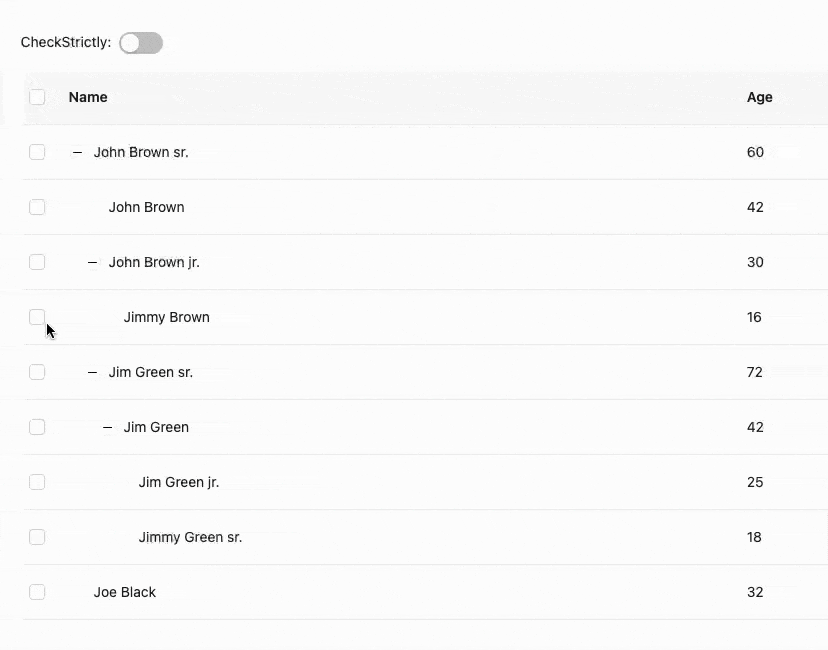
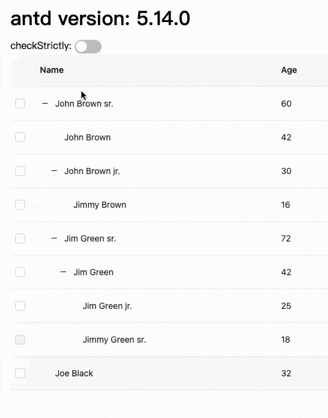
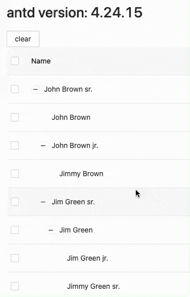
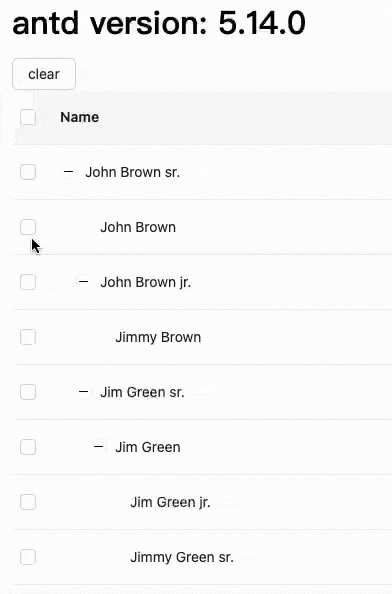

Ant Design 的表格组件 `Table` 支持 shift 多选，但前提是父子不关联，也就是必须设置 `checkStrictly: true`

具体演示如下：



但现在需求就是要支持父子联动，还要有多选

一开始想的是设置父子不联动，这样多选就没有问题了，在用户勾选后，手动处理父子联动，但这样就没有半选的状态了

所以还是要设置父子联动

那其实可以监听 shift 按键，如果按下了，就设置父子不联动，就实现了多选；抬起后恢复父子联动，父子联动也有了，这样就没问题了

那就开干吧

这里就是初版的实现方式：

[checkStrictly - CodeSandbox](https://codesandbox.io/p/sandbox/checkstrictly-576hqs?file=%2Findex.js)

效果如下：



初始时是支持父子联动的，当按下 shift 时，设置父子不联动，勾选后支持多选，抬起 shift 后，恢复父子联动，而且可以看到我们多选只勾选了 4 个，抬起后表格自动处理了父子联动，都不需要我们手动处理了

但 onChange 里的勾选数据还是只有 4 个，与最后表格展示的不一致

同时当我们反复按下抬起 shift 时，勾选在来回切换，这个是由于抬起 shift 后，我们没有手动将勾选设置回去，所以会导致数据不一致

但我们现在拿不到抬起 shift 后的勾选数据啊，如果有一个 api 可以获取表格勾选数据就好了

所以我就给 AntD 提了一个 issue：[可以通过 ref（或别的 api）主动获取表格勾选的数据](https://github.com/ant-design/ant-design/issues/46848)

最后的结论就是让 checkStrictly 也支持多选，但他们现在可能还没有时间搞这个，目前没有下文了

但需求等不了啊，那还是需要自己手动处理一下父子联动

思路就是：遍历已勾选的 keys，查看父级是否存在并且没有勾选，如果是的话，就遍历该父级的所有子级，如果所有子级都勾选了或禁用了，就把父级的 id push 到 keys 中；再将其所有未禁用的子级的 id push 到 keys 中

关键代码如下：

```js
const checkSelected = () => {
  const keys = [...selectedRowKeys]

  // 动态迭代
  for (const key of keys) {
    const node = list.find(item => item.id === key)
    if (node) {
      // 有 parent，且没有被选中
      if (node.pid && !keys.includes(node.pid)) {
        checkParent(node.pid, keys)
      }
      // 有 children
      if (node.children?.length) {
        checkChildren(node.children, keys)
      }
    }
  }

  setSelectedRowKeys(keys)
}

const checkParent = (pid: string, keys: React.Key[]) => {
  const parent = list.find(item => item.id === pid)
  // parent 存在，且不是禁用状态，且有子元素
  if (parent && !getCheckboxProps(parent)?.disabled && parent.children?.length) {
    // 子元素都被选中或禁用
    if (parent.children.every(item => keys.includes(item.id) || getCheckboxProps(item)?.disabled)) {
      keys.push(parent.id)
    }
  }
}

const checkChildren = (children: RecordType[], keys: React.Key[]) => {
  children.forEach(item => {
    // 子元素不是禁用状态且没有被选中
    if (!getCheckboxProps(item)?.disabled && !keys.includes(item.id)) {
      keys.push(item.id)
    }
  })
}
```

然后我们只需要在抬起 shift 时执行 checkSelected 就可以了，并且将 selectedRowKeys 设置回去就可以了

基于可复用的原则，我们还是将其封装为一个 hook 吧

useTableShift.ts

```ts
import { useState, useEffect, useRef } from 'react'
import { TableRowSelection } from 'antd/es/table/interface'

interface BaseRecordType<T> {
  id: string
  pid?: string
  children?: T[]
}

interface UseTableShiftProps<RecordType> {
  list: RecordType[]
  getCheckboxProps?: TableRowSelection<RecordType>['getCheckboxProps']
  defaultSelectedRowKeys?: React.Key[]
}

interface UseTableShiftReturn<RecordType> {
  selectedRowKeys: React.Key[]
  selectedRows: RecordType[]
  setSelectedRowKeys: React.Dispatch<React.SetStateAction<React.Key[]>>
}

/**
 * 支持父子联动的表格多选
 * @param list 拍平后的数据，仍然包含 children
 * @param getCheckboxProps 参见 antd table
 * @param defaultSelectedRowKeys 默认选中的行 ids
 * @returns [checkStrictly, {selectedRowKeys, selectedRows, setSelectedRowKeys}]
 */
const useTableShift = <RecordType extends BaseRecordType<RecordType>>({
  list = [],
  getCheckboxProps = () => ({}),
  defaultSelectedRowKeys = []
}: UseTableShiftProps<RecordType>): [boolean, UseTableShiftReturn<RecordType>] => {
  const [selectedRowKeys, setSelectedRowKeys] = useState(defaultSelectedRowKeys)
  const [selectedRows, setSelectedRows] = useState<RecordType[]>([])
  const [checkStrictly, setCheckStrictly] = useState(false)

  // 供 addEventListener 使用
  const checkStrictlyRef = useRef(checkStrictly)

  useEffect(() => {
    const handleKeyDown = e => {
      // 按下 shift 键并且父子联动状态是开启的
      if (e.shiftKey && !checkStrictlyRef.current) {
        // 关闭父子联动
        setCheckStrictly(true)
      }
    }
    document.addEventListener('keydown', handleKeyDown)
    return () => {
      document.removeEventListener('keydown', handleKeyDown)
    }
  }, [])

  useEffect(() => {
    const handleKeyUp = e => {
      // 松开 shift 键并且父子联动状态是关闭的
      if (!e.shiftKey && checkStrictlyRef.current) {
        // 开启父子联动
        setCheckStrictly(false)
      }
    }
    document.addEventListener('keyup', handleKeyUp)
    return () => {
      document.removeEventListener('keyup', handleKeyUp)
    }
  }, [])

  useEffect(() => {
    checkStrictlyRef.current = checkStrictly
    // 松开 shift 键后
    if (!checkStrictly) {
      // 校验父子联动
      checkSelected()
    }
  }, [checkStrictly])

  useEffect(() => {
    setSelectedRows(
      selectedRowKeys.length ? list.filter(item => selectedRowKeys.includes(item.id)) : []
    )
  }, [selectedRowKeys])

  const checkSelected = () => {
    const keys = [...selectedRowKeys]

    // 动态迭代
    for (const key of keys) {
      const node = list.find(item => item.id === key)
      if (node) {
        // 有 parent，且没有被选中
        if (node.pid && !keys.includes(node.pid)) {
          checkParent(node.pid, keys)
        }
        // 有 children
        if (node.children?.length) {
          checkChildren(node.children, keys)
        }
      }
    }

    setSelectedRowKeys(keys)
  }

  const checkParent = (pid: string, keys: React.Key[]) => {
    const parent = list.find(item => item.id === pid)
    // parent 存在，且不是禁用状态，且有子元素
    if (parent && !getCheckboxProps(parent)?.disabled && parent.children?.length) {
      // 子元素都被选中或禁用
      if (
        parent.children.every(item => keys.includes(item.id) || getCheckboxProps(item)?.disabled)
      ) {
        keys.push(parent.id)
      }
    }
  }

  const checkChildren = (children: RecordType[], keys: React.Key[]) => {
    children.forEach(item => {
      // 子元素不是禁用状态且没有被选中
      if (!getCheckboxProps(item)?.disabled && !keys.includes(item.id)) {
        keys.push(item.id)
      }
    })
  }

  return [checkStrictly, { selectedRowKeys, setSelectedRowKeys, selectedRows }]
}

export default useTableShift
```

这里我们把 interface 也添加上了，不过目前 ts 还是学的不太好，如果有问题或优化空间，大家可以在评论区告诉我，不胜感谢

当然我们这里的代码还是有很多硬编码的地方，比如 children，id，pid(虽然我们用 ts 类型约束了一下)，这些其实应该也需要传入过来，动态获取，不过这里就先这样了

而且我们的 list 虽然拍平了，但还是保留了 children，当然不保留也可以，通过 pid 也可以拿到所有的 children

只能说现在的代码还是偏向于定制化

使用方式：

```ts
const [checkStrictly, { selectedRowKeys, setSelectedRowKeys, selectedRows }] = useTableShift({
  list: dataModel, // dataModel 就是 tableData 拍平的数据
  getCheckboxProps
})

const rowSelection = {
  checkStrictly,
  selectedRowKeys,
  onChange: (selectedRowKeys: any[]) => {
    setSelectedRowKeys(selectedRowKeys)
  },
  getCheckboxProps
}

return <Table columns={columns} dataSource={tableData} rowSelection={rowSelection} />
```

实际使用过程中还发现一个问题：

当手动清空选中 (setSelectedRowKeys([])) 后，下次按 shift 多选的时候，antd4 内部没有清空，还是会有多选效果，而 antd5 就没有这个问题了

下图为 antd4 下的效果



[代码地址](https://codesandbox.io/p/sandbox/antd-reproduction-template-forked-m43h9l)

下图为 antd5 下的效果



[代码地址](https://codesandbox.io/p/sandbox/antd-reproduction-template-forked-h7t98z)

这个其实问题也不是太大，但如果有禁用勾选就有问题了

比如勾选禁用逻辑是勾选了 a，b 就禁用了

当我们不按 shift 勾选 a 后，b 确实禁用了

但手动清空后，按 shift 勾选 c 后，a，b，c 都勾选了，而且 b 还是禁用状态下勾选，这样就有问题

所以如果你使用的是 antd4，而且还有上面类似的禁用逻辑，可以参考下方代码

```ts
const checkSelected = () => {
  /* 使用手动清空勾选后
   * antd v4 table 内部没有清除，v5 会自动清除
   * 下次勾选使用 shift 后，会将上次勾选的节点 (页面展示其实已经是未勾选状态) 及当前节点中间所有节点都勾选
   * 导致出现禁用选中的情况
   * 这里做一个容错处理，防止出现禁用选中的情况，但勾选的结果无法保证
   */
  const keys = selectedRowKeys.filter(key => {
    const node = list.find(item => item.id === key)
    return node && !getCheckboxProps(node)?.disabled
  })
  // ...
}
```
