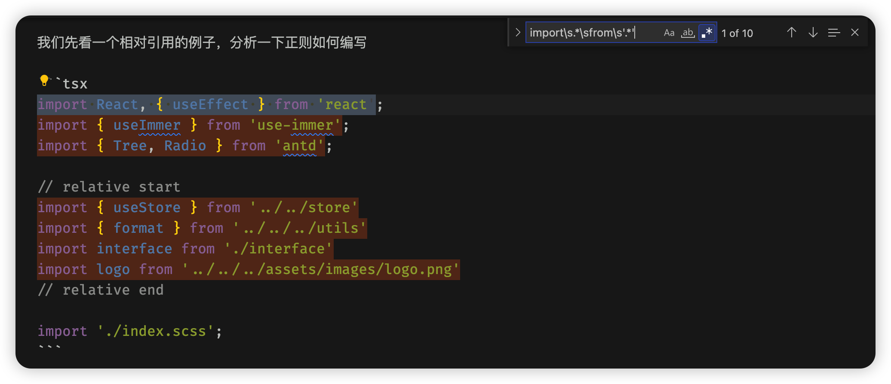
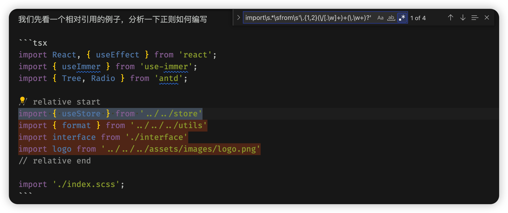

## 前言

书接上回 [node 监听文件夹并处理](/pages/9cef33/)

最近各个项目都配置了路径别名，引用文件又方便了不少，而且还摆脱了又臭又长的 `../`

代码一下就简洁干净了不少，而且也不用担心拷贝代码以后引用路径错误的问题。

路径别名配置文档可以参考这篇文章：[react @craco/craco 配置路径别名 @ 转 src](https://www.jianshu.com/p/5fd396e6e448)

说个题外话，这里为什么不说移动文件呢？因为移动文件以后，VSCode 可以自动校正引用路径，完全不需要我们管，配置如下

```json
{
  // 自动更新路径
  "javascript.updateImportsOnFileMove.enabled": "always",
  "typescript.updateImportsOnFileMove.enabled": "always",
}
```

书归正传，但有一个很现实的问题：我们以前一直使用的是相对路径，难道要我们手动一个一个改吗？这不是累傻小子吗？

no, no, no

作为程序员，第一美德肯定是懒，这种重复而且不需要动脑子的体力活，怎么适合程序员干呢？那必须是程序干啊！

所以我们需要写一个脚本，可以自动将相对路径转为别名路径

有了新增文件自动初始化的经验，这不是手到擒来嘛

个屁呀

## 如何匹配相对路径

一说到匹配，那当仁不让的就是正则了，没有比他更好的选择了

我们先看一个相对引用的例子，分析一下正则如何编写

```tsx
import React, { useEffect } from 'react';
import { useImmer } from 'use-immer';
import { Tree, Radio } from 'antd';

// relative start
import { useStore } from '../../store'
import { format } from '../../../utils'
import interface from './interface'
import logo from '../../../assets/images/logo.png'
// relative end

import './index.scss';
```

我们将变化的使用 `x` 替代，就可以得出如下简版的正则：

`/import\sxxx\sfrom\s'xxx'/`

我们先看第一处 `x` 的正则如何编写

分两种情况，一种是带 `{}` 的，一种是不带的，我们需要分开讨论

个屁啊

我直接一个 `.*` 就搞定了，管你那么多，反正前后有 `import` 和 `from` 限制，我管你中间写什么，`who care` 啊

哦，那我知道了，第二处 `x` 也可以用这个吧

```tsx
import React, { useEffect } from 'react';
import { useImmer } from 'use-immer';
import { Tree, Radio } from 'antd';
```

你问问这三同意吗？

说到这里了，再说一个题外话

教大家一个写正则的好方法：那就是使用 VSCode 的正则查找模式

首先使用 `ctrl/cmd + f` 打开查找模式，点击正则匹配图标即可，当然也可以直接通过快捷键打开正则查找模式


如上图，我配置的快捷键是 `cmd + shift + r`

然后在输入框输入正则表达式即可（不用输入 //），这样当你输入的正则表达式可以匹配到当前文件的内容（需要提前写好测试内容）时，查找模式就会高亮匹配到文本，就可以验证正则是否正确了

比如我们现在输入 `import\s.*\sfrom\s'.*'` 看看能匹配到什么呢？



可以看到，不仅相对引用高亮了，那些第三方引用也高亮了，这肯定是不对的

所以我们需要重点分析一下这部分

首先都是以 `.` 或 `..` 开头，跟着一个或多个 `/..` 或者 `/\w+`，可能还有一个后缀名 `\.\w+`

对应的正则就是：`\.{1,2}\/[.\w]+(\.\w+)?`

我们先测试一下：


发现只匹配到一个相对路径，重新检查一下

跟着一个或多个 `/..` 或者 `/\w+` 我们的正则是 `\/[.\w]+`，这其实只能匹配到一个，所以我们需要变成可以匹配多个的：`(\/[.\w]+)+`

再试试：



可以了，正好是我们需要的，完整的正则如下：

`import\s.*\sfrom\s'\.{1,2}(\/[.\w]+)+(\.\w+)?'`

可以进行下一步了～

等等，这个正则你不觉得有点长吗？

正则都是非常长，而且还晦涩难懂（小声 BB：我到现在还有点懵呢），都正常的啦～

作为一个专业的程序员，我们必须力求精简，即使是正则也不例外，不能因为不懂或阴差阳错写出来就万事大吉了

首先还是看第一处 `x`，这里我们的正则是 `\s.*\s`，但其实 `.` 就包含了 `\s`，所以我们使用 `.*` 就可以了

再看第二处，`\.{1,2}` 和 `(\.\w+)?` 无法优化了，但 `(\/[.\w]+)+` 还是可以优化嘀，`[.\w]+` 也可以使用 `.` 代替

那最后就是 `import.*from\s'\.{1,2}(\/.+)+(\.\w+)?'`

再验证一下：


完全没问题，可以进行下一步啦～

## 相对路径如何转别名路径
