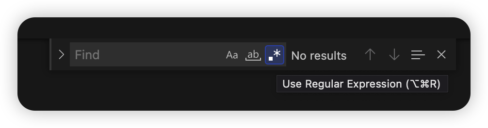
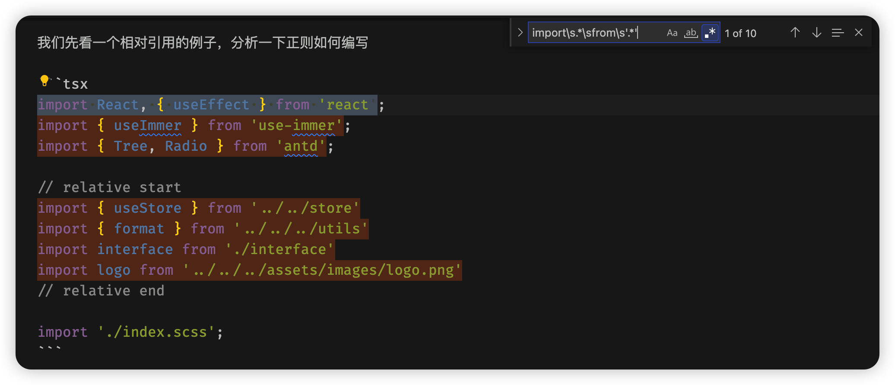
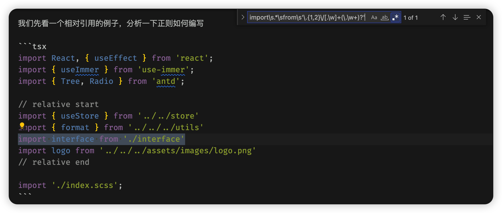
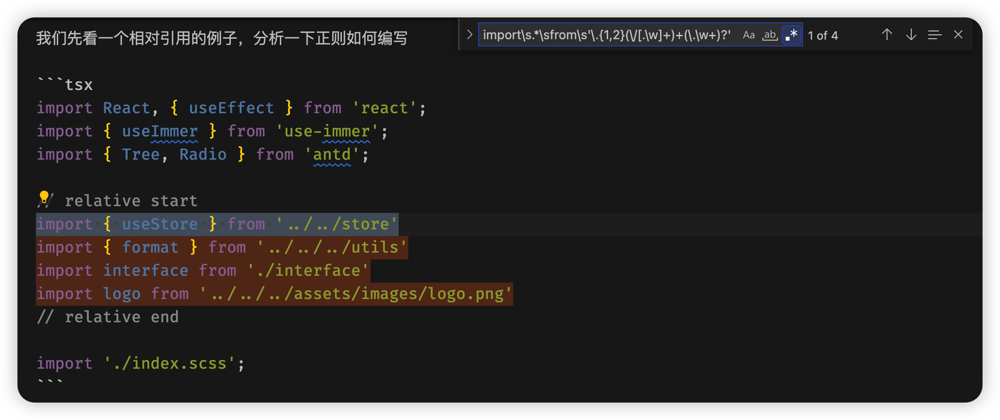
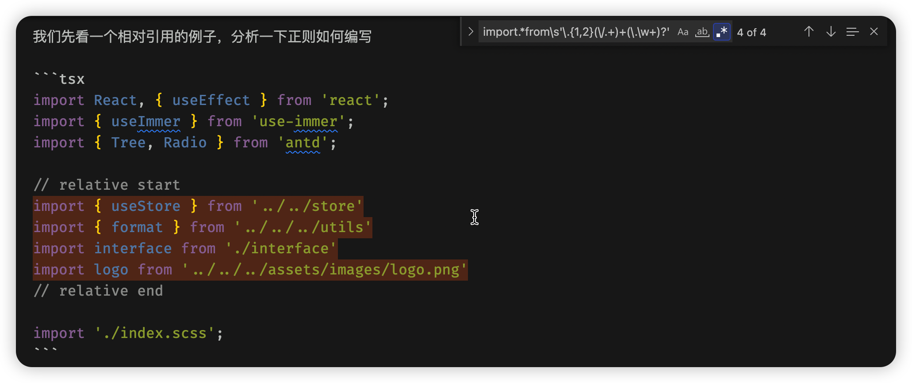

## 前言

书接上回 [node 监听文件夹并处理](/pages/9cef33/)

最近各个项目都配置了路径别名，引用文件又方便了不少，而且还摆脱了又臭又长的 `../`

代码一下就简洁干净了不少，而且也不用担心拷贝代码以后引用路径错误的问题。

路径别名配置文档可以参考这篇文章：[react @craco/craco 配置路径别名 @ 转 src](https://www.jianshu.com/p/5fd396e6e448)

说个题外话，这里为什么不说移动文件呢？因为移动文件以后，VSCode 可以自动校正引用路径，完全不需要我们管，配置如下

```json
{
  // 自动更新路径
  "javascript.updateImportsOnFileMove.enabled": "always",
  "typescript.updateImportsOnFileMove.enabled": "always"
}
```

书归正传，但有一个很现实的问题：我们以前一直使用的是相对路径，难道要我们手动一个一个改吗？这不是累傻小子吗？

no, no, no

作为程序员，第一美德肯定是懒，这种重复而且不需要动脑子的体力活，怎么适合程序员干呢？那必须是程序干啊！

所以我们需要写一个脚本，可以自动将相对路径转为别名路径

有了新增文件自动初始化的经验，这不是手到擒来嘛

大体思路就是找到需要修改的相对路径，替换为别名路径即可，简单吧~

个屁呀

假设目录树如下：

```
demo
└─ src
   ├─ assets
   │  └─ images
   │     └─ logo.png
   ├─ pages
   │  ├─ Admin
   │  │  └─ HelloWorld
   │  │     ├─ index.tsx
   │  │     └─ interface.js
   │  └─ store
   │     └─ index.js
   └─ utils
      └─ index.js
```

当前文件为 `HelloWorld/index.tsx`

## 如何匹配相对路径

一说到匹配，那当仁不让的就是正则了，没有比他更好的选择了

我们先看一个相对引用的例子，分析一下正则如何编写

```tsx
import React, { useEffect } from 'react'
import { useImmer } from 'use-immer'
import { Tree, Radio } from 'antd'

// relative start
import { useStore } from '../../store'
import { format } from '../../../utils'
import interface from './interface'
import logo from '../../../assets/images/logo.png'
// relative end

import './index.scss'
```

我们将变化的使用 `x` 替代，就可以得出如下简版的正则：

`/import\sxxx\sfrom\s'xxx'/`

我们先看第一处 `x` 的正则如何编写

分两种情况，一种是带 `{}` 的，一种是不带的，我们需要分开讨论

个屁啊

我直接一个 `.*` 就搞定了，管你那么多，反正前后有 `import` 和 `from` 限制，我管你中间写什么，`who care` 啊

哦，那我知道了，第二处 `x` 也可以用这个吧

```tsx
import React, { useEffect } from 'react'
import { useImmer } from 'use-immer'
import { Tree, Radio } from 'antd'
```

你问问这三同意吗？

说到这里了，再说一个题外话

教大家一个写正则的好方法：那就是使用 VSCode 的正则查找模式

首先使用 `ctrl/cmd + f` 打开查找模式，点击正则匹配图标即可，当然也可以直接通过快捷键打开正则查找模式



如上图，我配置的快捷键是 `cmd + shift + r`

然后在输入框输入正则表达式即可（不用输入 //），这样当你输入的正则表达式可以匹配到当前文件的内容（需要提前写好测试内容）时，查找模式就会高亮匹配到文本，就可以验证正则是否正确了

比如我们现在输入 `import\s.*\sfrom\s'.*'` 看看能匹配到什么呢？



可以看到，不仅相对引用高亮了，那些第三方引用也高亮了，这肯定是不对的

所以我们需要重点分析一下这部分

首先都是以 `.` 或 `..` 开头，跟着一个或多个 `/..` 或者 `/\w+`，可能还有一个后缀名 `\.\w+`

对应的正则就是：`\.{1,2}\/[.\w]+(\.\w+)?`

我们先测试一下：



发现只匹配到一个相对路径，重新检查一下

跟着一个或多个 `/..` 或者 `/\w+` 我们的正则是 `\/[.\w]+`，这其实只能匹配到一个，所以我们需要变成可以匹配多个的：`(\/[.\w]+)+`

再试试：



可以了，正好是我们需要的，完整的正则如下：

`import\s.*\sfrom\s'\.{1,2}(\/[.\w]+)+(\.\w+)?'`

可以进行下一步了～

等等，这个正则你不觉得有点长吗？

正则都是非常长，而且还晦涩难懂（小声 BB：我到现在还有点懵呢），都正常的啦～

作为一个专业的程序员，我们必须力求精简，即使是正则也不例外，不能因为不懂或阴差阳错写出来就万事大吉了

首先还是看第一处 `x`，这里我们的正则是 `\s.*\s`，但其实 `.` 就包含了 `\s`，所以我们使用 `.*` 就可以了

再看第二处，`\.{1,2}` 和 `(\.\w+)?` 无法优化了，但 `(\/[.\w]+)+` 还是可以优化嘀，`[.\w]+` 也可以使用 `.` 代替

那最后就是 `import.*from\s'\.{1,2}(\/.+)+(\.\w+)?'`

再验证一下：



完全没问题，可以进行下一步啦～

## 如何获取相对路径

现在正则有了，直接使用 `replace` 替换就可以了

测试一下：

```js
const str = `
import React, { useEffect } from 'react'
import { useImmer } from 'use-immer'
import { Tree, Radio } from 'antd'

// relative start
import { useStore } from '../../store'
import { format } from '../../../utils'
import interface from './interface'
import logo from '../../../assets/images/logo.png'
// relative end

import './index.scss'
`

const reg = /import.*from\s'\.{1,2}(\/.+)+(\.\w+)?'/g

str.replace(reg, function (match, p1, p2) {
  console.log('match:', match, 'p1:', p1, 'p2:', p2)
})
```

输出如下：

```
match: import { useStore } from '../../store' p1: /../store p2: undefined
match: import { format } from '../../../utils' p1: /../../utils p2: undefined
match: import interface from './interface' p1: /interface p2: undefined
match: import logo from '../../../assets/images/logo.png' p1: /../../assets/images/logo.png p2: undefined
```

这个输出有点超出我的预期范围了，感觉不对！

首先 `match` 匹配是对的，但我们好像没有特意写子表达式（正则中用括号括起来的那些）啊

原来我们在优化时无意识的写了子表达式：`(\/.+)+(\.\w+)?`，当时只是为了匹配多个

但这貌似应该是两个子表达式吧，别的就不说了，`import logo from '../../../assets/images/logo.png'` 中 `.png` 应该被 `p2` 匹配到啊

结果却被 `p1` 匹配到了，说明正则还是有问题

这种匹配长度超出我们预期的现象，大部分都是因为处于贪婪匹配模式，会尽可能的多匹配符合正则的字符

解决方法也很简单，在量词后面加一个 `?` 就变成非贪婪模式了

以我们这个为例，`\/.+` 其实就已经把后面的字符都匹配完了，其实就是 `import.*from\s'\.{1,2}(\/.+)'`

再测试一下：

```js
const reg = /import.*from\s'\.{1,2}(\/.+)'/g

str.replace(reg, function (match, p1, p2) {
  console.log('match:', match, 'p1:', p1, 'p2:', p2)
})
```

输出如下：

```
match: import { useStore } from '../../store' p1: /../store p2: 133
match: import { format } from '../../../utils' p1: /../../utils p2: 172
match: import interface from './interface' p1: /interface p2: 212
match: import logo from '../../../assets/images/logo.png' p1: /../../assets/images/logo.png p2: 248
```

`match` 和 `p1` 与原来相同，所有此次优化又成功啦~

`p2` 是因为我们本次正则就只有一个子表达式，`p2` 就变成 `offset`: 匹配到的子字符串在原字符串中的偏移量

我们再验证一下非贪婪模式：`import.*from\s'\.{1,2}(\/.+?)(\.\w+)?'`

再测试一下：

```js
const reg = /import.*from\s'\.{1,2}(\/.+?)(\.\w+)?'/g

str.replace(reg, function (match, p1, p2) {
  console.log('match:', match, 'p1:', p1, 'p2:', p2)
})
```

输出如下：

```
match: import { useStore } from '../../store' p1: /../store p2: undefined
match: import { format } from '../../../utils' p1: /../../utils p2: undefined
match: import interface from './interface' p1: /interface p2: undefined
match: import logo from '../../../assets/images/logo.png' p1: /../../assets/images/logo p2: .png
```

好，完全正确！

但其实 `import.*from\s'\.{1,2}(\/.+)'` 已经就满足我们的需求了，只是还缺少前面一层路径，使用括号创建一个子表达式就可以了：`import.*from\s'(\.{1,2}\/.+)'`

再测试一下：

```js
const reg = /import.*from\s'(\.{1,2}\/.+)'/g

str.replace(reg, function (match, p1, p2) {
  console.log('match:', match, 'p1:', p1, 'p2:', p2)
})
```

输出如下：

```
match: import { useStore } from '../../store' p1: ../../store p2: 133
match: import { format } from '../../../utils' p1: ../../../utils p2: 172
match: import interface from './interface' p1: ./interface p2: 212
match: import logo from '../../../assets/images/logo.png' p1: ../../../assets/images/logo.png p2: 248
```

`p1` 就是我们需要替换的字符

## 相对路径如何转别名路径

这里我们主要解决 `import { format } from '../../../utils'` 转成 `import { format } from '@/utils'`

`../../../utils` 我们已经找到了，如何变成 `@/utils` 就是我们需要做的了

在上一章我们使用 `relative` 来根据当前工作目录查找从给定路径到另一个路径的相对路径，那么有没有相反的函数呢？

当然是有的，那就是 [`normalize`](https://nodejs.org/dist/latest-v16.x/docs/api/path.html#pathnormalizepath)

可以看一下官网的例子：

```js
path.normalize('/foo/bar//baz/asdf/quux/..')
// Returns: '/foo/bar/baz/asdf'
```

看到参数有什么想法吗？

对，我们只需要把当前文件的路径及相对路径 `join` 一下，然后当参数传给 `normalize` 就可以生成当前引用的绝对路径了

再根据 `src/` 截取一下，拼上 `@` 不就可以了吗？

我们来实现一下：

```js
const path = require('path')
const fs = require('fs')

const filePath = path.join(__dirname, 'src/pages/Admin/HelloWorld/index.tsx')

const fileData = fs.readFileSync(filePath, 'utf8')

const reg = /import.*from\s'(\.{1,2}\/.+)'/g

fileData.replace(reg, function (match, p1) {
  const absolutePath = path.normalize(path.join(filePath, p1))
  console.log(absolutePath)
})
```

输出：

```
demo\src\pages\Admin\store
demo\src\pages\utils
demo\src\pages\Admin\HelloWorld\index.tsx\interface
demo\src\pages\assets\images\logo.png
```

路径有点问题，`../` 多了一个 `pages`，`./` 多了一个 `index.tsx`

看来 `normalize` 使用还有点问题

再看一下例子，貌似好像不需要最后面的 `index.tsx`

去掉试试

```js
const path = require('path')
const fs = require('fs')

const filePath = path.join(__dirname, 'src/pages/Admin/HelloWorld/index.tsx')

const fileData = fs.readFileSync(filePath, 'utf8')

const reg = /import.*from\s'(\.{1,2}\/.+)'/g

fileData.replace(reg, function (match, p1) {
  const absolutePath = path.normalize(path.join(path.parse(filePath).dir, p1))
  console.log(absolutePath)
})
```

输出：

```
demo\src\pages\store
demo\src\utils
demo\src\pages\Admin\HelloWorld\interface
demo\src\assets\images\logo.png
```

绝对路径没有问题了，再变成别名路径：

```js
const path = require('path')
const fs = require('fs')

const sep = path.sep

const filePath = path.join(__dirname, 'src/pages/Admin/HelloWorld/index.tsx')

const fileData = fs.readFileSync(filePath, 'utf8')

const reg = /import.*from\s'(\.{1,2}\/.+)'/g

fileData.replace(reg, function (match, p1) {
  const absolutePath = path.normalize(path.join(path.parse(filePath).dir, p1))
  const aliasPath = '@/' + absolutePath.split(`src${sep}`)[1].replace(/\\/g, '/')
  console.log(aliasPath)
})
```

输出：

```
@/pages/store
@/utils
@/pages/Admin/HelloWorld/interface
@/assets/images/logo.png
```

别名路径也没问题了

那就执行替换吧

```js
const result = fileData.replace(reg, function (match, p1, p2) {
  const absolutePath = path.normalize(path.join(path.parse(filePath).dir, p1))
  const aliasPath = '@/' + absolutePath.split(`src${sep}`)[1].replace(/\\/g, '/')
  return aliasPath
})
console.log(result)
```

输出：

```
import React, { useEffect } from 'react'
import { useImmer } from 'use-immer'
import { Tree, Radio } from 'antd'

// relative start
@/pages/store
@/utils
@/pages/Admin/HelloWorld/interface
@/assets/images/logo.png
// relative end

import './index.scss'
```

嗯？怎么回事，我那么大一个 `import` 哪去了？

原来搞错了呀，这里我们使用转换以后的 `p1` 替换 `match`，导致丢失了前面的字符

有两种方式，

一种是把前面的也变成子表达式，最后返回两个子表达式：

```js
const reg = /(import.*from\s)'(\.{1,2}\/.+)'/g

const result = fileData.replace(reg, function (match, p1, p2) {
  const absolutePath = path.normalize(path.join(path.parse(filePath).dir, p2))
  const aliasPath = '@/' + absolutePath.split(`src${sep}`)[1].replace(/\\/g, '/')
  return `${p1}'${aliasPath}'`
})
console.log(result)
```

输出：

```
import React, { useEffect } from 'react'
import { useImmer } from 'use-immer'
import { Tree, Radio } from 'antd'

// relative start
import { useStore } from '@/pages/store'
import { format } from '@/utils'
import interface from '@/pages/Admin/HelloWorld/interface'
import logo from '@/assets/images/logo.png'
// relative end

import './index.scss'
```

完美！

另一种是正则只匹配相对路径的引用部分：

```js
const reg = /\.{1,2}\/.+/g

const result = fileData.replace(reg, function (match, p1, p2) {
  const absolutePath = path.normalize(path.join(path.parse(filePath).dir, match))
  const aliasPath = '@/' + absolutePath.split(`src${sep}`)[1].replace(/\\/g, '/')
  return aliasPath
})
console.log(result)
```

输出：

```
import React, { useEffect } from 'react'
import { useImmer } from 'use-immer'
import { Tree, Radio } from 'antd'

// relative start
import { useStore } from '@/pages/store'
import { format } from '@/utils'
import interface from '@/pages/Admin/HelloWorld/interface'
import logo from '@/assets/images/logo.png'
// relative end

import '@/pages/Admin/HelloWorld/index.scss'
```

这种是把所有 `./` 或 `../` 开头的字符都匹配了，感觉有点不可控，还是使用第一种方式吧

## 在实际项目中验证

本来一开始测试的都运行完美，结果遇到下面的代码：

```js
import {
  format,
  formatDate,
  formatTime,
  isObject,
  isArray,
  getCookie,
  listToTree
} from '../../../utils'
```

发现匹配不了了，这种在项目中还是很常见的，必须要解决的

这是因为 `import.*` 中的 `.` 只能匹配除换行符 "\n" 外的任意字符，所以这里还需要加上换行的正则

我们可以使用 `[\s\S]` 来替换 `.`，这样就可以匹配任意字符啦

```js
const reg = /(import[\s\S]*from\s)'(\.{1,2}\/.+)'/g

const result = fileData.replace(reg, function (match, p1, p2) {
  console.log('p1:', p1, 'p2:', p2)
  const absolutePath = path.normalize(path.join(path.parse(filePath).dir, p2))
  const aliasPath = '@/' + absolutePath.split(`src${sep}`)[1].replace(/\\/g, '/')
  return `${p1}'${aliasPath}'`
})
```

输出：

```
p1: import React, { useEffect } from 'react'
import { useImmer } from 'use-immer'
import { Tree, Radio } from 'antd'

// relative start
import { useStore } from '../../store'
import {
  format,
  formatDate,
  formatTime,
  isObject,
  isArray,
  getCookie,
  listToTree
} from '../../../utils'
import interface from './interface'
import logo from  p2: ../../../assets/images/logo.png
```

看到这个输出，应该知道为啥了吧，又是贪婪匹配了，这就好办了

```js
const reg = /(import[\s\S]*?from\s)'(\.{1,2}\/.+)'/g

const result = fileData.replace(reg, function (match, p1, p2) {
  const absolutePath = path.normalize(path.join(path.parse(filePath).dir, p2))
  const aliasPath = '@/' + absolutePath.split(`src${sep}`)[1].replace(/\\/g, '/')
  return `${p1}'${aliasPath}'`
})
console.log(result)
```

输出：

```
import React, { useEffect } from 'react'
import { useImmer } from 'use-immer'
import { Tree, Radio } from 'antd'

// relative start
import { useStore } from '@/pages/store'
import {
  format,
  formatDate,
  formatTime,
  isObject,
  isArray,
  getCookie,
  listToTree
} from '@/utils'
import interface from '@/pages/Admin/HelloWorld/interface'
import logo from '@/assets/images/logo.png'
// relative end

import './index.scss'
```

完美~

我们只需要使用 `fs.writeFileSync(filePath, result)` 重新写入就可以啦

## 使用 chokidar 监听文件并处理

处理脚本有了，现在就差如何触发了

既然已经使用 `chokidar` 监听了，就还使用它吧

`add` 和 `addDir` 是不行了，只能使用 `change` 事件监听了

我们继续使用链式调用：

```js
const reg = /(import[\s\S]*?from\s)'(\.{1,2}\/.+)'/g

  // do something: watch add/addDir

  .on('change', filePath => {
    let fileData = readFileSync(filePath, 'utf8')
    if (reg.test(fileData)) {
      const result = fileData.replace(reg, (match, p1, p2) => {
        const absolutePath = path.normalize(path.join(path.parse(filePath).dir, p2))
        const aliasPath = '@/' + absolutePath.split(`src${sep}`)[1].replace(/\\/g, '/')
        return `${p1}'${aliasPath}'`
      })
      fs.writeFileSync(filePath, result)
    }
  })
```

这样，当我们启动项目，更改文件并保存后，就会触发脚本，自动将相对路径转为别名路径

由于我们项目在保存文件时，自动执行了格式化，导致有时候与自动格式化冲突，路径没有转换成功，故使用 `setTimeout` 延迟一下：

```js
setTimeout(() => {
  fs.writeFileSync(filePath, result)
}, 100)
```

而且好像不用修改文件，直接使用快捷键保存也可以触发

## 发现的问题

### 性能问题

首先 `change` 事件是在保存文件时触发，而我们转换路径一般只调用一次就够了，后续的 `change` 事件均无效了

所以我们在第一次触发 `change` 事件后，就需要 `unwatch` 该文件

```js
const watcher = chokidar.watch('./src', {
  ignoreInitial: true
})
watcher.on('change', filePath => {
  watcher.unwatch(filePath)
  let fileData = readFileSync(filePath, 'utf8')
  if (reg.test(fileData)) {
    const result = fileData.replace(reg, (match, p1, p2) => {
      const absolutePath = path.normalize(path.join(path.parse(filePath).dir, p2))
      const aliasPath = '@/' + absolutePath.split(`src${sep}`)[1].replace(/\\/g, '/')
      return `${p1}'${aliasPath}'`
    })
    setTimeout(() => {
      fs.writeFileSync(filePath, result)
    }, 100)
  }
})
```

### 触发时机不好控制

目前的触发时机是开启服务并且文件改变，完全不受使用者控制

比如开着服务切换分支时，某些文件会发生改变，就会触发脚本，大量文件被修改

或者某些文件不想转换路径，也被自动执行了，虽然加了 `unwatch`，可以再撤回就不会自动转了，但还是使用不太方便

所以我们需要做一个可以由使用者控制的脚本

这个使用 `chokidar` 就无法做到了，只能使用 `VSCode` 插件实现了

详细实现逻辑见：[VSCode 开发插件之相对路径转别名路径](/pages/0473ca/)

## 参考资料

- [将别名@导入重构为相对路径](https://qa.1r1g.com/sf/ask/4003161921/)
- [正则匹配所有换行 - CSDN](https://www.csdn.net/tags/MtjaQg4sNjQ4NTYtYmxvZwO0O0OO0O0O.html)
