所谓重构就是在不改变代码外在行为的前提下，对代码进行修改，以改进程序的内部结构。本质上说，重构就是在代码写好之后改进它的设计，来提高项目的质量和可维护性

## 代码重构有什么意义？为什么重构有用？

今天来说一下为什么重构有用呢？程序有两种价值："今天可以为你做什么"和"明天可以为你做什么"。大多数时候，我们都只关注自己今天想要程序做什么。不论是修复 Bug 或是添加特性，我们都是为了让程序更加完善更强大，让它在今天更有价值。

但是系统当下行为，只是整个故事的一部分，如果没有认清这一点，无法长期从事编程工作。如果你为求完成今天任务而不择手段，导致不可能在明天完成明天的任务，那么最终还是会失败。但是，你知道自己今天需要什么，却不一定知道自己明天需要什么。也许你可以猜到明天的需求，也许吧，但肯定还有些事情出乎你的意料。

对于今天的工作，我了解得很充分；对于明天的工作，我了解得不够充分。但如果我纯粹只是为今天工作，明天我将完全无法工作。

重构是一条摆脱束缚的道路。如果你发现昨天的决定已经不适合今天的情况，放心改变这个决定就是，然后你就可以完成今天的工作了。明天回头看今天的理解也许觉得幼稚，那时你还可以改变你的理解。

是什么让程序如此难以修改？主要有以下四个原因：

1. 难以阅读的程序；
2. 逻辑复杂的程序；
3. 添加新行为时需要修改既有代码；
4. 带复杂条件逻辑的程序。

因此，我们希望编写的程序是：

1. 容易理解；
2. 所有逻辑都只在唯一地点指定；
3. 新的改动不会危及现有行为；
4. 尽可能简单表达条件逻辑。

重构是这样一个过程：它在一个目前可运行的程序上进行，企图在不改变程序行为的情况下赋予上述美好性质，使我们能够继续保持高速开发，从而增加程序的价值。

## 使用重构

VS Code 通过 TypeScript 语言服务内置了对 TypeScript 和 JavaScript 重构的支持，也可以通过安装扩展来为其他编程语言提供重构支持

当光标位于可重构的文本区域时，源代码附近的灯泡会提示可用的代码操作。单击灯泡或使用快速修复命令 `C + .` 将显示快速修复和重构。

如果您只想看到没有快速修复的重构，您可以使用重构命令 `CT + S + r`。

详情参见：

- [Refactoring source code in Visual Studio Code](https://code.visualstudio.com/docs/editor/refactoring)
- [TypeScript refactoring with Visual Studio Code](https://code.visualstudio.com/docs/typescript/typescript-refactoring)

### Rename Symbol: 重命名

快捷键：`F2`

与查找替换不同的是，重命名只会修改与之有引用关系的名称

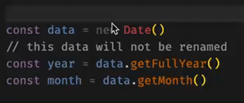

### Extract Variable: 提取变量

智能选取光标所在的变量或已选取的范围，将其提取为常量或函数

使用快速修复：

- Extract to constant in enclosing scope: 在当前作用域中将其提取为常量
- Extract to inner function in function: 在当前函数中将其提取为内部函数
- Extract to function in global scope: 在全局作用域中将其提取为函数
- Extract to constant in global scope: 在全局作用域中将其提取为常量
- Extract to function in module scope: 在组件作用域中将其提取为函数
- Extract to constant in module scope: 在组件作用域中将其提取为常量

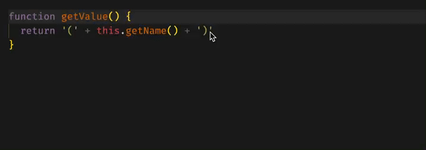

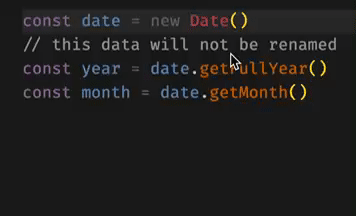

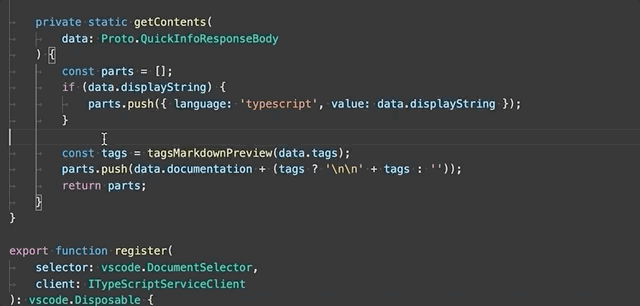

使用建议：

- 修改魔法数字
- 抽离逻辑
- 拆分函数
- 提取公共逻辑

### Extract Type: 提取类型

使用快速修复：

- Extract to type alias
- Extract to interface

与提取变量类似，不过针对的是类型

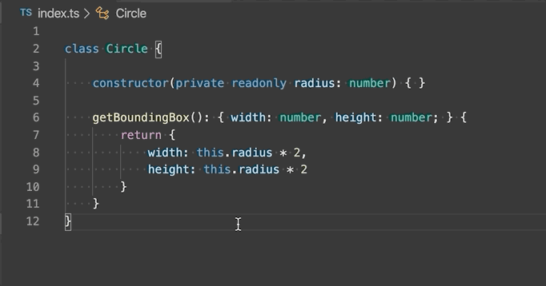

### Move to a new File: 移动到新文件

使用快速修复：`Move to a new File`

只适用于全局声明的函数、类型、接口和变量

代码会迁移到以光标所在的函数/类作为文件名的文件中；如果有多个类/函数，会以第一个类/函数做命名

如果选中一个代码块，也可以将其移动到新文件，文件名以第一个变量做命名

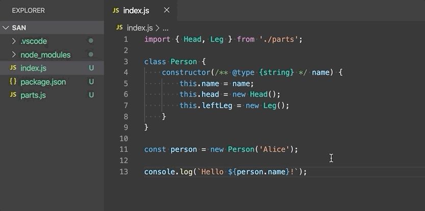

### import and export: 导入导出

使用快速修复：

- Convert default export to named export
- Convert named export to default export
- Convert namespace import to named export
- Convert named imports to namespace export

在默认导出（export default）和命名导出（export const Foo = ...）之间转换

在命名导入（import { Name } from './foo'）和命名空间导入（import \* as foo from './foo'）之间转换

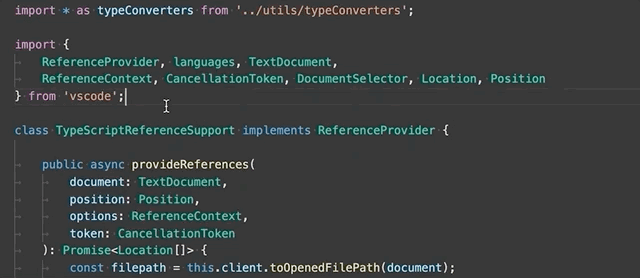

### Convert parameters to destructured object: 将参数转换为解构对象

使用快速修复：`Convert parameters to destructured object`

将函数的多个参数转换为一个参数对象并解构

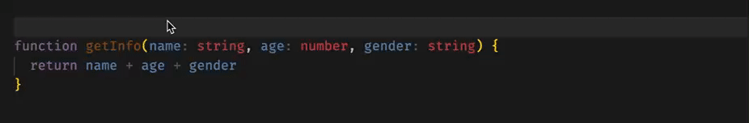

### Generate get and set accessors: 生成获取和设置访问器

使用快速修复：`Generate get and set accessors`

通过为选定的类属性封装 get 和 set

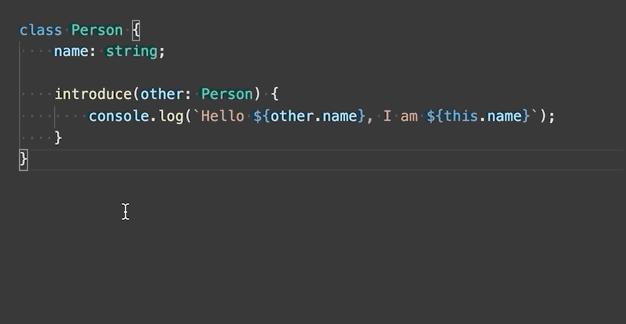

### Infer function return types: 推断函数返回类型

使用快速修复：`Infer function return types`

向函数添加显式返回类型注释

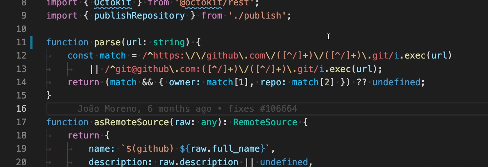

### Remove unreachable code: 删除无法访问的代码

使用快速修复：`Remove unreachable code`

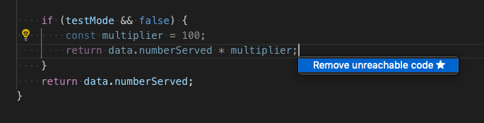

### Remove unused declaration: 删除未使用的变量

使用快速修复：

- Remove unused declaration
- Remove all unused declaration

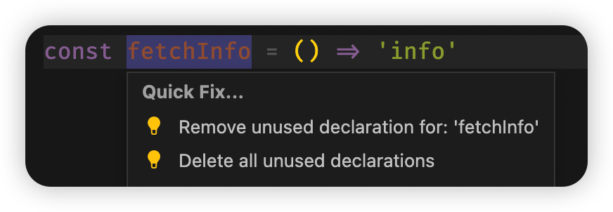

### Organize Imports: 重排导入顺序

使用右键菜单 `Source Action -> Organize Imports` 或使用 `S + O + o` 快捷键运行

对文件中的导入进行排序，并删除未使用的导入

### Convert to async function: 转换为 async 函数

使用快速修复：`Convert to async function`

将 `.then` 链式调用转换为 `async` 函数

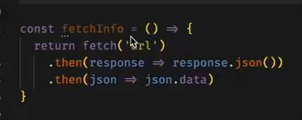

### Convert to template string: 转换为模板字符串

使用快速修复：`Convert to template string`

将拼接字符串转换为模板字符串

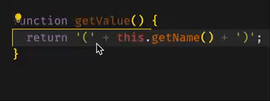

### Convert to optional chain expression: 转换为可选的链式表达式

使用快速修复：`Convert to optional chain expression`

将使用 `&&` 判断的表达式转换为可选的链式表达式

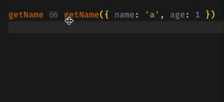

### Add/remove braces from arrow function: 从箭头函数中添加/删除大括号

使用快速修复：

- Add braces from arrow function
- Remove braces from arrow function

将单行箭头函数转换为多行和反向转换

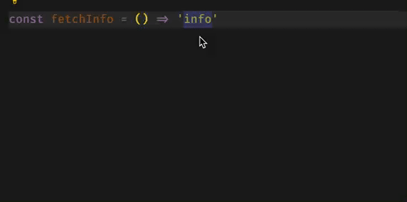

### Surround With Snippet: 使用代码片段包围

使用快速修复：

- Surround With xxx

先选中需要包围的代码，然后选择适合的代码片段包围代码

代码片段包含已安装插件的代码片段及用户自定义的代码片段

比如对于 `js` 代码，有如下代码片段（由于每个人安装插件不同，结果不同，仅供参考）：

- Surround With: If Statement
- Surround With: If-Else Statement
- Surround With: For Loop
- Surround With: Try-Catch Statement
- Surround With Snippet...

默认展示 4 个代码片段，根据最近使用排序，选择最后的 `Surround With Snippet...` 可以展示所有可用的代码片段

对于 `md` 文件：

- Surround With: Insert fenced code block
- Surround With: Insert inline code
- Surround With: Insert image
- Surround With: wrap with double bracket
- Surround With Snippet...

## 参考资料

- [VSCode 中怎么进行前端重构？方法浅析-VSCode-PHP 中文网](https://www.php.cn/tool/vscode/490266.html)
