本文主要结合自己实际工作中的例子介绍重构插件 [Abracadabra, refactor this! - Visual Studio Marketplace](https://marketplace.visualstudio.com/items?itemName=nicoespeon.abracadabra)

快捷键别名对照表参见[这里](/pages/5eaf2e/)

## The Essentials: 主要常用的

### Rename Symbol: 重命名

快捷键：`F2`

通过引用查找的方式重命名变量或函数名

VSCode 原生已支持该功能，但无法在 `.vue` 文件中生效

该插件可以在 `<script>` 标签内使用，但仍无法在 `<template>` 标签内使用

### Extract Variable: 提取变量

快捷键：`C + O + v`

比如我们有时候需要返回一个简单的表达式，可能直接就写成 `return + 表达式`

当我们需要输出该表达式或者增加一些处理时，将其提取为一个变量是更好的选择

我们就可以先选中该表达式，使用快捷键即可提取为变量：

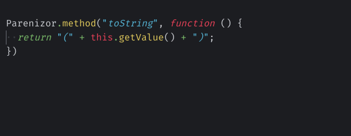

该快捷键也可以根据光标所在的位置智能提取变量：

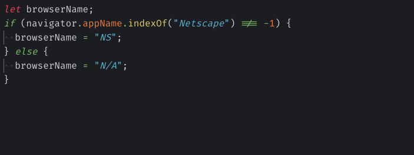

对于多处出现的相同变量也可以同时处理

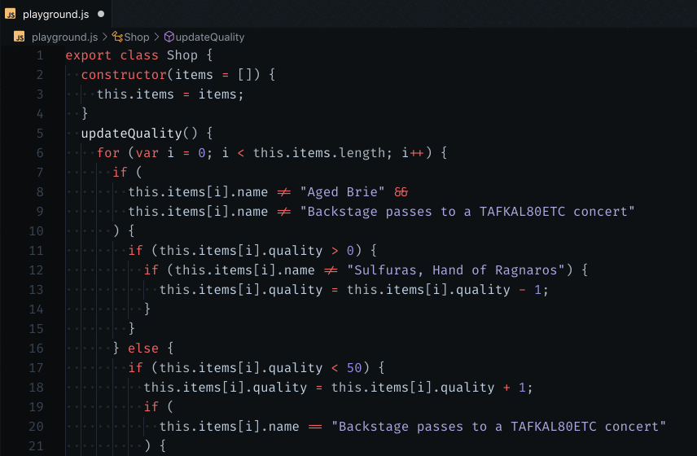

### Extract Type: 提取类型

快捷键：`C + O + v`

与提取变量类似，不过针对的是类型

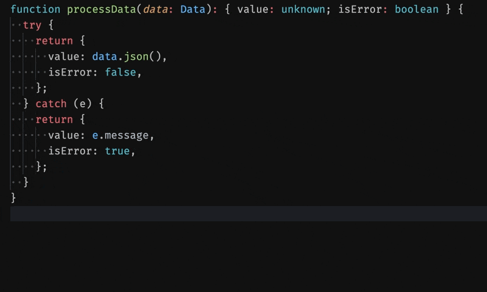

### Inline Variable: 内联变量

快捷键：`C + O + n`

使用快速修复：`Inline Variable`

与提取变量相反

比如我们先使用一个变量接收了一个表达式，结果发现该变量只使用了一次，就可以使用该功能

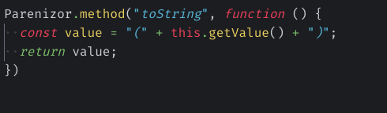

### Inline Function: 内联函数

快捷键：`C + O + n`

与内联变量类似，不过针对的是函数；使用函数体替换对函数的每次调用

适用于函数体较简单的场景

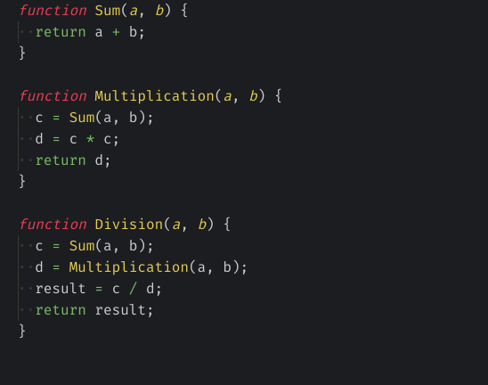

### Move Statement Up: 向上移动语句

快捷键：`O + S + u`

这里的"语句"通常指变量或函数

VSCode 原生只支持移动单行，想移动多行时，必须先选中，再移动

使用该快捷键后，不论是单行还是多行都可以一键移动，无需选中，只要保证光标在需要移动的语句上即可

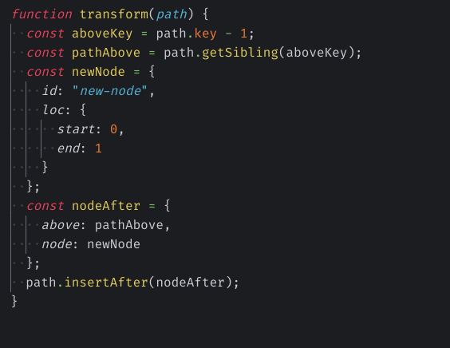

### Move Statement Down: 向下移动语句

快捷键：`O + S + d`

与向上移动语句作用一样，只不过是向下移动

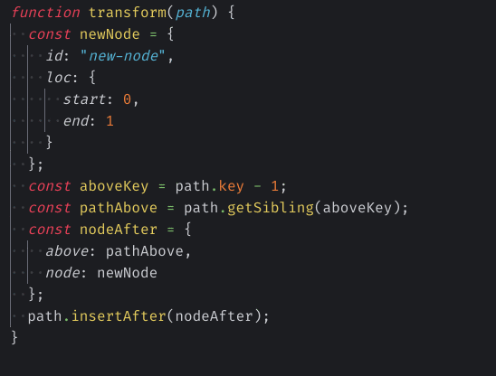

向上移动语句和向下移动语句也适用于对象属性。移动的同时也会智能格式化代码，所以你不必再为结尾的逗号而烦恼了

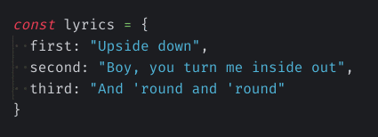

## Simplifying Conditional Logic: 简化条件逻辑

### Invert Boolean Logic: 反转布尔逻辑

使用快速修复：`Invert Boolean Logic`

在保留功能的同时反转逻辑表达式，最好在复杂表达式上使用

我们在写逻辑表达式时，总是按照需求或自己的想法把每一种情况都写下来，也就是符合人类逻辑的表达式，其实，只需要逆向一下，就可以得到一个简化版的表达式，更符合程序的表达式

所以当我们写了一个一眼看不明白的逻辑表达式时，不妨使用一下这个功能，没准就能简化逻辑呢

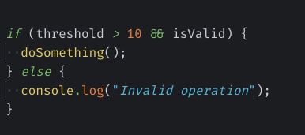

可以智能的从光标所在位置或部分选择中反转最接近的表达式

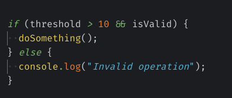

### Remove Redundant Else: 删除多余的 Else

使用快速修复：`Remove Redundant Else`

在不需要 else 时将其删除，从而减少嵌套代码。此重构可将嵌套条件替换为保护语句，以使代码更易于阅读

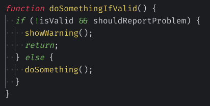

### Simplify Ternary: 简化三元

使用快速修复：`Simplify Ternary`

总是有人写出如下代码：

```js
const c = a ? a : b
```

但其实与 `const c = a || b` 是完全一样的效果，所以为什么不使用更简单的写法呢？

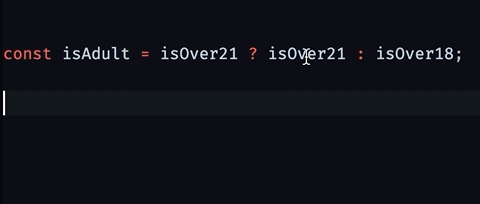

### Flip If/Else: 翻转 If/Else

使用快速修复：`Flip If/Else`

翻转 if 和 else 语句，有点类似反转布尔逻辑的高级版，只不过是那个不改变逻辑结果，而这个会反转结果

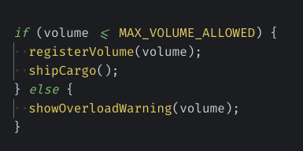

### Flip Ternary: 翻转三元

使用快速修复：`Flip Ternary`

与翻转 if/else 类似

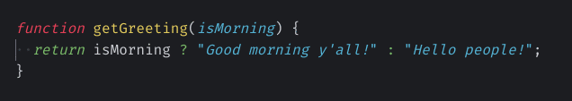

### Convert If/Else to Ternary: 将 If/Else 转换为三元

使用快速修复：`Convert If/Else to Ternary`

当 if/else 语句较简单时，可以转换为更简短的三元表达式，提高代码的简洁性

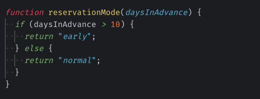

### Convert Ternary to If/Else: 将三元转换为 If/Else

使用快速修复：`Convert Ternary to If/Else`

当我们需要在三元表达式的基础上扩充逻辑时，就可以使用该功能

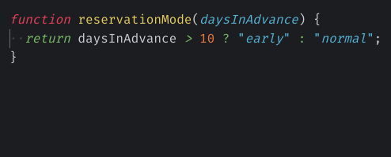

### Convert If/Else to Switch: 将 If/Else 转换为 Switch

使用快速修复：`Convert If/Else to Switch`

当多个 if 判断条件与同一个变量有关时，就可以使用该功能

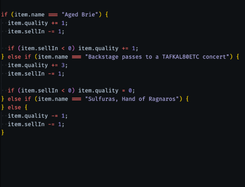

### Convert Switch to If/Else: 将 Switch 转换为 If/Else

使用快速修复：`Convert Switch to If/Else`

当 switch 处理逻辑少于 3 个时，建议使用 if/else

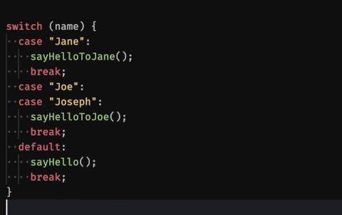

### Split If Statement: 拆分 If 语句

使用快速修复：`Split If Statement`

拆分最近的 if 语句的逻辑表达式

只能拆分表达式最后的部分，无法自己选择拆分部分

当我们需要在表达式最后部分扩充逻辑时，就可以使用该功能

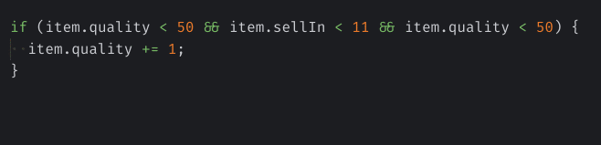

### Merge If Statements: 合并 If 语句

使用快速修复：`Merge If Statements`

与拆分 if 语句相反

当我们使用多个 if 语句只处理一个场景时，就可以使用该功能

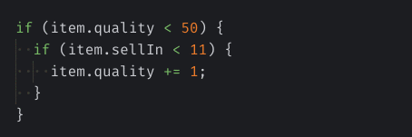

它也适用于 else-if

使用快速修复：`Merge else-if`

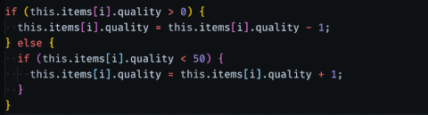

它还可以合并处理连续的 if 语句

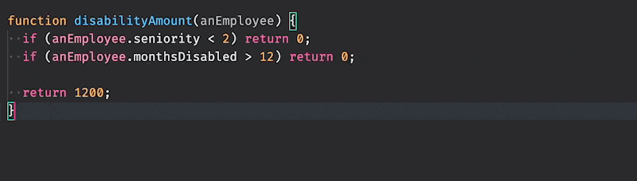

### Merge With Previous If Statement: 与前一个 if 语句合并

使用快速修复：`Merge With Previous If`

将光标所在的语句与上面的 if 语句合并

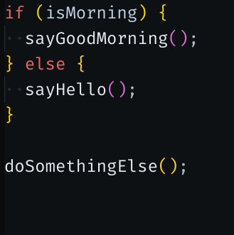

合并 2 个连续的 if 语句很有用，并且会智能的处理合并后的逻辑

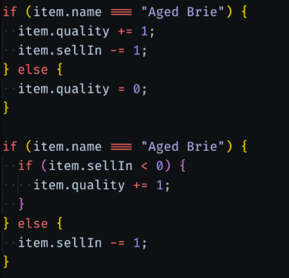

### Lift Up Conditional: 提升条件语句

使用快速修复：`Lift Up Conditional`

适用于在 if 语句里嵌套 if/else 语句，想把 if/else 提升到 if 外面的场景

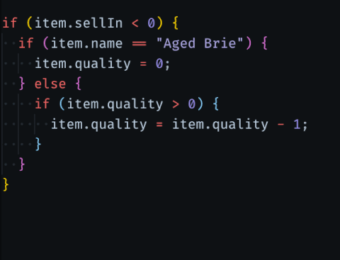

## Encapsulation: 封装

### Extract Class: 提取类

使用快速修复：`Extract Class`


## Moving Features: 移动特性

### Move to Existing File: 移动到现有文件

使用快速修复：`Move to Existing File`

VS Code 只能将内容移动到新文件中，该插件可以将内容移动到现有文件中

在要移动的函数上使用快速修复，选择目标文件，让它负责其余的工作。

只适用于全局声明的函数、类型、接口和变量，可以智能解析所需的导入，并防止创建循环依赖项。

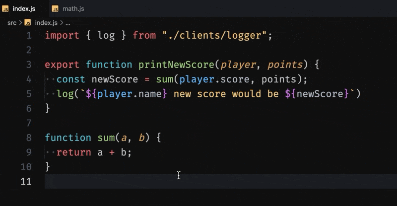

### Remove Dead Code: 删除无法运行的代码

使用快速修复：`Remove Dead Code`

我们在老代码的基础上增加新业务时，可能会写出永运都无法访问运行的代码，就像下图一样

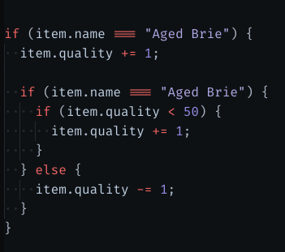

## Organizing data: 重组数据

### Split Declaration and Initialization: 拆分声明和初始化

使用快速修复：`Split Declaration and Initialization`

有人喜欢使用 `let` 或 `const` 一次声明多个变量，但本人还是喜欢分别声明，奈何改起来比较麻烦，现在好了，一键修改

只是改变以后的格式是先使用 `let` 声明（不论以前是 `let` 还是 `const`），后赋值

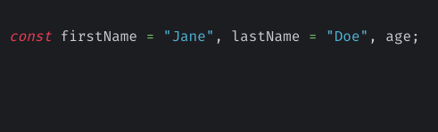

毕竟人家的功能就是拆分声明和初始化嘛，想只要拆分声明，可以使用下一个命令

### Split Multiple Declarations: 拆分多个声明

使用快速修复：`Split Multiple Declarations`

就是将一起声明的多个变量拆分为分别声明

`const` 声明的拆分完还是 `const`

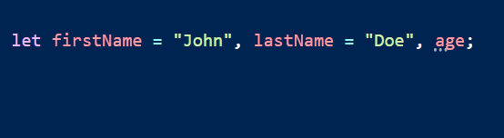

### Convert let to const: 将 let 转换为 const

使用快速修复：`Convert let to const`

如果在作用域中，一个变量的值未发生改变，就可以将其 `let` 声明转换为 `const` 声明

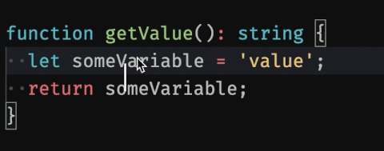

## Working around the syntax: 围绕语法工作

### Add Numeric Separator: 添加数字分隔符

使用快速修复：`Add Numeric Separator`

你知道你可以写 10_000 而不是 10000 吗？好吧，现在你知道了

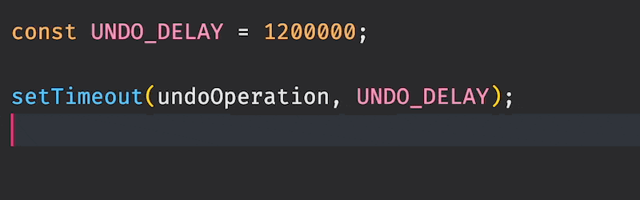

### Destructure Object: 解构对象

目前由于存在[Destructure Object is too slow · Issue #416 · nicoespeon/abracadabra](https://github.com/nicoespeon/abracadabra/issues/416)问题，无法使用快速修复，只能使用命令行调用：`Abracadabra: Destructure Object`

如果该问题已被关闭，那么就可以使用快速修复了

只要该插件可以推断出对象的类型，就可以自动对其进行解构，可能最适合 TypeScript 代码

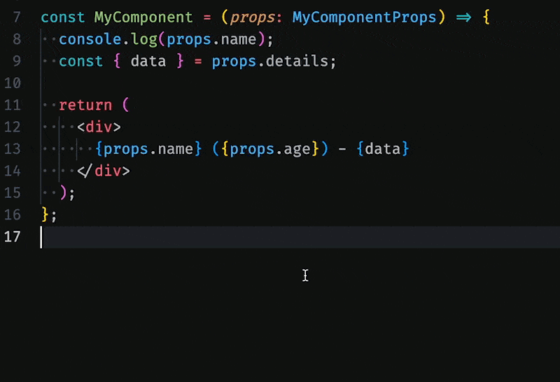

### Convert to Arrow Function: 转换为箭头函数

使用快速修复：`Convert to Arrow Function`

将函数声明转换为箭头函数

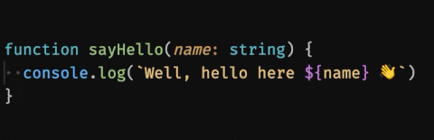

### Toggle Braces: 切换大括号

使用快速修复：`Toggle Braces`

有时我们需要在添加更多代码之前添加大括号，但有的时候我们为了代码简洁，去掉大括号更好

这种重构允许我们在光标最近的语句上切换大括号！

它适用于：

- If 语句（if 和 else 可以独立设置）
- 箭头函数表达式（例如 const someFunction = () => {}）
- JSX 属性（例如 `<SomeComponent anAttribute={"a value"} />`）
- 循环（for 和 while 块）

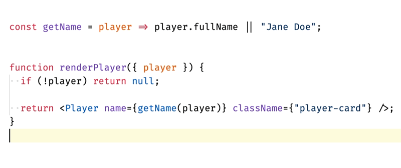

### Convert to Template Literal: 转换为模板文字

使用快速修复：`Convert to Template String`

目前 VS Code 已支持该重构，使用快速修复：`Convert to Template String`，但不支持纯字符串转模板字符串这种情况：[Don't offer Convert to template string refactoring for simple strings · Issue #36784 · microsoft/TypeScript](https://github.com/microsoft/TypeScript/issues/36784)

所以该插件才加的这个功能

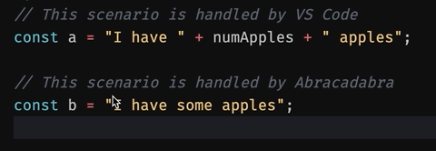

### Replace Binary with Assignment: 用赋值替换二进制

使用快速修复：`Replace = with x=`；这里 x 代表计算符号

这个可能看起来晦涩难懂，简单来说就是用 += 替换 =，用 -= 替换 =，等等

可以获得更短的（赋值）语法，重构必备

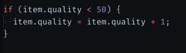

### Convert For-Loop to ForEach: 将 For 循环转换为 ForEach

使用快速修复：`Convert to ForEach`

重构老代码必备

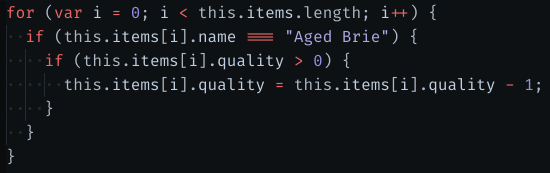

### Convert ForEach to For-Of: 将 ForEach 转换为 For-Of

使用快速修复：`Convert ForEach to For-Of`

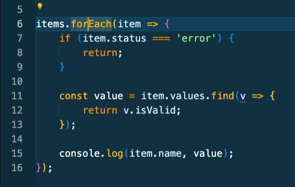

### Create Factory for Constructor: 为构造函数创建工厂函数

使用快速修复：`Create Factory for Constructor`

创建一个工厂函数来实例化选定的类。当您想在后台使用类公开常规函数时，这可能很有用。

不需要 new 调用常规函数，这使得它们更容易组合。

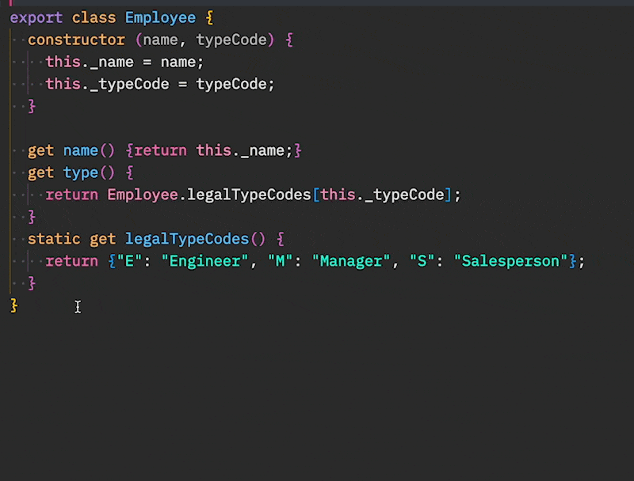

## Specific to TypeScript: TS 特有的

### Extract Generic Type: 提取通用类型

使用快速修复：`Extract Generic Type`

将现有类型转换为泛型，当需要使界面更通用时非常方便

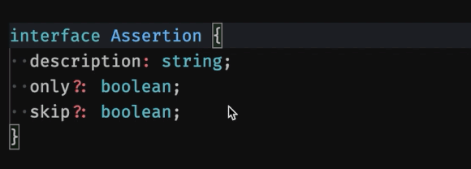

### Extract Interface

使用快速修复：`Extract Interface`

从类中提取接口


## Specific to React: React 特有的

### Convert to Pure Component: 转换为函数组件

使用命令行调用：`Convert to Pure Component`

它将仅具有 render 方法、仅具有安全属性（静态和道具）且没有对功能组件的引用的 ES6 类组件转换函数组件

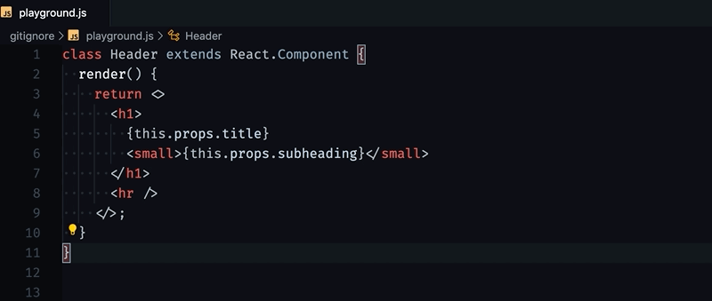

### Extract useCallback(): 提取到 useCallback

使用快速修复：`Extract to useCallback`

将函数 props 提取到 useCallback 声明中的重构。它将为您解决所需的依赖关系。


