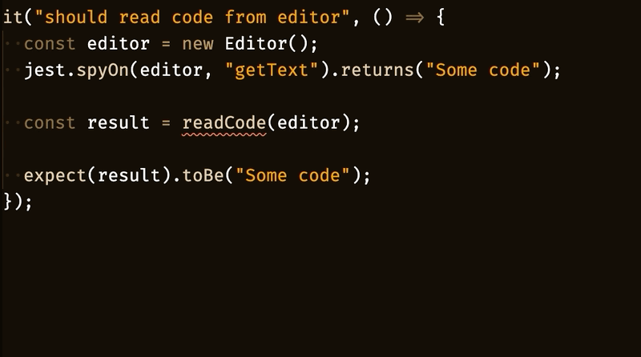
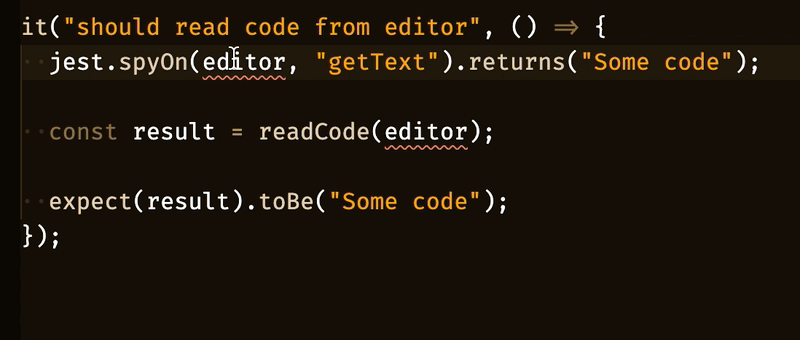
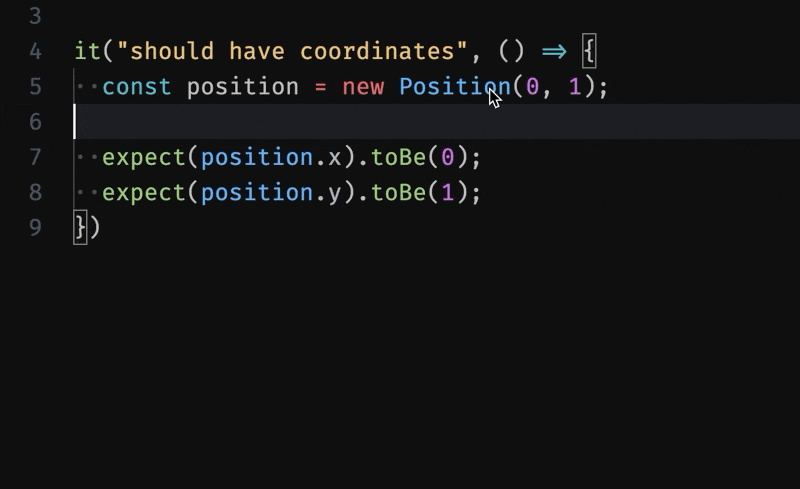

本文主要结合自己实际工作中的例子介绍重构插件 [Hocus Pocus - Visual Studio Marketplace](https://marketplace.visualstudio.com/items?itemName=nicoespeon.hocus-pocus)

## Create Function: 创建函数

使用快速修复：`Create Function`

从函数的调用表达式创建函数声明。

如果你是那种在实现一个函数之前，编写一个你希望存在的函数并调用的开发人员，那么你会喜欢这个。

## Create Variable: 创建变量

使用快速修复：`Create Variable`

从变量的使用方式创建变量声明。

就像“创建函数”一样，如果您倾向于在声明变量之前编写变量用法，这可能会非常有用。

## Create Class: 创建类

使用快速修复：`Create Class`

从类的使用方式创建类。

就像“创建函数”一样，如果您倾向于在声明类之前编写类的用法，这可能会非常有用。

## Create Switch Cases: 创建 switch

使用快速修复：`Create all Cases`

创建在联合类型或枚举上执行的 switch 语句的所有缺少的情况。

当你需要生成一个 switch 语句来处理每个场景时非常方便。如果一些情况已经存在，它会完成剩下的。

