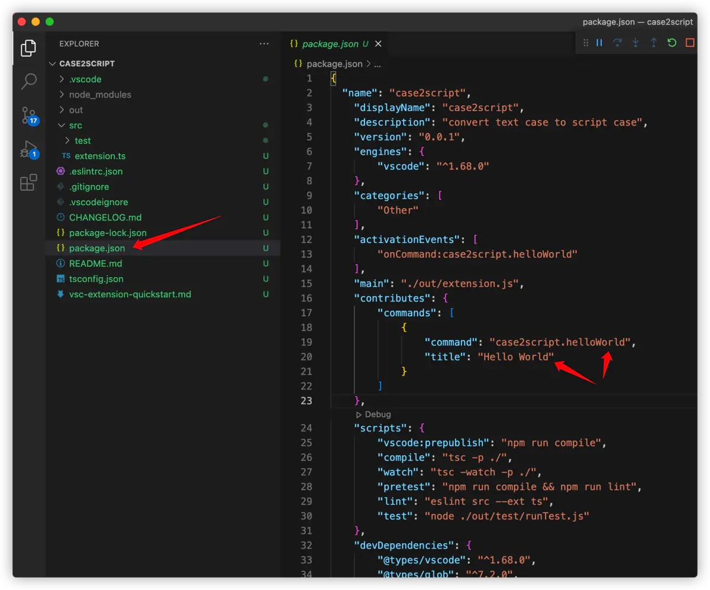

## 安装插件开发脚手架

首先确保本地已安装好 [Node.js](https://nodejs.org/en/)  和  [Git](https://git-scm.com/)

然后使用如下命令安装 [Yeoman](https://yeoman.io/)  和  [VS Code Extension Generator](https://www.npmjs.com/package/generator-code)

```
npm install -g yo generator-code
```


## 使用插件开发脚手架创建插件项目

接下来我们利用 yo 和 generator-code 模块配合而成的脚手架，开始创建我们的 VSCode 插件项目。

### 执行命令：

```
yo code
```

### 根据脚手架提示选择和填入相关信息


当执行 yo 报如下错误时：

```
/usr/local/lib/node_modules/yo/node_modules/macos-release/index.js:27

	const [name, version] = nameMap.get(release);

	                        ^

TypeError: undefined is not iterable (cannot read property Symbol(Symbol.iterator))
```

可以打开报错指出的第一行的文件（可能与以上报错给出的路径不同，没关系），修改成如下内容即可：

```js
const nameMap = new Map([
  [22, ['Ventura', '13']],
  [21, ['Monterey', '12']],
  [20, ['Big Sur', '11']],
  [19, ['Catalina', '10.15']],
  [18, ['Mojave', '10.14']],
  [17, ['High Sierra', '10.13']],
  [16, ['Sierra', '10.12']],
  [15, ['El Capitan', '10.11']],
  [14, ['Yosemite', '10.10']],
  [13, ['Mavericks', '10.9']],
  [12, ['Mountain Lion', '10.8']],
  [11, ['Lion', '10.7']],
  [10, ['Snow Leopard', '10.6']],
  [9, ['Leopard', '10.5']],
  [8, ['Tiger', '10.4']],
  [7, ['Panther', '10.3']],
  [6, ['Jaguar', '10.2']],
  [5, ['Puma', '10.1']]
]);
```

主要就是没有增加对 mac 新系统的兼容

具体参见：[Unable to run yo on macOS Ventura Beta · Issue #753 · yeoman/yo](https://github.com/yeoman/yo/issues/753)

### 在选项选择完成后，会进行项目依赖的安装


### 项目依赖安装完成后，可以根据提示打开插件项目


### 打开项目后，项目结构如下


其实这是个简单的、完整的、可运行的插件项目，接下来我们先来看看这个插件项目工作起来是怎么样子的

## 快速试用 Hello World 插件项目

我们这里先不做任何改动，也不做任何代码介绍，先看看这个最基础的插件运行效果。

### 打开 Extension Developer Host 窗口

打开方式有两种：

- F5
- 使用侧边栏的调试工具，如下图


我们可以在这个窗口任意打开一个项目或文件用于学习演示

### 运行插件项目；

在 Extension Developer Host 窗口内使用键盘组合键：Command+Shift+P (windows Ctrl+Shift+P)，然后搜索我们的 Hello World 插件：


点击或回车使用我们的 Hello World 插件

即可在 VSCode 右下角则会看到一个提示，这就是我们的插件工作效果


如果找不到 Hello World 插件，可以试着更新一下 VSCode, 或者重新运行一下调试

## 对插件效果稍做解读

### 首先是插件名字何来？

插件名字声明和绑定关系在 package.json 表示，其中：

contributes: 是对插件的一些配置，比如图标，菜单、快捷键设置等，例如 title 为我们能在 VSCode 的命令面板中搜索到的插件名字（Command+Shift+P 命令打开的搜索入口）



activationEvents: 配置触发 extension.ts 文件中 active 钩子函数的事件，例如：

```js
vscode.commands.registerCommand('case2script.helloWorld'...)
```

### 插件为我们做了什么事情？

extension.ts 中的这行代码为我们注册了一个命令，命令名 case2script.helloWorld 与 package.json 中的 contributes 内的 command 匹配，代表这个插件能够展示一个 information message: Hello World from case2script!


也就是为什么我们在使用了插件之后，在 VSCode 右下角能看到这个提示的原因：


## 对插件做简单改动并验证；

我们可以稍做修改，看下效果，如下图

点击 reload 即可重新加载插件：


再次调用 Hello World 插件


## 参考资料

- [Your First Extension](https://code.visualstudio.com/api/get-started/your-first-extension)
- [VSCode 插件开发（一）：Hello World](https://www.jianshu.com/p/72972778c855)
- [编写一个 Vscode 插件，从创建到发布，一键删除函数](https://www.bilibili.com/video/BV1bG4y1n78A)
