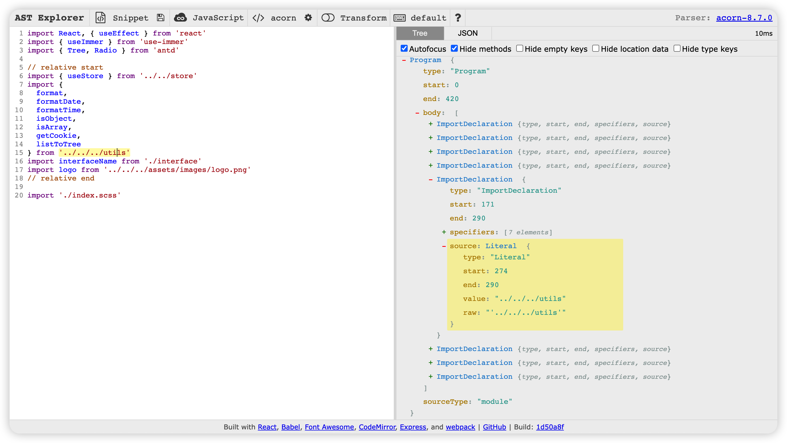
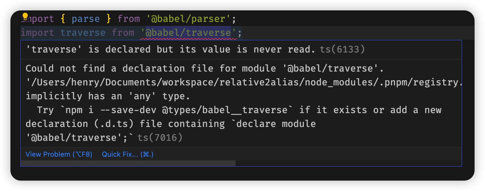

在上篇[相对路径转别名路径之 chokidar](https://tsz.netlify.app/pages/2c6a63/) 中，我们使用 `chokidar` 完成了自动将相对路径转为别名路径，但还是有些问题，所以我们使用 `VSCode` 插件实现一下该功能

大体思路就是：找的需要替换的相对路径，将其转换为别名路径，然后调用 `VSCode` 的替换函数将其替换

## 初始化插件

先看这里：[VSCode 开发插件之初识](/pages/c23aed/)

然后我们改一下插件的触发命令：将 `helloWorld` 修改为 `relative2alias`

## 如何获取相对路径

使用 `chokidar` 时我们是使用正则来获取相对路径，这次我们换一种方式，使用 `AST` 获取

### 认识 AST

测试地址：[AST explorer](https://astexplorer.net/)

一个简单的例子：



可以看到，`AST` 准确的找到了引用的路径，这可比我们自己写正则快多了，而且准确性也有保证

首先我们需要使用 [@babel/parser](https://babel.dev/docs/en/babel-parser) 及 [@babel/traverse](https://babel.dev/docs/en/babel-traverse):

```
pnpm i @babel/parser @babel/traverse
```

`parser` 生成 `AST` 树，`traverse` 可以遍历 `AST` 树

### 使用 @babel/parser

然后我们在 `src` 下新建 `main.ts` 文件，简单测试一下：

```ts
import { parse } from '@babel/parser'

export function getRelativePath(code: string) {
  const ast = parse(code, {
    sourceType: 'module'
  })
  console.log('🚀 ~ file: main.ts ~ line 5 ~ getRelativePath ~ ast', ast)
}
```

这里说明一下：

由于我们这里都使用的是 `import` 和 `export`，

故 `pages` 的第二个参数必须填写 `sourceType: 'module'`（默认是 `script`），否则会报：

```
Command 'xxx' resulted in an error ('import' and 'export' may appear only with 'sourceType: "module"' (2:4))
```

不是 eslint 配置有误（如果你在网上搜索时，大部分都提示修改 eslint 配置），而是 parse 需要传入第二个参数

具体参见[官方例子](https://babel.docschina.org/docs/en/babel-parser/#example)

所以当你在网上查询的解决方法无效时，阅读官方文档是最快的解决方式

然后调用一下

```ts
const code = `
import {
  format,
  formatDate,
  formatTime,
  isObject,
  isArray,
  getCookie,
  listToTree
} from '../../../utils'
  `
getRelativePath(code)
```

就得到如下的输出：

```
🚀 ~ file: main.ts ~ line 8 ~ getRelativePath ~ ast Node {
  type: 'File',
  start: 0,
  end: 123,
  loc: SourceLocation {
    start: Position { line: 1, column: 0, index: 0 },
    end: Position { line: 11, column: 2, index: 123 },
    filename: undefined,
    identifierName: undefined
  },
  errors: [],
  program: Node {
    type: 'Program',
    start: 0,
    end: 123,
    loc: SourceLocation {
      start: [Position],
      end: [Position],
      filename: undefined,
      identifierName: undefined
    },
    sourceType: 'module',
    interpreter: null,
    body: [ [Node] ],
    directives: []
  },
  comments: []
}
```

`AST` 树生成完成，接下来就需要使用 `traverse` 遍历树

### 使用 @babel/traverse

引入 `traverse`:

```ts
import traverse from '@babel/traverse'
```

发现有报错：



那我们就按照提示安装一下：

```
pnpm i --save-dev @types/babel__traverse
```

然后我们使用一下：

```ts
import { parse } from '@babel/parser'
import traverse from '@babel/traverse'

export function getRelativePath(code: string) {
  const ast = parse(code, {
    sourceType: 'module'
  })

  traverse(ast, {
    ImportDeclaration(path) {
      console.log('🚀 ~ file: main.ts ~ line 11 ~ ImportDeclaration ~ path', path)
    }
  })
}
```

然后再调用一下 `getRelativePath`，由于输出有点长，这里就不展示了

通过输出我们发现 `path.node` 与我们在 `AST` 测试地址输出的一致

而我们只需要 `path.node.source`，输出一下：

```
🚀 ~ file: main.ts ~ line 11 ~ ImportDeclaration ~ path Node {
  type: 'StringLiteral',
  start: 104,
  end: 120,
  loc: SourceLocation {
    start: Position { line: 10, column: 7, index: 104 },
    end: Position { line: 10, column: 23, index: 120 },
    filename: undefined,
    identifierName: undefined
  },
  extra: { rawValue: '../../../utils', raw: "'../../../utils'" },
  value: '../../../utils'
}
```

发现 `value` 就是我们需要的相对路径，这可比我们当初哼哧哼哧写半天正则快多了

不过对于那些不是相对路径的 `value`，我们还需要过滤一下

### 使用正则过滤相对路径

这里我们就还是用现成的正则：/\.{1,2}\/.+/

```ts
const relativeReg = /\.{1,2}\/.+/
const relativePaths: string[] = []
traverse(ast, {
  ImportDeclaration(path) {
    const value = path.node.source.value
    if (relativeReg.test(value)) {
      relativePaths.push(value)
    }
  }
})
return relativePaths
```

调用一下：

```ts
const code = `
import React, { useEffect } from 'react'
import { useImmer } from 'use-immer'
import { Tree, Radio } from 'antd'

// relative start
import { useStore } from '../../store'
import {
  format,
  formatDate,
  formatTime,
  isObject,
  isArray,
  getCookie,
  listToTree
} from '../../../utils'
import interfaceName from './interface'
import logo from '../../../assets/images/logo.png'
// relative end

import './index.scss'
  `
const relativePaths = getRelativePath(code)
console.log('🚀 ~ file: main.spec.ts ~ line 28 ~ test ~ relativePaths', relativePaths)
```

输出：

```
🚀 ~ file: main.spec.ts ~ line 28 ~ test ~ relativePaths [
  '../../store',
  '../../../utils',
  './interface',
  '../../../assets/images/logo.png',
  './index.scss'
]
```

发现把 `.scss` 也过滤出来了，这个我们要特殊处理一下

修改一下正则表达式：`/\.{1,2}\/.+(?<!.scss)$/`，排除以 `.scss` 结尾的引用路径

再测试一下：

```
🚀 ~ file: main.spec.ts ~ line 28 ~ test ~ relativePaths [
  '../../store',
  '../../../utils',
  './interface',
  '../../../assets/images/logo.png'
]
```

好，完美

## 相对路径如何转别名路径

借鉴以前的经验：

```ts
const path = require('path')
const sep = path.sep

// ...

const filePath = '/Users/name/Documents/workspace/src/pages/Admin/HelloWorld/index.tsx'
const relativePaths = getRelativePath(code)
const aliasPaths = relativePaths.map(item => {
  const absolutePath = path.normalize(path.join(path.parse(filePath).dir, item))
  const aliasPath = '@/' + absolutePath.split(`src${sep}`)[1].replace(/\\/g, '/')
  return aliasPath
})
console.log('🚀 ~ file: main.spec.ts ~ line 33 ~ test ~ aliasPaths', aliasPaths)
```

输出：

```
🚀 ~ file: main.spec.ts ~ line 33 ~ test ~ aliasPaths [
  '@/pages/store',
  '@/utils',
  '@/pages/Admin/HelloWorld/interface',
  '@/assets/images/logo.png'
]
```

这里的 `filePath` 是我们写死的，需要改成动态获取

由于以前都是 `chokidar` 给我们提供的，但现在已经不使用了，所以我们只能从 `VSCode` 上找找了

### 动态获取 filePath

通过简单的搜索即可得到如下方法：

```ts
vscode.window.activeTextEditor?.document.fileName
```

在 `extension.ts` 文件里验证一下：

```ts
import * as vscode from 'vscode'

export function activate(context: vscode.ExtensionContext) {
  let disposable = vscode.commands.registerCommand('relative2alias.relative2alias', () => {
    console.log(vscode.window.activeTextEditor?.document.fileName)
  })

  context.subscriptions.push(disposable)
}

export function deactivate() {}
```

启动调试并打开 `index.tsx`，调用 `relative2alias` 后得到如下输出：

```
/Users/name/Documents/workspace/src/pages/Admin/HelloWorld/index.tsx
```

### 动态获取 code

同样的，`code` 我们也需要动态获取一下：

```ts
vscode.window.activeTextEditor?.document.getText()
```

这样我们就拿到整个文件的内容了，输出也没有问题，这里就不展示了

然后我们将获取的 `text` 传入 `getRelativePath` 验证一下

```ts
const disposable = vscode.commands.registerCommand('relative2alias.relative2alias', () => {
  const { activeTextEditor } = vscode.window
  if (!activeTextEditor) {
    return
  }
  const document = activeTextEditor.document
  const fileName = document.fileName
  const text = document.getText()
  const relativePaths = getRelativePath(text)
  console.log('🚀 ~ file: extension.ts ~ line 14 ~ disposable ~ relativePaths', relativePaths)
})
```

调用以后竟然报错了：

```
Command 'relative2alias' resulted in an error (Missing semicolon. (8:7))
```

由于没有看到详细报错信息，使用 `try catch` 获取一下：

```ts
try {
  const relativePaths = getRelativePath(text)
  console.log('🚀 ~ file: extension.ts ~ line 14 ~ disposable ~ relativePaths', relativePaths)
} catch (error) {
  console.log('🚀 ~ file: extension.ts ~ line 17 ~ disposable ~ error', error)
}
```

查看报错信息发现好像是 babel parser 报的语法错误：babel parser syntax error：

```
{code: 'BABEL_PARSER_SYNTAX_ERROR', reasonCode: 'MissingSemicolon', loc: Position, pos: <accessor>, stack: 'SyntaxError: Missing semicolon. (8:7)
```

初步猜测是由于 `jsx` 语法引起的

所以我们还需要看一下 `parse` 的文档

在 `babel` 给出的[例子](https://babel.dev/docs/en/babel-parser#example)中就可以知道，可以通过 `plugins` 添加一些插件，其中就有语言插件，所以我们把 `jsx` 和 `typescript` 都添加上再试试：

```ts
const ast = parse(code, {
  sourceType: 'module',
  plugins: ['jsx', 'typescript']
})
```

测试通过，输出也没有问题

ok, 完美

注：这里只解决了语法的问题，可能还有别的问题，比如 `options` 中的 `allowImportExportEverywhere`: By default, import and export declarations can only appear at a program's top level. Setting this option to true allows them anywhere where a statement is allowed.(默认情况下，import 和 export 声明只能出现在程序的顶层。如果将此选项设置为 true，则允许在任何允许使用语句的地方使用它们。)，所以我们需要根据自己的需求来完善 `options` 及 `plugins`

## 相对路径替换为别名路径

这里我们就需要使用 `VSCode` 提供的方法将相对路径替换为别名路径

### replace 方法

```ts
/**
  * Replace a certain text region with a new value.
  * You can use \r\n or \n in `value` and they will be normalized to the current {@link TextDocument document}.
  *
  * @param location The range this operation should remove.
  * @param value The new text this operation should insert after removing `location`.
  */
replace(location: Position | Range | Selection, value: string): void;
```

这里的 `replace` 方法第一个参数是一个范围，和我们平时用的 `replace` 不同（第一个参数是需要替换的字符），第二个参数是替换后的字符

但我们现在只有替换前的字符和替换后的字符，所以还需要获取替换范围

我们查看一下 `Position` 需要哪些参数：

```ts
/**
 * Represents a line and character position, such as
 * the position of the cursor.
 *
 * Position objects are __immutable__. Use the {@link Position.with with} or
 * {@link Position.translate translate} methods to derive new positions
 * from an existing position.
 */
export class Position {
  /**
   * The zero-based line value.
   */
  readonly line: number

  /**
   * The zero-based character value.
   */
  readonly character: number
}
```

这个 `line` 我们好像在 `AST` 那里见过：

```
loc: SourceLocation {
  start: Position { line: 10, column: 7, index: 104 },
  end: Position { line: 10, column: 23, index: 120 },
  filename: undefined,
  identifierName: undefined
}
```

这个 `start` 和 `end` 貌似正好是我们需要的，所以我们需要把这些参数也返回出去

```ts
traverse(ast, {
  ImportDeclaration(path) {
    const source = path.node.source
    const value = source.value
    if (relativeReg.test(value)) {
      const start = source.loc!.start
      const end = source.loc!.end
      relativePaths.push({ value, start, end })
    }
  }
})
```

### 执行 replace

然后我们就需要使用 `replace` 执行替换逻辑了：

```ts
const relativePaths = getRelativePath(text)

relativePaths.map(({ value, start, end }) => {
  const absolutePath = path.normalize(path.join(path.parse(fileName).dir, value))
  const aliasPath = '@/' + absolutePath.split(`src${sep}`)[1].replace(/\\/g, '/')
  activeTextEditor.edit(editBuilder => {
    editBuilder.replace(
      new vscode.Range(
        new vscode.Position(start.line, start.column),
        new vscode.Position(end.line, end.column)
      ),
      aliasPath
    )
  })
})
```

输出：

```
import { useStore } from '../../store'
import {@/pages/store
  format,
  formatDate,
  formatTime,
  isObject,
  isArray,
  getCookie,
  listToTree
} from '../../../utils'
import interfaceName from './interface'
import logo from '../../../assets/images/logo.png'
```

### 有两个问题：

1. 只有 store 执行了替换，也就是只替换了一次
2. 替换结果行数错位了，下移了一行

先看错位问题，这是由于 `@babel/parser` 的 `startLine: By default, the parsed code is treated as if it starts from line 1, column 0.` 与 `vscode` 的 `line A zero-based line value.` 不同

所以我们可以给 `parser` 指定一下 `startLine`:

```ts
const ast = parse(code, {
  sourceType: 'module',
  startLine: 0,
  plugins: ['jsx', 'typescript']
})
```

再试一下，输出：

```
import { useStore } from @/pages/store
import {
  format,
  formatDate,
  formatTime,
  isObject,
  isArray,
  getCookie,
  listToTree
} from '../../../utils'
import interfaceName from './interface'
import logo from '../../../assets/images/logo.png'
```

错位问题解决了，但引号又没了

这是因为 `AST` 把引号也包含了，实际匹配的值是存储在 `raw` 的，而我们使用的 `value` 是被处理过的

那我们使用 `raw` 再重新处理一下吗？还需要考虑单引号还是双引号呢

这里我们取个巧，直接把替换范围缩小一下：

```ts
editBuilder.replace(
  new vscode.Range(
    new vscode.Position(start.line, start.column + 1),
    new vscode.Position(end.line, end.column - 1)
  ),
  aliasPath
)
```

再验证一下：

```
import { useStore } from '@/pages/store'
```

引号问题解决了，再看一下为什么就替换了一次的问题

一开始想的是难道不支持一下替换多处？每次只能替换一处？

那我们得换一种思维方式了：与 `chokidar` 处理方式一样，先拿到文件所有内容，然后使用 `js` 的 `replace` 全部替换完成，再使用 `vscode` 的 `replace` 全文替换

```ts
vscode.window.activeTextEditor.edit(editBuilder => {
  // 从开始到结束，全量替换
  const end = new vscode.Position(vscode.window.activeTextEditor.document.lineCount + 1, 0)
  const text = '新替换的内容'
  editBuilder.replace(new vscode.Range(new vscode.Position(0, 0), end), text)
})
```

但这种是全量替换，毕竟我们需要替换的内容比较少，还是想用那种可以精细化的替换方式

再看一下 `edit` 的文档，发现返回一个 `Promise`

```
@return A promise that resolves with a value indicating if the edits could be applied.
```

难道在 `map` 中使用需要 `async/await`，再使用 `Promise.all` 处理一下吗？

实际测试没有任何效果，还是只替换一处

难道不能在循环中使用吗？

突然发现，我们把 `edit` 及其回调函数都放在 `map` 中了，我们是不是应该在回调函数中 `map` 呢？

```ts
activeTextEditor.edit(editBuilder => {
  relativePaths.map(({ value, start, end }) => {
    const absolutePath = path.normalize(path.join(path.parse(fileName).dir, value))
    const aliasPath = '@/' + absolutePath.split(`src${sep}`)[1].replace(/\\/g, '/')
    editBuilder.replace(
      new vscode.Range(
        new vscode.Position(start.line, start.column + 1),
        new vscode.Position(end.line, end.column - 1)
      ),
      aliasPath
    )
  })
})
```

输出：

```
import React, { useEffect } from 'react'
import { useImmer } from 'use-immer'
import { Tree, Radio } from 'antd'

// relative start
import { useStore } from '@/pages/store'
import {
  format,
  formatDate,
  formatTime,
  isObject,
  isArray,
  getCookie,
  listToTree
} from "@/utils"
import interfaceName from '@/pages/Admin/HelloWorld/interface'
import logo from '@/assets/images/logo.png'
// relative end

import './index.scss'
```

完美！

当然，我们这里只是实现了基本的功能，而且还有很多硬编码的地方，需要持续的维护及重构

## 发布插件

参见：[VSCode 开发插件之发布](/pages/5cbda2/)

## 参考资料

- [编写一个 Vscode 插件，从创建到发布，一键删除函数](https://www.bilibili.com/video/BV1bG4y1n78A)
- [带你玩转 babel 工具链（一）@babel/parser](https://juejin.cn/post/7112733626589577230)
- [带你玩转 babel 工具链（二）@babel/traverse](https://juejin.cn/post/7113800415057018894)
- [【JS】正则表达式取反（不能以...结尾）](https://blog.csdn.net/qq_45677671/article/details/120350062)
- [vscode 插件开发 - 右键菜单：获取选中的文件或者目录](https://blog.csdn.net/leiweip/article/details/126892769)
- [VSCode 插件开发全攻略（九）常用 API 总结](http://blog.haoji.me/vscode-plugin-common-api.html)
