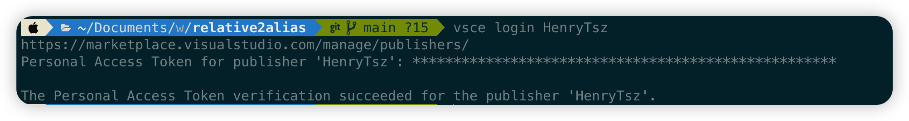
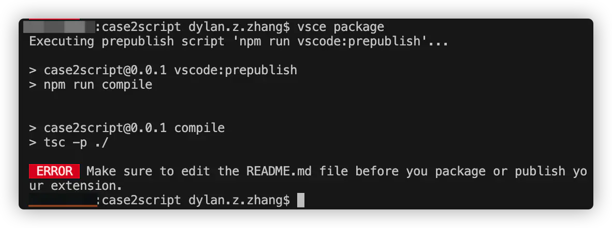
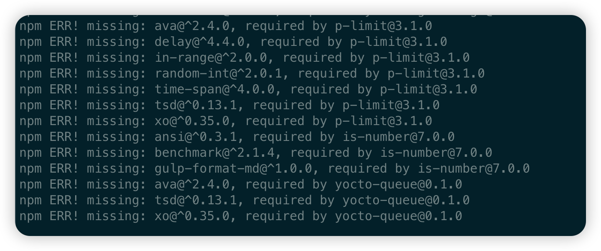
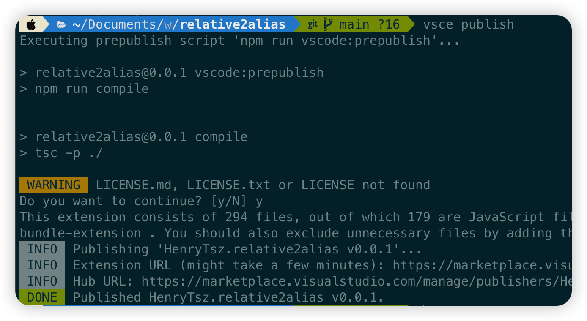
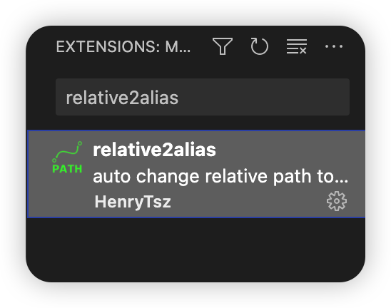

## 安装 vsce

```
npm install -g @vscode/vsce
```

## 创建发布账号

首先我们需要先创建发布账号，具体可参见官方文档：[Publishing Extensions](https://code.visualstudio.com/api/working-with-extensions/publishing-extension#publishing-extensions)

### [注册账号](https://azure.microsoft.com/services/devops/)

### [创建令牌](https://code.visualstudio.com/api/working-with-extensions/publishing-extension#get-a-personal-access-token)

复制保存一下令牌，后面用

### [创建 publisher](https://marketplace.visualstudio.com/manage)

创建以后，使用 `vsce` 登录一下：

```
vsce login <publisher name>
```

需要输入令牌：



## 修改 package.json

参数具体介绍：[VSCode 插件开发全攻略（三）package.json 详解](http://blog.haoji.me/vscode-plugin-package-json.html)

由于我们是要发布到插件市场的，目前还缺少 `publisher`，值就是上一步创建的 publisher

其余参数根据自己需要增加

## 修改 README.md

发布或打包前，必须修改一下 README.md(如果创建后一直没有修改过的话)

否则会报错：



## 发布

使用以下命令发布扩展：

```
vsce publish
```

当报如下错误时：



是由于我们当初选择的包管理器为 `pnpm`

可以修改为 `npm`:

修改 `package.json` 的 `"vscode:prepublish": "pnpm run compile",` 为 ` "vscode:prepublish": "npm run compile",`

然后删除 `node_modules`：`rm -rf node_modules`

再重新安装一下依赖：`npm i`

最后重新执行 `vsce publish` 即可

当出现下图所示时，即表示发布成功了



可以在 [Visual Studio Marketplace publisher management page](https://marketplace.visualstudio.com/manage) 这个页面查看已发布的插件

稍等几分钟即可在插件市场搜索到我们刚发布的插件：



## 参考资料

- [Publishing Extensions](https://code.visualstudio.com/api/working-with-extensions/publishing-extension)
- [VSCode 插件开发全攻略（十）打包、发布、升级](http://blog.haoji.me/vscode-plugin-publish.html)
- [VSCode 插件开发（三）：插件打包与本地安装](https://www.jianshu.com/p/bb379a628004)
