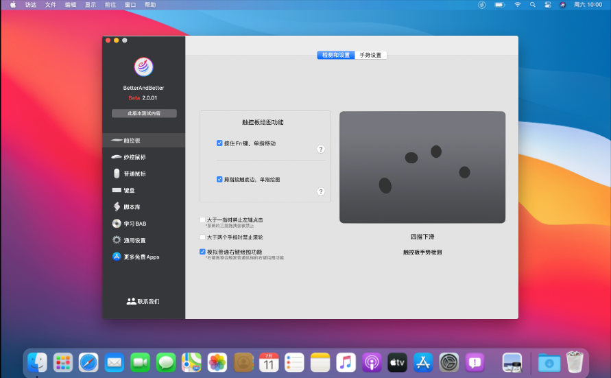

对于一台全新的 `Mac` , 我们除了欣赏它奇妙的工业设计之外，还有一件非常重要的事情，就是装上 `Mac` 上的第一批软件。一般，这第一批软件会一直伴随着我们日常生活、办公、娱乐，所以能在最开始就装上这些优秀的应用，绝对是提升幸福感的不错途径。

## Mac 终端软件安装利器：[Homebrew](/pages/fe838b/) 和 [Homebrew Cask](/pages/6f5865/)

强烈推荐先安装 `Homebrew` , 因为 `Mac` 端几乎所有软件都可以通过它来安装。这种方法只需在终端输入一行命令，就可以解决包括查找、下载和安装软件的一系列步骤。

也许在你看到「终端」「命令」等字眼的时候会有些犹豫，更是对 `Homebrew` 一无所知，没关系，因为它其实并没有很复杂，只需一点学习成本，就能让你解锁一种高效而炫酷的安装 `Mac App` 新姿势。

「终端」和「命令行」并不是只有极客或开发人员才能玩的东西，我们大可不必先入为主的产生抗拒心理。

`Homebrew` 这种方式不仅能让你更快更好的解决软件安装的问题，节省更多时间，也会为你开启一个新世界的大门，慢慢地你会发现用「命令行」你还能做很多事情。

你可以点击上面的两个链接喵一眼，我保证不难

## iTerm2: 终端工具

`Term2` 是 `Mac` 系统下的一款非常好用的终端工具，它比系统自带的 `Terminal` 好用得多。有丰富的特色功能供，比如快捷键、分屏、定制终端主题颜色等; 这些功能极大的提高我们敲命令的效率，强烈推荐每一个程序员都尝试和习惯使用这款工具。

[iTerm2 用法与技巧](/pages/5ea06c/)

Install: `brew install iterm2 --cask`

下载地址：[iTerm2](https://www.iterm2.com/downloads.html)

## VS Code: 编辑器

`Visual Studio Code` 是一个轻量级但功能强大的源代码编辑器，可在桌面上运行，适用于 `Windows` , `macOS` 和 `Linux` . 它内置了对 `JavaScript` , `TypeScript` 和 `Node.js` 的支持，并为其他语言 (如 `C++` , `C＃` , `Java` , `Python` , `PHP` , `Go` ) 和运行时 (如 `.NET` 和 `Unity` ) 提供了丰富的扩展生态系统。

[VSCode 初始化配置](/pages/6f52fa/)

Install: `brew install visual-studio-code --cask`

下载地址：[VS Code](https://code.visualstudio.com/)

## Karabiner-Elements: 改键神器

由于 `Mac` 的键盘和主流布局不一致，许多人都会遇到外接键盘布局不适应的情况; 即便是 `Mac` 的内置键盘，也有人觉得其设计不够合理，不符合自己的工作习惯。好在键盘和使用者之间是可以磨合的，[Karabiner-Elements](https://pqrs.org/osx/karabiner/)  就是 `Mac` 上一款非常好用的开源改键利器，能让键盘顺着你的意愿来工作。

[Karabiner-Elements 使用介绍](/pages/2c17f0/)

Install: `brew install karabiner-elements --cask`

下载地址：[Karabiner-Elements](https://pqrs.org/osx/karabiner/)

## Alfred: 启动器

但凡初入 `Mac` 的新用户，在建立起自己的工作流前，大抵都会经历一段被疯狂安利  [Alfred](http://www.alfredapp.com/)  的时光。这种长期口碑积累所达到的效果，也使得 `Alfred` 经常出现在各自 `Mac` 「装机必备」清单中。

什么是启动器？顾名思义，就是通过键盘输入来执行相应动作，从而提高工作效率的软件。例如 `macOS` 自带的聚焦搜索 (Spotlight), 就能将文稿、邮件、应用等整合在一起，通过关键词匹配展示。

而本文要介绍的 `Alfred` , 也可以看成是 `Spotlight` 的增强版，但它更多的高级功能，比如：

- 添加自定义网络搜索引擎;
- 指定规则精准定位本地文件;
- 在命令框内使用计算器、词典等实用工具;
- ……

总之，`Alfred` 的一切设计都以提高效率为本，帮助你建立一套更高效的工作体系。

[Alfred 上手指南](/pages/9c6596/)

Install: `brew install alfred --cask`

下载地址：[Alfred](http://www.alfredapp.com/)

## Raycast: 启动器

Raycast 是一款 MacOS 的启动器应用程序，可以快速地帮助用户执行各种常见的任务和操作。与一般的应用程序不同，Raycast 的设计开发理念是以快速和便捷为前提。它提供了丰富的插件，使得用户可以轻松地完成一些常用任务，例如：搜索文件、首选项设置、音乐播放器、从剪贴板中复制内容、打开应用程序、控制系统等等。

此外，Raycast 还支持快捷键绑定和 Action 扩展功能，您可以根据自己的使用场景和习惯，选择自己喜欢的插件及其快捷键绑定，从而实现更加高效的操作方式。同时，Raycast 的插件库也在不断地更新和扩充，为用户提供更好的使用体验。

总体来说，Raycast 是一款功能强大、易用、定制化的启动器应用程序，可以帮助用户轻松、快速地完成常见任务，值得一试。

而且使用 Raycast 可以替换很多软件：Alfred(启动器)，Magnet 或 Rectangle(窗口管理)，Maccy(剪切板历史)，AppCleaner(卸载工具)，Manico(启动和切换 App)，Text Replacement(自定义片段)

[Raycast 该怎么用？我们帮你准备了一份实用指南 - 少数派](https://sspai.com/post/79769)

[快捷启动器 Raycast ｜它想成为你的 Mac 默认搜索工具 - 知乎](https://zhuanlan.zhihu.com/p/296773104)

Install: `brew install raycast --cask`

下载地址：[Raycast](https://raycast.com/)

## PopClip: 选中小工具

`PopClip` 是一款在 `Mac` 上人尽皆知的小工具，它简单高效，具有强大的拓展功能。`PopClip` 最基本的功能即用鼠标选中一段文字就可以做复制粘贴的动作，省去了我们平时 `Command + C or V` 的麻烦，除此之外，在无拓展支持的情况下，根据鼠标选中的内容，`PopClip` 还自身支持链接的跳转打开、自带词典的翻译、邮件地址跳转、搜索引擎搜索、单词纠正等功能。但这个工具真正强大之处在于它的拓展功能   `PopClip Extensions`   的使用。

[少数派 PopClip 专栏](https://sspai.com/search/article?q=popclip)

Install: `brew install popclip --cask`

下载地址：[PopClip](https://itunes.apple.com/cn/app/popclip/id445189367?mt=12)

## CheatSheet: 快捷键提示

如果你想在电脑上进行那种行云流水的操作，快捷键的利用一定是最重要的。但是别说其他软件的快捷键，可能就连自带的 `Safari` 的快捷键都不知道一两个。如果你还在搜索「XXX 的快捷键是什么？」, 那一定是没有遇到过 `CheatSheet` . 这款软件在使用前需要在「系统偏好设置 - 安全性与隐私 - 隐私 - 辅助功能」中勾选 `CheatSheet` 一项，即可在大多数 `App` 界面中长按 `Command-⌘` 直接呼出该软件的全部快捷键，可以说是非常的方便了。

Install: `brew install cheatsheet --cask`

下载地址：[CheatSheet](https://www.mediaatelier.com/CheatSheet/)

## BetterAndBetter: Mac 手势神器，不仅仅是手势

一款功能强大的效率神器，包括触摸板手势/鼠标手势/蓝牙解锁/四角触发/自动跳窗等效率工具集合，不仅仅是手势，还包含更多快捷功能等你探索，更多功能不断完善中...

`BetterAndBetter` 的功能基本涵盖了上面 `PopClip` / `BetterTouchTool` / `CheatSheet` , 只是相对于 `PopClip` 没有那么多的功能，但可以满足日常轻度使用; 快捷键提示和 `CheatSheet` 平分秋色; 在触摸板方面是强于 `BetterTouchTool` 的。如果不是重度使用以上三款产品的话，完全可以考虑只安装 `BetterAndBetter`
注：目前版本是 `1.6.07` , 如果同时使用 `BetterAndBetter` 和 `PopClip` , 会在部分软件中出现选中即复制的效果，如果不想要这个效果，可以在 `自动跳窗` 的 `黑名单` 中添加软件

下载地址：[BetterAndBetter](https://www.better365.cn/bab2.html)

## iShot: 截图、长截图、全屏带壳截图、贴图、标注、取色、录屏、录音、OCR

iShot 堪称 macOS 上功能最为全面的截图、录屏、OCR 工具，截图、长截图、多窗口截图、全屏带壳截图、延时截图、标注、贴图、取色、录屏、录音......众多丰富功能满足你各种需求，其出色的功能，赢得广大用户好评！

尤其是录屏可以内录，操作简单

下载地址：[iShot](https://www.better365.cn/ishot.html)

## FastZip: 强大的 macOS 解压 RAR、Zip、7z 装机必备工具

FastZip for Mac 集压缩、解压、预览、加密压缩、分卷压缩、固实压缩、右键压缩解压、多线程压缩等功能于一体，绝佳的设计、便捷的操作，为您带来优秀的使用体验。

下载地址：[FastZip](https://www.better365.cn/fastzip.html)

## 超级右键-iRightMouse: 增强访达右键

访达一直被人诟病的就是没有新建文件和剪切功能，今天终于解决了

下载地址：[超级右键-iRightMouse](https://apps.apple.com/cn/app/iRightMouse/id1497428978?ct=better365apps&mt=12)

## BitBar: Mac 菜单栏「万能」工具箱

开源免费的 BitBar, 是专门为 macOS 菜单栏准备，能够将任何脚本、程序、代码的运行结果输出到菜单栏上面的应用。

[监控疫情、看天气、查汇率…… Mac 菜单栏「万能」工具箱：BitBar - 少数派](https://sspai.com/post/58683)

Install: `brew install bitbar --cask`

## IINA: 视频播放器

如果是原来，大多数人推荐给你的第一款视频播放器大概会是 `MplayerX` , 但是这款软件在安装时大多数情况下富含了各类「垃圾软件」, 并且也太久没有更新了。但 `Mac` 上不安装一个视频播放器，可能你的观影的日子就到头了。`IINA` 作为一款开源的视频播放器，却很好的的做到了「干净、流畅、美观」等诸多要点。高度定制的快捷键绝对可以为你带来更顺手的操作环境，对视频格式的支持也做的更加完美，一定是 [《macOS 上最好的现代视频播放器：IINA》](https://sspai.com/post/40870).

Install: `brew install iina --cask`

下载地址：[IINA](https://lhc70000.github.io/iina/)

## AppCleaner: 卸载工具

`Mac` 上的卸载方式有很多，在 `MAS` 上安装的软件可以进入 `Launchpad` 长按删除。如果是其他来源安装的软件，可以在 `Finder` 里的应用程序一栏使用 `Command + Delete` 进行删除。但是有人会考虑到会不会有残留在其他的地方的文件没有删除干净，这时你就可以选择一款卸载器来卸载你的所有软件。为大家推荐的 `AppCleaner` 一款轻量级卸载软件，只需要将所需卸载软件拖拽至 `AppCleaner` 的空白处即可以自动检查相关的所有文件并清除。

Install: `brew install appcleaner --cask`

下载地址：[AppCleaner](https://freemacsoft.net/appcleaner/)

## ImageOptim: 无损图片压缩

`ImageOptim` 是 `mac` 电脑上一款简单好用的图片优化软件，它可以对图片的大小进行轻松优化，只要拖动图片到软件界面就可以了，软件绿色安全，使用方便而且占用空间非常的小哦。

图片文件中往往包含一些注释、颜色 `Profile` 等多余信息，移除后图像质量不变，体积更小载入更快。`ImageOptim` 以此方式压缩图片，先分析图片，找到最优压缩参数，去除无关信息减小体积，实行无损压缩。

下载地址：[ImageOptim — better Save for Web](https://imageoptim.com/mac)

## Dash: API 文档查询

`Dash` 对自身的定位是一款面向开发人员的文档查询工具。而事实上，无论是从易用性还是实用性上，`Dash` 都是极其强大的。简略概括如下：

- **离线文档查阅**: 快速方便的 API 索引，包含 JavaScript、iOS、React、Haskell 等语言及库的文档及官方入门。
- **第三方工具集成**: 与各个工具及编辑器、IDE 无缝集成，还有 jetBrain 家族、Xcode、Alfred 等等，你用的都在里面。
- **自定义数据来源**: 已经包含 Google、Stack Overflow, 你还可以自定义来自诸如 Medium、Quora 等任何你需要的网站。
- **注释功能**: 方便快速的注释、标记功能。

可以说，`Dash` 绝对对得起它给自己的定位。用过之后，很可能就离不开它了。

[程序员的 API 文档查询利器：Dash - 少数派](https://sspai.com/post/45786)

Install: `brew install dash --cask`

下载地址：[Dash for macOS - API Documentation Browser, Snippet Manager - Kapeli](https://kapeli.com/dash)

`Dash` 本身可以免费使用，但免费版本在查找一个新文档的时候 (不是每次查询) 会有 10 秒的延迟时间。如果不想等待，请[下载此文件](https://github.com/HenryTSZ/files/blob/master/licenses.dash-license)

## [ShowyEdge: 根据输入源切换不同颜色](/pages/ce63b5/)

## Aria2GUI: 下载工具

其实迅雷在 `Mac` 上的使用体验还算不错，尤其是在对应用进行一定处理除去广告。但是迅雷下载文件时长会出现速度上不去，没有资源或者无法下载的问题，不如尝试一下是用 `Aria2` 作为你的下载器，不仅可以下载一般的文件，结合相关插件还可以直接下载百度网盘的内容。在少数派介绍 `Aria2` 配置的 [《Mac 上使用百度网盘很烦躁？花点时间配置 aria2 吧》](https://sspai.com/post/32167) 中所使用只是它的网页版，操作起来可能也没有那么方便，而 `Aria2GUI` 则是一款拥有了独立界面的软件，除开集成了多线程下载和 `Aria2c` 之外，还可以对未下载完成的任务自动保存以及相关任务完成时发送提示，比起网页版更加人性化了许多。

Install: `brew install aria2gui --cask`

下载地址：[Aria2GUI](https://github.com/yangshun1029/aria2gui)

## stretchly: 提醒工作狂按时休息

即使 `OS X` 再好用，玩起来也要注意时间，注意身体嘛，推荐一款休息提醒软件：`stretchly` , 可以帮助用户从"忘我"的状态下脱离出来，用户提前设置好每过多长时间就休息几分钟，到了休息点会强制性锁屏，并进行休息时长倒数读秒。

下载地址：[stretchly](https://hovancik.net/stretchly/downloads/)

## Recess: 提醒休息

`stretchly` 虽然好用，但下载和升级却非常慢，常常由于网络原因下载失败，最近发现 `Recess` 这款软件还不错，虽然界面有点简单，但功能完全够用

下载地址：[Recess](https://apps.apple.com/cn/app/recess/id621451282?mt=12)

## 有道词典

`Mac` 的原生词典是包含《现代汉语规范词典》和《牛津英汉汉英词典》的，用户也可以通过 `Spotlight` 输入单词进行快速查询，或者在文本中使用 `Force Touch` 进行查询。对于一些用户来说，原生的翻译可能没有太全面，或者达不到他想要的效果。其实，安装一个有道词典也是不错选择，界面干净整洁，翻译准确度高，支持快捷查词、划线查词，取词等功能。

Install: `brew install youdaodict --cask`

下载地址：[有道词典](https://itunes.apple.com/cn/app/you-dao-ci-dian/id491854842?mt=12)

## Bob

`Bob` 是一款 `Mac` 端翻译软件，翻译方式支持划词翻译和截图翻译，翻译引擎支持有道翻译、百度翻译和谷歌翻译~

与欧路词典、有道词典等老牌词典应用相比较，`Bob` 的单词查询结果不够详尽，界面也极简得甚至可以用简陋来形容，不过其对多个翻译源的整合、切换以及独特的截图翻译功能还是给 `macOS` 平台的词典应用带来了一丝新风，期待开发者对 `Bob` 的后续功能优化与完善。

Install: `brew install bob --cask`

下载地址：[Bob](https://github.com/ripperhe/Bob/releases)

## Easydict

`Easydict` 是一个简洁易用的翻译词典 `macOS App`，能够轻松优雅地查找单词或翻译文本。`Easydict` 开箱即用，能自动识别输入文本语言，支持输入翻译，划词翻译和 `OCR` 截图翻译，可同时查询多个翻译服务结果，目前支持有道词典，苹果系统翻译，DeepL，谷歌，百度和火山翻译。

而且可以配合 PopClip 使用

作者寄语：

> 查询单词和翻译文本，是日常生活非常实用的功能，我用过很多翻译词典软件，但都不满意，直到遇见了 Bob。Bob 是一款优秀的翻译软件，但它不是开源软件，自从上架苹果商店后也不再免费提供应用更新。

> 作为一名开发者，也是众多开源软件的受益者，我觉得，这世界上应该存在一个免费开源版本的 Bob，于是我开发了 Easydict。现在，我每天都在大量使用 Easydict，我很喜欢它，也希望能够让更多的人了解它、使用它。

> 开源，让世界更美好。

Install: `brew install easydict`

下载地址：[Easydict](https://github.com/tisfeng/Easydict)

## 网易云音乐

与 `B 站` 有着不可告人的 `PY` 交易的音乐播放器你确定不来 `一发` 吗？

Install: `brew install neteasemusic --cask`

下载地址：[网易云音乐](http://music.163.com/#/download)

## Chrome: 浏览器

作为一个前端，当一个公司和你说："我们只兼容 `Chrome` ", 难道这不是一项最大的福利吗？

作为一个前端，明明知道一个电脑只装一个浏览器 - `Chrome` 就够了，但现实是你不得不去安装各种浏览器来处理兼容问题; 最可气的是 `Mac` 没有 `IE` , 你不得不为了它安装虚拟机或者自备一个 `Windows` .

说了这么多你还不卸载你所有的浏览器然后投入到 `Chrome` 的怀抱？

不好意思，我也是前端 !!! [捂脸]

Install: `brew install google-chrome --cask`

下载地址：[Chrome](https://www.google.com/chrome/)

## Microsoft Edge: 浏览器

与 `Chrome` 相比就是可以在国内环境下同步配置，而不需要魔法

Microsoft Edge 是由微软开发的一款网页浏览器，它最初以 Windows 10 操作系统的默认浏览器身份发布。Microsoft Edge 是一款使用 Chromium 作为其后台渲染引擎的浏览器，这一改变于 2019 年进行了更新。

相较于老款 Microsoft Edge，新版的 Microsoft Edge 的界面设计更加简洁清晰，可以提供更快的网页加载速度和更可靠的性能。它也提供了一些新的特性，比如集成了 Cortana 语音助手、集成了 Microsoft 的 Personal assistant(个人助理)、内置了电子笔记和阅读模式、自动填充表单等等，让用户的上网体验更加方便和便捷。

Microsoft Edge 还支持扩展程序，这意味着用户可以在浏览器中使用各种各样的第三方插件和工具来提升其功能和效果。同时，Microsoft Edge 也内置一些安全性功能，例如防止钓鱼、恶意软件检测和弹窗广告屏蔽等等，从而让用户更安全地浏览网页。

总体来说，Microsoft Edge 是一款现代化的网页浏览器，它提供了许多实用的功能并具有良好的性能表现，值得一试。

Install: `brew install microsoft-edge --cask`

下载地址：[Microsoft Edge](https://www.microsoft.com/zh-cn/edge)

## TinyCal: 小而美的日历软件

小历 (TinyCal) Mac 版是一款 Mac 平台上的最受欢迎的日历软件。这款小而美的轻量级日历软件，可以在菜单栏显示阳历、农历、节日节气和法定节假日，还能快速添加日历事件，功能实用！

下载地址：[TinyCal for Mac - Download](https://tinycal.en.softonic.com/mac)

## AlDente: 适用于 MacBook 的 ALL-IN-ONE 充电限制器应用程序

锂离子和聚合物电池（如 MacBook 中的电池）在 20% 到 60% 之间运行时持续时间最长。大部分时间将电池保持在 100% 状态会显着缩短 MacBook 电池的使用寿命，更换旧电池不仅对环境有害，而且成本高达 199 美元。安装 AlDente 后，您可以在更健康的充电范围，以及更多功能，如航行模式或热保护，您可以更长时间地保持电池健康。

下载地址：[AlDente](https://apphousekitchen.com/)

## ToDesk: 远程控制软件

ToDesk 远程控制软件是一款稳定流畅的远程控制电脑手机连接软件，能够支持远程桌面办公和远程协助运维。它采用了端对端加密技术，保证了访问的安全性和可靠性。这款软件可以在 Windows、macOS 和 Android 操作系统上运行，并提供了免费试用和企业版等多种选择。

下载地址：[ToDesk](https://www.todesk.com/download.html)

## Manico: 像高手一样启动和切换 App

Manico 是一个为快速启动及切换 App 而设计的工具。通过使用它，在 macOS 上启动及切换 App 将变得无比顺畅。

预设情况下，Manico 支持通过 Option + 数字键，即可启动或切换至对应的 App。用户再也不需要用到 Command+Tab 一个一个去遍历至想用的 App，也无须从程序坞上去找，从来带来效率和体验上的提升。

在长期的使用过程中，用户还将形成肌肉记忆，从而在使用 macOS 过程中变得越来越高效。

下载地址：[Manico - macOS 下的快速 App 切换器](https://manico.im/)

## TaskTab: Simple To Do List

`TaskTab` 将焦点直接放在你的待办事项列表上。我们有意让应用程序尽可能简单，以便让您能够快速添加、检查和管理任务，而不会被毫无意义的功能分散注意力，这些功能会使待办事项应用程序的关键目的过于复杂。该应用程序位于你的菜单栏中，点击一个按钮或通过其可定制的热键就可以使用。

通过菜单栏上简单的数字，你可以看到目前正在进行中的事项个数，点击图标后即可看到事项的详情。在这里，点击一个事项即可将其标记为完成，再次点击可撤销标记。而且可以在这里直接录入事项

在 `TaskTab` 中，已完成的事项不会自动消失，如果你要清理它们，则需要进入菜单栏中的编辑 (Preferences... ) 界面，你可以先选中需要删除的事项，通过 `Remove Tsak` 来删除，也可以通过鼠标右键删除单条事项。同样，这里也可以录入事项

`Preferences` 里可以设置快捷键和开机自启等一些设置

下载地址：[TaskTab: Simple To Do List](https://itunes.apple.com/cn/app/tasktab-simple-to-do-list/id1395414535?mt=12)

## 腾讯柠檬清理 - 全新 Mac 清理工具，实时了解 Mac 系统状况

人们常说，`macOS` 不需要清理和优化，但随着使用时间的变长，硬盘空间还是会被一些搞不清楚的东西占据，难免还是会想念 `Windows` 下的一些清理优化工具。去搜索 `macOS` 的清理与优化工具，`CleanMyMac` 、 `MacBooster` 等优秀软件会被许多网友提及并推荐

而去年底，腾讯也上线了一款 `macOS` 下的清理软件 - 腾讯柠檬清理 (Tencent Lemon Cleaner), 虽说在 `Windows` 系统下，各类"管家"类软件口碑实在不怎么样，那在 `mac` 系统下，腾讯的这颗"柠檬"酸不酸呢？

软件主界面还是蛮简洁的，只有一个"开始扫描按钮", 右下角菜单按钮可以打开各种功能

腾讯柠檬清理主要功能包括：一键 (垃圾) 扫描、大文件清理、重复文件清理、相似照片清理、应用卸载、隐私清理以及设备保护功能

如果，你的 `mac` 也有系统优化等类似需求的话，不妨尝试一下 腾讯柠檬清理，也许可以省下购买其它昂贵清理软件的咖啡钱

总的来说，目前的这颗"柠檬"还是比较甜的，至于以后酸不酸，让我们拭目以待吧

另外，腾讯柠檬清理也在 `Mac App Store` 上线了 `Lite` 版本，不过功能受限，最好还是在官网下载比较好

Install: `brew install tencent-lemon --cask`

下载地址：[tencent-lemon](https://lemon.qq.com/)

## PinTab: 资源神器

`PinTab` 是一个超级强大的 **免费资源集合库**. 实际上它是一个集图片、设计、代码等各种资源的标签页集合。类似于高价版的网址大全，但是上面有清晰的分类。在这里你能找到各种 **免费的商用图片、字体、图标、Photoshop、Sketch、配色、原型，甚至还有 HTML, CSS 和 Javascript 等资源**.

可以说是一个超强资源集合库了。墙裂推荐！

下载地址：[PinTab - Free collection resources for creatives](http://pintab.co/index)

## 博主必备

- [ScreenFlow](http://screenflow.en.softonic.com/mac)  这或许是 mac 上最好用的屏幕录制应用。
- [Snipaste](https://zh.snipaste.com/)或许是最好的截图软件
- [Annotate](http://www.waitsun.com/annotate-2-0-5.html)  屏幕截图批注应用，令人惊喜的是，支持划区域 gif 制作，教程以及动图制作者必备。
- [Licecap](http://www.cockos.com/licecap/) mac 上超强大的且极简的 gif 录制应用，使用免费，支持 FPS 帧率调整且无录制时间限制 (笔者用它录制了很多 gif 动图).
- [KeyCastr](http://mac.softpedia.com/get/Utilities/KeyCastr.shtml)  将 mac 按键显示在屏幕上，分享演示、录制视频或动图时超赞。

## 一些暂时没用但可能有用的

- [坚果云官网 - 网盘/云盘/云服务/团队协作软件/同步共享文件夹](https://www.jianguoyun.com/)

## 下载链接

- [MacWk](https://www.macwk.com/)
- [麦氪搜](https://www.imacso.com/)
- [Xclient](https://github.com/itgoyo/MacApp)
- [waitsun](https://www.waitsun.com/)

## 参考资料

- [macOS 上有哪些值得推荐的常用软件？](https://www.zhihu.com/question/19550256#Popover127-toggle)
- [干货满满！推介几款 Mac 下非常好用的软件 (第一弹) - 掘金](https://juejin.im/post/5de664e5f265da33b82bcfce#heading-1)
