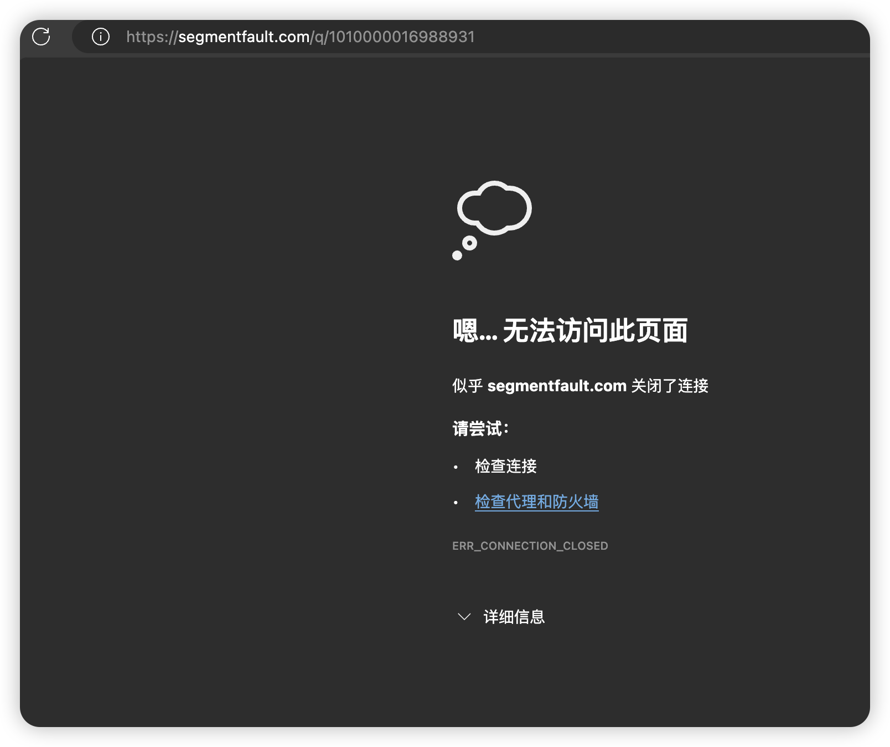
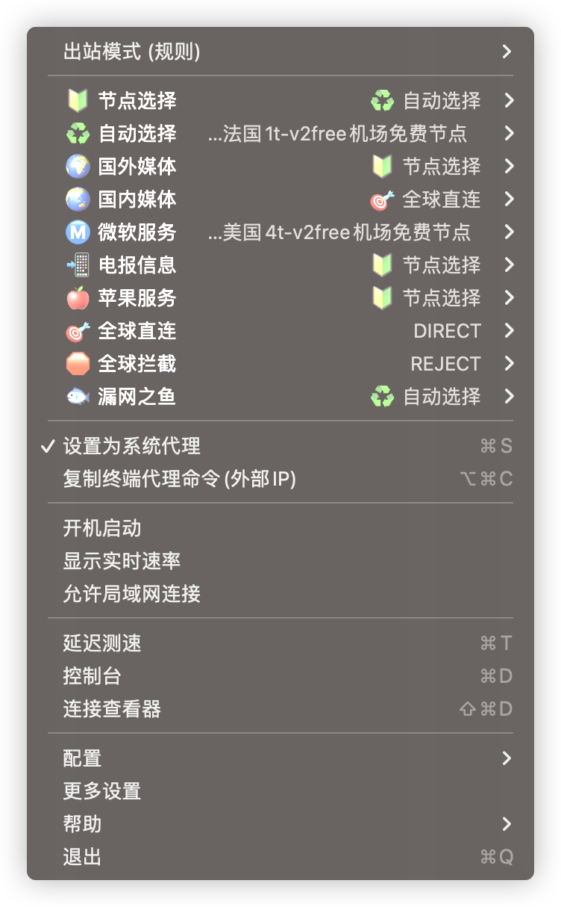
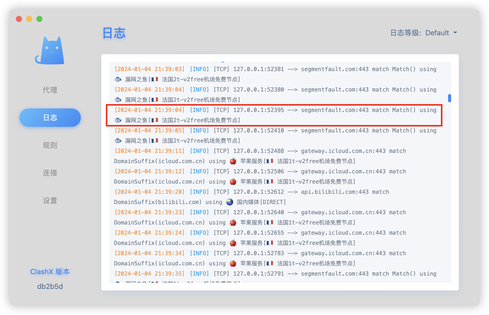

开启魔法后，打开国内部分网站，都出现如下提示：

> 嗯… 无法访问此页面
> 似乎 segmentfault.com 关闭了连接

包括知乎简书都不能访问了，但 B 站可以访问。

当然，访问外网是没有问题的

在网上搜索了半天，大部分都是说关闭连接后无法上网，但和我这种情况不一样

然后我就只能需要魔法时开启，访问内网时关闭，非常麻烦

好在最近终于解决了这个问题

原来是我的规则配置错了，`漏网之鱼` 选择了 `自动选择`，而 `自动选择` 是访问外网的，导致无法访问内网了

我就说我 `国内媒体` 选择的是 `全球直连`，而 `全球直连` 是 `DIRECT`，应该是可以访问内网的呀

没想到知乎这类的不在 `国内媒体` 规则里，而在 `漏网之鱼` 规则里，导致无法访问

那我是如何发现的呢？

是那天无意中打开了日志，查看后发现的：

那这就好办了，把 `漏网之鱼` 也设置成 `全球直连`，就可以访问内网了

这下就不用来回开启关闭了，完美
