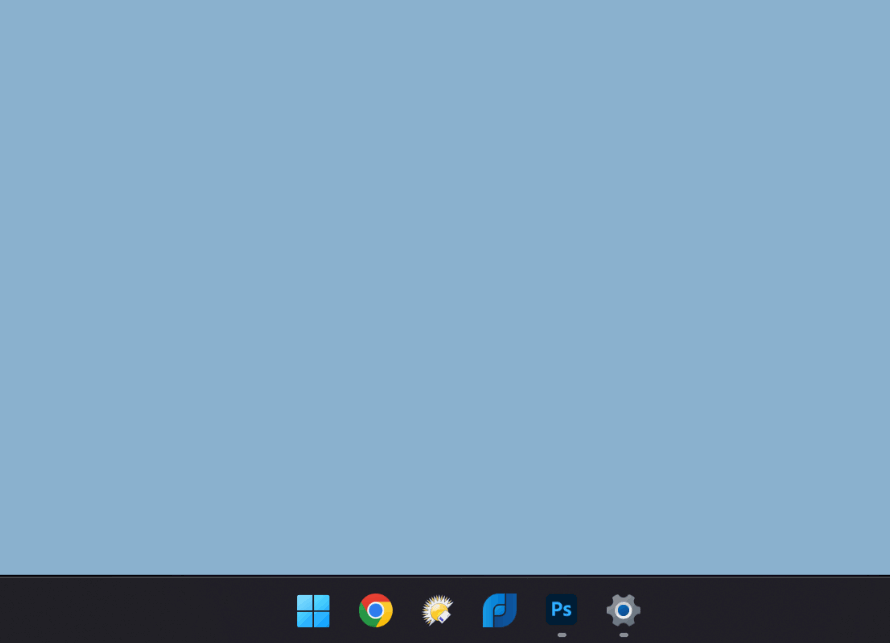
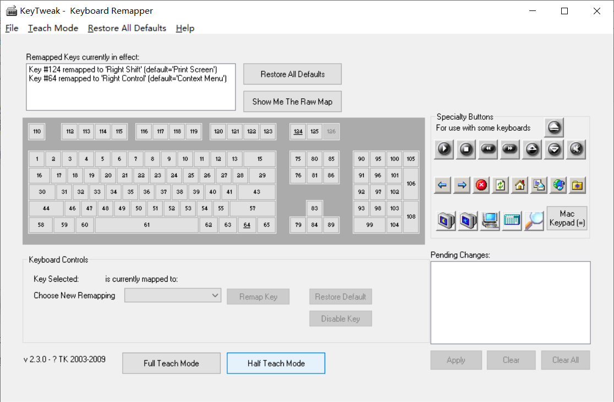
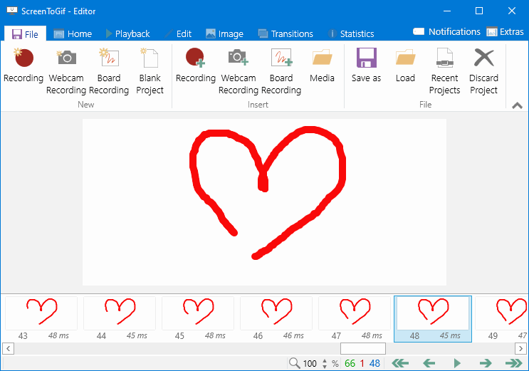
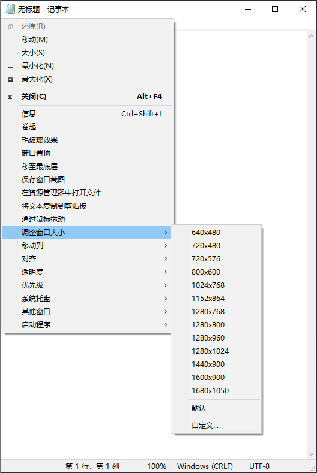
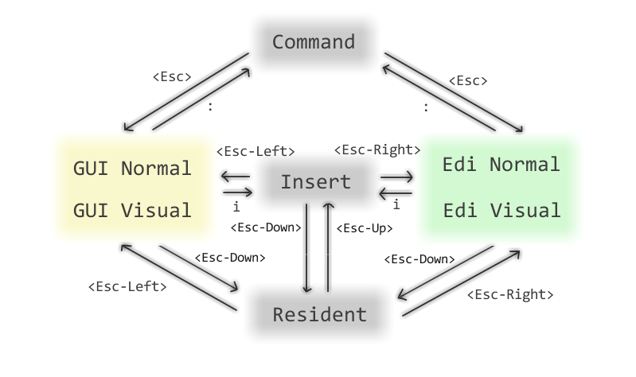

## [7+ Taskbar Tweaker](https://tweaker.ramensoftware.com/)

7+ Taskbar Tweaker 是一款免费的 Windows 软件，可以让用户自定义任务栏的行为和外观。它允许用户根据自己的需求调整任务栏的大小、按钮组合方式、缩略图的尺寸和位置，以及修改任务栏的右键单击、中键单击和双击行为等。此外，它还提供了许多有用的快捷键，可以方便用户执行各种任务，包括关闭窗口、切换窗口、打开任务管理器等。7+ Taskbar Tweaker 是一款用途广泛的工具，特别适合需要频繁操作任务栏的用户，例如多任务管理器或需要打开大量窗口的用户。它提供的大部分选项，则是你无法从调整任务栏属性或者注册表所能达到的。

安装方法

https://ramensoftware.com/downloads/7tt_setup.exe

## [7-Zip](https://7-zip.org/)

7-Zip 是一款开放源代码的文件压缩软件，可以将文件压缩为.zip、.rar、.tar 和.7z 等多种格式，还可以解压缩这些格式的文件。7-Zip 使用了一种高度压缩算法，称为 Lempel-Ziv-Markov chain-Algorithm（LZMA），这种算法可以压缩非常大的文件并保持压缩比例很高。

7-Zip 的主要优点之一是它的压缩比例很高，而且可以比其他文件压缩软件获得更好的压缩率。此外，7-Zip 具有以下特点：

- 它是一款免费软件，并且没有任何广告或间谍软件。
- 它支持多种文件格式，包括 7z、ZIP、GZIP、BZIP2、XZ、RAR 和 TAR 等。
- 它可以在 Windows、Linux 和 macOS 等多个操作系统上运行。
- 它可以创建自解压缩文件，这样不需要安装任何软件就可以解压缩文件。
- 它还可以加密文件，以确保安全性。

总之，7-Zip 是一款功能强大、易于使用和完全免费的文件压缩软件，适合任何需要进行文件压缩或解压缩的用户。

安装方法

https://7-zip.org/download.html

## [AutoHotkey](https://www.autohotkey.com/)

AutoHotkey 是一款免费的开源自动化脚本工具，可以用于自动化和自定义键盘、鼠标和其他输入设备的功能。AutoHotkey 脚本使用简单易懂的语言编写，可以让用户充分利用键盘、鼠标和其他输入设备来快速完成繁琐的重复任务。

AutoHotkey 可以执行很多功能，包括：

- 自定义快捷键和热键：用户可以快速设置自己的快捷键和热键，从而加快他们的工作效率。
- 定制鼠标操作：用户可以在鼠标上创建复杂的宏，用于点击、滚动或拖动。
- 自动填充表单：用户可以使用 AutoHotkey 自动填写表单，快速完成日常工作中的重复性任务。
- 快速启动应用程序：用户可以将常用的应用程序设置成快捷键或热键，从而快速启动应用程序。

总的来说，AutoHotkey 是 自动化和自定义键盘、鼠标和其他输入设备功能的一个很好的工具，极大地提高了用户的生产力和工作效率。

[中文文档](https://wyagd001.github.io/zh-cn/docs/index.htm)

安装方法

https://www.autohotkey.com/

## [arlbibek/windows-ahk: ⌨ A simple and intuitive AutoHotKey script for Windows.](https://github.com/arlbibek/windows-ahk)

## [Ditto](https://github.com/sabrogden/Ditto)

Ditto 是一个免费的剪贴板管理器，可在 Windows 操作系统中使用。它可以记录复制和剪切的文本、图片、文件等信息，并支持多种操作方式，如搜索、筛选、编辑、查看等。Ditto 还具有多重快捷键、自动备份和数据同步等特点，可以提高用户的生产力。

Ditto 的主要功能包括：

- 记录并管理剪贴板历史记录：Ditto 可以记录复制和剪切的内容，并支持多种格式，如文本、图片、文件等。
- 多重搜索和筛选：Ditto 支持多重搜索和筛选，可以轻松找到所需内容。
- 编辑、添加、删除和分类管理：Ditto 可以对历史记录进行编辑、添加、删除和分类管理，并可以自动备份和数据同步。
- 多重快捷键：Ditto 提供多种快捷键，可以快速访问剪贴板内容，提高工作效率。

总的来说，Ditto 是一款实用的剪贴板管理器，可以帮助用户管理和使用剪贴板，提高工作效率。无论你是经常需要复制和剪切文本、图片、文件，还是需要随时访问历史记录，Ditto 都是一个很好的选择。

安装方法

https://ditto-cp.sourceforge.io/

也可以在 Microsoft Store 中安装

## [f.lux](https://justgetflux.com/)

随着人们生活水平的提高，越来越多的人关注健康问题。点子产品已经成为生活中不可分割的一部分，长时间的电脑办公可能会导致一部分人感到眼睛干涩不舒服，现在大部分的显示器都已经具备防蓝光功能，自然滤掉一部分有害蓝光。如果电脑显示器没有防蓝光功能，有没有一款软件可以帮助我们解决这个问题，答案是肯定的，那就是这款完全免费的 f.lux 软件。

安装方法

https://justgetflux.com/

## [Flow Launcher](https://github.com/Flow-Launcher/Flow.Launcher)

Flow Launcher 是一个 Windows 平台上的开源生产力工具。它旨在帮助用户提高工作效率，通过快速访问常用文件、文件夹、应用程序和网络搜索来改善工作流程。

Flow Launcher 采用可自定义的搜索栏界面，用户可以在搜索栏中输入关键词或短语，并基于搜索查询显示一系列建议的结果。Flow Launcher 的搜索功能非常强大，它可以快速搜索计算机上的文件和文件夹、Windows 设置、Web 搜索、计算器等等。搜索结果还可以针对具体的搜索关键字进行分类，方便用户快速找到所需的内容。

除此之外，Flow Launcher 还可以帮助用户创建自定义命令和快捷方式，以简化他们的工作流程。用户可以创建自己的快捷键、自动执行脚本、打开指定网页等，而不必浪费时间寻找操作或者复制粘贴等。

总之，Flow Launcher 绝对是一款非常实用的工具，尤其适合那些需要经常进行搜索和操作的用户。

安装方法

https://www.flowlauncher.com/

## KeyTweak

KeyTweak 是一款免费的 Windows 系统键位映射工具。它允许用户重新映射键盘的每个按键，以满足用户的特殊需求或喜好，从而提高用户的生产力和输入体验。

使用 KeyTweak 非常简单。首先，您需要下载并安装 KeyTweak 软件。安装完成后，启动 KeyTweak 会出现一个键位映射表。您可以将左侧的按键拖动或单击来选择按键，然后将您希望其映射的按键拖动到右侧的目标按键，或通过按一次“Disable”来禁用这个按键。

这是一种非常有用和灵活的工具，特别是对于那些习惯于使用自定义键位的程序员和游戏玩家来说。通过 KeyTweak 这样的工具，他们可以将常用的按键映射到键盘上更为便利和易于访问的位置，从而使他们的输入速度大大提高。

需要注意的是，如果您不熟悉基本的键位映射知识，请勿随意更改键盘的按键映射，否则可能会出现意外的后果。

安装方法

目前 KeyTweak 的官网已经下线了，可以自行查找下载地址

## [LosslessCut](https://github.com/mifi/lossless-cut)

LosslessCut 是一款免费简单易用的跨平台工具，包括 windows 版本和 mac 电脑的版本，用于无损修剪、合并视频和音频文件，它不进行任何重新编解码操作，所以剪切速度超快！

[无损视频切割合并软件 LosslessCut 中文免费版 - 知乎](https://zhuanlan.zhihu.com/p/365498815)

安装方法

https://github.com/mifi/lossless-cut/releases

## [Microsoft Edge](https://www.microsoft.com/zh-cn/edge)

Edge 浏览器采用全新的浏览器内核，提供更快的速度、更好的性能和更好的安全性。

与传统的 Internet Explorer 浏览器相比，Edge 提供了更多的功能和更好的用户体验，例如内置的 Cortana 虚拟助手、Web 笔记本等。此外，它还支持扩展程序和主题，并且提供了多个屏幕、书签和历史记录的同步等功能。

安装方法

https://www.microsoft.com/zh-cn/edge/download

## [MyKeymap](https://xianyukang.com/MyKeymap.html)

MyKeymap 是 Windows 下的一款按键映射 / 快捷键增强工具

- 对于`普通用户` (1) 能利用 caps 命令以一种新颖的方式启动程序\
  (2) 能利用 caps + f 召唤窗口，解决高频的窗口切换\
  (3) 还能从 MyKeymap 预设的系统控制，窗口操作中获得一些便利
- 对于`文字编辑`、整理笔记较多的人，`J`  模式的「光标控制」和「文字选择」能帮你提高生产力
- 对于`程序员`，除了能享受上述的所有便利，还可以看看「符号输入」和「数字输入」两个功能
- 对于`我`，MyKeymap 最开始是个人日常使用的一套键位映射，它能提高我的操作效率，优化输入体验。\
  因为我觉得好用，说不定对其他人也有用，如果能写出一个有用 or 有帮助的软件，又有何不可呢？🐶 所以做成了一个软件。

安装方法

https://xianyukang.com/MyKeymap.html

## [ScreenToGif](https://www.screentogif.com/)

ScreenToGif 是一款免费、开源的屏幕录制、gif 制作和视频转换工具。使用 ScreenToGif 可以方便地录制电脑屏幕，对屏幕上的活动进行捕捉并录制成 gif 动态图片或视频文件。

ScreenToGif 软件界面简单，易于使用。它支持多窗口录制、鼠标跟踪、快捷键等功能，可以对录制的内容进行编辑和优化，包括添加字幕、调整画面大小、剪辑、添加帧等。ScreenToGif 还支持截图、转换视频格式、压缩文件等功能。

安装方法

https://www.screentogif.com/

也可以在 Microsoft Store 中安装

## [SmartSystemMenu](https://github.com/AlexanderPro/SmartSystemMenu)

SmartSystemMenu 扩展了系统中所有窗口的系统菜单。它会将下面的自定义项目追加到菜单：

- 信息.  显示一个对话框，其中包含当前窗口和进程的信息：窗口句柄、窗口标题、窗口风格、窗口类、进程名称、进程 ID、进程路径。
- 卷起.  将当前窗口向上卷起。
- 毛玻璃效果.  将 "毛玻璃效果" 模糊添加到当前窗口。(仅 Windows Vista 及更高版本支持。主要用于控制台窗口。)
- 窗口置顶.  当前窗口位于所有其他窗口之上。
- 移至最底层.  将当前窗口发送到底部。
- 保存窗口截图.  将当前窗口的屏幕截图保存到文件中。
- 在资源管理器中打开文件.  在文件资源管理器中打开进程文件。
- 通过鼠标拖动.  通过鼠标拖动当前窗口。
- 调整窗口大小.  更改当前窗口的大小。
- 移动到.  将当前窗口移动到另一个显示器。
- 对齐.  当前窗口与桌面上的 9 个位置中的任何一个对齐。
- 透明度.  更改当前窗口的透明度。
- 优先级.  更改当前窗口的程序优先级。
- 剪贴板.  复制所有窗口文本 (包括控制台、MS Office 产品等) 到剪贴板中，同时支持清除剪贴板。
- 系统托盘.  将当前窗口最小化或挂起到系统托盘。
- 其他窗口.  关闭和最小化系统中除当前窗口之外的所有窗口。
- 启动程序.  启动设置中的程序。

安装方法

- 下载  [SmartSystemMenu](https://github.com/AlexanderPro/SmartSystemMenu/releases) zip 压缩包文件
- [Chocolatey](https://chocolatey.org/): `choco install smartsystemmenu`
- [Scoop](https://scoop.sh/): `scoop install smartsystemmenu`

## [SnipDo](https://snipdo-app.com/)

在任何应用程序中选择一个文本，SnipDo 会弹出以帮助您

安装方法

https://snipdo-app.com/

也可以在 Microsoft Store 中安装

## [VLC media player](https://www.videolan.org/vlc/)

VLC 是一款自由、开源的跨平台多媒体播放器及框架，可播放大多数多媒体文件，以及 DVD、音频 CD、VCD 及各类流媒体协议。

安装方法

https://www.videolan.org/vlc/#hrefHaoChenDIY7

## [VS Code](https://code.visualstudio.com/)

`Visual Studio Code` 是一个轻量级但功能强大的源代码编辑器，可在桌面上运行，适用于 `Windows` , `macOS` 和 `Linux` . 它内置了对 `JavaScript` , `TypeScript` 和 `Node.js` 的支持，并为其他语言 (如 `C++` , `C＃` , `Java` , `Python` , `PHP` , `Go` ) 和运行时 (如 `.NET` 和 `Unity` ) 提供了丰富的扩展生态系统。

[VSCode 初始化配置](/pages/6f52fa/)

安装方法

https://code.visualstudio.com/

## [win-vind](https://pit-ray.github.io/win-vind/)

Win-vind 是一个可以让 Windows 的图形用户界面 (GUI) 与 Vim 编辑器类似操作的工具，可以通过安装此工具进行控制。[GitHub](https://github.com/pit-ray/win-vind)。win-vind 的模式就像是一个绑定的预设，可以根据不同的应用程序动态切换。如果选择插入模式或常驻模式，操作与 Windows 正常操作相同，具有 Vim 用户友好的特点。[Vim 操作指南](https://pit-ray.github.io/win-vind/usage/)。同时，可以自定义映射，通过宏功能添加额外模式的概念，并具有类似 Vim 的特点。

安装方法

https://pit-ray.github.io/win-vind/downloads/

## [Windows Terminal](https://github.com/microsoft/terminal)

Windows 终端程序是一款新式、快速、高效、强大且高效的终端应用程序，适用于命令行工具和命令提示符，PowerShell 和 WSL 等 Shell 用户。主要功能包括多个选项卡、窗格、Unicode、和 UTF-8 字符支持，GPU 加速文本渲染引擎以及自定义主题、样式和配置。

安装方法

https://github.com/microsoft/terminal
