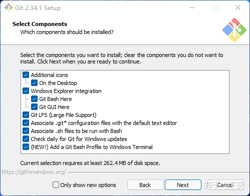
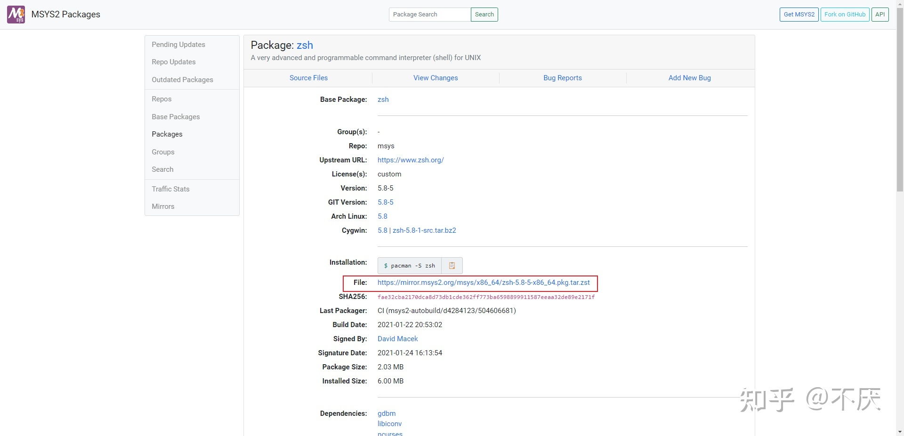
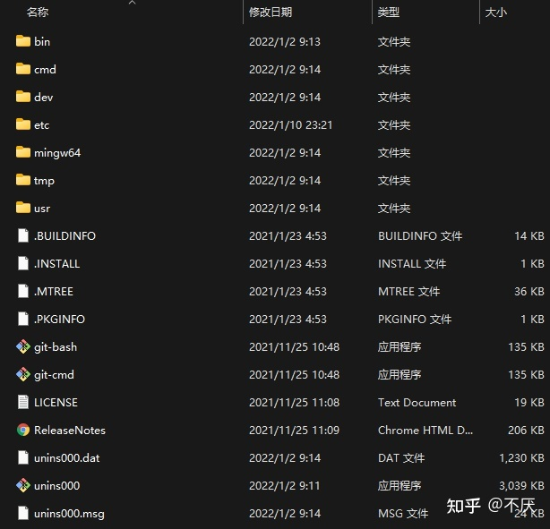
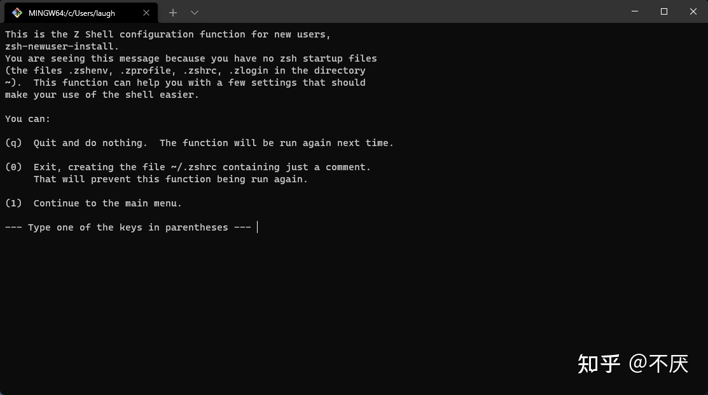
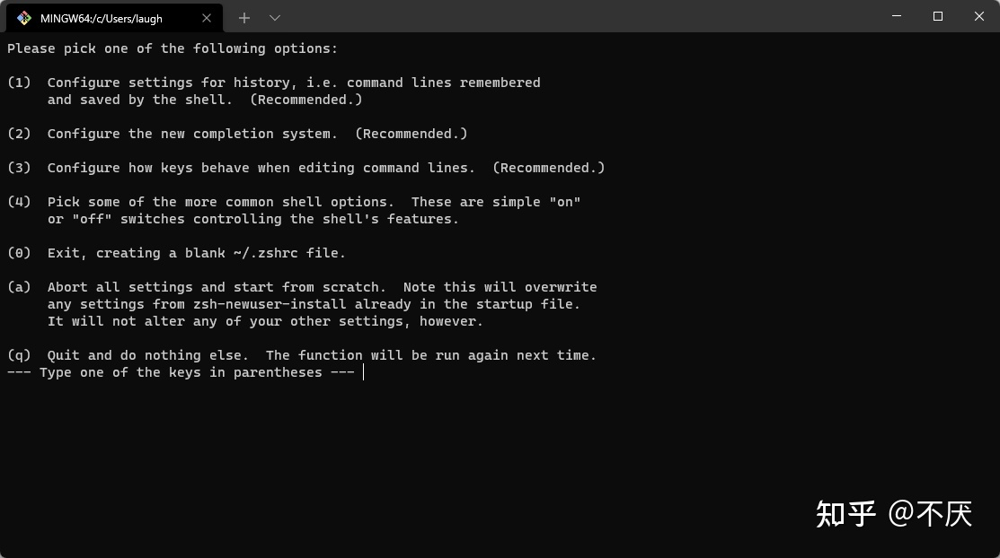
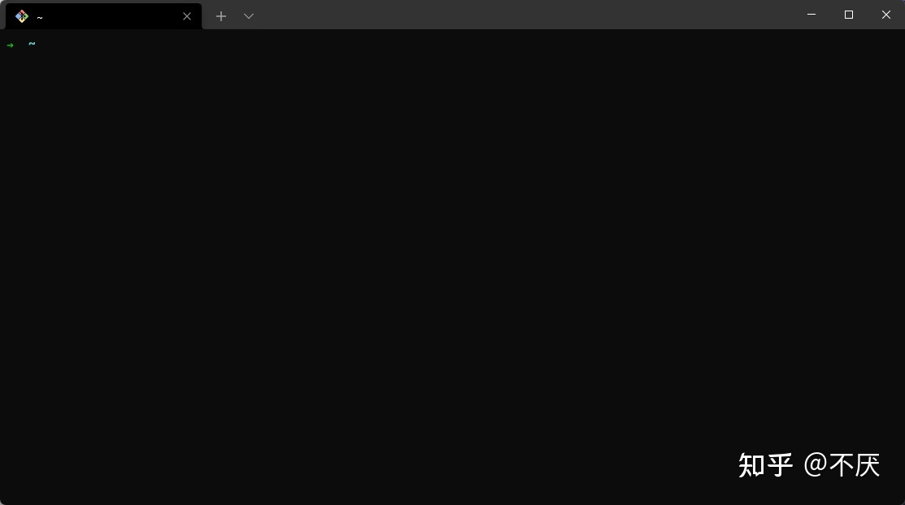
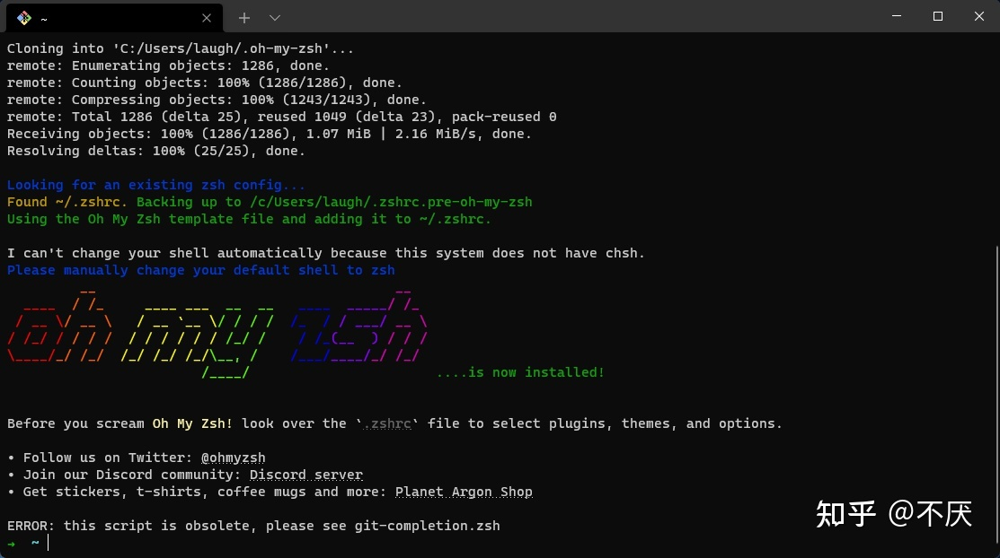
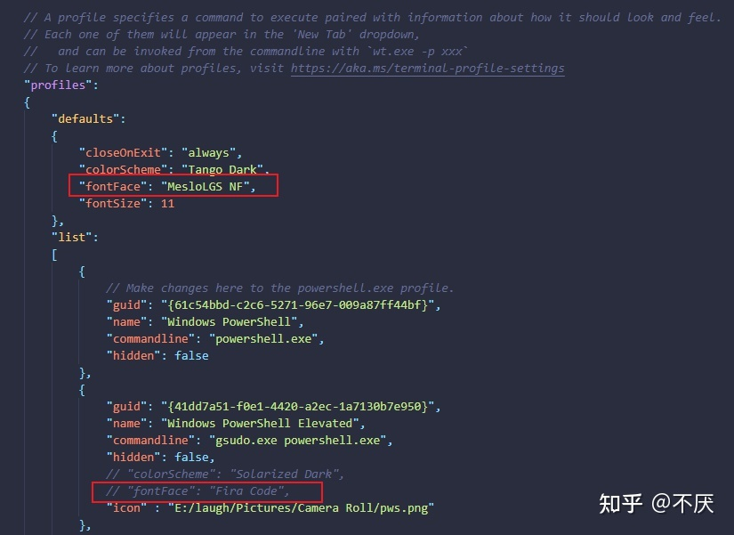
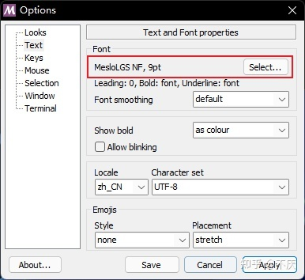
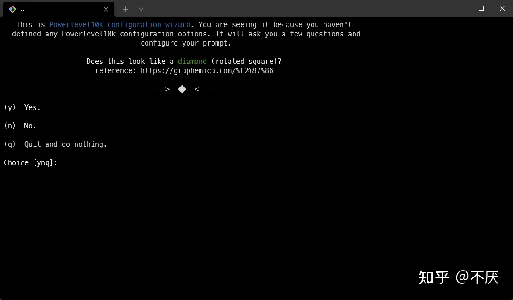

众所周知，windows 下有很多优秀的终端：`cmd`、`PowerShell`、`Git-Bash`，但都有一个致命的缺点：不支持 `zsh`，或者需要很麻烦的配置才能使用，而不像 Mac，天生就支持；对于用惯了 mac 以及习惯了 zsh-autosuggestions 的我来说，windows 的命令行简直不能忍

而 `Windows Terminal` 的出现打破了这一难题，通过简单的配置即可支持 `zsh`

注：`Windows Terminal` 以下简称为 `wt`

这里是官方文档：[Windows 终端概述 | Microsoft Docs](https://docs.microsoft.com/zh-cn/windows/terminal/)

## 安装 wt

首先是安装了，可以在 Microsoft Store 直接搜索安装，如果你无法访问 Microsoft Store，[GitHub 发布页](https://github.com/microsoft/terminal/releases)上发布有内部版本。如果从 GitHub 安装，Windows 终端将不会自动更新为新版本。

要求 windows 版本最低为：Windows 1903 (build >= 10.0.18362.0)，可用 cmd 查看版本。

安装时会校验系统版本，太低的话安装不了，升级系统吧

## 安装 Git

下载 [Git for Windows](https://gitforwindows.org/)，安装时注意勾选 `Add a Git Bash Profile to Windows Terminal` 即可，安装时自动添加。



## 在 Windows 环境下为 Git Bash 安装 zsh (非 WSL)

安装 zsh

进入 [MSYS2 Packages](https://packages.msys2.org/package/zsh?repo=msys&variant=x86_64) 点击 File 下载 `.zst` 压缩包，如图所示：



直接解压至 Git 根目录下 (**重点**)，可使用 [7-Zip-zstd](https://github.com/mcmilk/7-Zip-zstd/releases) 解压，解压后文件结构如图所示：



使用 wt 打开 Git Bash 标签页输入 zsh，出现下图则代表安装成功，否则检查是否解压至 Git 根目录下



出现上图，则代表需要进行初始化配置（具体配置可自行百度），在终端输入 1 后如图：



依次设置好 `Recommended.` 项后，输入 0 退出（务必生成 .zshrc 文件），之后在终端（Git Bash 标签页）输入 zsh，出下图即可。



本人在配置时，没有设置 `Recommended.`，输入 1，再输入 0 就结束了，应该是能生成 .zshrc 文件即可

## Oh My Zsh

### 安装 Oh My Zsh

进入[官网](https://ohmyz.sh/#install)，复制首页命令进行安装。

`sh -c "$(curl -fsSL https://raw.github.com/ohmyzsh/ohmyzsh/master/tools/install.sh)"`

若出现 `curl: (6) Could not resolve host: raw.githubusercontent.com` 报错，则在 hosts 下添加以下内容，重试即可。

`199.232.68.133 raw.githubusercontent.com`

安装完成后出现下图内容代表安装成功（若出现 ERROR 忽略即可）



### 配置 `Oh My Zsh` 主题

`Oh My Zsh` 主题文件在 `~/.oh-my-zsh/themes` 下，各个主题预览可参见 [官方 WiKi](https://github.com/ohmyzsh/ohmyzsh/wiki/Themes)，默认主题为 `robbyrussell`。想更换主题在 `~/.zshrc` 文件中新增/修改 `ZSH_THEME` 字段的配置。

### 安装 `powerlevel10k` 主题

在安装 `powerlevel10k` 主题前需要安装需要推荐的[字体](https://github.com/romkatv/powerlevel10k#meslo-nerd-font-patched-for-powerlevel10k), 字体安装完成后分别在 `Windows Terminal` 与 `Git Bash` 配置字体。

在 `Windows Terminal` 中打开 `settings.json`，在 *profiles → defaults* 设置 `"fontFace": "MesloLGS NF"`。



在 `Git Bash` 右键选项 (`Options`)，点击文本 (`Text`) 配置字体。



配置好字体后，在终端输入以下命令进行安装：

```zsh
git clone --depth=1 https://gitee.com/romkatv/powerlevel10k.git ${ZSH_CUSTOM:-$HOME/.oh-my-zsh/custom}/themes/powerlevel10k
```

安装完成后在 `~/.zshrc` 文件中设置 `ZSH_THEME="powerlevel10k/powerlevel10k"`，并在终端输入以下命令更新 `.zshrc` 配置文件：

```zsh
source ~/.zshrc
```

之后会显示下图信息进行配置 (如果没显示，重启 wt)，输入 `y` 后根据个人喜好配置。若之后觉得配置不合适，可在终端输入 `p10k configure` 重新配置。



如果觉得终端显示的文件路径过长，只想显示最后一个文件夹，可在 `~/.p10k.zsh` 文件中将 `POWERLEVEL9K_SHORTEN_STRATEGY` 的参数改为 `truncate_to_last`。

```zsh
typeset -g POWERLEVEL9K_SHORTEN_STRATEGY=truncate_to_last
```

### 配置默认启动 zsh

在 `../Git/etc/bash.bashrc` 文件末尾追加以下内容：

```zsh
# Launch Zsh
if [ -t 1 ]; then
exec zsh
fi
```

之后每次启动/新建 `Git Bash`，都会是 `zsh`。

### [配置 zsh 插件](/pages/5ea06c/#%E6%8C%87%E4%BB%A4%E9%AB%98%E4%BA%AE)

## wt 快捷键

## 参考资料

- [一文搞定 Windows Terminal 设置与 zsh 安装【非 WSL】 - 知乎](https://zhuanlan.zhihu.com/p/455925403)
