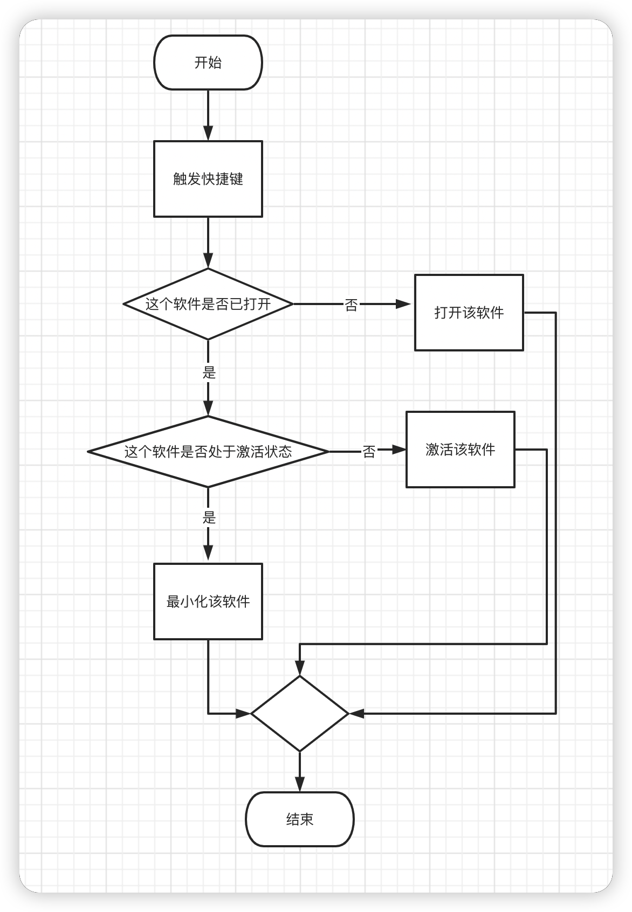

[Manico](https://manico.im/) 是 Mac 上一款优秀的效率工具，可以实现快速启动和切换 App

具体介绍可以看：[简洁、高效、易用，Mac App 快速启动及切换工具：Manico 2.0 - 少数派](https://sspai.com/post/32457)

奈何 Windows 上并没有可以替代的产品，故想通过 ahk 模拟 Manico 的功能

autohotkey 的简单使用可以参考这个文章：[Windows 自动化效率神器：AutoHotkey 使用教程和脚本推荐 - 知乎](https://zhuanlan.zhihu.com/p/35379309)

初步想法是这样的：



那我们就实现一下吧，以 chrome 为例：

首先新建脚本 Manico.ahk

## 定义快捷键

我们和 Manico 保持一致，也使用 alt 作为触发键

从[这里](https://wyagd001.github.io/zh-cn/docs/Hotkeys.htm#Symbols)可以查得 alt 的修饰符为 `!`

所以我们可以这样定义快捷键：

```
; Manico.ahk
!j:: ; 触发的快捷键：alt + j。! 代表 alt
; do something
```

## 窗口操作

[这里](https://wyagd001.github.io/zh-cn/docs/commands/WinActivate.htm)是窗口操作相关的文档

[这里](https://wyagd001.github.io/zh-cn/docs/Variables.htm#os)是系统变量相关的文档

继续补齐我们的代码：

```
; Manico.ahk
!j:: ; 触发的快捷键：alt + j。! 代表 alt
  if not WinExist("ahk_exe chrome.exe") ; 判断是否有打开的 chrome
  {
    run "%A_ProgramsCommon%\Google Chrome" ; 运行 chrome，run 后面是 chrome 的位置
    WinWait, ahk_exe chrome.exe ; 等待 chrome 打开
    WinMaximize ; 最大化 chrome，默认打开的不是最大化的窗口
  }
  else if WinActive("ahk_exe chrome.exe") ; 判断 chrome 是否处于活动状态
  {
    WinMinimize ; 最小化
  }
  else
  {
    WinActivate ; 激活 chrome
    WinGet, OutputVar, MinMax ; 判断 chrome 是否是最大化
    if OutputVar != 1 ; 如果不是最大化
      WinMaximize ; 最大化
  }
return
```

这样我们就实现了通过快捷键 `alt + j` 打开/最大化/最小化 chrome

不过当有多个 chrome 窗口时，我们只能操作最后激活的那个窗口，无法操作其他的窗口

这时候我们只能使用 Windows 自带的快捷键来实现了

## 结合 Windows 自带的快捷键

在 Windows 中，当我们将一个软件固定到任务栏时，可以使用 `win + 数字` 来打开/激活该软件，而且有多个窗口时，可以在窗口之间切换，但无法最小化

比如我将 chrome 固定到任务栏第一个位置，如果未打开 chrome，使用 `win + 1` 即可打开，如果当前激活的软件不是 chrome，使用 `win + 1` 即可激活 chrome，有多个 chrome 窗口时，`win + 1` 可以在窗口之间切换

这样我们就可以使用 `alt + j` 打开/最大化/最小化 chrome，`win + 1` 在多个 chrome 窗口切换

如果你不需要最小化这个功能，那就更简单了，直接使用 `win + 1` 就好了；而如果还想使用 `alt + j`，上面的代码都不需要了，只需要下面一行即可搞定

```
; Manico.ahk
!j::#1 ; 将 alt + j 映射为 win + 1
```

如果需要开机自启，将 Manico.ahk 放到开机启动目录下：`C:\Users\${username}\AppData\Roaming\Microsoft\Windows\Start Menu\Programs\Startup`

这样我们就基本实现了 Manico，当然没有人家那么完美，不过也可以正常使用

## 参考资料

- [快速参考 | AutoHotkey](https://wyagd001.github.io/zh-cn/docs/AutoHotkey.htm)
- [如何在 Windows 上使用 autohotkey 模拟 macOS 上的 Manico 软件？ - 简书](https://www.jianshu.com/p/541b4a6c51bc)
