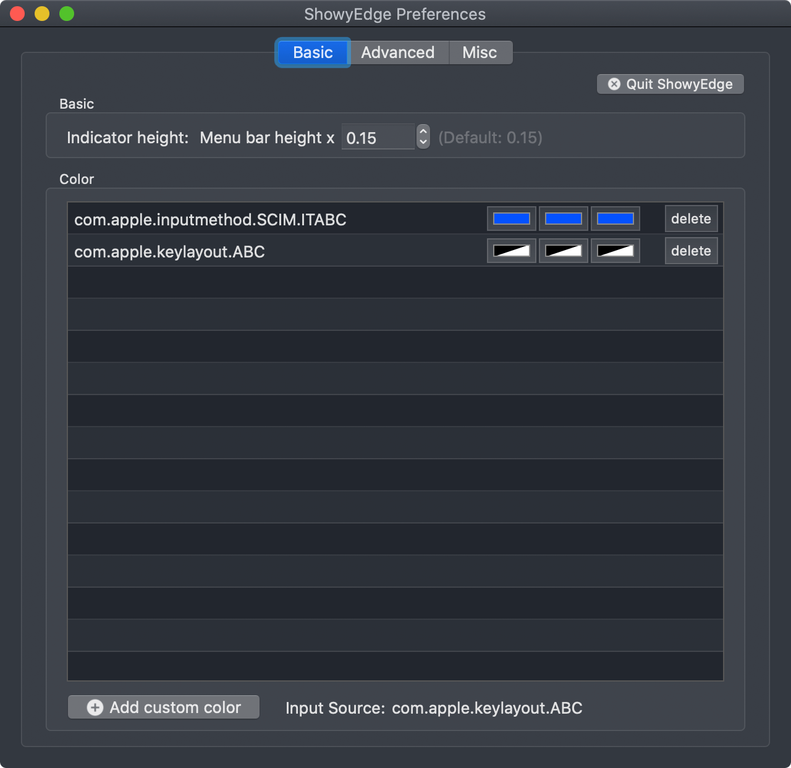
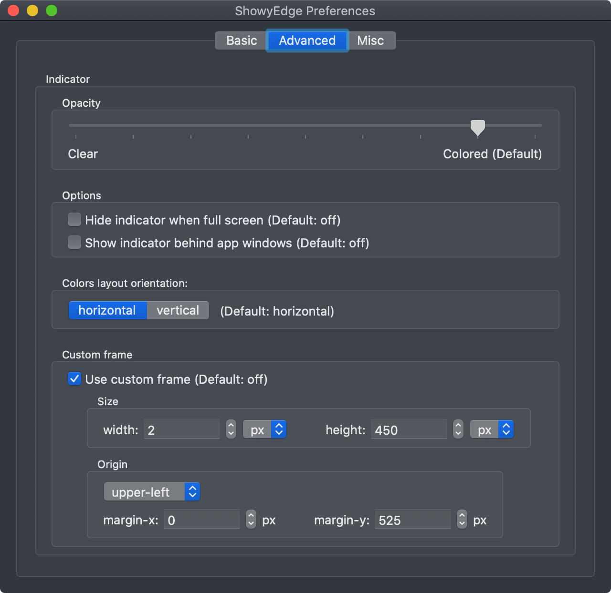

作为一个对工具有绝对掌控欲的强迫症程序员来说，无法得心应手的切换中英文输入法一直让我耿耿于怀。我想实现的是**不用看通知栏就能知道当前输入法的状态，一键切换到自己需要的输入法，做到对输入法的绝对掌控。**

## Mac

本来一开始打算中英文全部使用百度的，无奈系统自带的英文无法删除（可以删除，但不想那么折腾），而且就算你使用 `shift` 切换百度的中英文，系统有时候莫名其妙会切换到系统的英文; 每次输入都需要查看顶部状态栏，而且有的软件全屏后会隐藏顶部状态栏，这时要不先随便输入一下查看输入源，要不鼠标滑到顶部查看输入源，极其影响效率

解决方法：

1. 放弃百度输入法，均使用系统自带的 (不是说百度不好，只是觉得自带的也可以)
2. 切换输入法仍使用 `Caps Lock`
3. 使用 `ShowyEdge` 给输入源添加不同颜色

注：`ShowyEdge` 推荐是在顶部状态栏，但我们一般输入位置是在屏幕中下部的，这样查看当前输入源还是不方便，所以本人将 `ShowyEdge` 放置在屏幕左侧靠下位置

在 `VSCode` 中的中文输入法效果图（英文就是透明的，没有那个蓝条）：


具体配置看下图：



注：英文输入源的颜色是透明的，因为常用英文，透明不影响视觉; 中文输入源的颜色是蓝色的，这是本人征求设计同学的意见而选择的，因为蓝色在白色和黑色背景下都显眼



注：这个图主要是调整 `ShowyEdge` 的位置，可以根据自己喜好自定义

这样只需要看一下屏幕左下角，就可以知道当前输入法状态了，完美！

Install: `$ brew cask install showyedge`

下载地址：[ShowyEdge - Software for macOS](https://pqrs.org/osx/ShowyEdge/)

## Windows

`Windows` 没有类似的软件，那只能自己实现一个了

这里还是使用 [AutoHotkey](https://wyagd001.github.io/zh-cn/docs/index.htm)

使用 [Gui](https://wyagd001.github.io/zh-cn/docs/lib/Gui.htm) 展示输入法状态，然后在[切换输入法](/pages/004a3a/#%E9%94%AE%E4%BD%8D%E6%98%A0%E5%B0%84%E5%87%86%E5%A4%87-%E8%87%AA%E5%B7%B1%E5%AE%9E%E7%8E%B0)时显隐控件

ps: 由于本人没有找到 `ahk` 如何监听输入源变化的代码，故这里偷个懒，和自己实现的切换输入法联动一下

```
; Gui 展示输入法状态
CustomColor := "0352ff" ; 可以为任意 RGB 颜色，这里还是蓝色
MyInput := 0 ; 定义显隐变量
Gui +LastFound +AlwaysOnTop -Caption +ToolWindow ; +ToolWindow 避免显示任务栏按钮和 alt-tab 菜单项.
Gui, Color, %CustomColor%
Gui, Show, x0 y400 w3 h500 NoActivate ; x/y/w/h 调整位置和大小，NoActivate 让当前活动窗口继续保持活动状态.

;=====================================================================o
; 按键修饰符

; CapsLock 短按切换输入法，先按其他功能键再按 CapsLock 为切换大小写；CapsLock 与其他某个键同按时，CapsLock 映射为 ctrl，如 CapsLock + w => ctrl + w
; https://zhuanlan.zhihu.com/p/389784449

; 切换是否显示输入法状态
UpdateOSD(arg) {
  Gui +LastFound
  if (arg) {
    Gui, Hide
  } else {
    Gui, Show, NoActivate
  }
}

#InstallKeybdHook
; 禁用大写功能，防止误触
SetCapsLockState, alwaysoff
*Capslock::
  Send {LControl Down}
  KeyWait, CapsLock
  Send {LControl Up}
  if ( A_PriorKey = "CapsLock" )
  {
    Send {ctrl down}{shift down}
    Send {shift up}{ctrl up}
    MyInput := !MyInput
    UpdateOSD(MyInput)
  }
  ; CapsLock + [ 进入 normal 模式，并切换到英文输入法，系统配置的切换到英文快捷键是 ctrl + 0
  if ( A_PriorKey = "[")
  {
    ; Send {Esc}
    Send ^0
    MyInput := 1
    UpdateOSD(MyInput)
    return
  }
return
```
