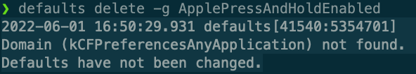

## im-select 实现

使用 vim 过程会频繁切换状态，在 insert 模式下，主力使用的中文输入法，比如搜狗输入法、微软拼音输入法等，而在 normal 模式下敲命令都是需要英文状态的，为了切换到 normal 模式时输入法能自动切换为英文状态，[vscodevim](https://github.com/VSCodeVim/Vim#input-method) 插件推荐使用 [im-select](https://github.com/daipeihust/im-select)。

这里是 windows 的操作步骤：[如何解决 VSCode Vim 中文输入法切换问题-im-select](https://www.zhihu.com/question/303850876/answer/2263584870)

mac 也是类似操作，必须有两个输入源，一个中文输入，比如系统自带的或搜狗之类的三方输入法，一个是英文输入，一般选系统自带的就可以了

首先先安装 [im-select](https://github.com/daipeihust/im-select#macos)

将以下部分插入到 vscode 的 settings.json 里面

```json
// 开启自动切换输入法
"vim.autoSwitchInputMethod.enable": true,
// 设置默认输入法，值获取方法：切换到系统的英文输入法，在命令行输入 im-select 就可以获取当前输入法的值了
"vim.autoSwitchInputMethod.defaultIM": "com.apple.keylayout.ABC",
// im-select 安装路径，在命令行输入 which im-select 获取
"vim.autoSwitchInputMethod.obtainIMCmd": "/usr/local/bin/im-select",
"vim.autoSwitchInputMethod.switchIMCmd": "/usr/local/bin/im-select {im}"
```

测试了一下，insert 模式是自带中文，ctrl + [ 后就切换到自带英文了，再切到 insert 模式，还是中文

这样其实已经实现了 normal 模式下中文输入法切换的问题，但切回 insert 模式后，还保留原输入模式其实就有点体验不好了

我们的终极需求是 normal 模式是英文，切回 insert 模式还是英文，这样我们就不需要考虑输入源的问题了，否则我切到 insert 模式 还得看一下到底是中文还是英文

当然如果你能接受现在这种效果，按照上面的配置一下就可以了

## win autohotkey 实现

先来说一下 windows 如何借助 autohotkey 实现

还是需要两个输入源

先参考一下这个文章，不需要跟着操作，就熟悉一下流程即可：[如何解决 VSCode Vim 中文输入法切换问题-autohotkey](https://www.zhihu.com/question/303850876/answer/1181682863)

这篇文章是直接把切换输入法的值写死了

> PostMessage, 0x50, 0, 0x4090409, , A ;切换为英文 0x4090409=67699721

万一以后变了呢？或者我想切换别的英文输入法呢？

最好的办法是给切换英文输入绑定一个快捷键，切换 normal 模式后模拟按键，这样就比较灵活一点



可以看到我配置的切换到英文是 ctrl + 0，切换输入法是 ctrl + shift

接下来我们就需要在 autohotkey 中改键了

```ahk
; CapsLock + [ 进入 normal 模式，并切换到英文输入法
CapsLock & [::
Send {Esc}
Send ^0
return
```

这样当我们按下 CapsLock + [ 后，就会先触发 Esc 按键，切换到 normal 模式，再触发 ctrl + 0，切换到英文输入法。

而当我们再切回 insert 模式时，仍然是英文输入法

由于我是 mac/win 双系统开发，mac 使用的键盘是 HHKB，ctrl 对应在 win 上就是 CapsLock，所以就将 CapsLock 改成 ctrl 了

这里是全部配置，CapsLock to Ctrl，按键习惯于 mac 一致

```
; 短按 CapsLock 切换中英文，长按开启大写
CapsLock::
  KeyWait, CapsLock
  if (A_TimeSinceThisHotkey > 300)
  {
    state := GetKeyState("Capslock", "T") ; 当 CapsLock 打开时为真, 否则为假.
    if state
      SetCapsLockState, Off
    else
      SetCapsLockState, On
  }
  else
  {
    state := GetKeyState("Capslock", "T")
    if state
    {
      SetCapsLockState, Off
    }
    Send {ctrl down}{shift down}
    Send {shift up}{ctrl up}
  }
return

; CapsLock as Control for vim

; CapsLock + [ 进入 normal 模式，并切换到英文输入法，系统配置的切换到英文快捷键是 ctrl + 0
CapsLock & [::
Send {Esc}
Send ^0
return

CapsLock & i::Send ^i
CapsLock & o::Send ^o
CapsLock & `;::Send ^`;
CapsLock & v::Send ^v
CapsLock & r::Send ^r
CapsLock & f::Send ^f
CapsLock & b::Send ^b
CapsLock & d::Send ^d
CapsLock & u::Send ^u
return
```

## mac
