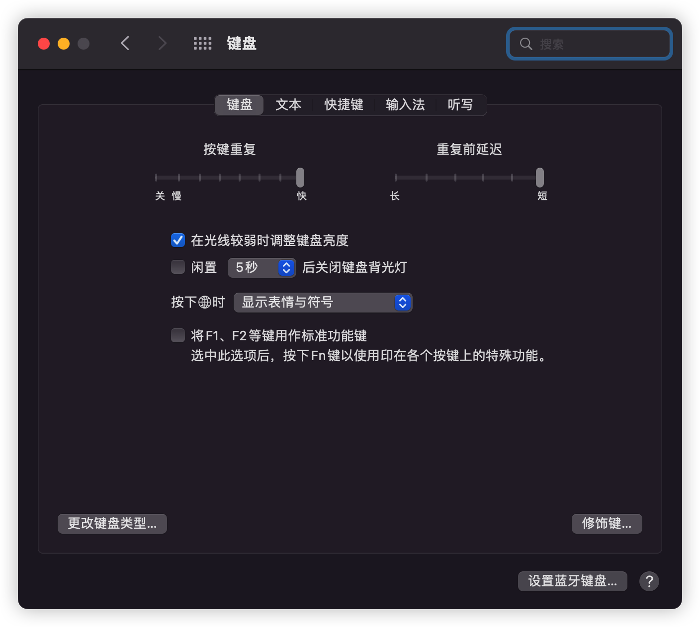
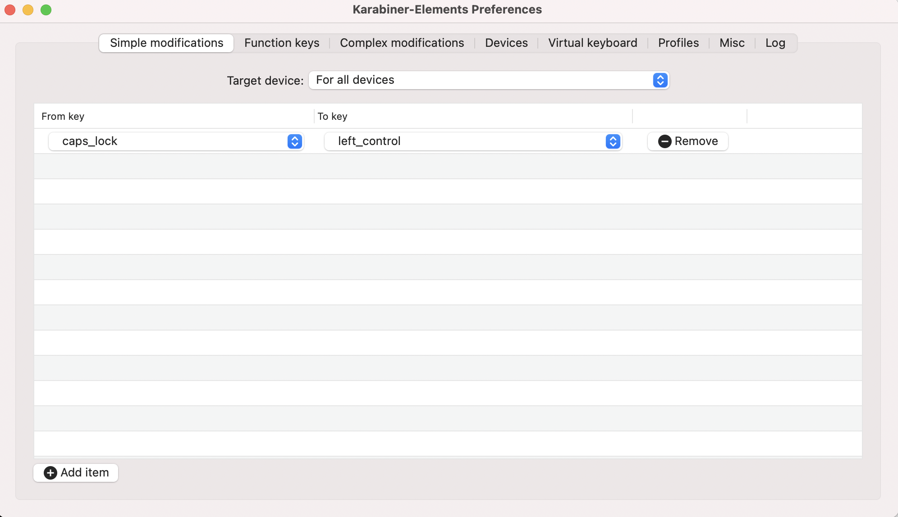

## Mac

### vscode 环境准备：

安装 `vscode` [vim](https://marketplace.visualstudio.com/items?itemName=vscodevim.vim) 拓展

`mac` 系统设置-键盘，将 `按键重复` 调到最快，将 `重复前延迟` 调到最短

todo
补一个图
todo

在命令行执行如下代码（开启长按键盘重复输入）：

```bash
$ defaults write com.microsoft.VSCode ApplePressAndHoldEnabled -bool false              # For VS Code
$ defaults write com.microsoft.VSCodeInsiders ApplePressAndHoldEnabled -bool false      # For VS Code Insider
$ defaults write com.visualstudio.code.oss ApplePressAndHoldEnabled -bool false         # For VS Codium
$ defaults write com.microsoft.VSCodeExploration ApplePressAndHoldEnabled -bool false   # For VS Codium Exploration users
$ defaults delete -g ApplePressAndHoldEnabled                                           # If necessary, reset global default
```



最后一个命令如果出现上图报错，不用管，重启 `vscode` 就好了

### 键位映射准备

推荐使用 [karabiner-elements](https://karabiner-elements.pqrs.org/) 进行键位映射

要注意给权限，否则不生效

映射规则如下：

非 `HHKB` 键盘 `ctrl` 与 `caps lock` 互换；在日常中，`caps lock` 键的作用其实不大，而 `ctrl` 键的使用频率更高，但他们的位置却相反，所以换过来会更适合我们日常使用


互换以后，我们切换中英文就有点不方便了，可以再添加一个规则：`Post caps_lock if left_control is pressed alone.`

打开这个网址：https://ke-complex-modifications.pqrs.org/?q=Change%20control%20key



找到图中红框标记的位置，点击后面的 `Import` 来引入该规则

todo, 补图，如何引入，还有下方的 space

space + hjkl 映射为 方向键；这可以使我们在 insert mode 中方便地移动光标，当然，这是全局生效的，在任何地方都可以使用

## Windows

### vscode 环境准备：

安装 `vscode` [vim](https://marketplace.visualstudio.com/items?itemName=vscodevim.vim) 拓展

由于 `Windows` 默认就支持长按重复输入，故不需要处理

### 键位映射准备

推荐使用 [autohotkey](https://www.autohotkey.com/) 进行键位映射，这里是[中文文档](https://ahkcn.github.io/docs/AutoHotkey.htm)

由于我是 `mac/win` 双系统开发，`mac` 使用的键盘是 `HHKB`，`ctrl` 对应在 `win` 上就是 `CapsLock`，所以就将 `CapsLock` 改成 `ctrl` 了

这里是全部配置，`CapsLock to Ctrl`，按键习惯与 `mac` 一致

```
; 短按 CapsLock 切换中英文，长按开启大写
CapsLock::
  KeyWait, CapsLock
  if (A_TimeSinceThisHotkey > 300)
  {
    state := GetKeyState("Capslock", "T") ; 当 CapsLock 打开时为真, 否则为假.
    if state
      SetCapsLockState, Off
    else
      SetCapsLockState, On
  }
  else
  {
    state := GetKeyState("Capslock", "T")
    if state
    {
      SetCapsLockState, Off
    }
    Send {ctrl down}{shift down}
    Send {shift up}{ctrl up}
  }
return

; CapsLock + [ 进入 normal 模式，并切换到英文输入法，系统配置的切换到英文快捷键是 ctrl + 0，具体配置参见下一篇
CapsLock & [::
Send {Esc}
Send ^0
return

; CapsLock as Control for vim

CapsLock & i::Send ^i
CapsLock & o::Send ^o
CapsLock & `;::Send ^`;
CapsLock & v::Send ^v
CapsLock & r::Send ^r
CapsLock & f::Send ^f
CapsLock & b::Send ^b
CapsLock & d::Send ^d
CapsLock & u::Send ^u
return
```
