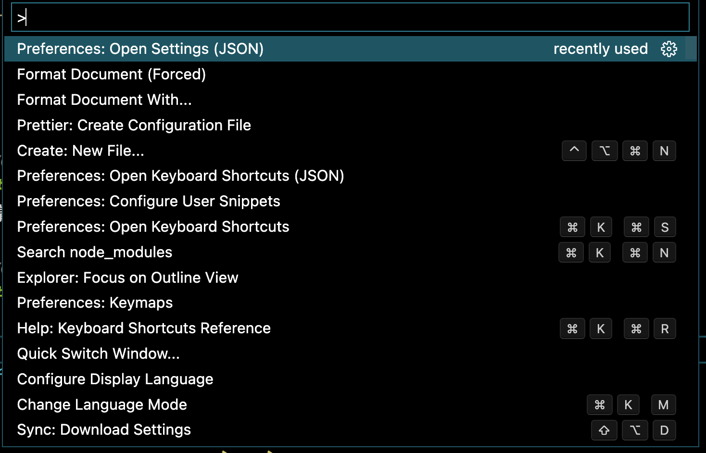

## 任务点

### vim 语法

操作符（operator）+ 动作（区域范围）

操作符：指删除、复制等操作字符的字符，如上节课所学的 `d`、`y`

动作：指可以将当前光标移动到另一位置的字符，如 `hjkl`, `^$` 等

### 操作符

`d`: 删除

当按下 `d` 后，可以在 `vscode` 下方状态栏看到当前输入到 `d`，此时 `vim` 就进入 `pending` 的状态，等待我们后续输入的动作

当我们输入 `操作符 + 动作` 后，`vim` 就会去执行这个命令

比如输入 `d + h` 就是向左删除一个字符，`d + $` 就是删除到行尾

但当我们输入 `d + H/L` 的时候，却不是删除到行首/尾

这是因为我们改键只改了 `normal` 模式，而没有改 `operatorPending` 模式

还是在 `settings.json` 中增加配置：

```json
"vim.operatorPendingModeKeyBindings": [
  {
    "before": ["H"],
    "after": ["^"]
  },
  {
    "before": ["L"],
    "after": ["g", "_"]
  }
]
```

如果要在终端中改键：

.vimrc

```vim
onoremap H ^
onoremap L g_
```

`onoremap`表示在输入完操作后等待时间按键绑定

`c`: 删除并进入 `insert` 模式

`y`: 复制

`d/c/y` 删除/复制后，都会把字符存储在寄存器中

### 基于单词/字串的移动

单词：字母组成的单词、括号等

`e`: 移动到单词的结尾 (从左到右移动)

`w`: 移动到单词的开头（从左到右移动）

`b`: 移动到单词的开头（从右到左移动）

`ge`: 移动到单词的结尾 (从右到左移动)

字串：空格、`tab`、换行分割的字符

`E`: 移动到字串的结尾（从左到右移动）

`W`: 移动到字串的开头（从左到右移动）

`B`: 移动到字串的开头（从右到左移动）

`gE`: 移动到字串的结尾 (从右到左移动)

### 组合

`cw`: 删除当前单词并进入 `insert` 模式

`ea`: 在当前单词结尾处添加

## 社群讨论

感觉第三章节讲的灵活性都开始变大了，循序渐进的一个过程也挺有意思的

其实写代码就是最好的练习，因为肌肉记忆有部分是和场景有关系

是的 像操作性的东西大部分就是肌肉记忆，练久了感觉就熟悉了，不过前期确实挺难受

其实就是第一次的痛苦期难熬 劝退了很多人，只要你有一次渡过痛苦期的经验 下一次在遇到痛苦期就心里有数有信心了，比如很多从全拼转到双拼的同学 就非常容易习得，因为他们知道痛苦期只是暂时的

<br />

两个问题

`d ^`: 删除到行首操作会有光标所在的字母没有删除到

`c w`：删除到下个单词前会保留下个单词前的空格，`d w` 则不会

嗯 这是一些小细节

<br />

有谁知道怎么快速打开 setting.json 这样的文件吗

command+shift + p

我还想问下 command + shift + p 和 command + p 有什么区别




观察一下 自己说答案

command + shift + p 是配置 和 command + p 是找文件？

加 shift 是命令，普通的就是文件

setting.json 不是文件吗？哦哦是打开这个文件的命令

也可以用 f1 代替 cmd + shift + p

<br />

cw 只能先移动到单词开头才可以，有那种光标在单词中间，也可以直接删除单词的操作吗？

ciw

<br />

我想在单词的末尾，删除这个单词，有什么办法么？例如：abcef，向前删除 f 还会留着

diw 吧

diw 删除光标所在单词
ciw 删除光标所在单词，并开始插入
yiw 复制光标所在单词

<br />

dL 可以用 D 代替

<br />

此外，P 是粘贴到光标前，p 是粘贴到光标后
