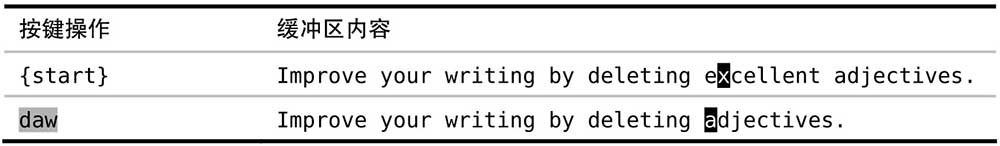
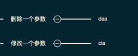
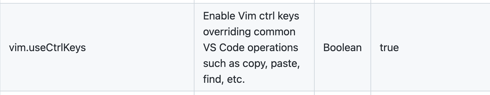

## 任务点

### 认识文本对象

文本是结构化的，可以快速选择，大白话就是范围

### 语法

- operator + 内/外部 + 文本对象
- 可视化模式 + 内/外部 + 文本对象

### 内/外部

- i: 内部
- a: 外部

### 对象

- w: 一个单词。内部：单词本身，外部：单词本身 + 左右空格，优先右空格
- W: 一个字串。内部：字串本身，外部：字串本身 + 左右空格，优先右空格
- (/)/b: 一对 ()。内部：括号内部，外部：括号及括号内部
- [/]: 一对 []。内外部同 ()
- {/}/B: 一对{}。内外部同 ()
- </>: 一对<>。内外部同 ()，操作 html 标签
- t: html 文本。
- ': 一对单引号。内外部同 ()
- ": 一对双引号。内外部同 ()
- `: 一对反引号。内外部同 ()
- s: 一个句子，以 .!? 结尾
- p: 一个段落，以空行分隔，内部选中该段落，外部还会选中下面的空行

下表总结了部分 Vim 内置的分隔符文本对象。出于整洁起见，表中省略了一些重复的文本对象。例如，`i(` 和 `i)` 等同，`a[` 和 `a]` 也相同，你可以使用最适合自己的那种风格。


使用可视模式展示部分文本对象：


下表总结了部分 Vim 内置的范围文本对象。


让我们比较一下 `iw` 及 `aw` 文本对象。按之前说过的记忆方式，可以分别把它们解读为操作单词内部（inside the word）或单词周围（around the word）。不过这究竟代表着什么呢？

`iw` 文本对象包含当前单词从第一个到最后一个字符间的全部内容，`aw` 文本对象也是一样，但它的范围有所扩大，它会额外包含该单词前面或后面的一个空白字符（假如该处有空白字符的话）。

`iw` 和 `aw` 之间的区别很微妙，为什么会需要这样两个文本对象呢？乍一看不是很明了。因此，让我们先看一下二者的典型应用。

假设，我们想删除下句中的单词“excellent”，此时可以用 `daw` 命令：



这条命令会删除此单词，外加一个空格，因此结果会很干净。如果我们用的是 `diw` 的话，那删完后就会有两个连在一起的空格，这或许并不是我们想要的。

现在假设我们是想把此单词改成另外一个单词，这次可以用 `ciw` 命令：


`ciw` 命令只删除该单词，而不删除其前后的空白字符，随后它会进入插入模式，这刚好是我们想要的效果。如果用的是 `caw` 的话，那最后两个单词就会连在一起，变成“mostadjectives”。虽然这很容易修正，但如果一开始就能避免此问题，那岂不是更好么。

一般来说，`d{motion}` 命令和 `aw`、`as` 和 `ap` 配合起来使用比较好，而 `c{motion}`命令和 `iw` 及类似的文本对象一起用效果会更好。

对于引号来说，只要当前行光标后面有引号就可以操作引号中的内容

比如 `name: 'xxx'`，光标在 `n` 上，执行 `vi'` 就可以选中 `xxx`，同理，`c/d/y` 都可以

### vim-textobj-arguments(选择函数参数/数组元素/对象属性):

- ia: 不包含分隔符
- aa: 包含分隔符

技巧：

- cia: 修改一个参数
- daa: 删除一个参数

默认删除 `(/[` 里以 `,` 分割的字符，所以可以选择函数参数或数组元素

我们可以增加 `{` 来使其可以选择对象属性

```json
"vim.argumentObjectOpeningDelimiters": [
  "(",
  "[",
  "{"
],
"vim.argumentObjectClosingDelimiters": [
  ")",
  "]",
  "}"
]
```

### vim-textobj-entire:

- ae: 当前文本所有内容
- ie: 当前文本所有内容，不包含前后空格

## 社群讨论

我有个问题，如果在 vim 中需要复制到系统的黏贴版，是不是要用 command + c，而不是用 y

对，y 是复制到 vim 的寄存器里了；记得视频里给大家演示了 这样的话有 2 个剪切板非常的舒服。当然 vim 本身有非常多的寄存器 但是我不是太喜欢用 太麻烦，2 个剪切板日常够用了

我看了那个视频，但是感觉很麻烦，感觉系统的剪切板用的方便

可以设置 vim 用系统剪贴板："vim.useSystemClipboard": true,

设置之后，y 是进入系统剪切板么

对，就是你在微信 copy 也能粘贴

eee

确实是打通了 但是少了一个剪切板

<hr />

想问一下有遇到过 vscode vim key repeating 在编辑区没生效的问题吗？侧边栏倒是生效了

在编辑区？normal 模式也不生效？重启试试

<hr />

我把 `</Row>` 剪贴后 怎么在 {data} 那行粘贴到 {data} 下面一行呢，假设 {data} 下面那行有数据 是新起一行


没太看懂 在 {data} 那里按 o

就是有快捷的办法把结束标签放到 61 行不


第一步是 da< 第二步粘贴


我只能做到这样，不然还得进入 inset 模式按回车

只能这样操作

好吧 我还以为有我不知道的命令

这个提示是啥插件 hhh

error lens

<hr />

打开了两个相同的 vscode ,请问怎么相互快速切换呢。manico 貌似只能在不同应用间切换

command + `

貌似没有反应，是要第三方软件驱动嘛

开 2 个 vscode 窗口

测试了下，全屏无效，开两个小窗有效。

对 不全屏，你可以放到最大鸭

啊，我一直都全屏

那你用 control + 左右切换系统的

不错结合 manico 确实可以做到不全屏了，感谢感谢

<hr />

当标签换行后，vit 会把开始标签的 > 选中

VS Code vim 插件的 bug

<hr />

请问下这里的动作范围是不是不对，是不是应该是 daw 跟 ciw



w 是单词 这里的 a 是参数

我 vscode 打了没反应，就光标闪了一下

这个是作用于方法的参数的，在别的地方不生效

<hr />

崔大，之前答疑那堂课讲到的，解决 windows ctrl+c 等会导致回到 normal 模式，然后通过设置 settings.json 的 vim.handlekeys 解决，那如果需要用到 visual block，按 ctrl + v 的话，又会变成粘贴，进不去 visual block 模式，是不是会有这种情况

现在你是遇到了这个情况了吗？



是滴，不过我原本就已经配置了 vim.useCtrlKeys 为 true，handleKeys 配了 C-a,C-c,C-v,C-f。原来如此，我把 handleKeys 指定的 C-v 配成 true 就可以了，另外的不启动的之前默认粘贴过来都是 false，比如 Ctrl+f 查找，c 复制，a 全选等

我看看你现在的配置是啥

这是阉割版，我在家里 windows 电脑从零用到啥配啥的，不过看目前讲到的第六课，是够用的


