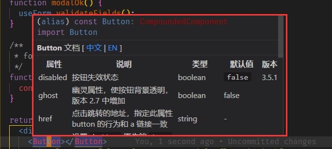
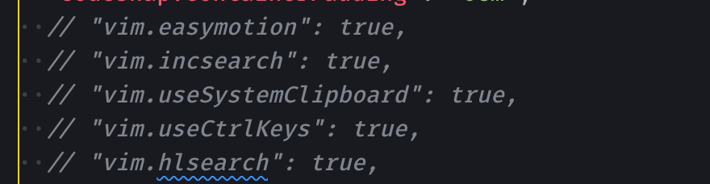
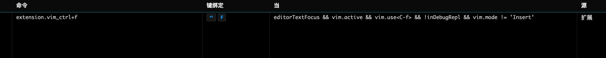

## 任务点

### 滚动

- ctrl + f(forward): 向下滚动一屏
- ctrl + b(backward): 向上滚动一屏
- ctrl + d: 向下滚动半屏
- ctrl + u: 向上滚动半屏
- ctrl + e: 向下滚动一行
- ctrl + y: 向上滚动一行

自定义配置滚动：

- shift + j: 向下滚动 5 行
- shift + k: 向上滚动 5 行

```json
"vim.normalModeKeyBindings": [
  {
    "before": ["J"],
    "after": ["5", "j"]
  },
  {
    "before": ["K"],
    "after": ["5", "k"]
  }
],
"vim.visualModeKeyBindings": [
  {
    "before": ["J"],
    "after": ["5", "j"]
  },
  {
    "before": ["K"],
    "after": ["5", "k"]
  }
],
```

- zz: 将当前行置于屏幕中央
- zt: 将当前行置于屏幕顶部
- zb: 将当前行置于屏幕底部
- gg: 跳转到文件首
- G: 跳转到文件尾
- 行数 + gg/G: 跳转到指定行

## 社群讨论

vscode 如何显示光标所在错误

gh

gh 相当于 hover

gh 出提示后，提示信息有滚动条，有按键可以让其滚动吗？

滚动还真不知道 一般用方向键就够了。

方向键现在是在代码移动，不能滚动弹出的提示信息 [破涕为笑]，见下图



在 Button 上 gh，然后弹出红框里的信息，有滚动条，有快捷键来滚动吗？

这个还真不知道，在 vscode 的 快捷键里面搜一下看看 有没有滚动

<hr />

Ctrl + f 为啥只向向后移动了一格啊，不是一屏

Ctrl+f 向后一格是在 insert 模式下，normal 模式下是一屏

我是在 normal 模式，normal 模式 ctrl + f 就向后了一格，所以我才奇怪

看看 vscode 有没有弄其他键位映射

这几个你们有开启吗？



忘了 应该是没有的，我配置 "vim.useCtrlKeys": false, 这个就是你说的这样，但我看你配置好像把这个注释了

<hr />

为啥我的 control + f 没作用

mac 这个不用配置，默认就是向下滚动一屏，你在快捷键配置那里看看是不是以前配置过别的功能

有个其他的，我给解绑了，现在就剩这一个了



还不行吗

不行

不是 insert 模式

在 normal 模式

难道你全局有这个快捷键功能吗？

我好像没有设置过

你看一下 settings.json 关于 vim 的配置，是不是把这个功能禁了

<hr />

怎么选中相同的变量一起编辑啊

vs code 如果能找到变量引用，你选中一个，f2 修改，别的会同步修改

如果 f2 不能改，有那种选择相同变量一个一个向后选择一起更改的，是个什么快捷键来着？

gb
