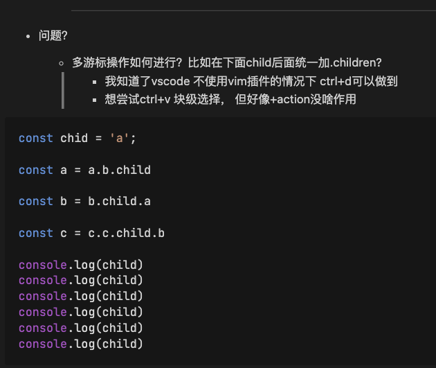
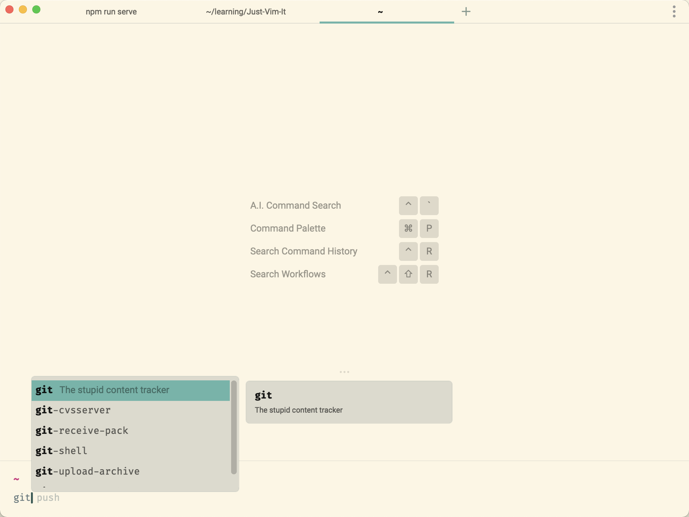

## 任务点

### 单行搜索

- f: 正向移动到下一个 char 所在之处
- F: 反向移动到上一个 char 所在之处
- t: 正向移动到下一个 char 所在之处的前一个 char
- T: 反向移动到上一个 char 所在之处的后一个 char
- ;: 重复上次的 char 查找命令
- ,: 反转方向查找上次的 char 查找命令

当搜索不到时，光标不会移动

`v/c/d` 结合 `f` 选中/删除的范围都是从当前位置到搜索到的位置，故

移动的时候用 `f`, 结合 `c/d` 使用 `t`

### 全文件搜索

- /: 向后查 (模糊搜索)
- ?: 向前查 (模糊搜索)
- n: 查找下一个
- N: 查找上一个
- / + 上下方向键：查看搜索历史
- \*: 向后查光标所处的字符（全量匹配搜索）
- #: 向前查光标所处的字符（全量匹配搜索）

搜索的时候写单词前几个字母就可以了

`v` 结合 `/?` 选中的范围是从当前位置到搜索到的第一个字符的位置

`d/c` 结合 `/?` 删除的范围是从当前位置到搜索到的第一个字符的前一个字符处

## 社群讨论

多游标操作如何进行？比如在下面 child 后面统一加 .children? 我知道 vscode 不使用 vim 插件的情况下 cmd+d 可以做到，想尝试 ctrl+v 块级选择，但好像 +action 没啥作用



ctrl v，然后 A

thx, 只能选中当前行的，vscode 原生可以操作多行一起操作

在第一行 ctrl v 然后 jjjjjj 然后 A，这样不行吗？

中间不连续呢？位置不同？

目前学到的无法做到 后面会有指令可以，我印象中

我百度好像要装插件

不连续或者位置不同的话只能说具体情况具体分析 这样的情况 vscode 原本也不行，我猜应该是可以用全局的通配符选中相同的位置然后插入

command + d，mac os 可以实现

那 vim 肯定有这样的操作方式

https://github.com/terryma/vim-multiple-cursors 不知道崔哥是不是用的这个插件？

这个问题我也很好奇 用了 vim 后原本 vscode 的 command d 选中下一个相同字符的功能就失效了

可能是按键冲突？

上面链接这个的功能我看了一下就是我想要的那种诶 不知道 vscode 的 vim 是否有预装该插件呢？

gb 然后 A 或 I，我的 cmd + d 和 gb 都可以

重启下好像又可以 cmd+d 了

<hr />

我以前安利了 5 6 个同事，没有一个坚持下来的

这就对了

更多的人说是炫技 装 x，我也不好多说啥了，自己知道是好东西就是了，最起码的好处 我不怕换编辑器 webstorm idea iterm linux 里 随便哪 都是 vim 这一套

那都是给自己找的理由，学不会 vim 那玩意没啥用 装 x 我用鼠标多快，看不懂源码 那玩意没啥用 都是面试造火箭 工作拧螺丝 搬砖也用不上源码

我放弃了两次 第三次才坚持下来，我是直接在工作上用，最开始两次确实影响效率，

vim 做好 2 星期的痛苦期的准备就好了

我现在是每天学完一节就写一篇小文章，因为写的时候也是用 vim，然后还比平时写代码多了中英文切换的环节，markdown 又各种符号，基本把我的速度练出来了

其实和学走路一个道理，一开始你走不稳的时候 你需要先练习，你直接去走 甚至跑 那肯定就会被摔个头破血流

<hr />

给你们推荐个软件，fig


我用的 warp，自带的，除了大家吐槽说要登录，感觉不错



是的 里面内嵌了 fig，你单独装一个 vscode 里也能用

我现在打算不用 vscode 里的命令行了哈哈

有大佬怎么知道改 vscode 的默认终端么，想改成 warp

https://github.com/warpdotdev/Warp/issues/257，vscode 未支持

那我还是装上面那个老哥说的 fig 提示工具用用

不用 vscode 的嘛 直接开 warp 用，vscode 还能多点地方显示代码哈哈

也是，慢慢改一下习惯，我都是单开一个桌面单独跑服务，输命令一般习惯在 vscode 里面

Warp 的 hotkey 修了几个版本没修明白，直接给我劝退

<hr />

https://github.com/nvbn/thefuck

这个插件也太他妈牛逼了，马上安装伊戈尔，快速纠正命令输入错误

fuck 可还行

<hr />

https://github.com/LunarVim/LunarVim 我现在用的这个配置，改了下键的映射。结合 lazygit+ ranger 都是支持 vim

<hr />

基于这几天的打卡 给同学们提个醒

笔记做的好不好 是次要的 练没练习 练了多少 是否达到熟悉的程度才是最重要的

这就好比大家学英语的时候 笔记没少做 但是就是不开口 就是不用 那等于 0

为什么有的同学会越学越想学

甚至感觉学习比打游戏还有成就感

就是因为他在学习的过程中建立了正向反馈

这个非常重要 俗话说 尝到甜头了

但是大多数知识的反馈周期还挺久的

需要你不断的持续的投入

而在这个阶段非常多的同学坚持不下来

然后放弃 得到的也是学习太痛苦的结论

我观察键盘侠训练营同学们的打卡发现了一个非常有趣的事

键盘侠训练营练习快捷键可以让你很快的建立学习上的正向反馈！！！

这个甚至要比练成键盘侠更有意义，因为你会用这次的学习经验和反馈来指导你下一次的学习 不管是什么 因为你有了一次成功的经验 得到过学习上的正向反馈 感受到努力就可以得到回报了！

<hr />

问题问题，vscode 里点这个 @change 能直接跳到具体的方法吗


ctrl + }

gd

<hr />

/# 不是精确查找吗？我输入 /# 会匹配到 #

pdf 文件 我那是因为写 # 它不显示 所以加了 /

<hr />

我现在想知道 怎么在一个 word 两边快速加 ()

y s i w (

自带空格好像

这里的 s 是啥意思

https://github.com/VSCodeVim/Vim#vim-surround，这个 看文档

surround，包围的意思

<hr />

删除或者剪切整个函数，有什么快速操作么

dap?

dap 可以

```
function test() {

}
```

试试上面这个函数 有效果吗

如果函数体为空，则不行

这时候就得在函数体上做 `v$%d`，然后你发现这个按键太多了，配置一个 `<Leader>+df` 处理

删除一段？但是如果是在函数体行内用 v，第一行删不全吧

在函数名那行执行，也可以换成 V，所以删除一个函数还挺有意思的

https://github.com/VSCodeVim/Vim/issues/1096。function 没有后续。。现在有 indent

自己写一个 map 一下嘛。有何难。大致思路是 `?function<CR>V/{<CR>%`，js 下够用了，其他语言得另写

配置一下 leader + d+f 且不是更简单

leader 这个后面会讲吗？

讲，专门有一节课讲这个

<hr />

有遇到过#和\* 查找不生效的吗，为啥我按了没反应

你看看你是不是没有重复的

emm 好的

原来中文也可以匹配的，连续的中文会被程序当成是一个单词

<hr />

最好的练习就是在工作中直接用了，效率低也要用，因为不用的话 永远也熟悉不了，光靠你每天回家练习 30 分钟已经不够了 知识点学那么多了

现在撸代码基本脱离鼠标了 还差应用切换 还有一些内置快捷键不会用

这状态就对了

## 课外小知识

在 VIM 中，我们通过在命令模式（正常模式）下输入序列 `/pattern` 或 `?pattern` 的模式来搜索文本。跟 VIM 编辑界面合为一体，不会弹出新窗口来干扰用户的操作，已经很方便了。但是，待搜索的文本必须得手动输入。简单两三个字母还好，如果长了，还就不方便了。

那，有没有好的办法？当然有！那就是：使用可视化选中命令“v”或“V”。（可视化选中跟用鼠标选中有点不一样。可视化选中时对文本所作的操作是与 VIM 内部的寄存器交互，而使用鼠标时，是与操作系统的剪贴板交互。）

可以按如下操作来达到任意选中并搜索：

- 按下 v 之后，可以任意移动光标来使光标经过的区域的文本处于可视化选中状态；
- 按下 y，把选中的内容复制到 VIM 内部的默认寄存器"中；
- 按下/或?，进入搜索状态；
- 按下^R（即：Ctrl+R），然后按下"，把寄存器"中的内容粘贴到搜索栏中。[Ctrl+R？](http://vim.wikia.com/wiki/Paste_registers_in_search_or_colon_commands_instead_of_using_the_clipboard)
- 最后，按下回车，执行搜索。

以上就是整个步骤。当然，由于搜索使用的非常频繁，如若每次都这样操作的话，肯定是很麻烦的。怎么办？自定义按键映射即可。

映射命令：

```json
"vim.visualModeKeyBindings": [
  {
    "before": ["<Leader>", "/"],
    "after": ["y", "/", "<C-r>", "\"", "<Enter>"]
  }
],
"vim.normalModeKeyBindings": [
  {
    "before": ["<Leader>", "/"],
    "after": ["/", "<C-r>", "\"", "<Enter>"]
  }
]
```

经这样一映射，在 `visual` 模式，在选中文本后，按下 `<Leader> /` 就可以快速搜索了；在 `normal` 模式，按下 `<Leader> /` 就可以快速搜索刚才复制或删除的文本。非常方便。赶快试试吧，必备命令。

参考链接：[搜索可视化选中（Visually Selected）的文本](https://blog.twofei.com/610/)
