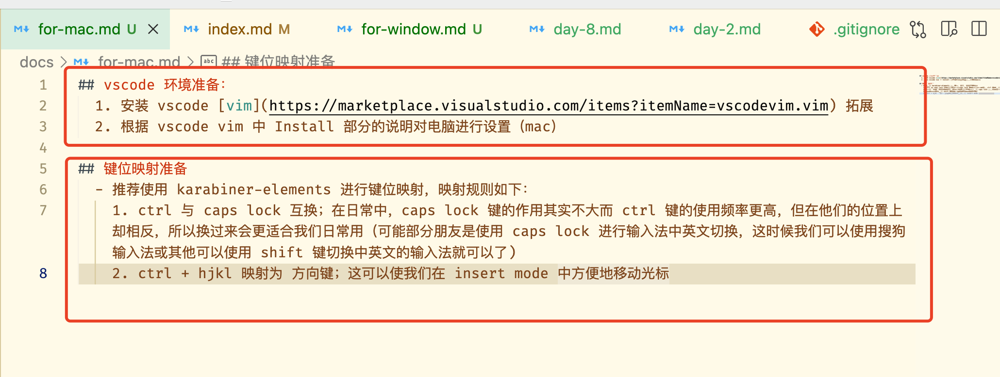
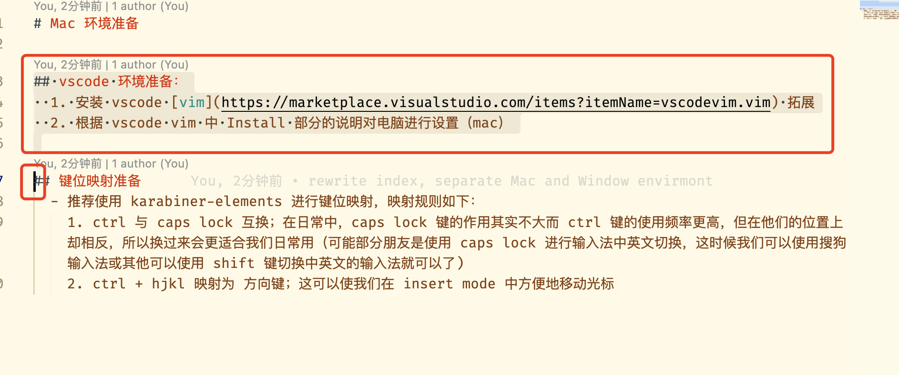
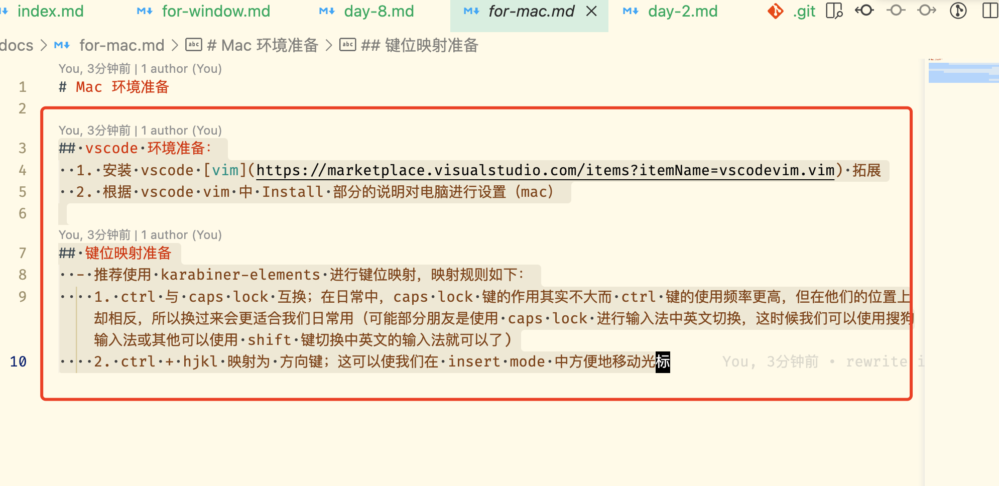
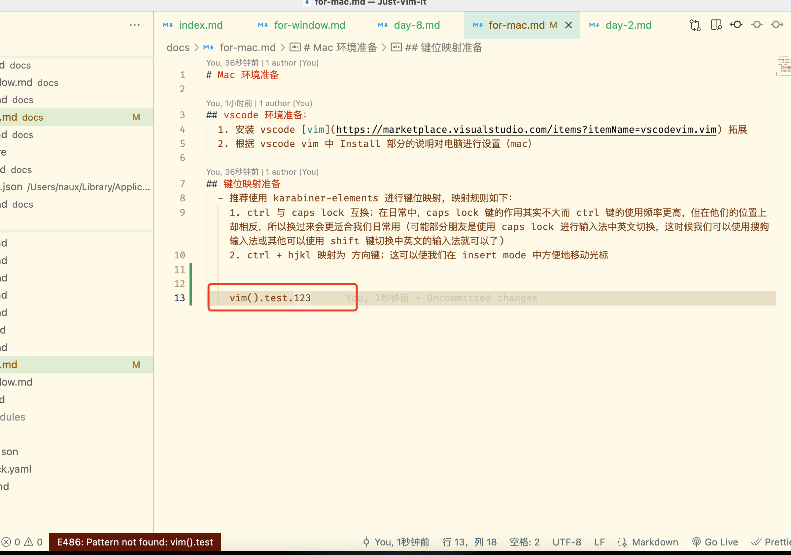
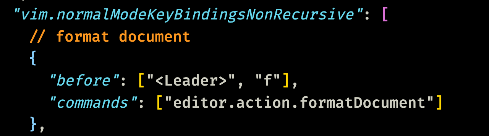

## 可视化模式

- `v`: 基于字符的可视化选择
- `V`: 基于行的可视化选择
- `C+v`: 基于块的可视化选择，多用于处理多行文本
- `o`: 切换可视区域光标的起始/终止位置，只在选择了多行后生效
- `gv`: 回到上一次选中的选择区域

选中 + 操作，如 `ved`

使用 `V` 或者 `C+v` 选择多行后，可以配合 `A` 或者 `I` 进行多行编辑

配合 `c` 来删除并插入

## 文本对象

- operator + 内/外部 + 文本对象
- 可视化模式 + 内/外部 + 文本对象

- i: 内部
- a: 外部

### 对象

- w: 一个单词。内部：单词本身，外部：单词本身 + 左右空格，优先右空格
- (/)/b: 一对 ()。内部：括号内部，外部：括号及括号内部
- [/]: 一对 []。内外部同 ()
- {/}/B: 一对{}。内外部同 ()
- </>: 一对<>。内外部同 ()，操作 html 标签
- t: html 文本。
- ': 一对单引号。内外部同 ()
- ": 一对双引号。内外部同 ()
- `: 一对反引号。内外部同 ()
- s: 一个句子，以 .!? 结尾
- p: 一个段落，以空行分隔，内部选中该段落，外部还会选中下面的空行

vim-textobj-arguments(选择函数参数):

- ia: 不包含分隔符
- aa: 包含分隔符

技巧：

- cia: 修改一个参数
- daa: 删除一个参数

vim-textobj-entire:

- ae: 删除当前文本所有内容
- ie: 删除当前文本所有内容，不包含前后空格

## 单文件移动

- ctrl + f(forward): 向下滚动一屏
- ctrl + b(backward): 向上滚动一屏
- ctrl + d: 向下滚动半屏
- ctrl + u: 向上滚动半屏
- ctrl + e: 向下滚动一行
- ctrl + y: 向上滚动一行

- shift + j: 向下滚动 5 行 (需改键)
- shift + k: 向上滚动 5 行 (需改键)

- zz: 将当前行置于屏幕中央
- zt: 将当前行置于屏幕顶部
- zb: 将当前行置于屏幕底部
- gg: 跳转到文件首
- G: 跳转到文件尾
- 行数 + gg/G: 跳转到指定行

## 搜索

- f: 正向移动到下一个 char 所在之处
- F: 反向移动到上一个 char 所在之处
- t: 正向移动到下一个 char 所在之处的前一个 char
- T: 反向移动到上一个 char 所在之处的后一个 char
- ;: 重复上次的 char 查找命令
- ,: 反转方向查找上次的 char 查找命令

- /: 向后查 (模糊搜索)
- ?: 向前查 (模糊搜索)
- n: 查找下一个
- N: 查找上一个
- / + 上下方向键：查看搜索历史
- \*: 向后查光标所处的字符（全量匹配搜索）
- #: 向前查光标所处的字符（全量匹配搜索）

## 其他

gh 相当于 hover

gb 批量修改

## 社群讨论

选中多段怎么选，比如 选中这两段

V + jk 吧，我没有太好的办法，我平常就这么干

上面那段 V2j，下面 VJ 再微调

Vip

这不是一段吗

加个 2 试试

可以了 2vap；2vip 有点奇怪，2vip 是这个效果 有点不懂

2vap 就是想要的效果

v2ip 是把空行算上了，一般这样不想动脑子就  V+J  选就好了

我用 /vim().t 是匹配不了这一句的

加转义符，不过你用 /vim( 就够了

昨天我用 f 行内搜索，发现搜索中文不行

f 是单行单字符搜索

明天的课学 vim-sneak  会把 f 替换掉

/会换不

不会

按键变成小下划线  怎么变回来

esc 或 ctrl [

搜方法名，我还在用 cmd + shift + o

/真的好用

其实搜方法名有个更好用的方法，command + t，在 vscode 中 试试

我擦，新世界啊，全局搜索啊

cmd + p 输入# 一样吧

一样的

我之前用 ctrl f

大佬们 这种怎么一步删除并把光标移动到上一行尾

如果这种情况非常常见的话  那么研究研究还值得  不然就正常删除吧

当自己习惯的快捷键跟 vim 冲突了该怎么办呢。比如 control+w / command + w 基本都是关闭 tab 页。但是 vim 下是切换 viewport

切换 viewport？没有发现有冲突哦

那就改习惯

好像 vscode 里面原生 vim 的 Ctrl + j 可以把后面的代码移到当前行

合并两行

是滴，不过我用的少  用的多的是格式化

所以 `<Leader>` 到底是什么？

自定义快捷键的意思类似
