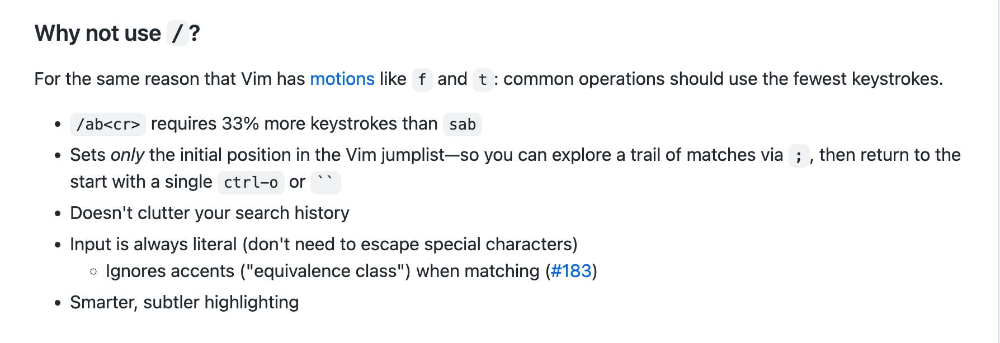
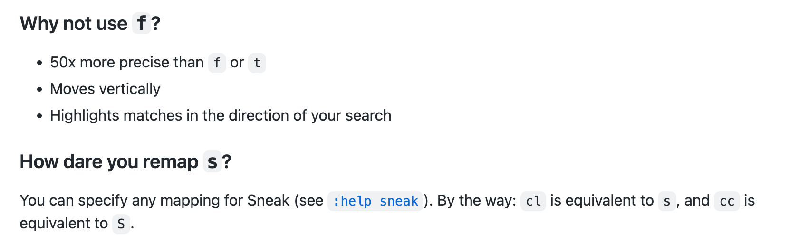

## 任务点

### vim-easymotion

需要开启 `easymotion` 及修改 `<leader>` 默认按键

```json
"vim.easymotion": true,
"vim.leader": "<Space>",
```

- `<leader> <leader> s <char>`: 搜索字符
- `<leader> <leader> f <char>`: 向后查找字符
- `<leader> <leader> F <char>`: 向前查找字符
- `<leader> <leader> t <char>`: 向后平铺字符
- `<leader> <leader> T <char>`: 向前平铺字符
- `<leader> <leader> e`: 移动到单词结尾 (选择范围从左到右，从上到下)
- `<leader> <leader> w`: 移动到单词开头 (选择范围从左到右，从上到下)
- `<leader> <leader> b`: 移动到单词开头 (选择范围从右到左，从下到上)
- `<leader> <leader> ge`: 移动到单词结尾 (选择范围从右到左，从下到上)
- `<leader> <leader> j`: 移动到行开头 (选择范围在光标下方)
- `<leader> <leader> k`: 移动到行开头 (选择范围在光标上方)
- `<leader> <leader> l`: 移动到单词的开头/结尾，驼峰字母，\_,#(选择范围从左到右，从上到下)
- `<leader> <leader> h`: 移动到单词的开头/结尾，驼峰字母，\_,#(选择范围从右到左，从下到上)
- `<leader> <leader> <leader> j`: 移动到单词的开头/结尾，驼峰字母，\_,#(选择范围全部)

### vim-sneak

与 `f` 功能有点类似，`f` 是行内搜索，`sneak` 是全局搜索，`f` 是输入一个单词就搜索，`sneak` 是输入两个

也是需要开启 `sneak`

```json
"vim.sneak": true,
```

- s: 正向移动到下一个 char 所在之处
- S: 反向移动到上一个 char 所在之处

搜索上一个下一个都是 `,;`

使用 `sneak` 与 `/?` 的区别是不用按回车了，输入两个字母后自动搜索

由于我们以前学的 `s/S` 是删除当前字符/行并进入 `insert` 模式，使用 `sneak` 后这个功能就没有了

而 `sneak` 与 `f` 功能差不多，比 `f` 还强大，故我们可以通过改键将 `sneak` 的功能绑定到 `f` 上来代替原来的 `f`

```json
// normal 非递归模式配置
"vim.normalModeKeyBindingsNonRecursive": [
  {
    "before": ["f"],
    "after": ["s"]
  },
  {
    "before": ["F"],
    "after": ["S"]
  },
  {
    "before": ["s"],
    "after": ["c", "l"]
  },
  {
    "before": ["S"],
    "after": ["^", "C"]
  }
],
// 为了与 normal 模式统一
// visual 模式也配置一下，由于不涉及递归，就不在非递归模式设置了
// S 在 visual 模式不生效，就不改键了
"vim.visualModeKeyBindings": [
  {
    "before": ["f"],
    "after": ["s"]
  }
],
// 为了与 normal 模式统一
// pending 模式下是 z/Z
"vim.operatorPendingModeKeyBindings": [
  {
    "before": ["f"],
    "after": ["z"]
  },
  {
    "before": ["F"],
    "after": ["Z"]
  }
]
```

## 社群讨论

https://m.bilibili.com/video/BV13t4y1H7Qx?p=1&share_medium=iphone&share_plat=ios&share_session_id=6D20114B-5B8B-4D83-B32A-4BD2EBFD6CC4&share_source=WEIXIN&share_tag=s_i&timestamp=1654913630&unique_k=v73ZCBj

这个有意思～

vimac 我体验了一下 然后卸载了

<hr />

vim-sneak 在 operator-pending mode 下使用 z 是因为 s 被 vim-surround 使用了的原因吗

是滴，不过都改成 f 就好了

看视频前面的时候我还在想，vim-sneak 不是和 vim-surround 冲突了么，原来它在 visual mode 又不一样

<hr />

大崔哥 刚看视频 发现你注释/取消注释用的命令是 gci[，这套命令组合规则没太懂 ci[ 不是删除中括号中的内容么 加个 g 为啥变成了注释和取消注释 没太懂

操作符是 gc

那就是 gc 是注释和取消注释的意思咯

对

<hr />

用 `f` 替代 `s` 触发 vim sneak 会导致一个字符触发的行内搜索（如 `f{` ）无法使用而降低 vim 使用效率

你这个减少效率的点有意思，确实是怎么配置都会有利有弊

f{ 如果这个 { 在行尾的话 就没法跳过去了，不过一般我找 { 的时候是选中一个函数的时候，而且通常 { 在行尾 直接用 V$

我实际开发中一般 f' f" f( f, 之类的用得比较多，如果 f 用 vim-sneak 覆盖掉了，这些操作都会变得更复杂

利弊都有，选自己喜欢的方案

vim-sneak 感觉有点鸡肋。它只有在同一行中定位之后第 >= 3 个相同字符时，收益相比 f 才是正的。多行搜索时虽然比 / 少输入一个`<CR>`，但同时也丧失了搜索随意多个字符的灵活性。

用 leader + s，用 sneak 本身的功能，f 不替换 也是一种方案

那样就得第 >= 4 个字符才有正收益了

f( enter，我是这样的

这个挺好的，虽然多了一个 enter，但却是最少按键实现功能的

https://github.com/justinmk/vim-sneak#faq





<hr />

发现把 s 替换了 f，我搜单个字符修改，感觉有一点麻烦

对，单字符确实不方便，或者不改键，s 用 cl S 用 cc 代替，这个方案的话 就不用替换 f 了

<hr />

easymotion 感觉也不用记住那么多，j k ge e w b 就行了

其实根本都不用记吧，就当成普通的 motion，只不过多敲两个键触发插件而已，motion 的逻辑和原生的区别不大，知道方向是哪里就行了

<hr />

空格 + 空格 + w，大家有没觉得延迟很重

没有诶，感觉挺自然的，空格以前一直没用上，现在终于能让它用起来了

我空格有时候按的时候，没触发第二个 leader

<hr />

cmd + a 全选进入 visual 模式了

<hr />

怎么一键删除相同字符串

我目前会的操作是 V 选中能够包括要删除的那些字符串的行，然后按下：再按下 s/再输入要删除的字符串再按下/然后直接回车，不知道是否有更加便捷的操作呢？

用 gb

gb 只是高亮 gbc 并没有同时修改

gb gb d，gb 是 第十三节课的内容

如果是变量或函数名，并且 vscod 能找到引用关系，可以选中一个，f2 重构 - 重命名

gb 与 f2 他两功能本质上不一样

gb 最终不还是为了批量修改么，还有其他场景吗

不是变量的话 你试试 f2 有没有用，gb 就可以

<hr />

normal 模式怎么快速交换两行代码上下位置

option + control + jk，这是改键了，如果没有改键，就是 option + 上下方向键

我的 option 给 Manico 用了

也可以用，只是会显示一下 manico
