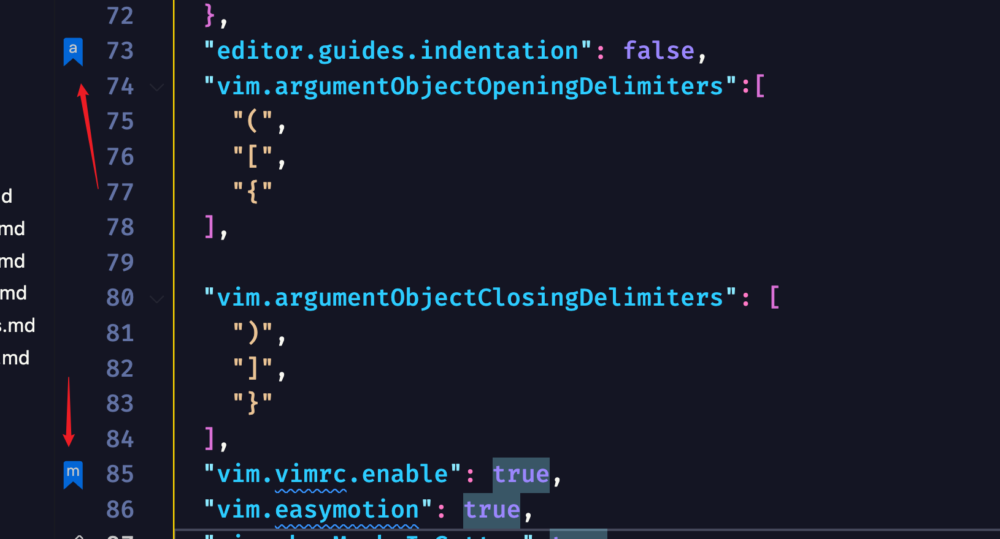
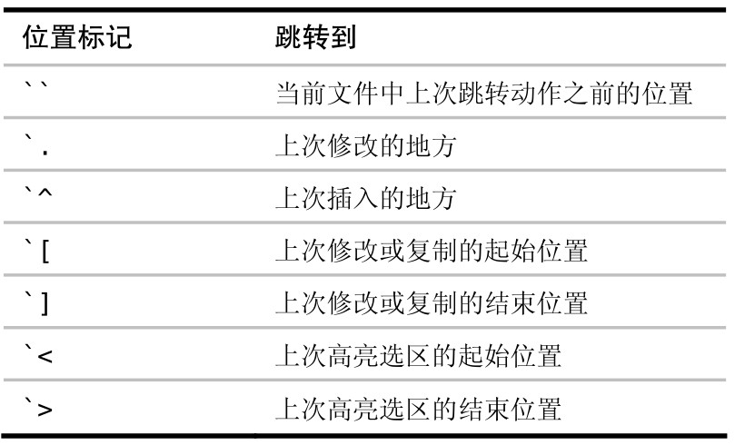
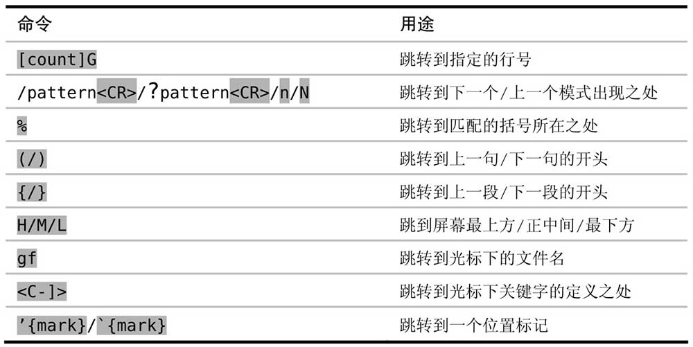
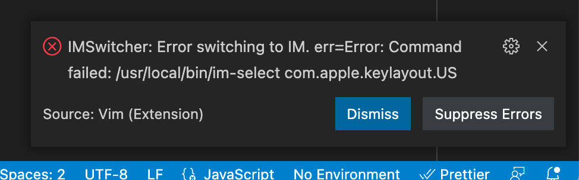
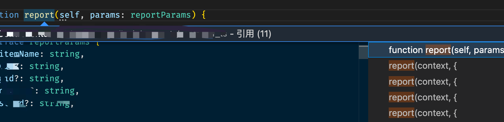
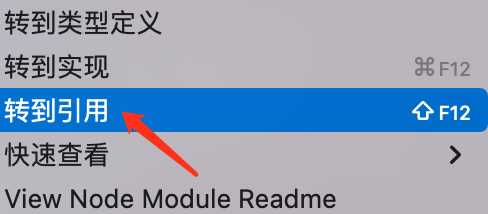
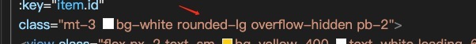

## 任务点

### 定位

标记

- m + 小写字母：单文件标记，推荐使用 mm
- m + 大写字母：多文件标记，推荐使用 mM

可以将在侧边显示标记点的功能打开，这样就很直观看到所有的标记位置了

```json
"vim.showMarksInGutter": true,
```



跳转：

- ' + 标记的字母：跳转到标记的行首
- ` + 标记的字母：跳转到标记的行列，光标就在标记时的位置

可以将 ' 与 ` 互换一下：

```json
// normal 不递归模式改键
"vim.normalModeKeyBindingsNonRecursive": [
  // 互换跳转到书签的命令
  {
    "before": ["'"],
    "after": ["`"]
  },
  {
    "before": ["`"],
    "after": ["'"]
  }
],
```

自动位置标记

我们可以为每个缓冲区设置最多 26 个小写位置标记。字母表中的每个字母都对应着一个位置标记，这可能远比你实际需要的数目要多。之所以会这样，是因为在 Vim 的前身 vi 里，并没有诸如现在的可视模式这样的功能。在那个时候，位置标记是一个比现在重要得多的功能。但现在，很多在 vi 里需要用位置标记完成的工作，都可以在 Vim 里用可视模式来做，因此对位置标记的需求也就相应减少了。

但是位置标记在 Vim 里并没有过时，它们仍然有用处。特别是，Vim 会自动帮我们设置一些位置标记，这些标记用起来非常方便。下表列出了这些自动位置标记：



### jump to definition

- gd

当光标处于函数调用的位置，`gd` 会跳转到函数定义的地方

当光标处于函数定义的位置，如果只有一处调用，`gd` 会跳转到调用的地方；如果有多处调用，会弹出弹窗，使用 `jk` 上下选择调用的地方，回车或 `l` 跳转到该调用的地方；使用 `esc` 可以关闭弹窗

如果有多个文件都调用了该函数，`l` 可以展开该文件，查看所有调用，`h` 回到该文件，此时 `l/h` 就可以折叠该文件

不止是函数，变量也是可以，任何有引用关系的都可以

`<C-]>` 作用与 `gd` 相同

### 跳转

任何大于一个单词或超过当前行导航的移动都是一个跳转

比如：

- '
- `
- gg
- /
- ?
- n
- N
- gd
- {: 跳转到上一个段落
- }: 跳转到下一个段落



不会记录的命令：

- C - b
- C - f
- C - d
- C - e
- J
- K
- vim-sneak: 查找并使用 ,; 跳转多次后，C - o 只会回到初始位置

跳转命令：

- C - o: 后退
- C - t: 后退
- C - i: 前进

最常使用的场景：查看代码，`gd` 到定义处查看详情，`C - o` 跳转回来；或者打开一个新文件，`C - o` 跳转回来，`C - i` 再跳转过去

vim 保留了移动前位置的记录，使用 `:jumps` 查看历史跳转，但不常用

### 切换页签

- gt: 切换到下一个页签
- gT: 切换到上一个页签

## 社群讨论

https://github.com/VSCodeVim/Vim#input-method 这个可以设置切换到 normal 模式的输入法，我测试了一下，insert 模式是自带中文，ctrl + [ 后就切换到自带英文（可以配置输入法）了，再切到 insert 模式，还是中文

所以我说了不好用嘛，真没有 习惯自己用 shift 控制来的舒服

啊，我感觉还可以吧

你多试几次 很多时间你都不知道在 insert 模式到底是啥了 不过你感觉舒服就可以用

我先尝试几天看看，它这个主要是通过 im-select 来控制输入法，我们也可以给 ctrl + [ 添加一些脚本：模拟按 esc，然后再切换成英文输入法，这样再回到 insert 模式就还是英文输入法

<hr />

https://github.com/VSCodeVim/Vim#input-method 试了好像没有用。



你应该没有这个输入法，所以报错了，你可以切换到英文输入法，在命令行执行 im-select，看看输出的是啥。

把最后的 US 替换成 ABC 就可以了

<hr />

崔大，我这儿用 gd 打不开这个界面。



但用引用可以打开，是需要关闭什么配置么？



gd 显示啥

在函数定义处点击 gd 没有任何反应，在函数使用处 gd 会跳到函数定义的地方

只能用重启大法 正常情况下 在函数定义的地方会显示它在哪里调用的，如果这个函数被多处调用的话

我早上重启过电脑，我再试试

<hr />

为什么我的 gd 不能在多文件查找，只会查找当前文件

看看版本搞到最新

好的，我试试

<hr />

大崔哥，我想删除这种带横杆的，有没有快捷的按键



可以全局替换，:%s/pattern/string，中间你可以写正则，这个应该是 vim13 的内容

d3e

这个要移到单词开头

dfov

我的 dfov 怎么不行

f 是查找，你得后面有 ov

ov 是什么

overflow 的前两个字母

<hr />

跨文件跳转不了是为什么呀，mark no set

是不是没有标记上，或者记错标记字母了，跨文件的标记名称要大写字母

<hr />

问个问题：没有开启 vim 之前 我在 vscode 里搜索关键词后可以按 option+Enter 全部选中然后就可以开始批量编辑，现在按 option+Enter 也全选中了，但是只能使用 d r 等操作，无法进入编辑模式，有人遇到了相同的情况吗

用 vim 来操作吧
