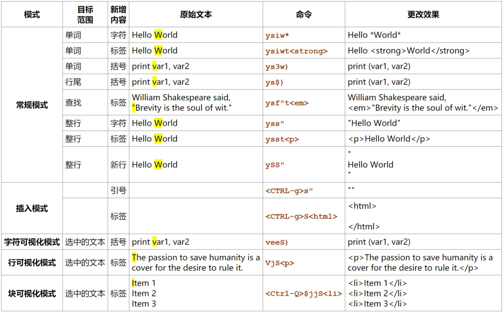
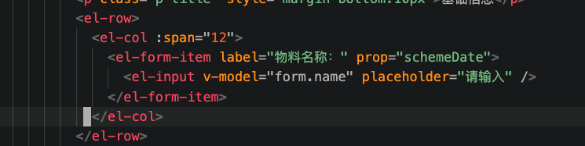
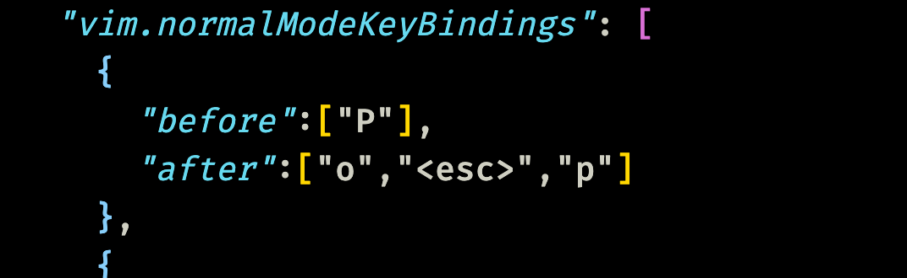
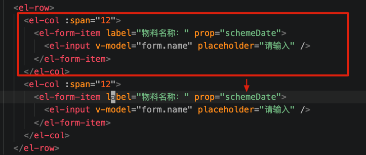

## 任务点

### vim-surround

- `c s <existing> <desired>`: 使用 `<desired>` 替换 `<existing>` 包围字符
- `y s <motion> <desired>`: 使用 `<desired>` 包围 `motion` 选中的字符
- `y s s <desired>`: 使用 `<desired>` 包围整行
- `d s <desired>`: 删除 `<desired>` 包围字符
- `S <desired>`: 使用 `<desired>` 包围在可视化模式选中的字符

`cs` 只支持英文符号，不能将英文括号改为中文括号

`y s <motion>` 的 `<motion>` 只支持简单的移动，比如 `w`, `b`, `iw`, `3w`, `L`..., 而不支持连续移动，比如 `lll`, 此时就可以先在可视化模式选中，再用 `S <desired>` 包围

### 扩展

`ys` 模式下 `<existing> <desired>` 取值：

- (: 使用 `( )` 包围字符，左括号是带空格的
- )/b: 使用 `()` 包围字符，右括号不带空格
- [: 使用 `[ ]` 包围字符
- ]/r: 使用 `[]` 包围字符
- {: 使用 `{ }` 包围字符
- }/B: 使用 `{}` 包围字符
- '/"/\`: 使用 ' " \` 包围字符
- `</t`: 使用 html 标签包围字符
- `>/a`: 使用 `<>` 包围字符
- `*`: 使用 `*` 包围字符

再贴一张示例图片：

不过 vscode 好像不支持 `ySS`

## 社群讨论

今天的 surround 有一个小众的 desired【t】可以使用处理标签环绕，例如 ysiwt 然后键入 tagName 可以使用标签包裹单词

< 也可以，不过还是用 t 吧，一个按键就实现了

昨天的课，代码多处标记来回跳转，推荐插件 Bookmarks，bookmarks 还可以自定义标记处的命名 用来梳理大模块还是比 vim 本身优秀很多的

问个问题，我想按 p 粘贴，如何直接在光标的下一行粘贴，我现在的做法是 按 o 然后切换到 normal 然后 p

你如果是复制的一行，p 直接就是下一行粘贴

一行好说，一个段落不行

复制一个段落也是粘贴在下一行啊

还真没有啥好办法 不过这种场景都可以通过配置映射来解决，下图这是基于你的需求临时配的

那你平时怎么处理，就是 `o <esc> p` 按三次吗

复制一个单词到 新一行 这场景不多呀，一般都是复制一行代码

我是要复制红框内的到下面，v a t 选中红框内的，然后 o esc p 粘贴到下面

vat 确实不行 因为他不包含/r/n

cmd + enter 就可以到下一行，也不需要映射，还在 normal 模式

崔大，cs 不能把英文括号改成中文括号吗

还真不能

请问 caps lock 这两个单词怎么用引号包裹呢？ysww 就退出包裹模式了

用可视化模式，可视化模式 + S + "

ys2w 也可以
