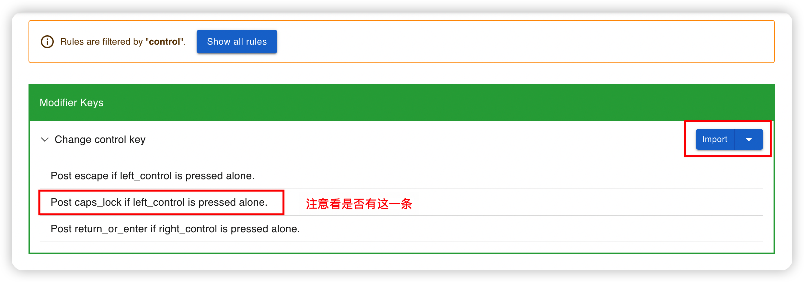

## Mac

### vscode 环境准备：

安装 `vscode` [vim](https://marketplace.visualstudio.com/items?itemName=vscodevim.vim) 扩展

`mac` 系统设置-键盘，将 `按键重复` 调到最快，将 `重复前延迟` 调到最短


在命令行执行如下代码（开启长按键盘重复输入）：

```bash
$ defaults write com.microsoft.VSCode ApplePressAndHoldEnabled -bool false              # For VS Code
$ defaults write com.microsoft.VSCodeInsiders ApplePressAndHoldEnabled -bool false      # For VS Code Insider
$ defaults write com.visualstudio.code.oss ApplePressAndHoldEnabled -bool false         # For VS Codium
$ defaults write com.microsoft.VSCodeExploration ApplePressAndHoldEnabled -bool false   # For VS Codium Exploration users
$ defaults delete -g ApplePressAndHoldEnabled                                           # If necessary, reset global default
```


最后一个命令如果出现上图报错，不用管，重启 `vscode` 就好了

### 键位映射准备

推荐使用 [karabiner-elements](https://karabiner-elements.pqrs.org/) 进行键位映射，[Karabiner-Elements | Henry](/pages/2c17f0/) 是对软件的简单介绍

要注意给权限，否则不生效

映射规则如下：

非 `HHKB` 键盘 `ctrl` 与 `caps lock` 互换；在日常中，`caps lock` 键的作用其实不大，而 `ctrl` 键的使用频率更高，但他们的位置却相反，所以换过来会更适合我们日常使用


互换以后，我们切换中英文就有点不方便了，可以再添加一个规则：`Post caps_lock if left_control is pressed alone.`

打开这个[网址](https://ke-complex-modifications.pqrs.org/#control)，点击后面的 `Import` 来引入该规则



在弹框中选择 `打开 Karabiner-Elements.app`

点击下图中的 `Import` 来引入


引入以后点击左下角的 `Add rule`


找到 `Post caps_lock if left_control is pressed alone.`，点击后面的 `Enable` 启用该规则


这样当我们单独按下左 `control` 后，就是切换中英文，配合别的按键，就是 `control` 键

然后我们还需要加一个规则：[SpaceFN](https://ke-complex-modifications.pqrs.org/#spacefn)，引入步骤同上

意思就是把 `space` 映射为 `fn` 键，当我们使用小配列键盘时，总是需要使用 `fn` 加别的按键实现一些功能，但 `fn` 的位置却不好，导致我们使用的时候总是很别扭，而 `space` 我们很容易触碰，但功能却只是加空格或确认输入，有点浪费这大好位置了


如上图所示，`SpaceFN: Space+[hjkl] to Left, Down, Up, Right`，以后无论在任何地方，只要使用 `space+hjkl` 即可实现方向键；`SpaceFN: Space+[1234567890-=] to F[1-12]`，使用 `space+123...` 即可实现 `F123...` 功能键；简直好用的不得了

这里顺便说一下，崔大视频里推荐的是 `control + hjkl`，但由于 `Windows` 的 `ctrl` 承担了太多的快捷键了，为了双端按键统一，我都改成 `space` 了，这个看大家的喜好

如果你使用的是 `SpaceFN`，那么看视频里如果提到 `control + hjkl`，自动替换到 `space +hjkl` 即可

## Windows

### vscode 环境准备：

安装 `vscode` [vim](https://marketplace.visualstudio.com/items?itemName=vscodevim.vim) 扩展

由于 `Windows` 默认就支持长按重复输入，故不需要处理

### 键位映射准备

推荐使用 [autohotkey](https://www.autohotkey.com/) 进行键位映射

由于本人是 `mac/Windows` 双系统开发，`mac` 使用的键盘是 `HHKB`，故 `Windows` 会改键，达到无论在哪个系统，按键习惯都一致的效果

首先是系统按键改键

`Mac` 左下角的系统按键依次是：`control/options/command`，而 `Windows` 的是 `ctrl/win/alt`

一般的对应关系是 `options -> alt`, `command -> ctrl`，所以改键配置为：

```
LCtrl::LWin ; 左 ctrl 改为 左 win
LWin::LAlt ; 左 win 改为 左 alt
LAlt::LCtrl ; 左 alt 改为 左 ctrl
```

而我们上面将 `Mac` 的 `caps lock` 与 `control` 互换了，所以 `Windows` 也需要改变一下

这里我们就不互换按键了，直接修改 `caps lock to Ctrl`，达到按键习惯与 `mac` 一致

```
; CapsLock 短按切换输入法，先按其他功能键再按 CapsLock 为切换大小写；CapsLock 与其他某个键同按时，CapsLock 映射为 ctrl，如 CapsLock + w => ctrl + w
; https://zhuanlan.zhihu.com/p/389784449
#InstallKeybdHook
; 禁用大写功能，防止误触
SetCapsLockState, alwaysoff
Capslock::
  Send {LControl Down}
  KeyWait, CapsLock
  Send {LControl Up}
  if ( A_PriorKey = "CapsLock" )
  {
    Send {ctrl down}{shift down}
    Send {shift up}{ctrl up}
  }
  ; CapsLock + [ 进入 normal 模式，并切换到英文输入法，系统配置的切换到英文快捷键是 ctrl + 0，具体配置参见下一篇
  if ( A_PriorKey = "[")
  {
    ; Send {Esc}
    Send ^0
    return
  }
return
```

接下来是 `SpaceFN`:

```
; space-fn

space::Send {space}

^space::Send ^{space}
#space::Send #{space}
^#space::Send ^#{space}
!space::Send !{space}
^!space::Send ^!{space}

;  *** space + Num to Function
space & 1::Send {F1}
space & 2::Send {F2}
space & 3::Send {F3}
space & 4::Send {F4}
space & 5::Send {F5}
space & 6::Send {F6}
space & 7::Send {F7}
space & 8::Send {F8}
space & 9::Send {F9}
space & 0::Send {F10}
space & -::Send {F11}
space & =::Send {F12}

; *** space + hjkl uiop to move cursor
space & k:: Send {up}
space & h:: Send {left}
space & j:: Send {down}
space & l:: Send {right}
space & i:: Send {home}
space & o:: Send {end}
space & u:: Send {Pgup}
space & p:: Send {Pgdn}

; *** space other
space & \:: Send {Del}
space & '::`

;  *** space + X + Y
#if GetKeyState("space", "P")
s & k:: Send !{up}
s & h:: Send !{left}
s & j:: Send !{down}
s & l:: Send !{right}
d & k:: Send +{up}
d & h:: Send +{left}
d & j:: Send +{down}
d & l:: Send +{right}
f & k:: Send ^{up}
f & h:: Send ^{left}
f & j:: Send ^{down}
f & l:: Send ^{right}
g & k:: Send ^+{up}
g & h:: Send ^+{left}
g & j:: Send ^+{down}
g & l:: Send ^+{right}
return
```
