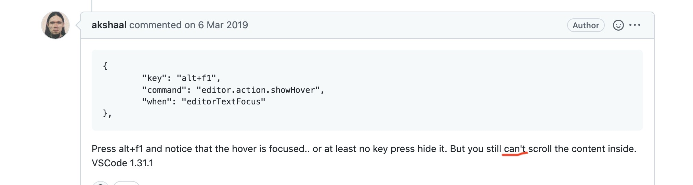

## 任务点

### 悬浮显示：gh

h: hover

类似 vscode 中鼠标悬停（hover）的效果，显示变量、函数信息或者报错提示。

### 切换大小写

normal 模式

- g~ + 动作（范围）: 切换大小写
- gu + 动作（范围）: 变为小写字母
- gU + 动作（范围）: 变为大写字母

g ～、gu 和 gU 命令要用两次按键来调用，我们可以把上述命令中的 g 当做一个前缀字符，用以改变其后面的按键行为

示例：将一个单词转变为大写：gUiw。

Vim 的语法只有一条额外规则，即当一个操作符命令被连续调用两次时，它会作用于当前行。所以 dd 删除当前行，而 >> 缩进当前行。gU 命令是一种特殊情况，我们既可以用 gUgU，也可以用简化版的 gUU 来使它作用于当前行，g~ 和 gu 也同理

visual 模式

- u: 变为小写字母
- U: 变为大写字母

示例：将一个单词转变为大写：veU

~:

- ~: 可以实现大小写互换

可以把 leader+u 映射成 ～，改大小写非常巴适

### 注释

- gc: 单行注释
- gC: 多行注释

例子：gcc/gcl 注释当前行，gcj/k 注释当前行和上/下行；gCiw 注释当前单词

### 格式化

- =: 格式化
- ==: 格式化当前行
- =i}: 格式化当前块
- =a}: 格式化当前 {} 块
- =iB: 格式化当前 {} 块
- =aB: 格式化当前 {} 块
- =ip: 格式化当前段落
- =ap: 格式化当前段落
- =i): 格式化当前 () 块
- =a): 格式化当前 () 块
- =i]: 格式化当前 [] 块
- =a]: 格式化当前 [] 块
- =i>: 格式化当前 <> 块
- =a>: 格式化当前 <> 块

## 社群讨论

n + 1 个单行注释：gc + n + j

快速依次单行注释：gc + l，再下一行 + .

visual 模式下，先多选，再 gc

关于单行注释，还有什么技巧么

应该无了

<hr />

我觉得，得有个平台（类似 github issue）收集大家在今天的学习中，额外拓展的技巧（尽量是基于之前的内容而组合）

可以的，写起来先。后面慢慢探索技巧，把这门课的知识，用论坛的形式一点点沉淀下里

可以提到我的仓库，提了拓展我会去自己去感受一下然后写到我的笔记里面，如果大家觉得 ok 的话，[仓库地址](https://github.com/Nauxscript/Just-Vim-It)，[笔记地址](https://vim.nauxscript.com)

好的

<hr />

想请教一下 gh 看变量详情的时候 如果信息太多，怎么滚动

好问题 应该有滚动的快捷键 不过我没找 可以去 vscode 里面找找

关键字都不知道怎么搜 现在搜到的都是讲文件的

https://github.com/microsoft/vscode/issues/69836 貌似作者没有给出（2019 年）



再看看呗

<hr />

问一下，如何反注释「多行」

```js
/* abc = 111
abc = 111
abc = 111
abc = 111
abc = 111
abc = 111 */
```

用可视化模式先选中多行，再 gC
