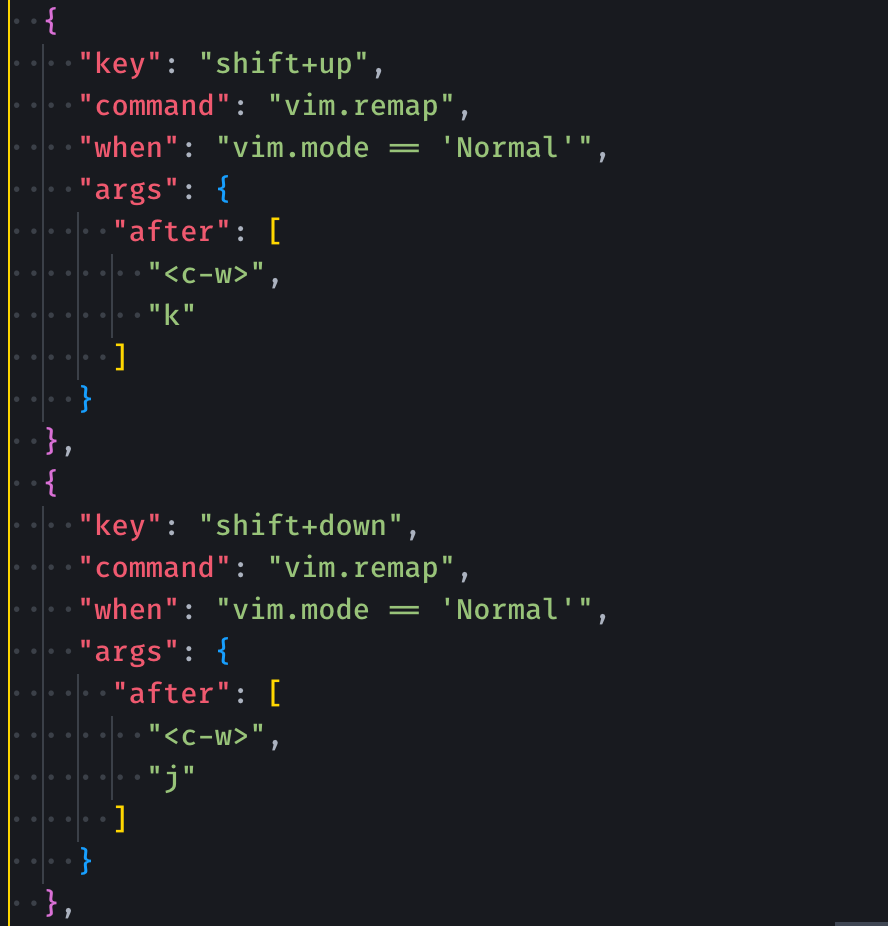
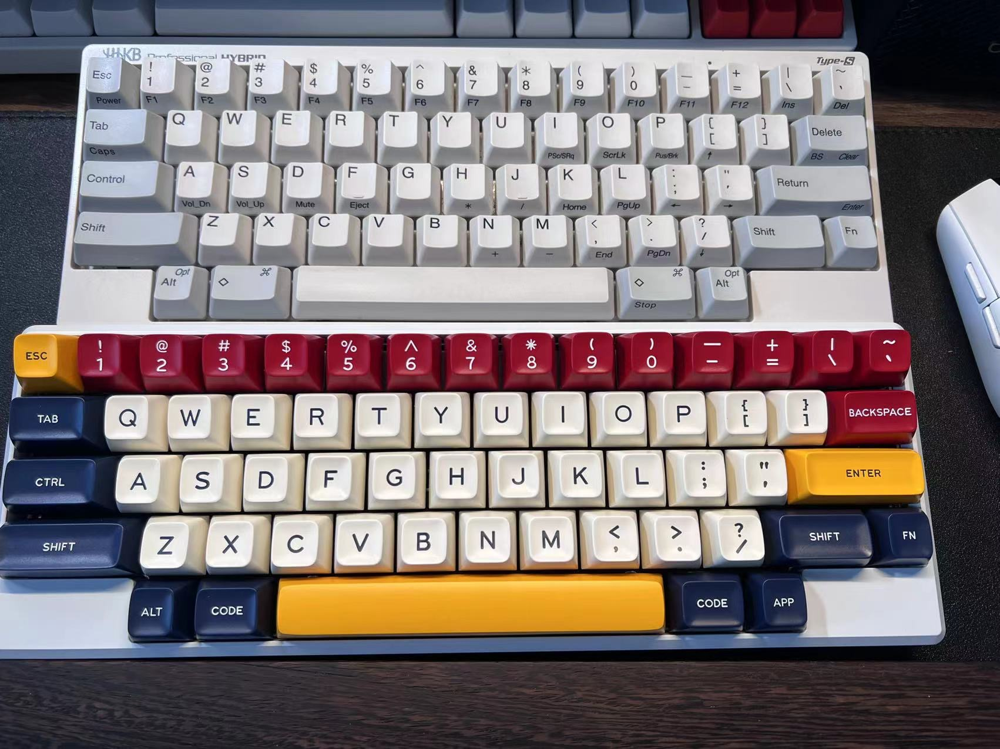

## 任务点

### vim

- C-w v: 新建左右窗口（向右拆分窗口）
- C-w s: 新建上下窗口（向下拆分窗口）
- C-w hjkl: 切换窗口（适用于多窗口，也可以切换到左侧边栏，但不能再切换回来）
- C-w w: 循环切换窗口（适用于两个窗口来回切换）
- C-w c: 关闭窗口，只关闭当前文件的窗口
- C-w o: 只保留当前窗口，关闭其他所有窗口，包括左侧边栏
- Shift-方向键：切换窗口（需改键）

### vscode

- cmd-\: 新建左右窗口
- ctrl-cmd-\: 新建上下窗口（需绑定快捷键，搜索 split editor up，然后绑定）
- cmd-1,2,3...: 切换第几个窗口
- cmd-w: 关闭窗口
- cmd-k w: 关闭一组窗口
- option-cmd-t: 只保留当前窗口，关闭其他所有窗口，不包括左侧边栏

## 社群讨论

问下大家，怎么一键从当前位置删到最后？

删除到文件最后？dG；行的话用大写的 C

shift + hjkl 切换窗口，为什么我设置了没有用啊，这样配置有问题吗？

你得改键，配置方向键，按 ctrl - shift - hjkl

这把是客制化键盘，和 hhkb 的布局一样，还真挺舒服的。。甚至我感觉比 hhkb 还舒服

还是头一次见这种内陷的键帽

崔哥 这买的多少钱？

800 多点，这个性价比太高了

800 多 蓝牙双模 三设备切换要什么自行车，1k 多的 hhkb 肯定没这个好

我刚刚和卖家聊了聊，团购的话 可以在上 95 折，我把卖家拉进群好了 他也是一个程序员

这款产品简单说是一个 hhkb 配列的铝合金机械键盘套件，搭配好如键轴之类的组件就可以组装成一个 hhkb 配列的机械键盘啦；有兴趣深入研究 diy 键盘的小伙伴儿还可以自己组装轴体，打造自己专属的 hhkb 键盘

是买了这个轴体再买键帽就行了？

组装全套的话需要套件、卫星轴、键轴、电池（可选）、键帽

不能全弄好，我只负责装键帽么

可以的，对于崔学社的学员有代组服务和高性价比方案，839 除了键帽其他组好，到手就用

键帽跟 hhkb 的也是一样嘛我正好多了一套

不一样的，需要购买机械键盘的键帽

在闲鱼？淘宝没店铺吗？

对，暂时在闲鱼，准备整一个淘宝店铺，在筹划了

备注崔学社学院是有 95 折优惠哦

有没有 ctrl + w + s/c 这两个不好使的兄弟，其他都没问题 奇怪..

是 win 吗？

不是，Mac

那你看看是不是和哪个 app 冲突了

嗯嗯 我找找

扩展窗口切换 不能是 shift + hjkl 吗，按了很久没反应，结果是 shift + 方向

shift + 方向键不就是 shift+control + hjkl 吗

还得在映射一下方向键，话说平常切换窗口的情景很多么，我最多也就是双窗口

看你们自己 不是一定非要配置，主要课上给大家提供这样的思路，你们自己举一反三 配置自己的

看个人吧 我左右用的多

如果只是切换编辑窗口，cmd + 1,2,3... 可以切换到对应的第几个编辑窗口，shift + 方向键我主要是用来切换左侧边栏和编辑窗口

左侧边栏可以试试 cmd + 0/9

可以啊，这个挺好用

cmd 09 有点远吧

还好，关键可以一次切到

其实还有一个是 ctrl + ; 和 Ctrl '
