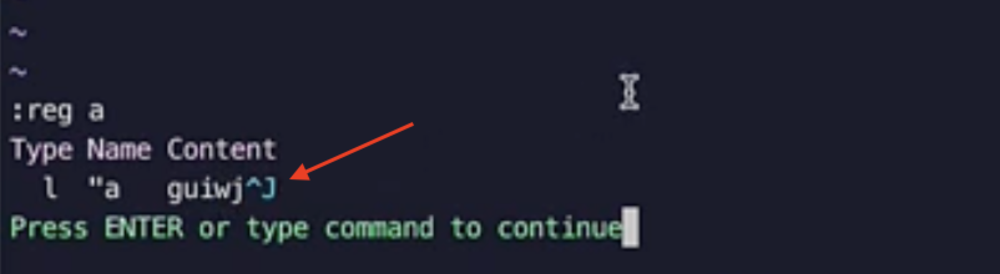

## 任务点

宏：可以录制一系列动作

- 开始录制：q + 寄存器名称 (比如 a)
- 结束录制：q
- 查看录制好的宏：`:reg` + 寄存器名称
- 使用宏： @ + 寄存器名称
- 调用最后一次执行的宏 (必须有才能执行)： @@
- 重复执行：次数 + @ + 寄存器名称
- 追加：q + 大写的已存在的寄存器名称 (比如 A)
- 修改宏：修改寄存器的内容，取出来——`" + 寄存器名称 + p` 或 `:put + 寄存器名称` 将寄存中的动作复制到编辑器中；修改后的动作使用 `" + 寄存器名称 + yy 或者 yw` 复制进寄存器完成修改，在 `vscode` 中不生效
- 安全机制：当宏执行报错后就会停止，降低了心智负担；比如我可能要执行大约 10 次相同的宏，但我不能挨个去数吧，我可以把数字设置的大一点，比如设置为 30，而宏执行到 13 次后发现报错了（因为需要的修改都完成了，没有再需要修改的了），就停止了，省去了我们需要精确次数的烦恼

注意光标位置，建议使用相对位置进行定位

hjkl 属于绝对位置，一次就只能移动固定的范围，比如 `5l` 就是往右移动 5 个字符的距离；w、e、textobject 这种属于相对位置，可以根据后面的字符类型动态调整移动范围，比如 `5w` 就是往右移动 5 个单词的距离，而最后到底移动多少距离是根据这 5 个单词有几个字符决定的

## 社群讨论

改完寄存器后多了一个 ^J

用 "ayy 的话 会有这个情况，可以用 "ayiw

"ayiw 仅适用寄存器里都是字母的情况，不能有特殊符号，那个 ^J 应该是个换行符，所以得用类似 ^vg\_"ay 的方法排除最后的换行符，改个寄存器真心累

我也这么觉得，我用的很少

为什么 "ayw 没有用

在 vscode 中改无效，命令行可以

当我想全项目删除一些相同代码时，我先全局搜索，在第一个文件那里录制并删除后，F4 跳转到下一个文件，发现并不能跨文件录制，但可以跨文件使用已录制好的宏，所以最后就是我手动按 F4，跳转到下一个搜索，然后执行宏，再 F4，再宏… 而且在一个新文件并不能先使用 @@，只能先使用 @a，然后才可以使用 @@
