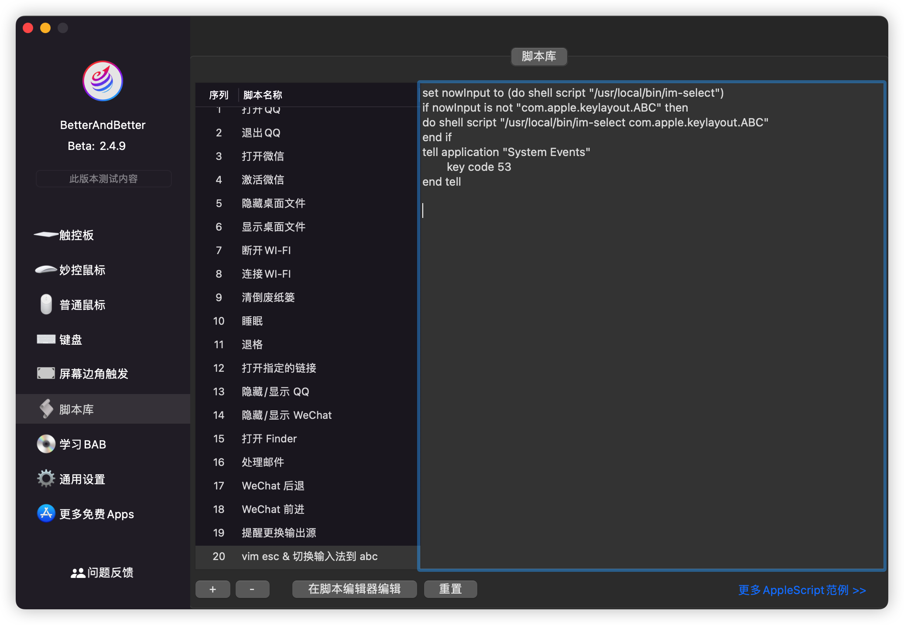

## im-select 实现

使用 `vim` 过程会频繁切换状态，在 `insert` 模式下，主力使用的中文输入法，比如搜狗输入法、微软拼音输入法等，而在 `normal` 模式下敲命令都是需要英文状态的，为了切换到 `normal` 模式时输入法能自动切换为英文状态，[vscodevim](https://github.com/VSCodeVim/Vim#input-method) 插件推荐使用 [im-select](https://github.com/daipeihust/im-select)。

这里是 `windows` 的操作步骤：[如何解决 VSCode Vim 中文输入法切换问题-im-select](https://www.zhihu.com/question/303850876/answer/2263584870)

`mac` 也是类似操作，必须有两个输入源，一个中文输入，比如系统自带的或搜狗之类的三方输入法，一个是英文输入，一般选系统自带的就可以了

首先先安装 [im-select](https://github.com/daipeihust/im-select#macos)

将以下部分插入到 `vscode` 的 `settings.json` 里面

```json
// 开启自动切换输入法
"vim.autoSwitchInputMethod.enable": true,
// 设置默认输入法，值获取方法：切换到系统的英文输入法，在命令行输入 im-select 就可以获取当前输入法的值了
"vim.autoSwitchInputMethod.defaultIM": "com.apple.keylayout.ABC",
// im-select 安装路径，在命令行输入 which im-select 获取
"vim.autoSwitchInputMethod.obtainIMCmd": "/usr/local/bin/im-select",
"vim.autoSwitchInputMethod.switchIMCmd": "/usr/local/bin/im-select {im}"
```

测试了一下，`insert` 模式是自带中文，`ctrl + [` 后就切换到自带英文了，再切到 `insert` 模式，还是中文

这样其实已经实现了 `normal` 模式下中文输入法切换的问题，但切回 `insert` 模式后，还保留原输入模式，很多时间我们都不知道在 `insert` 模式到底是啥了

我们的终极需求是 `normal` 模式是英文，切回 `insert` 模式还是英文，这样我们就不需要考虑输入源的问题了，否则我切到 `insert` 模式 还得看一下到底是中文还是英文

当然如果你能接受现在这种效果，按照上面的配置一下就可以了

## win autohotkey 实现

先来说一下 `windows` 如何借助 `autohotkey` 实现

还是需要两个输入源

先参考一下这个文章，不需要跟着操作，就熟悉一下流程即可：[如何解决 VSCode Vim 中文输入法切换问题-autohotkey](https://www.zhihu.com/question/303850876/answer/1181682863)

这篇文章是直接把切换输入法的值写死了

> PostMessage, 0x50, 0, 0x4090409, , A ;切换为英文 0x4090409=67699721

万一以后变了呢？或者我想切换别的英文输入法呢？

最好的办法是给切换英文输入绑定一个快捷键，切换 `normal` 模式后模拟按键，这样就比较灵活一点


可以看到我配置的切换到英文是 `ctrl + 0`，切换输入法是 `ctrl + shift`

接下来我们就需要在 `autohotkey` 中改键了：按下 `CapsLock + [`, 模拟按键 `Esc`, 模拟按键 `ctrl + 0`

```ahk
; CapsLock + [ 进入 normal 模式，并切换到英文输入法
CapsLock & [::
Send {Esc}
Send ^0
return
```

这样当我们按下 `CapsLock + [` 后，就会先触发 `Esc` 按键，切换到 `normal` 模式，再触发 `ctrl + 0`，切换到英文输入法。

而当我们再切回 `insert` 模式时，仍然是英文输入法

这只是一个简单了例子，在[上一篇](/pages/004a3a/)中实现了 CapsLock 短按切换输入法，先按其他功能键再按 CapsLock 为切换大小写；CapsLock 与其他某个键同按时，CapsLock 映射为 ctrl，如 CapsLock + w => ctrl + w

当然，CapsLock + [ 进入 normal 模式，并切换到英文输入法这个功能肯定还是有的

## mac-BetterAndBetter

先参考一下这个文章，不需要跟着操作，就熟悉一下流程即可：[在 Mac 上使用多输入法？尝试用 AppleScript+ 自动操作实现快捷切换到指定输入法。](https://zhuanlan.zhihu.com/p/404763045)

文章中提到的 `Inputsource` 目前已经不维护了，我们使用 `im-select` 代替；而且使用 `Inputsource + 输入法名称` 即可切换到该输入法，同样，使用 `im-select + 输入法名称` 也可以切换到该输入法

所以我们只需要修改一下 `AppleScript` 代码即可：

```
set nowInput to (do shell script "/usr/local/bin/im-select")
if nowInput is not "com.apple.keylayout.ABC" then
  do shell script "/usr/local/bin/im-select com.apple.keylayout.ABC"
end if
tell application "System Events"
	key code 53
end tell
```

实际测试发现在别的软件可以正常执行（如果不生效，看看是不是没有给权限），在 `vscode` 中只是切换到 `normal` 模式，并没有切换输入法，猜测是快捷键冲突，`vscode` 优先于系统，所以不生效

所以就引出了今天的主角：[BetterAndBetter](https://www.better365.cn/bab2.html)

在 `脚本库` 中增加上面的代码：



然后在 `键盘` 中给 `vscode` 绑定快捷键 `ctrl + [` 及刚才的脚本


这样我们就可以实现 `ctrl + [` 进入 `normal` 模式并切换为英文输入法了

上图我们是给 `vscode` 绑定的这个快捷键，只在 `vscode` 中生效，如果想要在全局生效，可以在 `所有应用程序` 中绑定

当然 `BetterAndBetter` 的功能远不止于此，触摸板增强，鼠标增强，快捷键增强，这里应有尽有，强烈推荐下载

更新：

使用 `im-select` 虽然可以解决我们的问题，但使用 `ctrl + [` 进入 `normal` 模式总是比较慢，也可以理解，毕竟要先判断当前输入源，中文的话还需要切换输入法，肯定会慢的，而 `Windows` 就没有这个问题

当我们正键指如飞的时候，一点卡顿就很影响编码，故我一直在寻找像 `Windows` 一样，可以给输入法绑定快捷键的软件

终于发现一个软件：[hatashiro/kawa: A macOS input source switcher with user-defined shortcuts.](https://github.com/hatashiro/kawa)，可以给输入法绑定快捷键，与 `Windows` 一样

那这就简单了，下载安装，先给英文输入法绑定一个快捷键：


这里和 `Windows` 保持统一，使用 `cmd + 0`

然后改一下我们的 `AppleScript` 吧：

```
tell application "System Events"
  key code 53
  key code 29 using {command down}
end tell
```

大功告成，使用 `ctrl + [` 进入 `normal` 模式明显快了很多

## mac-Karabiner-Elements

注：还是需要 `kawa` 这个软件

使用 `BetterAndBetter` 确实快了不少，但实际体验还是没有 `windows` 快，还是有一点延迟，按下 `ctrl + [` 后快速再按别的按键时，按键还是会插入到文档中，而不是执行命令

所以我一直在寻找一个和 `Windows` 一样快的软件

直到有一天想到了 `Karabiner-Elements` 这个软件，本来就是一个改键软件，而我却一直忽略了它

我们只需要给他添加一个规则即可：

```json
{
  "description": "Map Ctrl + [ to send Esc and Cmd + 8",
  "manipulators": [
    {
      "type": "basic",
      "from": {
        "key_code": "open_bracket",
        "modifiers": {
          "mandatory": ["left_control"]
        }
      },
      "to": [
        {
          "key_code": "escape"
        },
        {
          "key_code": "8",
          "modifiers": ["left_command"]
        }
      ]
    }
  ]
}
```

这里我把切换到英文输入法改成 `cmd + 8` 了，因为 `cmd + 0` 在 `VSCode` 中是切换到左侧区域，比较常用，大家可以依据自己设置的情况修改

至此，`mac` 进入 `normal` 模式就完美了

## mac-Rime

具体设置看这里：[解决 Vim 中英文切换的问题 | Vim 党狂喜\_哔哩哔哩\_bilibili](https://www.bilibili.com/video/BV1GA411U7CF/)

但该方式不支持两个输入法，只是在 Rime 内部切换中英文，类似搜狗

而我有两个输入法的需求，使用 [ShowyEdge](https://tsz.netlify.app/pages/baa026/#showyedge-%E6%A0%B9%E6%8D%AE%E8%BE%93%E5%85%A5%E6%BA%90%E5%88%87%E6%8D%A2%E4%B8%8D%E5%90%8C%E9%A2%9C%E8%89%B2) 切换输入法时可以知道当前是中文还是英文，使用一个输入法无法识别中英文，故放弃此方案了，仍使用上面的方案

更新 1：

用 rime 的同学可以换下配置

https://github.com/fkxxyz/rime-cloverpinyin

这个配置要好用很多 非常贴近搜狗了

双拼方案：https://github.com/fkxxyz/rime-cloverpinyin/issues/7#issuecomment-701865083

更新 2：

rime 有设置绑定英文输入法的快捷键，快捷键绑定 esc 可实现 normal 模式自动转英文了，这应该是 windows 党的解决 vim 中英切换的问题了

```

key_binder/bindings:

- { when: always, accept: Release+Escape, toggle: ascii_mode }

```

ctrl+[ 就把 Release+Escape 换成 Release+Control+bracketleft

```

```
