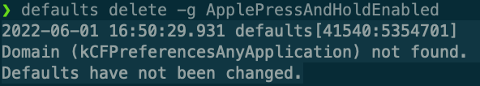

## 任务点

[安装 Vim](vscode:extension/vscodevim.vim)

安装好以后，光标会变粗，此时进入了 `Vim` 的 `normal` 模式，也叫正常模式；

在这个模式下，输入某些按键，此时并不会将这些按键插入到文本中，而是会执行一些操作，比如按下 `hjkl` 会移动光标，等等

在 `normal` 模式下按下 `i`，会进入到 `insert` 模式，也叫插入模式，就和我们平常使用一样了

在 `insert` 模式下按下 `Esc` 或 `control + [`（推荐）即可切换到 `normal` 模式

也可以通过改键来实现切换到 `normal` 模式

比如键入 `jk` 映射为 `Esc`:

`vscode` 的 `settings.json` 文件

```json
"vim.insertModeKeyBindings": [
  {
    "before": ["j", "k"],
    "after": ["<Esc>"]
  }
]
```

不过需要快速输入 `jk`，否则就是正常插入了

不推荐这种方式，因为这种只对 `vscode` 生效，别的软件并不生效，还需要配置（当然得支持配置才行）

在 `normal` 模式下按下 `i`，光标会插入到当前字符的前面，按下 `a` 会插入的后面

小 tips：养成习惯：`insert` 完立马回到 `normal` 模式

## 扩展

### Vim

在终端中输入 `vim 文件名` 即可打开或新建（没有会新建）文件，默认还是 `normal` 模式

退出 `Vim`：

`:wq`：保存并退出

`:q!`：不保存并强制退出

使用 `cat 文件名` 可以查看文件内容

### 快速移动光标

默认情况下，长按 `hjkl` 光标不会持续移动，只会移动一次，我们可以通过一下配置来实现长按快速移动

[VSCodeVim/Vim: Vim for Visual Studio Code](https://github.com/VSCodeVim/Vim#mac)

在终端中输入以下命令：

```bash
$ defaults write com.microsoft.VSCode ApplePressAndHoldEnabled -bool false              # For VS Code
$ defaults write com.microsoft.VSCodeInsiders ApplePressAndHoldEnabled -bool false      # For VS Code Insider
$ defaults write com.visualstudio.code.oss ApplePressAndHoldEnabled -bool false         # For VS Codium
$ defaults write com.microsoft.VSCodeExploration ApplePressAndHoldEnabled -bool false   # For VS Codium Exploration users
$ defaults delete -g ApplePressAndHoldEnabled                                           # If necessary, reset global default
```

`mac` 系统设置-键盘，将 `按键重复` 调到最快，将 `重复前延迟` 调到最短



重启 `vscode` 即可

## 社群讨论

vscode 的快捷键 ctrl + r 和 vim 冲突了，各位有啥好的解决方式嘛

把 vscode 的给重置掉 是冲突的啥

vscode 的 ctrl + r 是打开最近的文件，我看看换成其他的吧

这个默认用 command+p 就好呀

<hr />

怎么在终端这左右移动呀

ctrl b ，ctrl f，ctrl a，ctrl e

加一个 ctrl c 删除整行

<hr />

hjkl 方向键 只在 abc 输入法中 起作用？

英文情况下都 ok 呀

就是说在拼音输入法下 hjkl 是无法移动光标的是吧

对 输入法是英文的情况下才可以

<hr />

视频中 vscode 的主题：【【vscode】配置酷炫主题和字体，做最极客的程序员-哔哩哔哩】https://b23.tv/92quqSE

<hr />

你们输入中文的时候会不会抖动

原生自带的

原生和搜狗都会抖，就是已经输入的中文抖

我现在是 Mac，我之前 win，rog 48G 内存也会抖，好像是，复现是 vscode + vim 插件 + 输入中文，英文或者没有 vim 插件都不会；macbook air 2020 m1

https://github.com/VSCodeVim/Vim/issues/7724

抖动的同学看看你们的版本是多少，换到 1.22.1 试试看

1.22.1 太老了，应该不能原生支持 Apple m1

不是 m1 也会抖，会不会特定主题就不会抖

方块字输入防抖，我感觉有些基于 Electron 的编辑器好像也会出现这个抖动的问题

1.67.2 我这个中文版本没抖动

不行诶，我升级了也还是抖动

等修吧 没办法 不过换个角度来讲 正好驱动学英文了 [旺柴]

<hr />

发现 mac 终端输入 vimtutor 会出现一个系统自带的 vim 教程

<hr />

就是说我在 insert 模式输入的时候比如我输入一个 () 然后光标是在括号的尾部，我现在想在括号中插入字符是不是得切换到 normal 模式然后移动光标到括号中间，再切换 insert 模式输入呢

这种情况不用 直接在 insert 模式下移动过去就可以 因为你是还想继续输入 属于一次 insert 没结束 这个得需要配置 还没讲 配合 Karabiner-Elements 这个来修改

<hr />

normal 模式下 怎么有换行 和空格的效果？对应的快捷键是啥？

o

o 按下去以后自动切换成 insert 模式了 我想在 normal 模式下的空格和换行

没有 因为你加换行和空格都属于编辑文本了

normal 模式按 o 往下插入一个空行 再按 control + [ 回到 normal

<hr />

如果我现在在浏览代码 处于 normal 模式，我发现第二行和第三行之间多了一个空白行，我想删除掉这个空白行，是不是也要经过 insert 模式

dd

<hr />

我一直想要的最实用的技巧是 当光标在一个单词内的时候，有没有一个快捷键可以达到双击的效果，这样我就可以整体删除然后重命名，有这个快捷键吗

bved，b 是移动到单词的最前面，v 可视，相当于光标，e 移动到单词末尾，d 是删除

d 严格来说是剪切吧，你 p 一下看看

ciw 也可以

<hr />

请问下快速移动 defaults write 是只针对 mac 设置的吗

是的

<hr />

每次在 insert 模式编辑的时候，我编辑着然后就想换行移动到下一行差不多位置的地方，或者说同一行，很近的地方。这时候如果不借助方向键，我就要切换 normal 和 insert 模式，然后移动，然后再切换我感觉有点麻烦，还不如方向键方便，因为移动的范围非常小，方向键按一两下就可以，然后接着编辑。我想问，如何才能避免完全不用方向键呢？

可以改键   也可以使用 ctrl+f  /  b

<hr />

有什么办法让 vscodevim 和 terminal 的 vim 改键保持一致吗？

修改 vim 的配置，.vimrc
