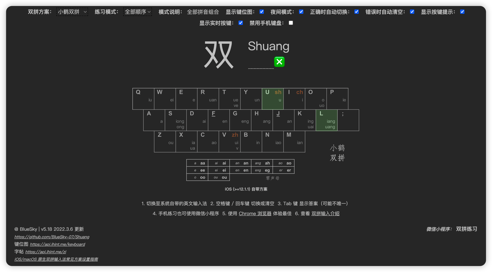
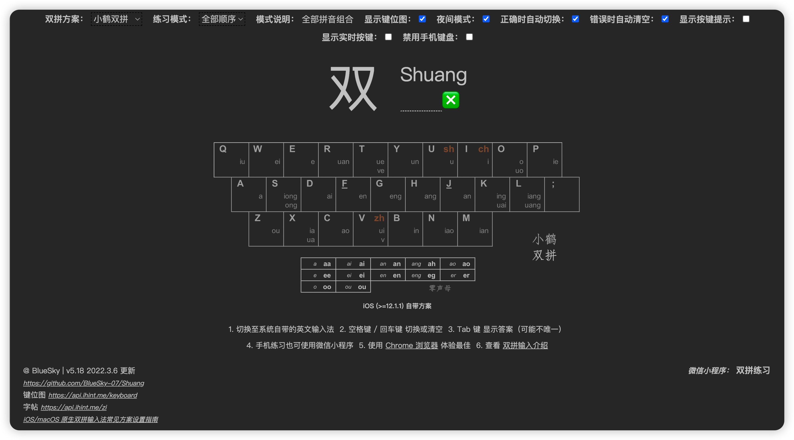
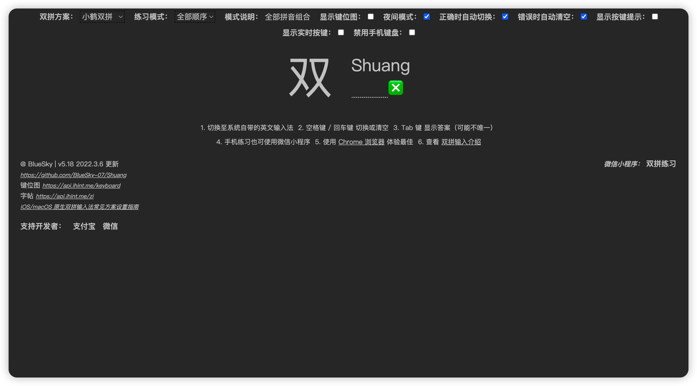

记录一下自己学习双拼的过程

[双拼练习 @ BlueSky](https://api.ihint.me/shuang/)

双拼方案选择小鹤双拼，练习模式选择全部顺序，其余保持默认，先熟悉一遍

然后把显示按键提示和显示实时按键关闭

自己看着下面的键位图练习，这个过程用时最多

感觉自己记的差不多了，就把显示键位图也关闭

接着练习

最后练习模式依次选择全部随机、困难随机、无拼音练习
