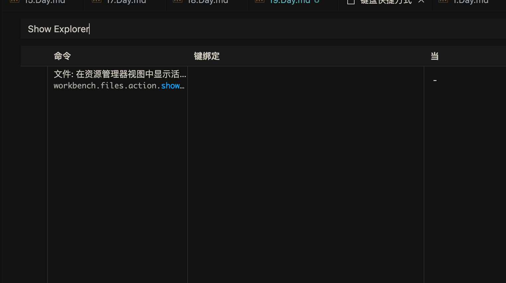

## 任务点

### 切到 files explorer 区域

vim: `shift + left`

`keybindings.json`:

```json
{
  "key": "shift+left",
  "command": "vim.remap",
  "when": "vim.mode == 'Normal'",
  "args": {
    "after": ["<c-w>", "h"]
  }
}
```

vscode: 原生：mac: `cmd + shift + e`, windows: `ctrl + shift + e`；改键：`ctrl + ;`, 可以在 `explorer` 和 `editor` 来回切换

`keybindings.json` 替换原生改键版 (mac)：

```json
({
  "key": "ctrl+;",
  "command": "workbench.view.explorer",
  "when": "viewContainer.workbench.view.explorer.enabled"
},
{
  "key": "shift+cmd+e",
  "command": "-workbench.view.explorer",
  "when": "viewContainer.workbench.view.explorer.enabled"
})
```

不替换原生改键版（与原生共存）：

```json
{
  "key": "ctrl+;",
  "command": "workbench.view.explorer",
  "when": "viewContainer.workbench.view.explorer.enabled"
}
```

### 切到 editor 区域

vim: `shift + right`

```json
{
  "key": "shift+right",
  "command": "vim.remap",
  "when": "vim.mode == 'Normal'",
  "args": {
    "after": ["<c-w>", "l"]
  }
}
```

vscode: 原生：`cmd/ctrl + 1`; 改键：`ctrl + '`

我感觉原生就挺好用，而且上面 `ctrl + ;` 也可以切换过来，故不改了；如果想改，参考上面即可

### 在 explorer 移动光标和折叠展开

- `j/k`: 上下移动
- `h`: 折叠
- `l`: 折叠/展开/打开文件

### 创建文件

在 `explorer`: `a`

```json
{
  "key": "a",
  "command": "explorer.newFile",
  "when": "filesExplorerFocus && !inputFocus"
}
```

在 `editor`: `<Leader> a`

```json
"vim.normalModeKeyBindings": [
  {
    "before": ["<Leader>", "a"],
    "commands": ["explorer.newFile"]
  }
]
```

vscode: `cmd + n`, 创建未命名的文件，需要自己保存是命名

通过插件 [File Utils](https://marketplace.visualstudio.com/items?itemName=sleistner.vscode-fileutils) 来创建：通过 `F1` 打开命令行，输入 `File Utils New File`

### 创建文件夹

在 `explorer`: `A`

```json
{
  "key": "shift+a",
  "command": "explorer.newFolder",
  "when": "filesExplorerFocus && !inputFocus"
}
```

在 `editor`: `<Leader> A`

```json
"vim.normalModeKeyBindings": [
  {
    "before": ["<Leader>", "A"],
    "commands": ["explorer.newFolder"]
  }
]
```

通过插件 File Utils 来创建：通过 `F1` 打开命令行，输入 `File Utils New Folder`

### 重命名

原生：`Enter/F2`; 改键：`r`

由于 `Enter` 已经很方便的，故我就不修改了

### 删除

原生：`cmd + backspace`: 直接删除，`opt + cmd + backspace`: 询问是否删除; 改键：`d`

```json
{
  "key": "d",
  "command": "deleteFile",
  "when": "explorerViewletVisible && filesExplorerFocus && !explorerResourceReadonly && !inputFocus"
},
{
  "key": "alt+cmd+backspace",
  "command": "-deleteFile",
  "when": "explorerViewletVisible && filesExplorerFocus && !explorerResourceReadonly && !inputFocus"
}
```

## 社群讨论

我 vscode 快捷键没有视频里的



而且我还没改映射，默认的不知道为啥不能用，shift cmd e，没效果

你是不是 vscode 中文的，安装了中文语言包，中文的就搜资源管理器

<hr />

其实 VSCode 里创建新文件可以直接 :e relative/path/to/file.txt

这个路径是自己手打？

相对当前正在编辑文件的路径，如果想在同一文件夹下创建，只要打文件名就好了

创建文件（当前文件夹）： `:e file`

创建文件（连带文件夹）：`:e path/to/file`

<hr />

Mac 上的 VS Code 似乎没有原生的热键来移动文件，为了移动文件专门装个插件又很鸡肋

可以用 ranger 支持 vim，ranger+lazygit+tmux.

<hr />

崔大，映射命令：`vnoremap // y/<c-r>"<cr >` 这个是一个搜索可视化选中的快捷键，[出处](https://blog.twofei.com/610/) 我在 `visual` 配置改键没生效：

```json
{
  "before": ["/", "/"],
  "after": ["y", "/", "<C-r>", "\""]
}
```

这个要咋配置呢？

你得看 vscode，里面的这个 vim 插件支持不支持，有些功能它不支持

我按命令是可以的，就是改键不会改

映射命令：

```json
"vim.visualModeKeyBindings": [
  {
    "before": ["<Leader>", "/"],
    "after": ["y", "/", "<C-r>", "\"", "<Enter>"]
  }
],
"vim.normalModeKeyBindings": [
  {
    "before": ["<Leader>", "/"],
    "after": ["/", "<C-r>", "\"", "<Enter>"]
  }
]
```

在 `visual` 模式，在选中文本后，按下 `<Leader> /` 就可以快速搜索了；在 `normal` 模式，按下 `<Leader> /` 就可以快速搜索刚才复制或删除的文本

vscode 好像用不了 // 这种自定义快捷键，输入第一个 / 就进入搜索了，所有我先前配置的就不生效

这种自定义的话，都得加个 leader 来防止按键和其他的冲突

<hr />

设置 J：10j，win 不生效，有人遇到过吗？

为什么要 10j，直接滚半屏好啦

折叠以后半屏滚到折叠处就不生效了，也是个 bug

<hr />

试一下 neovim 吧，neovim 配置好了可以直接扔了 vscode 了，vscode 有的 neovim 都能配出来，就是得花时间折腾，但是折腾出来后感觉体验好很多

那不得记一堆快捷键了吗

不用啊，灵活运用 leader 键，根据自己的使用场景 定制对应的按键缩写，比如 leader f 格式化代码，f 就是 format，类似这样用使用场景的英文缩写作为快捷键，比 vscode 的那些快捷键更好记忆，其实都是 lsp 的功劳

掘金有个小册是讲 neovim 配置的 我今天刚看完 再结合上键盘侠训练营的一些使用技巧，现在感觉真的可以扔了 vscode 了，真的觉得折腾一下挺好的 之前一直害怕配置 vim，感觉好繁琐，但是 neovim 可以用 lua 进行配置，试了一下感觉特别舒服，然后就花了两天把小册看完了

两种选择吧，我更喜欢 vscode

可以两者混着用，把两个的使用体验配置成尽量一致，就能无缝切换着用了

vscode 会卡顿 neovim 不会

对这个是重点，用 neovim 真的感觉好顺畅

不过 neovim 配完了 应该可以用在 vscode 上，能学到很多思路

对对这个也是

可惜 vscode 只能用那个 settings.json，不能像 lua 那样模块化，要是能拆分就好了

Vscode 也可以用 neovim，有这个插件，我体验了一下，不如 vim 插件丝滑

那可以用 lua 去配置 vscode 的 neovim 吗

是的

neovim 还没用过，主要优势是啥？

更灵活 自己可以去配 vim 生态的所有插件都可以配置上去，有点像 客制化键盘 自己 diy 随便改，这个 vscode 的 vim 插件 是给我们配置好的 不够灵活，但是够用，喜欢折腾的就试试

兼容 vim 插件那确实很值得一试，IdeaVim 和 VSCodeVim 感觉都是半吊子 vim

<hr />

话说今天的重命名也可以直接在文件树按 enter 实现

enter 就是 vscode 默认的快捷键啊

感觉应该来说，是 mac 的默认键，改电脑上的文件名字也是习惯按 enter 去了

r 的话 比较语义化，反正自己看着改呗，有些快捷键我习惯用默认的了 就也没改
