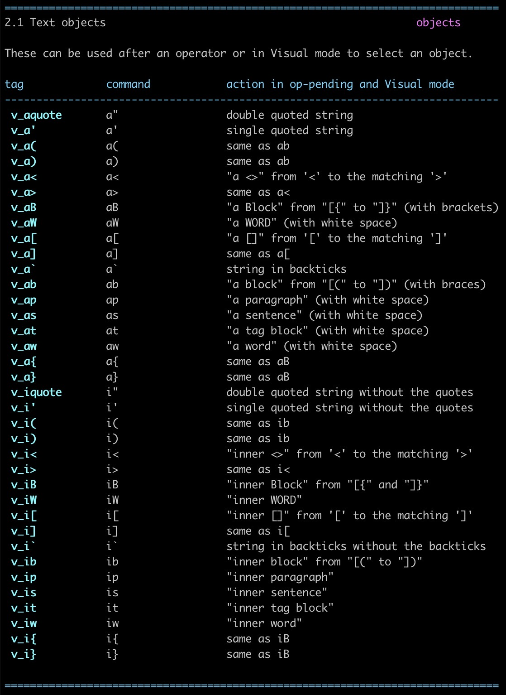
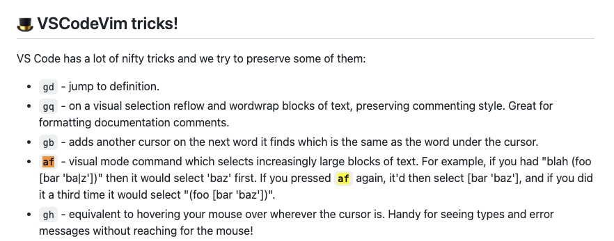

## 任务点

### 重构提示快捷键

- ctrl + shift + r: 显示和重构相关的命令
- cmd + .: 包含重构及其他命令

### 常用重构命令

- 重命名
- 提炼一个函数（全局、内部）
- 提炼一个变量，即常量变变量
- 反提炼一个变量，即变量变常量
- 引号变为模版字符串
- 创建函数
- 创建变量
- function 函数与箭头函数互转
- if/else 与三元表达式互转

内外平衡：

JavaScript Booster: 使用 `javascriptBooster.extendSelection and javascriptBooster.shrinkSelection`

vim: 使用 `vaf` 或 `vii`

### 重构插件

- [Abracadabra, refactor this! - Visual Studio Marketplace](https://marketplace.visualstudio.com/items?itemName=nicoespeon.abracadabra)
- [Hocus Pocus - Visual Studio Marketplace](https://marketplace.visualstudio.com/items?itemName=nicoespeon.hocus-pocus)
- [JavaScript Booster - Visual Studio Marketplace](https://marketplace.visualstudio.com/items?itemName=sburg.vscode-javascript-booster)

注：如果没有重构提示，检查是否有语法报错

## 社群讨论

Abracadabra 的 inline variable 好像不能放在变量调用的地方用

对 只能在声明处

这个插件的作者还出了本 重构的书

这本吗

是这本 他这个插件实现的也挺有意思   视图和逻辑拆分的挺好

extend selection 的 af 是哪个插件提供的功能？

vim

Vim 下默认 a 会进入 insert

先 v，必须在可视化模式

学到了，依此类推还可以 va{a{a{，vabababab

vim 文档里没有找到 f 这个 object

看来是 VSCodeVim 提供的

对 他自己实现的
