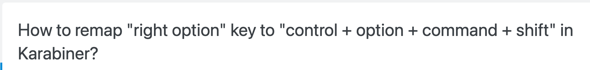

## 任务点

### 打开终端

- cmd + j: 显示终端节目，焦点不一定在终端
- ctrl + `: 显示终端界面，焦点一定在终端

### 清空

- cmd + k

### 分屏

- cmd + \: 分屏
- cmd + [/]: 切换分屏，需改键，改键要注意是否冲突；workbench.action.terminal.focusNextPane, workbench.action.terminal.focusPreviousPane
- shift + alt + q: 关闭分屏；workbench.action.terminal.kill

### 窗口

- shift + alt + n: 新建窗口，需改键；workbench.action.terminal.new
- cmd + shift + [/]: 切换窗口

### 直接打开终端

- cmd + shift + c: 打开终端 app

可以自定义打开终端的 app:

```json
{
  // 定义在 macOS 上运行的终端应用程序
  "terminal.external.osxExec": "iTerm.app",
  // 定义在 windows 上运行的终端应用程序
  "terminal.external.windowsExec": "C:\\Windows\\System32\\cmd.exe"
}
```

## 社群讨论

今天突发奇想，把 fn 和 left opt 互换了，巴适。大家平时按 opt 键是怎么按的

大拇指向左伸一点

哈哈哈我也是这样，虽然有点别扭，但是偶尔来一下还是能忍

我用的比较频繁，还有一种方式，左手   左移 一个 cmd 的距离

一般看使用场景，如果是用 opt 配合那个切换软件的话，我就会左移手掌

我是左手小拇指按

<hr />

我是感觉右侧的 cmd 和 opt 有点浪费

我 cmd 从来都用的 left

咦 我倒是真的想看看别人是如何利用 right cmd 和 right opt 的



哈哈哈哈，这是我没想到的

他这个思路挺好啊 把一些组合键映射到 righ opt 上

复制粘贴我在习惯用 right cmd

你是怎么够到的？

右手 right cmd，左手 c v

你拍一下 手的姿势，我看看啥样子，大拇指去按？

对哇，这样 cmd c 的时候就可以比较舒服地保持左中指按 c 的方式


有些朋友 cmd c 的时候应该是用左拇指按 cmd 和左食指按 c

我 c 用的是食指

如果纯左手 cmd c 而且键位指法正确的情况下，cmd c 的时候就很难受


之前练键位不是把 c 的指法改正了嘛，如果复制的时候 c 用食指感觉有点割裂感

有些键位还是保留了我自己的习惯 只要距离一样的话。比如 c     他的位置和 m 其实一样   而正确的键位是右手食指负责 m，同样的还有  b   以及 6，所以 c 和 m   都是使用食指，对称

<hr />

今天的这个 "terminal.external.osxExec" 解决了我最近一个大需求

有了 terminal external 其实就不用使用 vscode 里面的 terminal 了，别扭

由于 warp 的实现问题，没办法设置为 macos 默认的命令行工具，而我又不喜欢用 vscode 的命令行，不过配置为 warp 后打开没有在当前的工作区路径下，也没有新建一个 tab

<hr />

崔大，请问下二期有没有提，在 win 下，改什么键代替 cmd 比较合适之类的，还是自己按个人喜好找一个

没提供   是个探索的点

<hr />

各位有遇到过在 Mac 上多桌面切换时，切过去又反弹回来的情况吗

可能是你上一个桌面有失焦后又强制聚焦的功能，我用 Excel 的时候遇到过，编辑单元格后切换桌面又切回去了

还有好多情况下的都是切过去之后马上就自动返回来，我删了有个不咋用的窗口软件，设置了一下分配桌面，然后现在好像好些了没触发了

<hr />

崔哥的终端工具用的是哪一款啊

iterm2

warp 有人用了吗？我上次下了   登不上去然后就删了

你们 wrap 的 hotkey 能用吗？我刚安装的时候能用，然后更新了几个版本就不行了，然后我就卸载了

iterm2!!! 我就是 iterm2 感觉完全不是一个东西。。。。看来是可以个性化配置

warp 好使，我觉得比 iterm2 好使

hyper 有用的吗？挺火的

hyper 毕竟是 electron app，会卡

我也用 warp，但是 warp 的 git 状态现在好像还不支持？

Zsh 支持 git 不就好了

warp 这个算 zsh 吗？

算，它包装过，但是支持得不完全吧，以后应该会慢慢支持的，我感觉它们迭代速度还挺快的

感觉最喜欢 warp 的是它的 cmd history

这是啥命令呀

就是命令的历史，能看得到之前的那些

<hr />

你们是怎么快捷开 iterm2

cmd shift c

cmd + shift +c 我是打开系统 terminal，要怎么配成 iterm2 或者 warp 呢？

视频里讲了呀

哇，这个从源码里找配置的，太牛了，学到了学到了

<hr />

崔大，iterm2 中智能提示，怎么快速补全提示的命令，还是说只是提示出来提供参考看而已？

zsh-autosuggestions 这个插件

这个是有提示，但是有啥办法不用输入，直接补全，或者说执行到提示出来的命令

有了提示之后按右方向键

get

<hr />

拆分终端和新建终端有什么不同

没啥不同

在 vscode 表现应该是一面板左右跟面板右侧切换上下的区别吧

唯一感觉有实质区别的就是新建可以建不同的终端，如 zsh 或 bash，拆分的话两个是一样的

<hr />

zsh 也有很多可以玩的点，zsh 保底会讲 https://github.com/jeffreytse/zsh-vi-mode，可以先提前看看。其实也是 vim，learn vim Once，Run Anywhere
