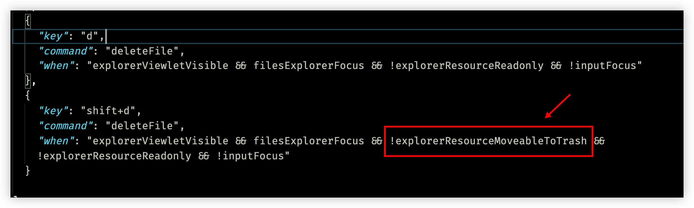
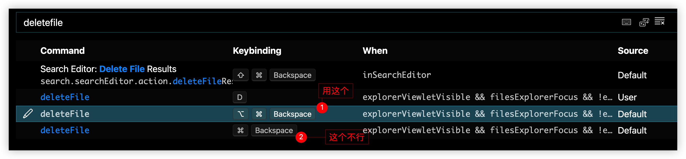

## 任务点

### 打开新的窗口

mac: `cmd + shift + n`

windows: `ctrl + shift + n`

### 选择工作区

`ctrl + r`

只有聚焦在 `explorer` 才可以

### 多窗口切换

mac: cmd + \`

windows: [Easy Window Switcher](https://www.appinn.com/easy-window-switcher/)

### 关闭窗口

mac: `cmd + shift + w`

windows: `ctrl + shift + w`

## 社群讨论

话说 vim 怎么切换 tab 栏

看到了 `:tabp`, `:tabn`

多个窗口切换 cmd + ` 对应的 vscode 键盘快捷命令叫啥啊，我的按了没反应

操作系统的，和 vscode 没关系。多窗口而且不是全屏才好使

窗口最大化的快捷键，看视频里是 cmd + shift + m，但是我这里不起作用

需要安装 Moom，我还没讲呢

Obsidian 还讲吗，里面的 vim 模式有点鸡肋呀 辅助的插件还没研究

讲讲如何配置 obsidian 里面的 vim，移动够用了，ob 只讲快捷键的配置 不会讲双链的概念   这个 b 站很多 up 主在讲 自己去找找看

最近项目紧 微信开发者工具里的 vim 模式延迟太严重了 所以 vim 都在 obsidian 里疯狂练习

微信开发者工具可以用 vim 吗

可以 底层就是个换皮的 vscode

窗口最小化以后，easy windows 那个软件就不能切换了

我想了一下为什么下面那个不行，`"when"` 中多了一个条件 `!explorerResourceMoveableToTrash`，应该是指不可删除，这个条件很奇怪，不知道是不是 vscode 的 bug（or feature）

是的 就是因为这个判断

猜测是写错了，应该没有 !，是不是可以去 vscode 提 issue？

去试试

没有！就直接删了。。不会放回收站

moveableToTrash 不是可以被删除？! 表示不可删除吧？否定的是 moveable 而不是 trash 吧？
