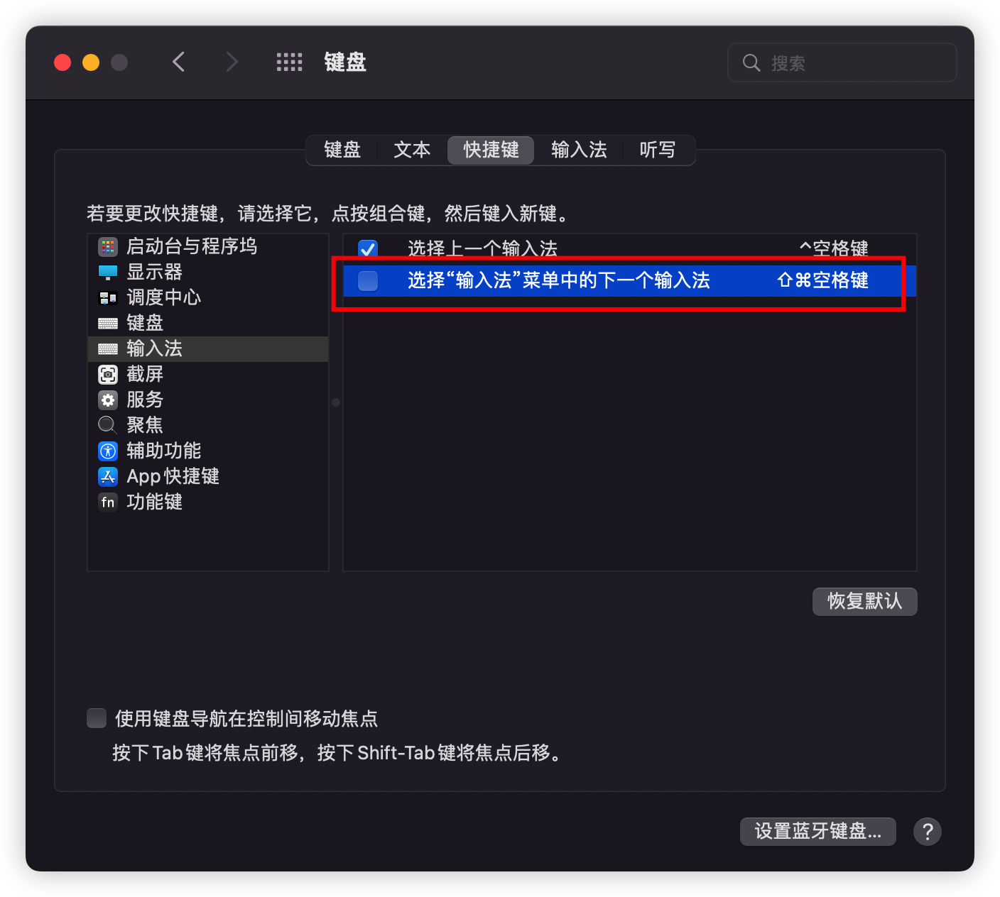
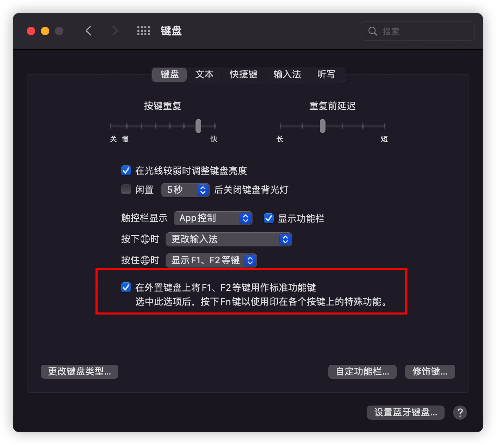

## 任务点

### 快速修复，提供代码错误解决方案

`cmd + .`

### 触发参数提示

`cmd + shift + space`

windows 由于 `ctrl + shift` 设置为切换输入法，而 `space` 又设置为 `spaceFn`，快捷键冲突了，所以我们需要改键

此时是处于 `insert` 模式，故无法使用 `vim` 改键，只能修改 `vscode` 了；而这个快捷键对应的 `Command Id` 为：`editor.action.triggerParameterHints`, 使用 `alt + t/p/h(驼峰首字母)` 都不顺手，就设置为了 `alt + g`, 查询发现也没有快捷键冲突，当然大家可以根据自己的喜好设置

有个小 tip：可以在 `settings.json` 中设置 `"editor.parameterHints.enabled": false`, 可以禁用 vscode 自动的函数变量提示 (因为有的时候我们都记得参数形式，那个框框跳出来很烦), 这样在想不起来的时候按快捷键，就会跳出参数提示了 !!!

### 触发建议

`cmd + i`

windows 的 `ctrl + i` 与 vim 的 `<C-i>` 冲突，要么禁用 vim 的 `<C-i>`，要么改键

### 移动行

`opt + up/down`

### 新增一行

- `cmd + enter`: 在当前光标下面增加一行
- `cmd + shift + enter`: 在当前光标上面增加一行

### 删除光标前面的单词

- `opt + delete`: 删除光标前面的单词，如 `deleteName` 会被都删除; windows: `ctrl + backspace`
- `opt + ctrl + delete`: 删除光标前面的单词，如 `deleteName` 的 `Name` 会被删除; windows 没有默认快捷键，可以配置

```json
{
  "key": "",
  "command": "deleteWordPartRight"
}
```

### 跳转到错误处

- `F8`: 跳转到下一个错误处
- `shift + F8`: 跳转到上一个错误处

全局跳转，不只限制于当前文件

### 选择所有出现的当前单词

`cmd + F2`

## 社群讨论

`"editor.cursorSmoothCaretAnimation": true`, 开启这个 光标移动的更丝滑

<hr />

兄弟们你们的 shift + command + space 都好使吗。我死活按不出来

估计是和你其他的 app 冲突了

windows 的好多快捷键就是冲突的，我昨天回家试了全局搜索那个，跟搜狗的输入法快捷键冲突，大家可以避个雷

好像是的，我改键以后就能用了

win 系统下，把搜狗的系统快捷键都去掉就行了 很多就能用了

是的，很闹心，按键不舒服，还有冲突，系统级的还不改。我现在对 windows 下的 vim 就是大写的嫌弃

破案了，是和切换输入法冲突：如下图



这个快捷键用不上呀。。我就留了 2 个输入法，平时一直用 搜狗 shift 就可以切中文和英文了

冲突的话 两个方案 要不修改软件的 要不修改 vscode 的

<hr />

原来左右 tab 切换也可以用 command + shift + [ / ] 来搞

貌似没有用

我刚试了可以的呀，要打开 1 个以上文件

<hr />

我吧 control + tab 改到 opt + tab 了。control 和 tab 两个键按着太近了。不习惯，俩个按键一个手指按不住

我给改成 leader tab 了

<hr />

感觉 opt + ctrl + jk 就不太好按了，直接用 opt + 我自己的键盘方向键 相对好按一点，你们觉得呢？

这是控制啥的

opt + 方向键，ctrl + jk 不是改成上下方向键了吗

我是因为 hhkb 的方向键不好按的问题所以改成 ctrl + hjkl

<hr />

hhkb 的 f8 怎么按呢。。。大佬们

右侧的 fn + 数字 8

我按完以后是电脑的功能。。。哈哈哈，我得调调。

mac 需要将这个打钩



<hr />

大家知道三语切换快捷键要怎么设置吗，我现在把 F12 设置成了快捷键，再把 shift 映射成了 F12，中英切换很好用，但就是要换到第三个语言时，就换不过去了

control + space 按住别放 用空格切换 3 重输入法

这个不行，不过我刚刚想到办法了，忘了还有个下一个输入法的快捷键可以设置了
