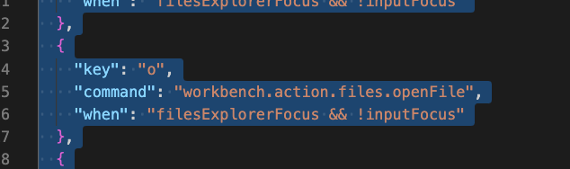
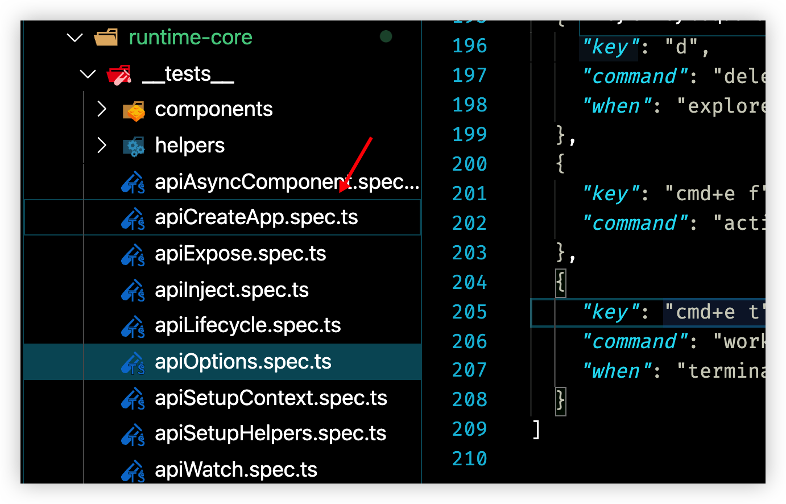
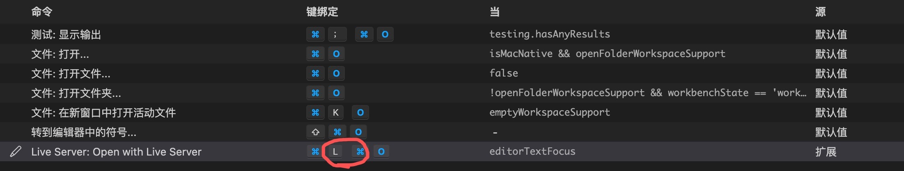
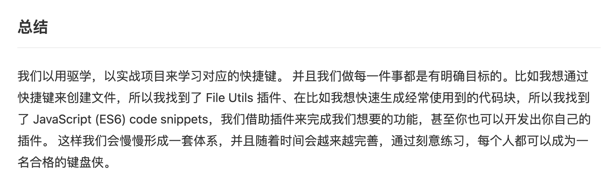

## 任务点

掌握常用的快捷键即可，不常用的可以使用鼠标代替，如果现在有功能经常使用鼠标，最好习得该快捷键

当默认快捷键使用不方便时，改键是一个很好的选择

### 显隐资源管理器

`cmd + b`

### Live Server

mac:

- `cmd + l cmd + o`: 开启服务
- `cmd + l cmd + c`: 关闭服务

windows:

- `alt + l alt + o`: 开启服务
- `alt + l alt + c`: 关闭服务

巧记：`l` 是 `Live Server` 的首字母；`o` 就是 `open`, 开启；`c` 就是 `close`, 关闭

### 预览 markdown

- `cmd + k v`: 向右拆分预览
- `cmd + shift + v`: 当前 editor 预览

windows 的 `ctrl + k` 与 vim 的 `<C-k>` 按键冲突，最好是禁用 vim 的 `<C-k>`, 因为 `ctrl + k` 使用场景还是有很多的

### 切换插件市场

`cmd + shift + x`

可以在插件市场与编辑器之间来回切换

### 在资源管理器中显示当前文件

- `cmd + k r`: 打开的是 editor 焦点的文件，即使现在聚焦在 explorer
- `cmd + opt + r`: 聚焦在 explorer，打开的是 explorer 聚焦的文件；windows: `shift + alt + r`

### 复制当前文件的路径

- `cmd + k p`: 复制 editor 聚焦的文件，即使现在聚焦在 explorer
- `cmd + opt + c`: 聚焦在 explorer，复制的是 explorer 聚焦文件的绝对路径
- `cmd + shift + opt + c`: 聚焦在 explorer，复制的是 explorer 聚焦文件的相对路径；windows: `ctrl + k ctrl + shift + c`

## 社群讨论

Vscode 打开文件怎么配制啊，下图这个，貌似每次打开的都是最近打开的文件

打开文件直接使用 l 就好了

如下图，我的光标在这里，然后我想打开这个文件有什么办法吗？空格键是暂时打开，还有什么打开方法不？

l

貌似没用

我这边用 l 能打开

配置了什么快捷键嘛

回车也可以啊

回车是重命名，回车加 ctrl 会打开一个新的子窗口

哦哦，小写 l，可以

cmd + shift + x 你们是咋按得，这也太别扭了，都在左下角，我改键了

这个不是太常用   能忍

有没有大佬，cmd + o 直接打开文件所在的 finder 了，这不是 live server 的快捷键吗？

是不是映射了这个组合键？是不是 live server 的快捷键被改过？

你们 cmd + o 是什么

我没有用这个快捷键，所以没有遇到这个情况

居然跟原生冲突，算了，我改键，我以为是我的问题，改键就解决了

先按 cmd+l，松开 l，再按 o

可以，谢谢大佬

这俩间距比较大，意思就是按完前面的快捷键以后可以松开，再按后面的；cmd+k 也是这样

学到了

推荐一个插件 which key，很适合今天崔大说到的思想，把平时常用鼠标操作的场景配置到 which key 统一触发，减少记忆压力

过两天会讲这个插件

话说大家 command+b 都好使吗，我为啥只有在下面终端按的时候才好使呢

都好使

我发现在 md 文件里面不好使

md 装插件了吧，是加粗吧

装没装插件我不知道 你说的加粗好像确实是这个现象

Md 的话 会优先触发 md 的快捷键

https://juejin.cn/post/6844904099880632328 来看看这篇文章

