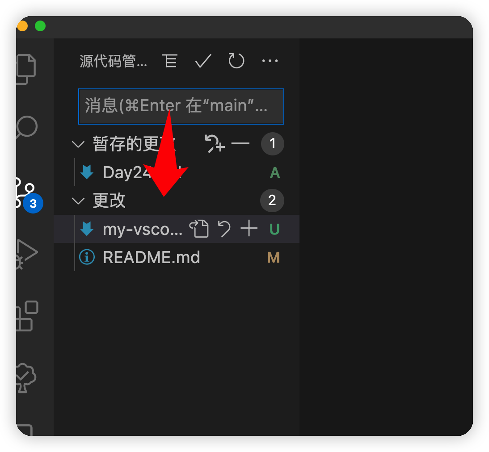
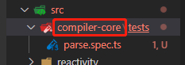

## 任务点

### 显示 git 面板

- `ctrl + shift + g`: 原生
- `Leader g g`: 改键

### 撤消修改

- `Leader g c`: 改键

由于本人操作习惯为：使用 vscode 的 git 面板查看修改，如果有问题，就再修改，可能有的文件要撤销修改；如果没有问题，就使用命令行操作；故只配置了 `显示 git 面板` 和 `撤销修改` 这两个快捷键，大家可以根据自己需求灵活设置

```json
{
  {
    "before": ["<Leader>", "g", "g"],
    "commands": ["workbench.view.scm"]
  },
  {
    "before": ["<Leader>", "g", "c"],
    "commands": ["git.clean"]
  }
}
```

## 扩展

[edamagit](https://marketplace.visualstudio.com/items?itemName=kahole.magit)

支持 vim 的 git 命令行工具，很好用，就是有时候会白屏，什么信息都没有，需要重启 vscode

## 社群讨论

崔哥日常是使用 edamagit 吗 进行 git 的相关操作吗

不会   那个 bug 太致命了

哈哈哈我就说。gitmoji 有没有用过

好用吗？调皮的呀 加个 emoji

好哈哈 就是不知道怎么样在 vscode git 的快捷键上使用

git-commit-plugin 这个可以用命令打开，也是加 emoji

<hr />

我想问下   如果本地代码修改的时候同时包含了 style fix doc，提交的时候 commit 就直接用 feat？

同时包含的我不懂。。可能用 doc 吧

理论上的提交粒度尽可能的细，实际上没必要，一大块功能做完直接用 feat 应该就行

是啊，一般都是 feat，我现实中大概率用到 feat fix perf

如果你用 commitlint，粒度特别小的 commit，写提交信息都非常闹心要写好多，我一开始用的时候还尽可能细，后来实在受不了了

比如那种集中的改几个 bug，是一个 bug 一次 commit 么

是的。我们是一个 issue 对应一个 commit

同时包含了 bug 和 style 这种 可以直接用 feat 吧

你知道 feat 的全称吗。。怎么能用 feat

feature？

你这会导致回退和 pick 的时候有问题

mosh 有一门 git 课，讲的很好，B 站 油管都有

我记得有一个叫 猴子都能懂的 git 入门 写得也不错

学 git 用这个吧 https://learngitbranching.js.org/?locale=zh_CN

虽然自己经常用 git，但是并不是特别的熟练，只是用常用的那几个

常用的就那几个

其实学到这里应该可以发现一个问题：重点是阅读文档 学习的能力，这个能力到位的话   直接打开文档看一看呗

<hr />

https://github.com/jesseduffield/lazygit   我用的 lazygit 支持 vim 操作。https://www.bilibili.com/video/BV1gV411k7fC?spm_id_from=333.337.search-card.all.click&vd_source=3a84d82ad3a7b1961884e4317bf2fac5   b 站教程。

看着不错，等会玩一玩

brew install lazygit，已经在安装了

lazygit 看了下，感觉对我这种简单 git 工作流的意义不大，而且用 git 对比大量文件是个强需求。vscode 还好些。

git 命令行 + fork，我这俩配合用

https://www.youtube.com/watch?v=CPLdltN7wgE 看完就会了

英文

youtu 有自动翻译，就是看着稍微有点难受

自带翻译？

右下角找设置，有个翻译，默认自动翻译英语字幕，再点一次就有英语转中文，就是看字幕会慢半截，有点难受，最简单就是学好英语了

<hr />

git 你们用命令还是 gui

vscode 的 git gui

<hr />

大家都用那个插件来做 mac 分屏呀？我用的是 spectacle

hammerspoon，这个是写脚本啥也能干，我用来切换 app 和分屏的

可能可以满足我的要求，用带鱼屏迅速分屏定位

magnet

嗯嗯 magnet 跟 spectacle 差不多

我是 切换 app 用 manico   分屏用 moom

moom 好东西，感觉有个底代码环境，学习曲线低，也可以定制屏幕方案

我使用的场景就是全屏 和 2 个屏幕来移动

嗯嗯我就不用全屏了，不过感觉 moon 或者 hammerspoon 挺有趣，等会儿对比一下

<hr />

Ctrl o 和 i 无效 找了半天原因没解决...

那个跳出 reference 的快捷键？

哎呀 记错了 ctrl o/i 不是调回上次编辑位置吗...怎么是跳文件的

如果你的上次编辑位置跳了文件，这个操作就会跳文件了。

单个文件回到上个编辑位置的按键是？

呃，这好像不太符合逻辑，你可以把这位置想象成一个堆栈结构，后进先出嘛；如果你一直在一个文件中编辑，那么 ctrl i/o 应该是在当前的文件中执行的，或者说跳转

<hr />

各位，上次说的在 siderbar 打开文件找到快捷键了：cmd + down

<hr />

有兄弟知道怎么从上面这个窗移动到下面呀。



tab 不行？

tab 不行

没有，移动不下去

就差这么一环，非常难受

shift+tab，然后就 hjkl

这个 OK

哎呀   原来可以

暴力破解 挨个试

我挨个试了。这俩键实在不好按

你要分开按，左手按 tab，右手按 shift

有道理。

实话说我觉得 git 这个窗口有问题。其他窗口都能通过 Command + 上下左右移动

集成的不好呗

<hr />

大佬们   这种情况 jk 移动只会在 src tests reactivity 间移动，   我想在 compiler-core 上创建文件夹   要咋按哇。



噢噢   我发现左右方向键可以

是滴 这时候得用方向键
