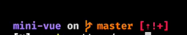
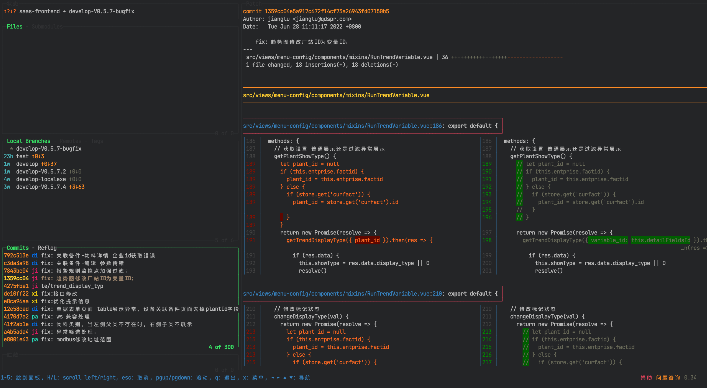
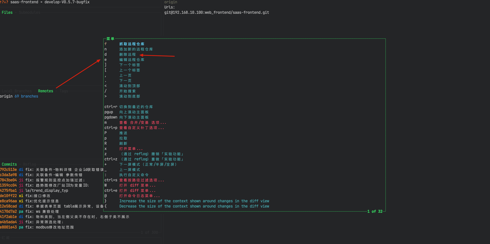
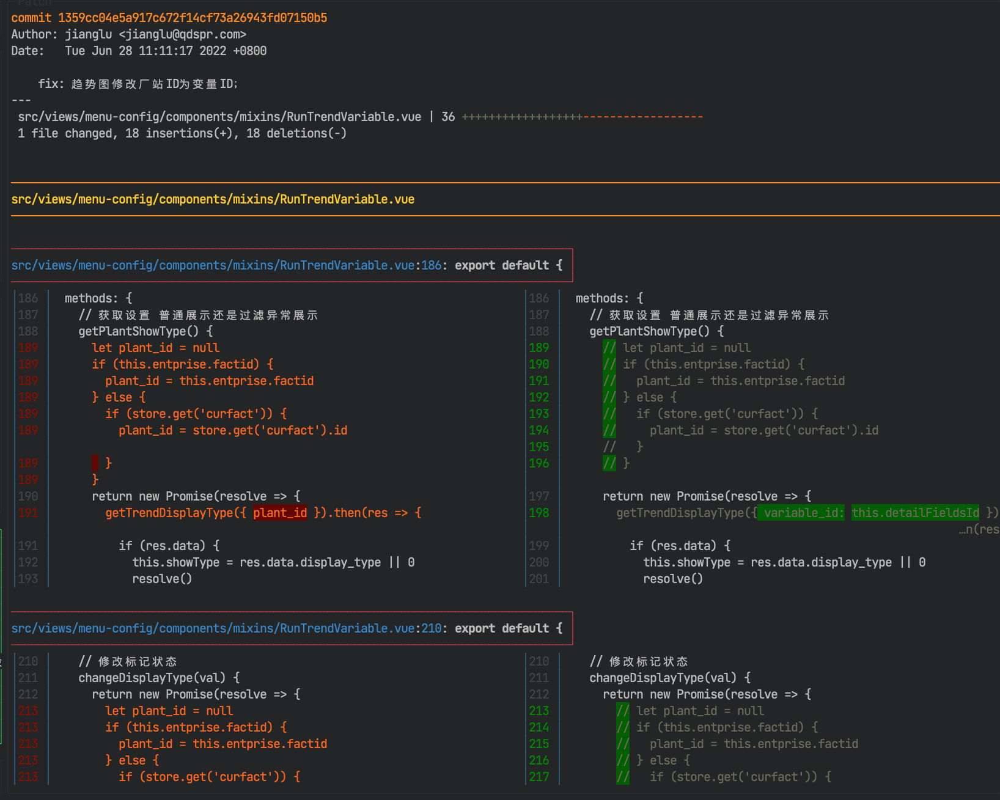

### 全局搜索

- `cmd + shift + f`: 全局搜索
- `cmd + up/down`: 在搜索框及搜索结果中切换；从结果切换到搜索框，必须是第一个结果才可以
- `hjkl`: 在搜索结果中移动及展开折叠
- `cmd + shift + j`: 切换搜索命令详情显隐，比如包含/不包含；必须聚焦在 `explorer`
- `tab`: 在搜索命令详情界面聚焦
- `F4/shift + F4`: 在搜索结果中移动

### 搜索工作区的 Symbol

Symbol 包括函数、变量等

- `cmd + t`: 搜索工作区的 Symbol; 等同于：`cmd + p, 输入 #`

### 搜索当前文件的 Symbol

- `cmd + shift + o`: 搜索当前文件的 Symbol; 等同于：`cmd + p, 输入 @`; 输入 `:` 可以进行分组，函数一组，变量一组等

### 搜索命令面板

- `cmd + shift + p / F1`: 搜索命令面板；等同于：`cmd + p, 输入 >`

### 搜索工作区的文件

- `cmd + p`: 搜索工作区的文件；按最近使用排序

### 切换文件

- `ctrl + i/o`: 切换文件；适用于在文件中没有跳转的情况
- `ctrl + tab`: 切换文件；在当前打开的文件中切换

### 快速修复，提供代码错误解决方案及建议

`cmd + .`

### 触发参数提示

`cmd + shift + space`

### 触发建议

`cmd + i`

### 移动行

`opt + up/down`

### 新增一行

- `cmd + enter`: 在当前光标下面增加一行
- `cmd + shift + enter`: 在当前光标上面增加一行

### 删除光标前面的单词

- `opt + delete`: 删除光标前面的单词，如 `deleteName` 会被都删除; windows: `ctrl + backspace`
- `opt + ctrl + delete`: 删除光标前面的单词，如 `deleteName` 的 `Name` 会被删除; windows 没有默认快捷键，可以配置

### 跳转到错误处

- `F8`: 跳转到下一个错误处
- `shift + F8`: 跳转到上一个错误处

全局跳转，不只限制于当前文件

### 选择所有出现的当前单词

`cmd + F2`

### 显隐资源管理器

`cmd + b`

### Live Server

mac:

- `cmd + l cmd + o`: 开启服务
- `cmd + l cmd + c`: 关闭服务

windows:

- `alt + l alt + o`: 开启服务
- `alt + l alt + c`: 关闭服务

巧记：`l` 是 `Live Server` 的首字母；`o` 就是 `open`, 开启；`c` 就是 `close`, 关闭

### 预览 markdown

- `cmd + k v`: 向右拆分预览
- `cmd + shift + v`: 当前 editor 预览

### 切换插件市场

`cmd + shift + x`

可以在插件市场与编辑器之间来回切换

### 在资源管理器中显示当前文件

- `cmd + k r`: 打开的是 editor 焦点的文件，即使现在聚焦在 explorer
- `cmd + opt + r`: 聚焦在 explorer，打开的是 explorer 聚焦的文件；windows: `shift + alt + r`

### 复制当前文件的路径

- `cmd + k p`: 复制 editor 聚焦的文件，即使现在聚焦在 explorer
- `cmd + opt + c`: 聚焦在 explorer，复制的是 explorer 聚焦文件的绝对路径
- `cmd + shift + opt + c`: 聚焦在 explorer，复制的是 explorer 聚焦文件的相对路径；windows: `ctrl + k ctrl + shift + c`

### 显示 git 面板

- `ctrl + shift + g`: 原生
- `Leader g g`: 改键

### 撤消修改

- `Leader g c`: 改键

## 社群讨论

视频中 master 前后图标怎么设置的？

zsh 的皮肤

我用的 zsh 皮肤就很简单，之前还搞挺复杂的，后来追求平静了

win 能嘛

可以，https://starship.rs/zh-CN/，zsh 上用 spaceship

明天研究一下，我用的是 Dracula pro 带的主题

好的，学完再看看，我 vscode 终端 用的是 git bash

powershell 也够用，升级到 7 就还行，我觉得 git bash 很怪异

win 有些命名 git bash 支持的好，而 cmd 和 powershell 并没有，这是 codewhy 哪里知道的

tmux 会讲吗

不讲  tmux 了

tmux 我是自学的，其实改了快捷键还挺好用的

昨天研究了下 lazygit 用来查看确实挺方便的，但不太敢通过这上面去操作

反正没 push 就不会有啥事

有些操作挺危险的，我怕按错了

昨天把 diff 配了下

这个 lazygit 确实不错
