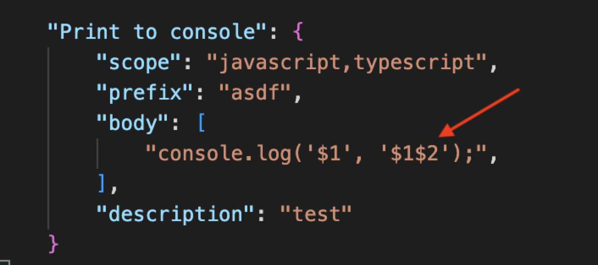

## 任务点

### 使用 snippets

在 vscode 插件市场搜索 `snippets`，有大量代码片段插件供我们选择，比如著名的 [JavaScript (ES6) code snippets - Visual Studio Marketplace](https://marketplace.visualstudio.com/items?itemName=xabikos.JavaScriptSnippets)，安装以后会有如下一些简写提示代码指令：

- imp：对应 import second from 'first'
- imd：对应 import { second } from 'first'
- fn：对应创建一个函数
- log：对应 console.log()
- vue：对应创建 vue 文件模版
- anfn：对应创建一个箭头函数
- rp：对应 return new Promise()

具体的 `snippets` 大家可以去插件详情查看

### 配置自己的 snippets

首先我们使用 `F1` 打开命令查找框，输入 user snippet，即查找当前用户自定义的 snippet，会有配置用户代码片段（configure user snippet）选项；选择它，会有如下选项：

- 新建全局代码片段文件
- 新建当前工作区的代码片段文件
- 为特定特定语言配置代码块；如 javascript、c# 等等

如果你已经配置过自定义的代码块，也会显示对应的配置文件名；此时我们选择第一个；输入要生成的文件名后，就进入了配置文件中。vscode 官方 snippet 配置规则文档在[这里](https://code.visualstudio.com/docs/editor/userdefinedsnippets)。

[这里](/pages/e26cbd/)是本人工作中总结的代码片段，仅供参考

可以在这个网址生成代码片段：[snippet generator](https://snippet-generator.app/)

详细介绍可以看这篇文章：[跟我一起在 Visual Studio Code 添加自定义 snippet(代码段)](https://blog.csdn.net/maokelong95/article/details/54379046)

这里主要说一个问题：当使用代码片段时，`tap stops` 位置是无法使用快速建议的，虽然可以使用 `cmd + i` 调出快速建议，但还是很影响效率的，没有自动弹出快速建议体验好。如果你有这方面的困惑，可以看这里：[在代码片段中使用快速建议](/pages/268883/)

## 社群讨论

想要输入完两个相同的值后跳到第二处，这样应该更直接？

