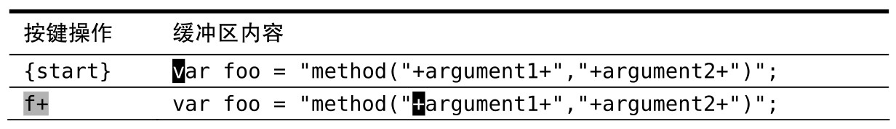
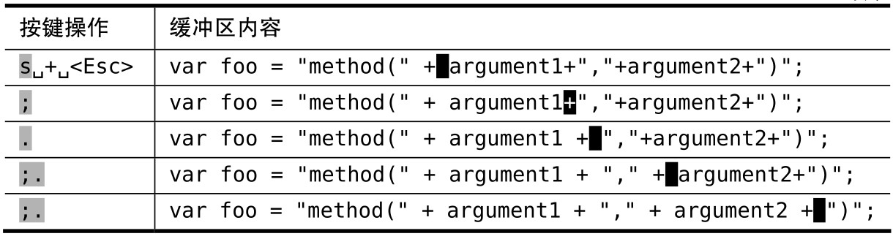

假设有一行代码看起来是这样的：

在 JavaScript 里把字符串连接到一起从来都不美观，但我们可以像下面这样在 + 号前后各添加一个空格，让肉眼更容易识别：

## 使修改可重复

下面的惯用方法可以解决这个问题：

`s` 命令把两个操作合并为一个：它先删除光标下的字符，然后进入插入模式。在删除 `+` 号后，我们先输入 `空格 + 空格`，然后退出插入模式。

先后退一步，然后前进三步，这是个奇怪的小花招，看起来可能不够直接。但这样做最大的好处是：我们可以用 `.` 命令重复这一修改。我们所要做的只是把光标移到下一个 `+` 号处，然后用 `.` 命令重复这一操作即可。

## 使移动可重复

本例中还有另外一个小窍门。`f{char}` 命令让 `Vim` 查找下一处指定字符出现的位置，如果找到了，就直接把光标移到那里。因此，当我们输入 `f+` 时，光标会直接移到下一个 `+` 号所在的位置。

完成第一处修改后，我们可以重复按 `f+` 命令跳到下一个 `+` 号所在的位置。不过，还有一种更好的方法可以用。`;` 命令会重复查找上次 `f` 命令所查找的字符，因此我们用不着输入 4 次 `f+`，而是只用输入一次，后面跟着再用 3 次 `;` 命令。

## 合而为一

`;` 命令带我们到下一个目标字符上，而 `.` 命令则重复上次的修改。因此，我们可以连续输入 3 次 `;.` 来完成全部修改。看起来是不是很熟悉？

与其和 Vim 区分模式的编辑模型做斗争，倒不如与它一起协同工作。然后，你就会发现它能把特定任务变得多么的容易。
