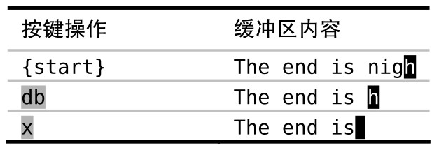
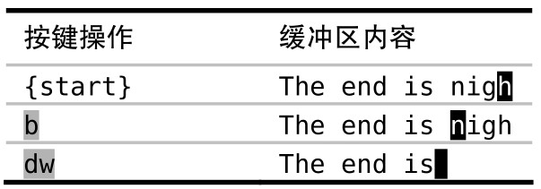
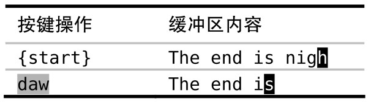

Vim 对重复操作进行了优化，要利用这一点，我们必须考虑该如何构造修改。

在 Vim 中，要完成一件事，总是有不止一种方式。在评估哪种方式最好时，最显而易见的指标是效率，即哪种手段需要的按键次数最少（又名 [VimGolf](http://vimgolf.com/)）。然而，在平局时该如何选择获胜者呢？

在下例中，假设光标位于行尾处的字符 `h` 上，而我们想要删除单词 `nigh`：

`The end is nigh`

## 反向删除

因为光标已经位于单词末尾，我们可以先反向删除该词。

按 `db` 命令删除从光标起始位置到单词开头的内容，但会原封未动地留下最后一个字符 `h`，再按一下 `x` 键就可以删除这个捣乱的字符。这样，整个操作的 Vim Golf 得分是 3 分。

## 正向删除

这一次，让我们尝试一下正向删除。

我们先用 `b` 命令把光标移到单词的开头，移动好后，就可以用一个 `dw` 命令删掉整个单词。这一次的 Vim Golf 得分也是 3 分。

## 删除整个单词

到目前为止，已有的两种方式都要先做某种准备工作或清理工作。另外，我们也可以使用更为精准的 `aw` 文本对象（text object），而不是用动作命令

可以把 `daw` 命令解读为“delete a word”，这样比较容易记忆。

## 决胜局：哪种方式最具重复性？

我们尝试了 3 种不同的方式来删除一个词：`dbx`、`bdw` 以及 `daw`。每种情况的 Vim Golf 得分都是 3 分。那么我们要怎么回答这个问题：“哪种方式最好？”

还记得吗，Vim 对重复操作进行了优化。让我们再回顾一下这 3 种方式，这一次我们跟着用一次 `.` 命令，看看会发生什么。我建议你自己也亲自试一下。

反向删除方案包含两步操作：`db` 命令删除至单词的开头，而后 `x` 命令删除一个字符。如果我们跟着执行一次 `.` 命令，它会重复删除一个字符（. = x）。我不觉得这有什么价值。

正向删除方案也包含两步。这一次，`b` 只是一次普通的移动，而 `dw` 完成修改。此时用 `.` 命令会重复 `dw`，删除从光标位置到下个单词开头的内容。不过因为我们刚好已经在行尾了，并没有“下一个单词”，所以在这个场景里 `.` 命令没什么用。不过，至少它代表了一个更长点的操作（. = dw）。

最后的方案只调用一个操作：`daw`。这个操作不仅仅删除了该单词，它还会删除一个空格，因此光标最终会停在单词“is”的最后一个字符上。如果此时我们使用 `.` 命令，它会重复上次删除单词的命令。这一次，`.` 命令会做真正有用的事情（. = daw）。

## 结论

`daw` 可以发挥 `.` 命令的最大威力，因此我宣布它是本轮的获胜者。

要想充分利用 `.` 命令，事先常常需要进行一番周详的考虑。如果你发现自己要在几个地方做同样的小修改，就可以尝试构造你的修改，让它们能够被 `.` 命令重复执行。要识别出这类机会需要进行一定的实践，不过一旦你养成了使修改可重复的习惯，那么你就会从 Vim 这里得到“奖赏”

有时，我并没有看到用 `.` 命令的机会，然而在做完一次修改后，我发现要做另一次同样的操作，这时候，我脑海里会浮现出 `.` 命令，而它也已经准备好为我效力了。每当遇到这种情况时，我都会开心地笑起来。
