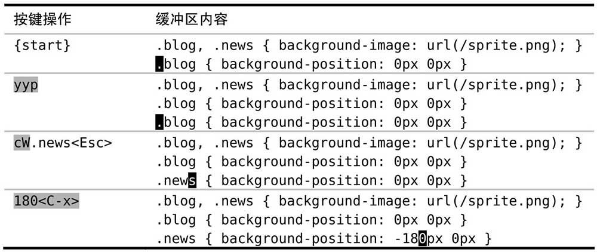

大多数普通模式命令可以在执行时指定次数，我们可以利用这个功能来做简单的算术运算。

很多普通模式命令都可以带一个次数前缀，这样 Vim 就会尝试把该命令执行指定的次数，而不是只执行一次

`<C-a>` 和 `<C-x>` 命令分别对数字执行加和减操作。在不带次数执行时，它们会逐个加减，但如果带一个次数前缀，那么就可以用它们加减任意整数。例如，如果我们把光标移到字符 `5` 上，执行 `10<C-a>` 就会把它变成 `15`。

但是如果光标不在数字上会发生什么？文档里说，`<C-a>` 命令会“把当前光标之上或之后的数值加上 `[count]`”。因此，如果光标不在数字上，那么 `<C-a>` 命令将在当前行正向查找一个数字，如果找到了，它就径直跳到那里。我们可以利用这一点简化操作。

下面是一段 CSS 片段：

```
.blog, .news { background-image: url(/sprite.png); }
.blog { background-position: 0px 0px }
```

我们要复制最后一行并且对其做两个小改动，即用“news”替换单词“blog”，以及把“0px”改为“-180px”。我们可以运行 `yyp` 来复制此行，然后用 `cw` 来修改第一个单词。但我们该怎么处理那个数值呢？

一种做法是用 `f0` 跳到此数字，然后进入插入模式手动修改它的值，即 `i-18<Esc>`。不过，运行 `180<C-x>` 则要快得多。由于我们的光标不在要操作的数字上，所以该命令会正向跳到所找到的第一个数字上，从而省去了手动移光标的步骤。让我们看看整个操作过程



在本例中，我们只复制了一行并做出改动。但是，假设你要复制 `10` 份，并对后续数字依次减 `180`。如果要切换到插入模式去修改每个数字，我们每次都得输入不同的内容（`-180`，然后 `-360`，以此类推）。但是如果用 `180<C-x>` 命令的话，对后续行也可以采用相同的操作过程。我们甚至还可以把这组按键操作录制成一个宏，然后根据需要执行多次。

## 数字的格式

`007` 的后面是什么？不，这不是詹姆斯·邦德的恶作剧，我是在问：如果对 `007` 加 `1`，你觉得会得到什么结果。

如果你的答案是 `008`，那么当你尝试对任意以 `0` 开头的数字使用 `<C-a>` 命令时，也许会感到诧异。像在某些编程语言中的约定一样，Vim 把以 `0` 开头的数字解释为八进制值，而不是十进制。在八进制体系中，`007 + 001 = 010`，看起来像是十进制中的 `10`，但实际上它是八进制中的 `8`，糊涂了吗？

如果你经常使用八进制，Vim 的缺省行为或许会适合你。如果不是这样，那么你可能想把下面这行加入你的 vimrc 里：

```vim
set nrformats=
```

这会让 Vim 把所有数字都当成十进制，不管它们是不是以 0 开头的。

而 VSCodeVim 目前还不支持此设置，详见：[`<C-a>` increment does not work at 07 · Issue #6693 · VSCodeVim/Vim](https://github.com/VSCodeVim/Vim/issues/6693)
