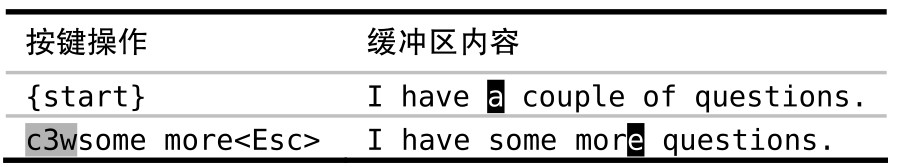

在处理某些特定工作时，使用次数可以使按键次数变得最少，不过我们并不是非得这样不可。我们需要认真考虑次数与重复各自的优缺点。

假设在缓冲区里有如下文字：

我们想把这段文字改为“Delete one word”，也就是说，要像这段文字里所讲的那样删除两个单词。

有几种方式可以达到这一目的，`d2w` 和 `2dw` 都可以。使用 `d2w`，我们先调用删除命令，然后以 `2w` 作为动作命令，我们可以把它解读为“删除两个单词”；然而 `2dw` 做的相反，这一次，次数作用于删除命令，而动作命令只跨越一个单词，我们可以把这解读为“做两次删除单词的操作”。抛开语义不讲，无论哪种方法，结果都是相同的。

现在，让我们考虑另外一种方式，即 `dw.`。这可以解读为“删除一个单词，然后重复上次的操作”。

概括一下，我们的 3 种选择 `d2w`、`2dw` 或者 `dw.` 都是 3 次按键，不过哪一种最好呢？

根据我们的讨论，`d2w` 和 `2dw` 是相同的，在执行完两者中的任一个后，我们可以按 `u` 键撤销，这样两个被删除的单词又会回来。或者，我们不是用撤销，而是用 `.` 命令重复执行它，这就会删除后面的两个单词。

对于 `dw.` 的情形，按 `u` 或 `.` 的结果会有细微的差别。这里的修改是 `dw`，即删除一个单词。因此，如果想恢复这两个被删除的单词，必须撤销两次，按 `uu`（或者，如果你愿意，也可以按 `2u`）。按 `.` 则只删除后面的一个单词，而不是两个。

现在假设我们原本是想删除 3 个单词，而不是 2 个。由于判断出了点差错，我们执行了 `d2w` 而不是 `d3w`，那接下来怎么做？我们不能使用 `.` 命令，因为那会总共删除 4 个单词。因此，我们或是先撤销而后修正次数（`ud3w`），或是继续删除下一个单词（`dw`）。

现在考虑另一种方案，如果我们在第一处地方用的是 `dw.` 命令，那么我们只要再多重复一次 `.` 命令就行了。因为我们最初的修改只是简单的 `dw`，因此 `u` 命令和 `.` 命令都具有更细的粒度，每次只作用于一个单词。

现在假设我们想删除 7 个单词，我们可以运行 `d7w`，或是 `dw......`（即 `dw` 后面跟 6 次 `.` 命令）。计算一下按键的次数，哪个命令胜出是很显而易见的。不过你真地确信自己数对了次数吗？

计算次数很是讨厌，因此我宁愿按 6 次 `.` 命令，也不愿意只为减少按键的次数，而浪费同样的时间去统计次数。如果我多按了一次 `.` 命令怎么办？没关系，只要按一次 `u` 键就可以回退回来。

还记得吗，我们的口诀是：执行、重复、回退。这里就是在把它付诸行动。

只在必要时使用次数

假设我们想把文字“I have a couple of questions”改为“I have some more questions”，可以用下面的方式做：

在此场景中，使用 `.` 命令的意义不大，我们可以删除一个单词，然后再用 `.` 命令删除另一个，但随后我们还得切换到插入模式（例如，使用 `i` 或 `cw`）。对我来说这么做很不顺手，我反而更愿意用次数。

使用次数的另一个好处是：它保留了一个干净、连贯的撤销历史记录。完成这次修改后，我们按一下 `u` 键就可以撤销整个修改

对于是用次数风格（`d5w`）还是用重复风格（`dw....`）也有同样的争论，因此我的偏好看起来似乎不太一致。对此，你要总结自己的观点，这取决于你怎么看保留干净撤销历史记录的价值，以及你是否觉得用次数令人生厌。
